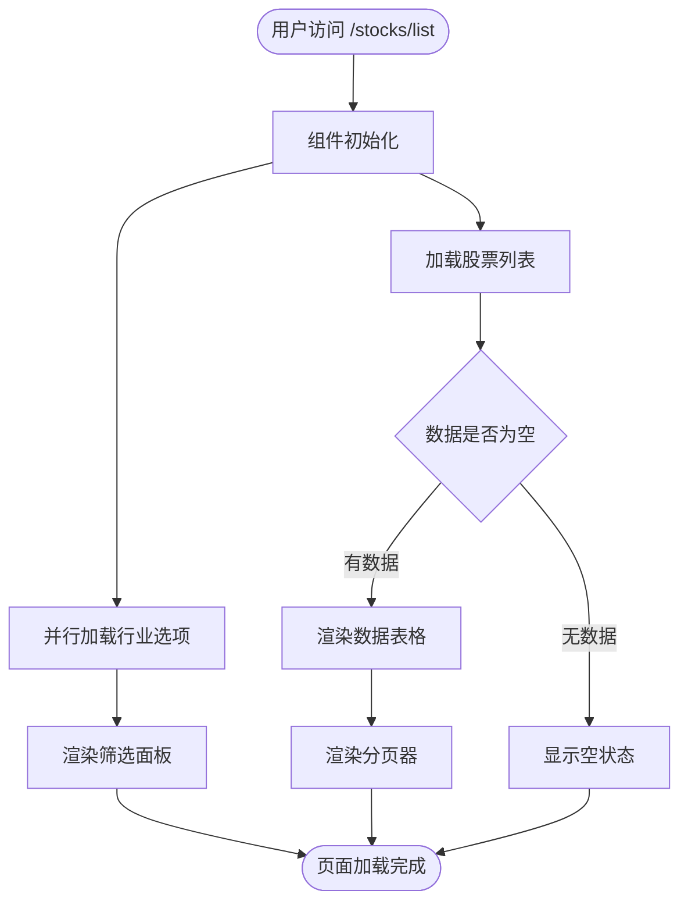
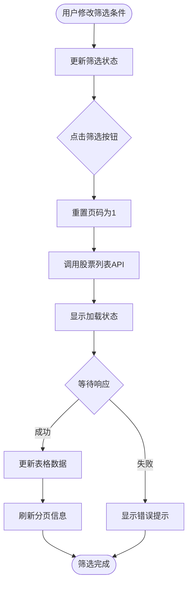
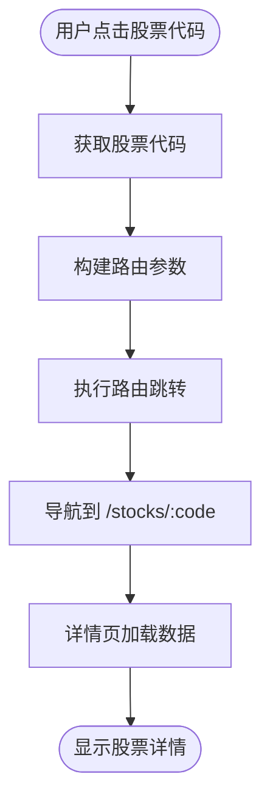

# 股票列表功能设计

## 功能目标

在 `/stocks` 路径下新增股票列表页面，与现有的股票详情页面同级，提供完整的股票浏览、筛选和导航能力。

## 功能范围

### 核心功能
1. 分页展示所有股票列表
2. 提供基础筛选能力（市场、行业等）
3. 点击股票代码跳转到详情页面

### 功能边界
- 聚焦于股票浏览和快速导航，不涉及复杂的技术指标筛选
- 区别于股票筛选（Screening）功能：本功能为基础列表浏览，筛选功能提供高级多条件组合查询
- 不包含分析、交易等业务操作（通过详情页进入）

## 设计决策

### 路由结构

基于现有路由模式，采用以下层级结构：

```
/stocks                           # 股票模块根路径 (BasicLayout)
  ├── /stocks/list               # 新增：股票列表页面
  └── /stocks/:code              # 现有：股票详情页面
```

**决策依据**：
- 保持与现有模块（如 `/reports`、`/settings`）的路由风格一致
- `/stocks` 作为容器路由，使用 BasicLayout 布局
- 通过 `list` 和 `:code` 子路由区分列表页和详情页

### 菜单结构

将股票列表作为一级菜单项显示在左侧导航栏中。

**菜单配置**：
| 属性 | 值 | 说明 |
|-----|-----|-----|
| 菜单名称 | 股票列表 | 清晰表达功能定位 |
| 图标 | `List` | 使用 Element Plus 图标 |
| 路由路径 | `/stocks/list` | 明确指向列表页 |
| 显示位置 | 一级菜单 | 提升功能可见性 |
| 权限要求 | 需登录 | 保持与其他功能一致 |

### 页面布局

采用卡片式布局，包含以下区域：

```
┌─────────────────────────────────────────────────┐
│ 页面标题区                                        │
│  • 标题：股票列表                                  │
│  • 描述：浏览所有已录入的股票信息                   │
└─────────────────────────────────────────────────┘
┌─────────────────────────────────────────────────┐
│ 筛选条件面板 (el-card)                            │
│  • 市场类型（下拉选择）                            │
│  • 行业分类（下拉选择，支持多选）                   │
│  • 搜索框（股票代码/名称）                         │
│  • 筛选/重置按钮                                   │
└─────────────────────────────────────────────────┘
┌─────────────────────────────────────────────────┐
│ 数据表格 (el-table)                               │
│  列：股票代码 | 股票名称 | 市场 | 行业 | 市值 | ...│
│  交互：点击代码单元格跳转详情页                     │
└─────────────────────────────────────────────────┘
┌─────────────────────────────────────────────────┐
│ 分页器 (el-pagination)                            │
│  • 每页显示条数：20/50/100                        │
│  • 总记录数、页码跳转                              │
└─────────────────────────────────────────────────┘
```

## 数据模型

### 前端数据结构

基于现有 API 响应格式定义：

| 字段名 | 类型 | 说明 | 来源 |
|--------|------|------|------|
| `symbol` / `code` | string | 股票代码（6位） | 后端 API |
| `name` | string | 股票名称 | 后端 API |
| `market` | string | 市场类型（如"A股"） | 后端 API |
| `industry` | string | 行业分类 | 后端 API |
| `total_mv` | number | 总市值（亿元） | 后端 API |
| `pe` | number | 市盈率 | 后端 API |
| `pb` | number | 市净率 | 后端 API |
| `close` | number | 最新价格 | 后端 API |
| `pct_chg` | number | 涨跌幅 | 后端 API |

### 筛选条件模型

```
筛选表单数据结构：
├── market: string | null           # 市场类型
├── industry: string[]              # 行业列表（多选）
└── searchKeyword: string           # 搜索关键词
```

### 分页参数

| 参数 | 类型 | 默认值 | 说明 |
|------|------|--------|------|
| `page` | number | 1 | 当前页码（从1开始） |
| `page_size` | number | 20 | 每页条数 |
| `total` | number | 0 | 总记录数（由后端返回） |

## API 接口设计

### 股票列表查询接口

**接口说明**：获取股票列表，支持分页和基础筛选

**请求参数**：

| 参数名 | 类型 | 必填 | 说明 | 示例 |
|--------|------|------|------|------|
| `page` | number | 是 | 页码（≥1） | 1 |
| `page_size` | number | 是 | 每页条数（1-100） | 20 |
| `market` | string | 否 | 市场筛选 | "A股" |
| `industry` | string | 否 | 行业筛选（后端处理多个值） | "银行" |
| `search` | string | 否 | 搜索关键词（代码或名称） | "平安" |

**响应结构**：

```
成功响应：
{
  success: boolean,
  data: Stock[],              # 股票列表数组
  total: number,              # 总记录数
  page: number,               # 当前页码
  page_size: number,          # 每页条数
  message: string             # 提示信息
}

Stock 对象结构：
{
  symbol: string,             # 股票代码
  name: string,               # 股票名称
  market: string,             # 市场类型
  industry: string,           # 行业
  total_mv: number,           # 总市值（亿元）
  pe: number,                 # 市盈率
  pb: number,                 # 市净率
  close: number,              # 最新价
  pct_chg: number            # 涨跌幅
}
```

### 行业列表接口

**接口说明**：获取所有可用的行业分类（用于下拉选项）

**响应结构**：

```
{
  success: boolean,
  data: {
    industries: Array<{
      label: string,          # 行业名称（显示用）
      value: string,          # 行业代码（查询用）
      count: number           # 该行业股票数量（可选）
    }>
  }
}
```

## 交互流程

### 页面加载流程



### 筛选操作流程



### 详情页导航流程



## 用户界面规范

### 表格列定义

| 列名 | 字段 | 宽度 | 对齐 | 排序 | 说明 |
|------|------|------|------|------|------|
| 股票代码 | `symbol` / `code` | 120px | 左对齐 | 否 | 可点击，蓝色链接样式 |
| 股票名称 | `name` | 150px | 左对齐 | 否 | 纯文本显示 |
| 市场 | `market` | 80px | 居中 | 否 | 标签样式 |
| 行业 | `industry` | 120px | 左对齐 | 否 | 纯文本 |
| 总市值 | `total_mv` | 120px | 右对齐 | 否 | 格式化为"XX亿"/"XX万亿" |
| 市盈率 | `pe` | 100px | 右对齐 | 否 | 保留2位小数 |
| 市净率 | `pb` | 100px | 右对齐 | 否 | 保留2位小数 |
| 最新价 | `close` | 100px | 右对齐 | 否 | 格式化为"¥XX.XX" |
| 涨跌幅 | `pct_chg` | 100px | 右对齐 | 否 | 带正负号，涨红跌绿 |

### 样式规范

**表格样式**：
- 使用 `el-table` 的 `stripe` 属性显示斑马纹
- 悬停行高亮（Element Plus 默认行为）
- 表头固定，内容区域可滚动

**股票代码样式**：
- 颜色：`--el-color-primary`（蓝色）
- 鼠标悬停：下划线
- 光标：pointer

**涨跌幅颜色规则**：
- 正值：红色 `#f56c6c`
- 负值：绿色 `#67c23a`
- 零值：默认文本色

**空状态**：
- 使用 `el-empty` 组件
- 描述文案："暂无股票数据"
- 提供"刷新"按钮

### 筛选面板交互

**市场选择器**：
- 类型：单选下拉框 `el-select`
- 选项：全部、A股、港股、美股
- 默认值："全部"

**行业选择器**：
- 类型：多选下拉框 `el-select`（带 `multiple` 属性）
- 支持 `collapse-tags` 折叠标签显示
- 选项：动态从后端加载

**搜索框**：
- 类型：`el-input`
- 占位符："输入股票代码或名称"
- 支持按回车键触发搜索

**按钮组**：
- 筛选按钮：`type="primary"`，显示搜索图标
- 重置按钮：`type="default"`，清空所有筛选条件

## 错误处理

### API 调用失败

**场景**：网络错误或服务端异常

**处理策略**：
1. 捕获异常并记录到控制台
2. 使用 `ElMessage.error()` 显示错误提示
3. 保持当前页面状态，不清空已有数据
4. 提供"重试"按钮

**错误提示文案**：
- "加载股票列表失败，请稍后重试"
- "网络连接异常，请检查网络设置"

### 空数据处理

**场景**：筛选条件过严，无匹配结果

**处理策略**：
1. 显示 `el-empty` 组件
2. 提示文案："未找到符合条件的股票"
3. 提供"重置筛选条件"按钮
4. 保持筛选条件不清空，方便用户调整

### 分页异常

**场景**：用户直接修改 URL 参数，导致页码超出范围

**处理策略**：
1. 后端返回错误时，自动重置为第1页
2. 前端限制页码输入范围（1 到最大页数）

## 性能优化

### 数据加载优化

**策略**：
1. 使用分页查询，避免一次性加载全部数据
2. 前端缓存行业选项，避免重复请求
3. 筛选操作防抖处理（延迟500ms），减少 API 调用频率

### 渲染优化

**策略**：
1. 表格使用虚拟滚动（当单页数据超过100条时）
2. 数据格式化函数（如市值格式化）提取为计算属性或工具函数
3. 使用 `v-memo` 优化表格行渲染（针对大数据量场景）

## 可访问性

### 键盘导航

**支持的快捷键**：
| 快捷键 | 功能 | 说明 |
|--------|------|------|
| Tab | 焦点切换 | 在筛选条件和表格间移动 |
| Enter | 触发搜索 | 在搜索框中按回车执行筛选 |
| Esc | 清除焦点 | 关闭下拉框或退出输入状态 |

### 屏幕阅读器

**支持项**：
1. 表格列标题使用语义化标签
2. 股票代码链接添加 `aria-label`，描述为"查看{股票名称}详情"
3. 筛选按钮添加 `aria-label`，描述为"执行股票筛选"

## 技术实现要点

### 路由配置

在 `router/index.ts` 中的 `/stocks` 路由下新增 `list` 子路由：

**路由层级结构**：
```
/stocks (BasicLayout)
  ├── list (StockList.vue) - 新增
  └── :code (Detail.vue)   - 现有
```

**路由元信息配置**：
| 字段 | 值 | 说明 |
|------|-----|------|
| `title` | "股票列表" | 页面标题 |
| `requiresAuth` | true | 需要登录 |
| `icon` | "List" | 菜单图标 |
| `hideInMenu` | false | 显示在菜单中 |

### API 集成

**新增 API 方法**：
在 `api/stocks.ts` 中添加：

**方法签名**：
```
getStockList(params: StockListParams): Promise<StockListResponse>
```

**参数对象结构**：
```
StockListParams {
  page: number
  page_size: number
  market?: string
  industry?: string
  search?: string
}
```

**响应类型定义**：
```
StockListResponse {
  success: boolean
  data: StockInfo[]
  total: number
  page: number
  page_size: number
  message: string
}
```

### 组件结构

**文件位置**：`frontend/src/views/Stocks/StockList.vue`

**组件组成**：
| 区块 | 组件 | 说明 |
|------|------|------|
| 页面标题 | `div.page-header` | 标题和描述文案 |
| 筛选面板 | `el-card` + `el-form` | 包含市场、行业、搜索输入 |
| 数据表格 | `el-table` | 显示股票列表 |
| 分页器 | `el-pagination` | 页码控制 |
| 空状态 | `el-empty` | 无数据提示 |

**响应式数据**：
```
state {
  loading: boolean                   # 加载状态
  stockList: StockInfo[]            # 股票数据
  total: number                     # 总记录数
  currentPage: number               # 当前页
  pageSize: number                  # 每页条数
  filters: {                        # 筛选条件
    market: string | null
    industry: string[]
    searchKeyword: string
  }
  industryOptions: IndustryOption[] # 行业选项
}
```

### 依赖项

**Element Plus 组件**：
- `ElCard`、`ElForm`、`ElFormItem`
- `ElSelect`、`ElOption`、`ElInput`
- `ElTable`、`ElTableColumn`
- `ElPagination`、`ElButton`
- `ElMessage`、`ElEmpty`、`ElIcon`

**Vue 组合式 API**：
- `ref`、`reactive`、`computed`
- `onMounted`
- `useRouter`

**工具函数**（需新增或引用）：
- `formatMarketCap(value: number): string` - 市值格式化
- `getChangeClass(value: number): string` - 涨跌颜色类名

## 测试要点

### 功能测试

**测试用例**：

| 用例ID | 测试场景 | 预期结果 |
|--------|----------|----------|
| TC-01 | 直接访问 `/stocks/list` | 成功加载页面，显示股票列表 |
| TC-02 | 选择市场筛选"A股" | 表格仅显示A股股票 |
| TC-03 | 选择行业"银行" | 表格仅显示银行类股票 |
| TC-04 | 输入关键词"平安" | 表格显示包含"平安"的股票 |
| TC-05 | 点击重置按钮 | 清空筛选条件，显示所有股票 |
| TC-06 | 点击股票代码 | 跳转到对应股票详情页 |
| TC-07 | 切换分页 | 表格内容更新，页码正确显示 |
| TC-08 | 修改每页条数 | 表格显示对应数量的记录 |

### 边界测试

**测试场景**：

| 场景 | 测试数据 | 预期行为 |
|------|----------|----------|
| 总记录数为0 | 空数据 | 显示"暂无股票数据" |
| 筛选无结果 | 不存在的行业 | 显示"未找到符合条件的股票" |
| API 响应超时 | 模拟网络延迟 | 显示错误提示，不影响页面状态 |
| 页码超出范围 | `page=9999` | 自动回退到第1页 |

### 性能测试

**测试指标**：

| 指标 | 目标值 | 测试方法 |
|------|--------|----------|
| 首屏加载时间 | < 1秒 | Chrome DevTools Performance |
| 筛选响应时间 | < 500ms | 测量从点击到数据更新的时间 |
| 表格渲染时间 | < 200ms | 100条数据渲染耗时 |

## 未来扩展方向

### 短期迭代（v1.1）

1. **列自定义**：用户可选择显示/隐藏特定列
2. **导出功能**：支持导出当前筛选结果为 Excel
3. **收藏功能**：在列表中直接添加/移除自选股

### 中期迭代（v1.2）

1. **高级筛选**：增加数值范围筛选（如市值区间）
2. **排序功能**：支持按市值、涨跌幅等字段排序
3. **批量操作**：支持多选股票进行批量分析

### 长期规划（v2.0）

1. **自定义视图**：用户保存常用筛选条件组合
2. **实时数据**：集成 WebSocket 推送实时行情更新
3. **智能推荐**：基于用户历史行为推荐关注股票
