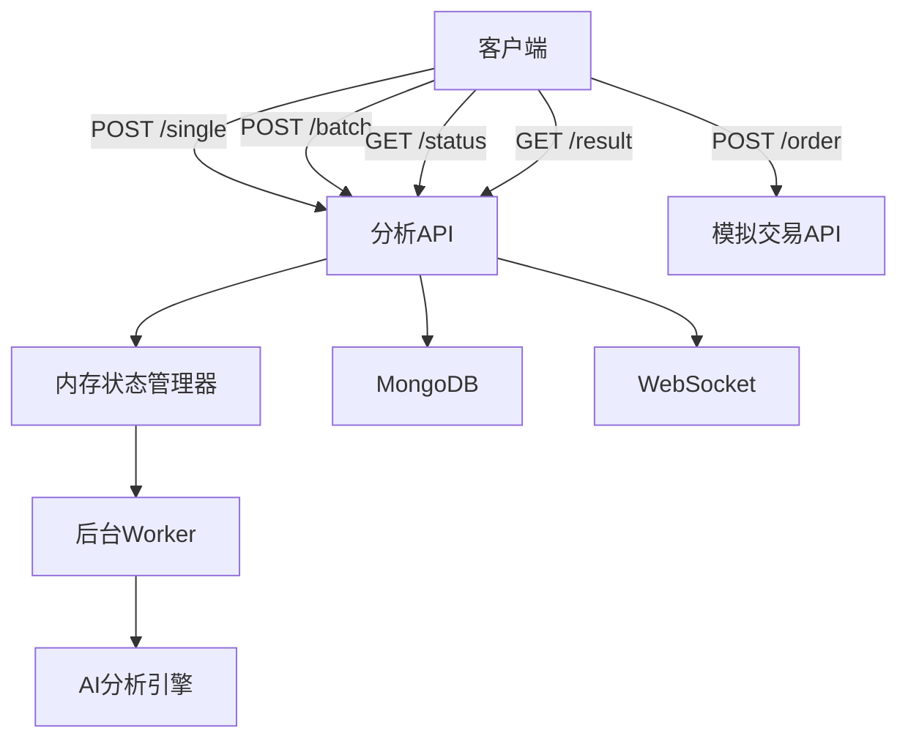
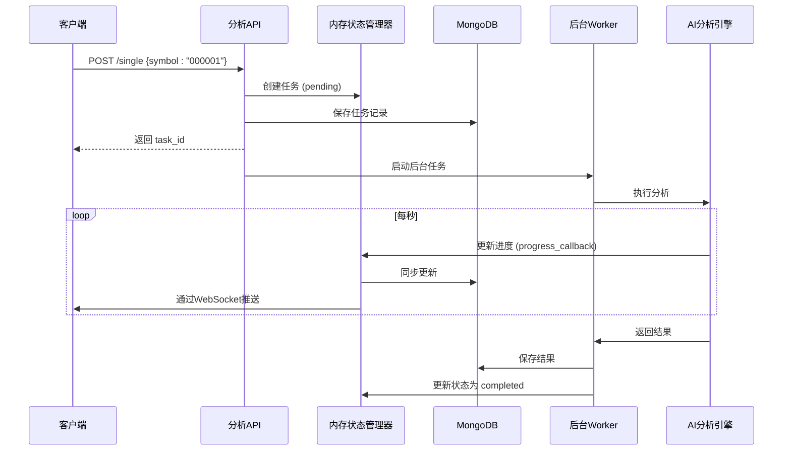

# 分析服务API

<cite>
**本文档引用的文件**   
- [analysis.py](file://app/routers/analysis.py)
- [analysis.py](file://app/models/analysis.py)
- [simple_analysis_service.py](file://app/services/simple_analysis_service.py)
- [paper.py](file://app/routers/paper.py)
- [memory_state_manager.py](file://app/services/memory_state_manager.py)
- [analysis_worker.py](file://app/worker/analysis_worker.py)
</cite>

## 目录
1. [引言](#引言)
2. [核心功能概述](#核心功能概述)
3. [API端点详解](#api端点详解)
4. [分析任务执行流程](#分析任务执行流程)
5. [进度跟踪与状态查询](#进度跟踪与状态查询)
6. [结果获取与数据结构](#结果获取与数据结构)
7. [批量分析实现机制](#批量分析实现机制)
8. [模拟交易集成](#模拟交易集成)
9. [错误处理与最佳实践](#错误处理与最佳实践)
10. [代码示例](#代码示例)

## 引言

分析服务API是本系统的核心功能模块，为用户提供股票分析、批量分析和模拟交易三大核心能力。该API采用异步任务处理架构，通过RESTful端点接收分析请求，利用后台Worker进程执行复杂的AI分析任务，并通过WebSocket和轮询机制提供实时进度反馈。分析结果持久化存储于MongoDB数据库，并支持通过API进行查询和导出。本API的设计旨在为前端应用提供稳定、高效且功能丰富的分析能力，支持从单股快速分析到多股批量深度研究的多样化场景。

**Section sources**
- [analysis.py](file://app/routers/analysis.py#L1-L37)

## 核心功能概述

分析服务API主要提供三大功能：**股票分析**、**批量分析**和**模拟交易**。股票分析功能允许用户对单个股票代码发起深度研究，系统会调用AI代理（如市场分析师、基本面分析师等）进行综合研判，并生成包含摘要、建议和风险评估的完整报告。批量分析功能则支持用户一次性提交多个股票代码（最多10个），系统将并发执行所有分析任务，极大地提升了研究效率。模拟交易功能与分析结果深度集成，用户可以将分析报告中的投资建议一键转化为模拟交易订单，在虚拟资金环境中验证策略的有效性，实现从分析到交易的闭环。

**Section sources**
- [analysis.py](file://app/routers/analysis.py#L771-L890)
- [paper.py](file://app/routers/paper.py#L1-L585)

## API端点详解

分析服务API提供了清晰的RESTful端点，用于管理分析任务的全生命周期。

### 单股分析端点
`POST /api/analysis/single` 用于提交单股分析任务。请求体为 `SingleAnalysisRequest`，包含 `symbol`（6位股票代码）和可选的 `parameters`（分析参数）。成功提交后，立即返回 `task_id`，表示任务已在后台启动。

### 批量分析端点
`POST /api/analysis/batch` 用于提交批量分析任务。请求体为 `BatchAnalysisRequest`，包含 `title`（批次标题）、`symbols`（股票代码列表）和可选的 `parameters`。成功提交后，返回 `batch_id` 和所有子任务的 `task_ids`，表示批量任务已提交并发执行。

### 状态与结果查询端点
- `GET /api/analysis/tasks/{task_id}/status`：查询单个任务的当前状态，包括进度百分比、当前步骤和预计剩余时间。
- `GET /api/analysis/tasks/{task_id}/result`：获取单个任务的完整分析结果。该端点会尝试从内存、MongoDB和文件系统等多个数据源聚合结果，确保数据的完整性。
- `GET /api/analysis/user/history`：根据状态、日期、股票代码等条件分页查询用户的分析历史记录。

### 模拟交易端点
`POST /api/paper/order` 用于提交模拟交易订单。请求体包含 `code`（股票代码）、`side`（买卖方向）和 `quantity`（数量）。该端点支持A股、港股和美股，并自动识别市场类型，执行T+1等交易规则。



**Diagram sources **
- [analysis.py](file://app/routers/analysis.py#L40-L890)
- [paper.py](file://app/routers/paper.py#L344-L530)

**Section sources**
- [analysis.py](file://app/routers/analysis.py#L40-L890)
- [paper.py](file://app/routers/paper.py#L344-L530)

## 分析任务执行流程

分析任务的执行遵循一个清晰的异步工作流。当用户通过 `POST /single` 或 `POST /batch` 提交请求后，API首先在内存状态管理器和MongoDB中创建任务记录，状态为 `pending`。随后，系统通过 `BackgroundTasks` 或 `asyncio.create_task` 在后台启动实际的分析工作。对于单股分析，`SimpleAnalysisService` 会直接调用 `execute_analysis_background` 方法；对于批量分析，系统会为每个股票创建一个并发任务。这些任务最终由部署在 `analysis_worker.py` 中的后台Worker进程消费。Worker从队列中获取任务，调用 `TradingAgentsGraph` 执行AI分析，并通过进度回调函数实时更新任务状态。



**Diagram sources **
- [simple_analysis_service.py](file://app/services/simple_analysis_service.py#L730-L800)
- [analysis_worker.py](file://app/worker/analysis_worker.py#L112-L132)

**Section sources**
- [simple_analysis_service.py](file://app/services/simple_analysis_service.py#L730-L800)
- [analysis_worker.py](file://app/worker/analysis_worker.py#L112-L132)

## 进度跟踪与状态查询

系统提供了强大的进度跟踪机制，确保用户能实时了解分析任务的执行情况。进度信息通过 `RedisProgressTracker` 进行管理，该组件在任务创建时即根据 `research_depth`（研究深度）、`selected_analysts`（选中的分析师数量）和 `llm_provider`（LLM供应商）等参数，预估任务的总执行时长（`estimated_total_time`）。在任务执行过程中，AI分析引擎会通过 `progress_callback` 函数定期报告进度。内存状态管理器会计算已用时间（`elapsed_time`）和预计剩余时间（`remaining_time`），并通过WebSocket实时推送给前端。`GET /tasks/{task_id}/status` 接口返回的数据结构中包含了 `progress`、`current_step`、`elapsed_time`、`remaining_time` 和 `estimated_total_time` 等关键字段，为用户提供精确的进度预估。

**Section sources**
- [memory_state_manager.py](file://app/services/memory_state_manager.py#L72-L91)
- [analysis.py](file://app/routers/analysis.py#L105-L125)

## 结果获取与数据结构

分析结果的获取是一个多源聚合的过程。`GET /tasks/{task_id}/result` 端点会按优先级顺序从多个数据源检索结果：首先是内存中的实时结果，其次是MongoDB中的 `analysis_reports` 集合，最后是文件系统中的报告文件。结果数据结构以 `AnalysisResult` 模型为核心，包含 `summary`（摘要）、`recommendation`（投资建议）、`confidence_score`（置信度）、`risk_level`（风险等级）和 `key_points`（关键要点）等字段。此外，结果中还包含详细的 `reports` 字典，其中存储了由不同AI代理生成的Markdown格式报告，如 `market_report`、`fundamentals_report` 等。该端点还实现了强大的兜底逻辑，当核心字段缺失时，会尝试从 `state` 字典或 `detailed_analysis` 字段中提取信息，确保返回结果的完整性。

**Section sources**
- [analysis.py](file://app/routers/analysis.py#L221-L697)
- [analysis.py](file://app/models/analysis.py#L56-L69)

## 批量分析实现机制

批量分析的实现机制经过精心设计，以确保真正的并发执行。`submit_batch_analysis` 函数首先为批次中的每只股票创建一个独立的单股分析任务，并获取所有 `task_id`。关键在于，它没有使用FastAPI的 `BackgroundTasks`（该机制是串行执行的），而是使用 `asyncio.create_task` 创建一个异步任务来并发执行所有分析。该并发任务会为每个 `task_id` 创建一个独立的 `run_single_analysis` 任务，并使用 `asyncio.gather` 等待所有任务完成。这种设计充分利用了Python的异步特性，实现了多个分析任务的并行处理，显著缩短了整体分析时间。同时，系统通过 `MAX_BATCH_SIZE` 常量将批量分析的股票数量限制在10个以内，以防止资源耗尽。

**Section sources**
- [analysis.py](file://app/routers/analysis.py#L771-L858)

## 模拟交易集成

分析服务与模拟交易功能深度集成，形成了一个完整的投资决策闭环。在分析报告的前端界面中，通常会提供一个“一键下单”按钮。当用户点击此按钮时，前端会调用 `POST /api/paper/order` API，并将关联的 `analysis_id` 作为可选参数传递。模拟交易API会根据股票代码自动识别市场（A股、港股、美股），并应用相应的交易规则，如A股的T+1制度和不同市场的手续费计算。用户的模拟账户支持多货币（CNY、HKD、USD），并独立计算各市场的盈亏。通过将 `analysis_id` 与交易订单关联，系统可以追踪从分析建议到实际交易的全过程，为用户提供宝贵的回溯分析数据。

**Section sources**
- [paper.py](file://app/routers/paper.py#L344-L530)

## 错误处理与最佳实践

API实现了全面的错误处理机制。所有端点都使用 `try-except` 块捕获异常，并通过 `HTTPException` 返回标准化的错误响应。对于任务执行过程中的错误，系统会在任务记录中保存 `last_error` 信息，并将状态更新为 `failed`。管理员可以通过 `/admin/zombie-tasks` 端点查询长时间未完成的“僵尸任务”，并使用 `/admin/cleanup-zombie-tasks` 端点进行清理。最佳实践包括：在提交批量分析前验证股票代码列表；使用WebSocket进行实时进度监控，而非频繁轮询；在获取结果时处理可能的404错误（任务不存在或结果尚未生成）；以及在模拟交易中检查可用资金和持仓数量。

**Section sources**
- [analysis.py](file://app/routers/analysis.py#L870-L872)
- [paper.py](file://app/routers/paper.py#L374-L407)

## 代码示例

以下代码示例展示了如何调用分析API进行个股分析和批量分析。

### 个股分析
```python
import requests

# 提交单股分析
response = requests.post(
    "http://localhost:8000/api/analysis/single",
    json={"symbol": "000001", "parameters": {"research_depth": "标准"}}
)
task_id = response.json()["data"]["task_id"]

# 轮询任务状态
while True:
    status = requests.get(f"http://localhost:8000/api/analysis/tasks/{task_id}/status").json()
    print(f"进度: {status['data']['progress']}% - {status['data']['current_step']}")
    if status['data']['status'] == 'completed':
        break
    time.sleep(5)

# 获取分析结果
result = requests.get(f"http://localhost:8000/api/analysis/tasks/{task_id}/result").json()
print(result['data']['recommendation'])
```

### 批量分析
```python
# 提交批量分析
batch_request = {
    "title": "科技股组合分析",
    "symbols": ["000001", "600519", "300750"],
    "parameters": {"research_depth": "深度"}
}
response = requests.post("http://localhost:8000/api/analysis/batch", json=batch_request)
batch_data = response.json()["data"]

print(f"已提交 {batch_data['total_tasks']} 个任务")
for task_id in batch_data['task_ids']:
    # 可以并行查询每个任务的状态或结果
    pass
```

**Section sources**
- [analysis.py](file://app/routers/analysis.py#L40-L890)