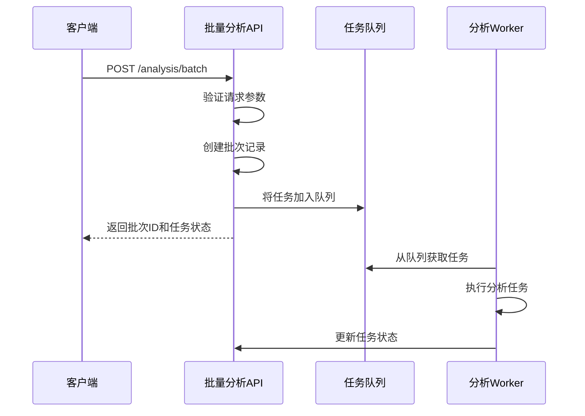
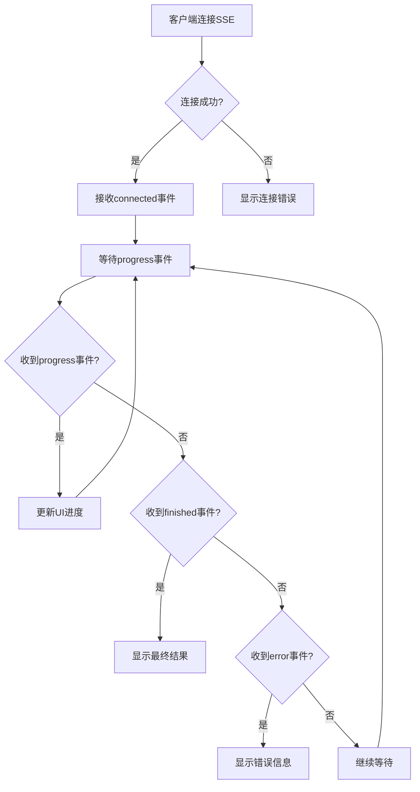
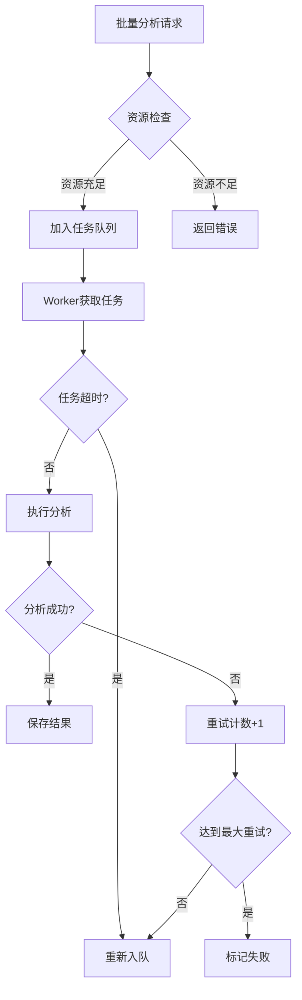

# 批量分析API

<cite>
**本文档引用的文件**   
- [analysis.py](file://app/routers/analysis.py)
- [analysis.py](file://app/models/analysis.py)
- [analysis_service.py](file://app/services/analysis_service.py)
- [queue_service.py](file://app/services/queue_service.py)
- [analysis_worker.py](file://app/worker/analysis_worker.py)
- [sse.py](file://app/routers/sse.py)
- [BatchAnalysis.vue](file://frontend/src/views/Analysis/BatchAnalysis.vue)
</cite>

## 目录
1. [简介](#简介)
2. [批量分析任务创建](#批量分析任务创建)
3. [批量分析状态查询](#批量分析状态查询)
4. [批量分析结果获取](#批量分析结果获取)
5. [资源管理与性能优化](#资源管理与性能优化)
6. [前端集成](#前端集成)
7. [代码示例](#代码示例)

## 简介
批量分析API提供了一套完整的多股票批量分析功能，允许用户一次性提交多个股票的分析任务。该API通过异步处理机制和队列系统，实现了高效的并发执行和进度跟踪。系统支持灵活的分析配置、并发控制和资源管理，确保在高负载情况下的稳定性和性能。

**Section sources**
- [analysis.py](file://app/routers/analysis.py#L1-L25)

## 批量分析任务创建
批量分析任务通过`POST /analysis/batch`端点创建。该端点接受一个包含股票列表、分析配置和批次信息的请求体。

### 请求参数
请求体必须包含以下字段：

| 字段 | 类型 | 必需 | 描述 |
|------|------|------|------|
| `title` | string | 是 | 批次标题，用于标识本次批量分析 |
| `description` | string | 否 | 批次描述，提供额外的上下文信息 |
| `symbols` | string[] | 是 | 股票代码列表，最多支持10个股票 |
| `parameters` | object | 否 | 分析配置参数，详见下文 |

### 分析配置参数
`parameters`对象包含以下可配置选项：

| 字段 | 类型 | 默认值 | 描述 |
|------|------|--------|------|
| `market_type` | string | "A股" | 市场类型，如"A股"、"美股"、"港股" |
| `research_depth` | string | "标准" | 研究深度，可选值："快速"、"基础"、"标准"、"深度"、"全面" |
| `selected_analysts` | string[] | ["market", "fundamentals", "news", "social"] | 选择的分析师类型 |
| `include_sentiment` | boolean | true | 是否包含情感分析 |
| `include_risk` | boolean | true | 是否包含风险分析 |
| `language` | string | "zh-CN" | 输出语言 |
| `quick_analysis_model` | string | "qwen-turbo" | 快速分析使用的模型 |
| `deep_analysis_model` | string | "qwen-max" | 深度分析使用的模型 |

### 并发控制
系统实现了两级并发控制：
1. **用户级并发限制**：每个用户同时处理的分析任务数量有限制
2. **全局并发限制**：系统整体的并发任务数量限制

这些限制可以通过系统配置进行调整，确保系统资源的合理分配。



**Diagram sources**
- [analysis.py](file://app/routers/analysis.py#L771-L870)
- [queue_service.py](file://app/services/queue_service.py#L45-L98)
- [analysis_worker.py](file://app/worker/analysis_worker.py#L112-L132)

**Section sources**
- [analysis.py](file://app/routers/analysis.py#L771-L870)
- [analysis.py](file://app/models/analysis.py#L165-L176)

## 批量分析状态查询
批量分析状态通过`GET /analysis/batch/{task_id}`端点查询。该端点提供实时的进度报告和统计信息。

### 响应数据结构
成功响应返回以下JSON结构：

```json
{
  "success": true,
  "data": {
    "batch_id": "string",
    "title": "string",
    "description": "string",
    "status": "pending" | "processing" | "completed" | "partial_success" | "failed" | "cancelled",
    "total_tasks": 0,
    "completed_tasks": 0,
    "failed_tasks": 0,
    "progress": 0,
    "created_at": "string",
    "started_at": "string",
    "completed_at": "string",
    "parameters": {
      "market_type": "string",
      "research_depth": "string",
      "selected_analysts": ["string"],
      "include_sentiment": true,
      "include_risk": true,
      "language": "string",
      "quick_analysis_model": "string",
      "deep_analysis_model": "string"
    }
  },
  "message": "string"
}
```

### 进度计算
批次的整体进度根据已完成任务的比例计算：
```
进度 = (已完成任务数 + 失败任务数) / 总任务数 * 100%
```

当所有任务都完成后，批次状态会根据结果更新为"completed"、"partial_success"或"failed"。

### 实时进度流
系统还提供SSE（Server-Sent Events）接口`/sse/batches/{batch_id}`，用于实时推送进度更新。客户端可以建立长连接，接收以下类型的事件：

- `connected`: 连接建立确认
- `progress`: 进度更新
- `finished`: 批次完成
- `error`: 错误信息



**Diagram sources**
- [sse.py](file://app/routers/sse.py#L113-L218)
- [analysis.py](file://app/models/analysis.py#L106-L136)

**Section sources**
- [analysis.py](file://app/routers/analysis.py#L909-L914)
- [sse.py](file://app/routers/sse.py#L113-L218)

## 批量分析结果获取
批量分析结果通过`GET /analysis/batch/{task_id}/results`端点获取。该端点支持分页机制，便于处理大量结果。

### 分页机制
请求支持以下查询参数：

| 参数 | 类型 | 默认值 | 描述 |
|------|------|--------|------|
| `page` | integer | 1 | 页码 |
| `page_size` | integer | 20 | 每页大小，最大100 |

响应包含分页信息：

```json
{
  "success": true,
  "data": {
    "tasks": [...],
    "total": 0,
    "page": 1,
    "page_size": 20,
    "has_more": true
  },
  "message": "string"
}
```

### 数据格式
每个任务结果包含详细的分析数据：

```json
{
  "task_id": "string",
  "batch_id": "string",
  "symbol": "string",
  "stock_code": "string",
  "stock_name": "string",
  "status": "pending" | "processing" | "completed" | "failed" | "cancelled",
  "progress": 0,
  "created_at": "string",
  "started_at": "string",
  "completed_at": "string",
  "result": {
    "analysis_id": "string",
    "summary": "string",
    "recommendation": "string",
    "confidence_score": 0,
    "risk_level": "string",
    "key_points": ["string"],
    "detailed_analysis": {},
    "execution_time": 0,
    "tokens_used": 0,
    "error_message": "string"
  }
}
```

**Section sources**
- [analysis.py](file://app/routers/analysis.py#L909-L914)
- [analysis.py](file://app/models/analysis.py#L72-L103)

## 资源管理与性能优化
批量分析系统采用多种策略来优化资源使用和性能表现。

### 资源管理策略
1. **队列系统**：使用Redis作为任务队列，确保任务的可靠存储和分发
2. **可见性超时**：为处理中的任务设置超时机制，防止任务卡住
3. **重试机制**：失败的任务会自动重新入队，最多重试3次
4. **内存管理**：分析任务的状态在内存中维护，提高查询性能

### 并发限制
系统配置了默认的并发限制：

| 限制类型 | 默认值 | 可配置 |
|---------|--------|--------|
| 用户级并发 | 3 | 是 |
| 全局并发 | 10 | 是 |
| 分析超时 | 300秒 | 是 |

这些值可以通过环境变量或数据库配置进行调整。

### 性能优化建议
1. **批量大小**：建议每次批量分析不超过10个股票，以平衡效率和资源使用
2. **分析深度**：根据需求选择合适的分析深度，避免不必要的资源消耗
3. **并发控制**：合理设置并发限制，避免系统过载
4. **缓存策略**：对频繁访问的数据使用Redis缓存，减少数据库查询



**Diagram sources**
- [queue_service.py](file://app/services/queue_service.py#L48-L52)
- [analysis_worker.py](file://app/worker/analysis_worker.py#L35-L45)

**Section sources**
- [queue_service.py](file://app/services/queue_service.py#L48-L52)
- [analysis_worker.py](file://app/worker/analysis_worker.py#L35-L45)

## 前端集成
前端通过`BatchAnalysis.vue`组件与批量分析API集成，提供用户友好的界面。

### 组件功能
1. **表单输入**：收集用户输入的批次信息和分析参数
2. **股票列表管理**：支持添加、删除和验证股票代码
3. **进度可视化**：实时显示分析进度和状态
4. **结果展示**：以结构化方式展示分析结果

### 用户体验设计
- **响应式布局**：适配不同屏幕尺寸
- **实时反馈**：通过进度条和状态消息提供即时反馈
- **错误处理**：友好的错误提示和恢复选项
- **配置保存**：记住用户的常用配置，提高使用效率

### 集成要点
1. **API调用**：使用axios等HTTP客户端调用后端API
2. **状态管理**：使用Vuex或Pinia管理应用状态
3. **进度更新**：通过SSE或轮询获取实时进度
4. **结果渲染**：使用Markdown渲染器展示分析报告

**Section sources**
- [BatchAnalysis.vue](file://frontend/src/views/Analysis/BatchAnalysis.vue#L115-L624)

## 代码示例
以下是使用批量分析API的代码示例：

```python
import requests
import json

# API配置
BASE_URL = "http://localhost:8000/api"
HEADERS = {
    "Content-Type": "application/json",
    "Authorization": "Bearer your_token"
}

# 1. 创建批量分析任务
def create_batch_analysis():
    analysis_request = {
        "title": "银行板块分析",
        "description": "分析主要银行股的投资价值",
        "symbols": ["601398", "601939", "601288"],
        "parameters": {
            "research_depth": "标准",
            "selected_analysts": ["market", "fundamentals", "news"],
            "include_sentiment": True,
            "include_risk": True
        }
    }
    
    response = requests.post(
        f"{BASE_URL}/analysis/batch",
        json=analysis_request,
        headers=HEADERS
    )
    
    if response.status_code == 200:
        result = response.json()
        batch_id = result["data"]["batch_id"]
        print(f"✅ 批量分析任务已提交: {batch_id}")
        return batch_id
    else:
        print(f"❌ 提交失败: {response.status_code}")
        return None

# 2. 查询批量分析状态
def get_batch_status(batch_id):
    response = requests.get(
        f"{BASE_URL}/analysis/batch/{batch_id}",
        headers=HEADERS
    )
    
    if response.status_code == 200:
        status_data = response.json()
        print(f"📊 状态: {status_data['data']['status']}")
        print(f"📈 进度: {status_data['data']['progress']}%")
        print(f"✅ 完成: {status_data['data']['completed_tasks']}")
        print(f"❌ 失败: {status_data['data']['failed_tasks']}")
        return status_data
    else:
        print(f"❌ 查询失败: {response.status_code}")
        return None

# 3. 获取批量分析结果
def get_batch_results(batch_id, page=1, page_size=20):
    params = {
        "page": page,
        "page_size": page_size
    }
    
    response = requests.get(
        f"{BASE_URL}/analysis/batch/{batch_id}/results",
        headers=HEADERS,
        params=params
    )
    
    if response.status_code == 200:
        results_data = response.json()
        print(f"📊 获取到 {len(results_data['data']['tasks'])} 个结果")
        return results_data
    else:
        print(f"❌ 获取结果失败: {response.status_code}")
        return None

# 使用示例
if __name__ == "__main__":
    # 创建批量分析
    batch_id = create_batch_analysis()
    
    if batch_id:
        # 查询状态
        import time
        while True:
            status = get_batch_status(batch_id)
            if status and status["data"]["status"] in ["completed", "failed"]:
                break
            time.sleep(5)
        
        # 获取结果
        results = get_batch_results(batch_id)
```

**Section sources**
- [examples/batch_analysis.py](file://examples/batch_analysis.py#L1-L170)