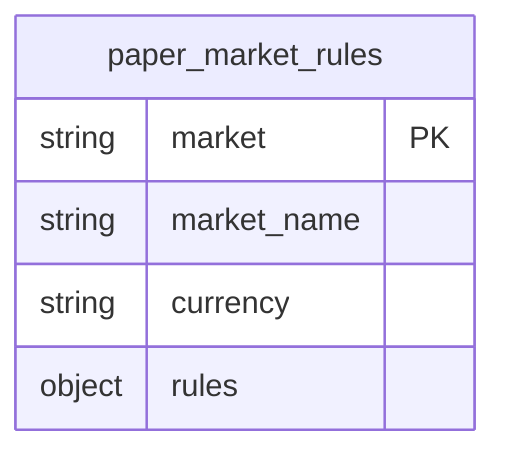
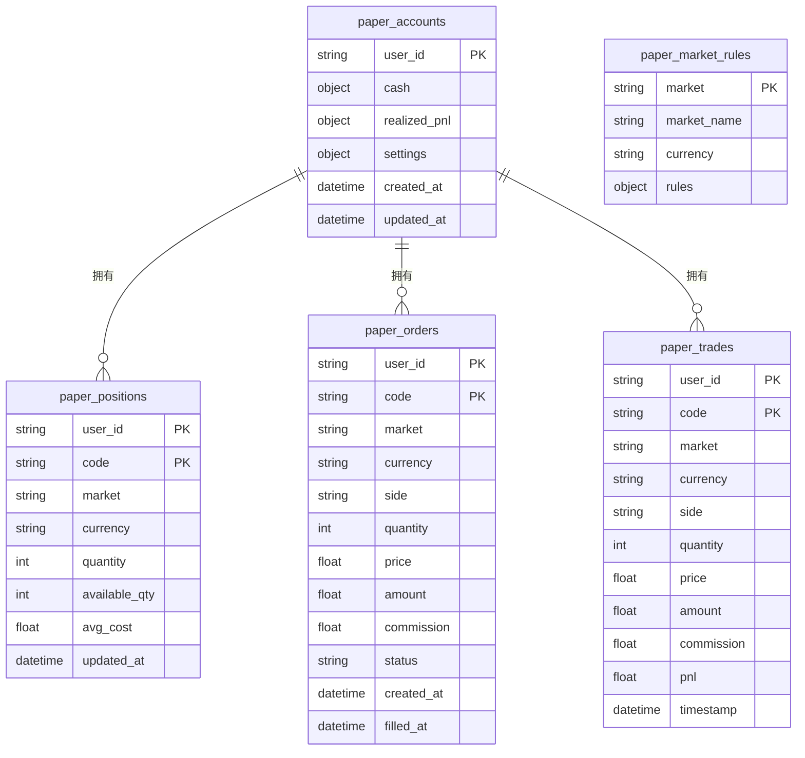

# 模拟交易API

<cite>
**本文档引用的文件**   
- [paper.py](file://app/routers/paper.py)
- [paper.ts](file://frontend/src/api/paper.ts)
- [init_paper_trading_market_rules.py](file://scripts/init_paper_trading_market_rules.py)
- [migrate_paper_accounts_cash_structure.py](file://scripts/migration/migrate_paper_accounts_cash_structure.py)
- [fix_paper_trading_initial_cash.py](file://scripts/fix_paper_trading_initial_cash.py)
</cite>

## 目录
1. [简介](#简介)
2. [核心功能](#核心功能)
3. [API端点详解](#api端点详解)
4. [交易规则与风险控制](#交易规则与风险控制)
5. [前端集成](#前端集成)
6. [代码示例](#代码示例)
7. [数据库结构](#数据库结构)

## 简介

模拟交易API为用户提供了一个安全的环境，用于测试和验证交易策略，而无需使用真实资金。该API支持多市场（A股、港股、美股）和多货币（人民币、港币、美元）的模拟交易，允许用户创建虚拟账户、执行买卖操作、查询持仓和交易历史。

该系统设计用于与前端组件无缝集成，提供实时的账户状态同步，并通过详细的市场规则和风险控制机制确保模拟交易的真实性。

**Section sources**
- [paper.py](file://app/routers/paper.py#L1-L585)

## 核心功能

模拟交易API的核心功能包括虚拟账户管理、交易执行、持仓查询和交易历史记录。系统支持多市场和多货币，确保用户可以在不同市场环境下进行交易策略的测试。

- **虚拟账户管理**：用户可以创建和管理模拟账户，初始资金根据市场类型自动配置。
- **交易执行**：支持市价单的即时成交，根据最新市场价格执行买卖操作。
- **持仓查询**：用户可以查询当前的持仓情况，包括数量、成本价、市值和盈亏。
- **交易历史**：提供完整的交易历史记录，便于用户回顾和分析交易行为。

**Section sources**
- [paper.py](file://app/routers/paper.py#L1-L585)

## API端点详解

### 账户创建端点 (GET /paper/account)

此端点用于获取或创建用户的模拟账户。如果账户不存在，系统将自动创建一个新账户，并根据市场类型配置初始资金。

**请求方法**: GET  
**路径**: `/api/paper/account`

**响应数据格式**:
```json
{
  "account": {
    "cash": {
      "CNY": 1000000.0,
      "HKD": 1000000.0,
      "USD": 100000.0
    },
    "realized_pnl": {
      "CNY": 0.0,
      "HKD": 0.0,
      "USD": 0.0
    },
    "positions_value": {
      "CNY": 0.0,
      "HKD": 0.0,
      "USD": 0.0
    },
    "equity": {
      "CNY": 1000000.0,
      "HKD": 1000000.0,
      "USD": 100000.0
    },
    "updated_at": "2023-10-01T12:00:00Z"
  },
  "positions": []
}
```

**Section sources**
- [paper.py](file://app/routers/paper.py#L270-L341)

### 交易下单端点 (POST /paper/order)

此端点用于提交市价单，按最新价格即时成交。

**请求方法**: POST  
**路径**: `/api/paper/order`

**请求体参数**:
- `code` (string): 股票代码（支持A股/港股/美股）
- `side` (string): 交易方向，"buy" 或 "sell"
- `quantity` (integer): 交易数量
- `market` (string, 可选): 市场类型 (CN/HK/US)，不传则自动识别
- `analysis_id` (string, 可选): 关联的分析ID，便于从分析页面一键下单后追踪

**请求示例**:
```json
{
  "code": "000001",
  "side": "buy",
  "quantity": 100,
  "market": "CN"
}
```

**响应数据格式**:
```json
{
  "order": {
    "user_id": "user123",
    "code": "000001",
    "market": "CN",
    "currency": "CNY",
    "side": "buy",
    "quantity": 100,
    "price": 15.5,
    "amount": 1550.0,
    "commission": 5.0,
    "status": "filled",
    "created_at": "2023-10-01T12:00:00Z",
    "filled_at": "2023-10-01T12:00:00Z"
  }
}
```

**Section sources**
- [paper.py](file://app/routers/paper.py#L344-L530)
- [paper.ts](file://frontend/src/api/paper.ts#L43-L48)

### 持仓查询端点 (GET /paper/positions)

此端点用于获取用户的持仓列表。

**请求方法**: GET  
**路径**: `/api/paper/positions`

**响应数据格式**:
```json
{
  "items": [
    {
      "code": "000001",
      "market": "CN",
      "currency": "CNY",
      "quantity": 100,
      "available_qty": 100,
      "avg_cost": 15.5,
      "last_price": 16.0,
      "market_value": 1600.0,
      "unrealized_pnl": 50.0
    }
  ]
}
```

**Section sources**
- [paper.py](file://app/routers/paper.py#L533-L560)

### 交易历史查询端点 (GET /paper/orders)

此端点用于获取用户的交易历史记录。

**请求方法**: GET  
**路径**: `/api/paper/orders`

**查询参数**:
- `limit` (integer, 可选): 返回记录数量，默认50，最大200

**响应数据格式**:
```json
{
  "items": [
    {
      "user_id": "user123",
      "code": "000001",
      "market": "CN",
      "currency": "CNY",
      "side": "buy",
      "quantity": 100,
      "price": 15.5,
      "amount": 1550.0,
      "commission": 5.0,
      "status": "filled",
      "created_at": "2023-10-01T12:00:00Z",
      "filled_at": "2023-10-01T12:00:00Z"
    }
  ]
}
```

**Section sources**
- [paper.py](file://app/routers/paper.py#L563-L570)

## 交易规则与风险控制

### 市场规则

系统通过 `paper_market_rules` 集合存储各市场的交易规则，包括交易制度、涨跌停限制、最小交易单位、手续费等。



**Diagram sources**
- [init_paper_trading_market_rules.py](file://scripts/init_paper_trading_market_rules.py#L20-L129)

### 风险控制机制

- **资金检查**：在买入操作前，检查账户是否有足够的资金。
- **持仓检查**：在卖出操作前，检查是否有足够的可用持仓（考虑T+1限制）。
- **手续费计算**：根据市场规则计算交易手续费，包括佣金、印花税等。

**Section sources**
- [paper.py](file://app/routers/paper.py#L127-L157)

## 前端集成

前端通过 `paperApi` 对象与模拟交易API进行交互，提供了简洁的接口用于账户管理、交易执行和数据查询。

```typescript
export const paperApi = {
  async getAccount() {
    return ApiClient.get<GetAccountResponse>('/api/paper/account')
  },
  async placeOrder(data: PlaceOrderPayload) {
    return ApiClient.post<{ order: PaperOrderItem }>('/api/paper/order', data, { showLoading: true })
  },
  async getPositions() {
    return ApiClient.get<{ items: PaperPositionItem[] }>('/api/paper/positions')
  },
  async getOrders(limit = 50) {
    return ApiClient.get<{ items: PaperOrderItem[] }>(`/api/paper/orders`, { limit })
  },
  async resetAccount() {
    return ApiClient.post<{ message: string; cash: number }>(`/api/paper/reset?confirm=true`)
  }
}
```

**Section sources**
- [paper.ts](file://frontend/src/api/paper.ts#L50-L67)

## 代码示例

以下示例展示了如何使用API进行模拟买卖操作。

```python
import requests

# 获取账户信息
response = requests.get('http://localhost:8000/api/paper/account', headers={'Authorization': 'Bearer your_token'})
account = response.json()
print(f"账户资金: {account['account']['cash']}")

# 下单买入
order_data = {
    "code": "000001",
    "side": "buy",
    "quantity": 100,
    "market": "CN"
}
response = requests.post('http://localhost:8000/api/paper/order', json=order_data, headers={'Authorization': 'Bearer your_token'})
order = response.json()
print(f"订单状态: {order['order']['status']}")

# 查询持仓
response = requests.get('http://localhost:8000/api/paper/positions', headers={'Authorization': 'Bearer your_token'})
positions = response.json()
print(f"当前持仓: {positions['items']}")
```

**Section sources**
- [paper.py](file://app/routers/paper.py#L344-L530)
- [paper.ts](file://frontend/src/api/paper.ts#L54-L55)

## 数据库结构

模拟交易相关的数据存储在MongoDB中，主要集合包括：

- `paper_accounts`: 存储用户的模拟账户信息
- `paper_positions`: 存储用户的持仓信息
- `paper_orders`: 存储用户的订单信息
- `paper_trades`: 存储用户的交易记录
- `paper_market_rules`: 存储各市场的交易规则



**Diagram sources**
- [paper.py](file://app/routers/paper.py#L65-L92)
- [init_paper_trading_market_rules.py](file://scripts/init_paper_trading_market_rules.py#L20-L129)