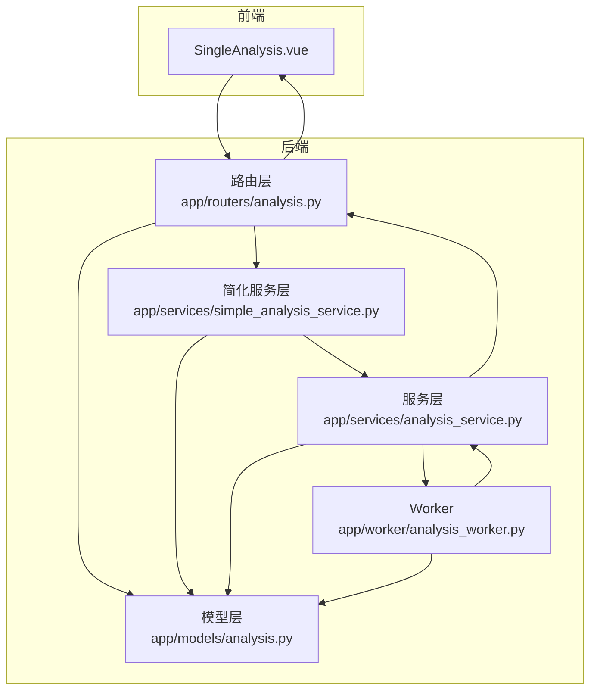
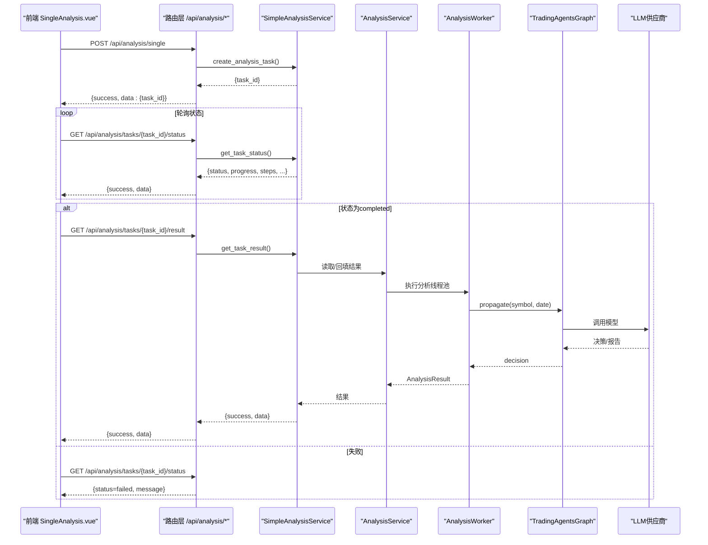
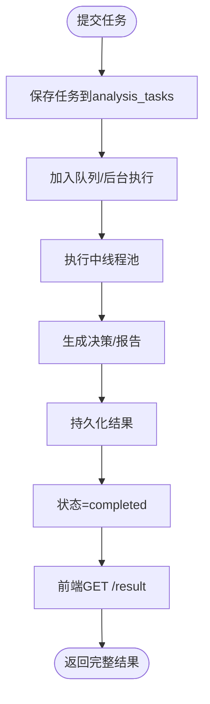
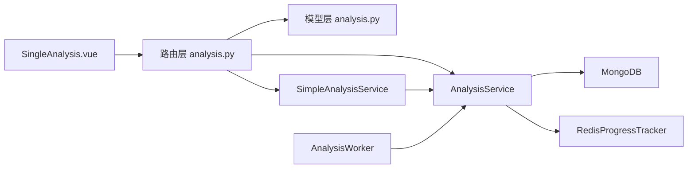

# 股票分析API

<cite>
**本文引用的文件**
- [app/routers/analysis.py](file://app/routers/analysis.py)
- [app/models/analysis.py](file://app/models/analysis.py)
- [app/services/analysis_service.py](file://app/services/analysis_service.py)
- [app/services/simple_analysis_service.py](file://app/services/simple_analysis_service.py)
- [app/worker/analysis_worker.py](file://app/worker/analysis_worker.py)
- [frontend/src/views/Analysis/SingleAnalysis.vue](file://frontend/src/views/Analysis/SingleAnalysis.vue)
- [app/middleware/error_handler.py](file://app/middleware/error_handler.py)
- [examples/simple_analysis_demo.py](file://examples/simple_analysis_demo.py)
</cite>

## 目录
1. [简介](#简介)
2. [项目结构](#项目结构)
3. [核心组件](#核心组件)
4. [架构总览](#架构总览)
5. [详细组件分析](#详细组件分析)
6. [依赖关系分析](#依赖关系分析)
7. [性能考量](#性能考量)
8. [故障排查指南](#故障排查指南)
9. [结论](#结论)
10. [附录](#附录)

## 简介
本文件面向“个股分析”功能，系统化梳理股票分析API的设计与实现，重点覆盖以下方面：
- 单只股票分析任务创建端点（POST /api/analysis/single）
- 分析状态查询端点（GET /api/analysis/tasks/{task_id}/status）
- 分析结果获取端点（GET /api/analysis/tasks/{task_id}/result）
- 请求参数与响应结构说明（含研究深度、模型选择、分析师选择等）
- 超时与错误处理机制
- Python与JavaScript调用示例
- 任务生命周期与前后端集成（SingleAnalysis.vue）

## 项目结构
围绕个股分析的核心模块与职责如下：
- 路由层：定义REST API端点，负责请求校验、鉴权、调用服务层
- 模型层：定义请求/响应数据结构、状态枚举、参数模型
- 服务层：封装分析任务提交、执行、状态更新、结果聚合
- Worker：消费队列任务，实际执行分析流程
- 前端：SingleAnalysis.vue负责轮询状态、拉取结果并渲染

图表来源
- [app/routers/analysis.py](file://app/routers/analysis.py#L1-L120)
- [app/services/analysis_service.py](file://app/services/analysis_service.py#L420-L520)
- [app/services/simple_analysis_service.py](file://app/services/simple_analysis_service.py#L730-L820)
- [app/worker/analysis_worker.py](file://app/worker/analysis_worker.py#L110-L180)
- [app/models/analysis.py](file://app/models/analysis.py#L140-L237)

章节来源
- [app/routers/analysis.py](file://app/routers/analysis.py#L1-L120)
- [app/models/analysis.py](file://app/models/analysis.py#L1-L120)

## 核心组件
- 路由与端点
  - POST /api/analysis/single：提交单只股票分析任务，立即返回任务ID，后台异步执行
  - GET /api/analysis/tasks/{task_id}/status：查询任务状态（含进度、步骤、耗时等）
  - GET /api/analysis/tasks/{task_id}/result：获取分析结果（汇总摘要、建议、决策、报告等）
- 数据模型
  - AnalysisParameters：研究深度、模型选择、分析师选择、语言、是否包含情绪/风险等
  - AnalysisTask/AnalysisResult：任务与结果的数据结构
  - AnalysisStatus/BatchStatus：任务状态枚举
- 服务层
  - AnalysisService：负责任务持久化、状态更新、执行分析（含线程池与进度跟踪）
  - SimpleAnalysisService：轻量封装，负责任务创建、内存状态管理、模型/供应商解析
- Worker
  - AnalysisWorker：从队列取出任务，调用分析服务执行，完成ACK

章节来源
- [app/routers/analysis.py](file://app/routers/analysis.py#L39-L120)
- [app/models/analysis.py](file://app/models/analysis.py#L33-L120)
- [app/services/analysis_service.py](file://app/services/analysis_service.py#L420-L520)
- [app/services/simple_analysis_service.py](file://app/services/simple_analysis_service.py#L730-L820)
- [app/worker/analysis_worker.py](file://app/worker/analysis_worker.py#L110-L180)

## 架构总览
下图展示了从前端到后端、再到分析引擎与外部模型供应商的整体流程。

图表来源
- [app/routers/analysis.py](file://app/routers/analysis.py#L39-L120)
- [app/services/simple_analysis_service.py](file://app/services/simple_analysis_service.py#L730-L820)
- [app/services/analysis_service.py](file://app/services/analysis_service.py#L420-L520)
- [app/worker/analysis_worker.py](file://app/worker/analysis_worker.py#L133-L178)

## 详细组件分析

### 1) 端点：提交单只分析任务（POST /api/analysis/single）
- 请求体
  - symbol 或 stock_code（兼容字段）：6位股票代码
  - parameters：AnalysisParameters 对象，包含
    - research_depth：研究深度（支持“快速”、“基础”、“标准”、“深度”、“全面”，或数字1-5）
    - selected_analysts：分析师选择列表（如 ["market","fundamentals","news","social"]）
    - include_sentiment/include_risk：是否包含情绪与风险分析
    - language：语言（默认 zh-CN）
    - quick_analysis_model/deep_analysis_model：快速/深度模型名称
    - market_type：市场类型（默认“A股”）
    - custom_prompt：自定义提示词（可选）
- 响应
  - success：布尔
  - data：包含 task_id
  - message：提示信息（如“任务已在后台启动”）

注意
- 该端点使用 BackgroundTasks 异步执行，提交后立即返回，不阻塞API响应
- 任务会在后台异步执行，状态可通过状态查询端点获取

章节来源
- [app/routers/analysis.py](file://app/routers/analysis.py#L39-L120)
- [app/models/analysis.py](file://app/models/analysis.py#L33-L120)

### 2) 端点：查询任务状态（GET /api/analysis/tasks/{task_id}/status）
- 响应结构
  - success：布尔
  - data：包含
    - task_id、status、progress、message
    - current_step、steps（步骤列表）、start_time/end_time/elapsed_time/remaining_time/estimated_total_time
    - symbol/stock_code/stock_symbol、analysts、research_depth
    - source（数据来源标记）
- 状态码
  - 200：成功
  - 404：任务不存在
  - 500：服务器内部错误

章节来源
- [app/routers/analysis.py](file://app/routers/analysis.py#L105-L214)

### 3) 端点：获取分析结果（GET /api/analysis/tasks/{task_id}/result）
- 响应结构
  - success：布尔
  - data：包含
    - analysis_id、stock_symbol/stock_code、analysis_date
    - summary（摘要）、recommendation（建议）、confidence_score、risk_level
    - key_points（要点）、execution_time、tokens_used
    - analysts、research_depth、detailed_analysis、state、decision
    - reports（报告字典，键为报告名，值为报告内容）
    - created_at/updated_at/status/source
- 数据来源与回退策略
  - 优先从内存中获取（任务完成时写入）
  - 内存不存在时，从MongoDB analysis_reports 集合恢复
  - 再兜底从 analysis_tasks.result 字段恢复
  - 若仍无，尝试从文件系统 results 目录或 state 字段提取报告
- 超时与错误
  - 404：分析结果不存在
  - 400/500：获取失败

章节来源
- [app/routers/analysis.py](file://app/routers/analysis.py#L221-L699)

### 4) 请求参数详解：AnalysisParameters
- 研究深度（research_depth）
  - 支持“快速”、“基础”、“标准”、“深度”、“全面”或数字1-5
  - 数字与中文映射在服务层完成，最终影响辩论轮次、记忆开关、在线工具等配置
- 模型选择（quick_analysis_model/deep_analysis_model）
  - 支持 qwen 系列、OpenAI、Google 等供应商模型
  - 服务层会解析供应商与API Base URL，并优先使用数据库配置，其次回退到环境变量
- 分析师选择（selected_analysts）
  - 默认包含 ["market","fundamentals","news","social"]，可按需调整
- 其他
  - include_sentiment/include_risk：是否启用情绪与风险分析
  - language：语言
  - market_type：市场类型
  - custom_prompt：自定义提示词

章节来源
- [app/models/analysis.py](file://app/models/analysis.py#L33-L120)
- [app/services/simple_analysis_service.py](file://app/services/simple_analysis_service.py#L372-L588)

### 5) 任务生命周期与执行流程
- 提交流程
  - 前端调用 POST /api/analysis/single，后端立即创建任务并返回 task_id
  - 后台异步执行，状态逐步更新
- 执行流程
  - AnalysisWorker 从队列取出任务，调用 AnalysisService.execute_analysis_task
  - 在线程池中执行 TradingAgentsGraph.propagate，产出决策与报告
  - 更新任务状态为 completed，并持久化结果
- 结果获取
  - 前端轮询状态，当 status=completed 时调用 GET /api/analysis/tasks/{task_id}/result
  - 后端按优先级回填/补全结果字段（summary、recommendation、reports 等）

图表来源
- [app/services/analysis_service.py](file://app/services/analysis_service.py#L616-L739)
- [app/worker/analysis_worker.py](file://app/worker/analysis_worker.py#L133-L178)
- [app/routers/analysis.py](file://app/routers/analysis.py#L221-L699)

章节来源
- [app/services/analysis_service.py](file://app/services/analysis_service.py#L616-L739)
- [app/worker/analysis_worker.py](file://app/worker/analysis_worker.py#L133-L178)

### 6) 前端集成：SingleAnalysis.vue
- 轮询策略
  - 每5秒轮询一次状态，直到 status=completed 或 failed
  - 展示进度、步骤、耗时等信息
- 结果获取
  - 当状态为 completed 时，调用 /api/analysis/tasks/{task_id}/result 获取完整数据
  - 若失败或异常，回退到 status 中的 result_data
- 错误处理
  - 失败时展示友好错误消息，清除任务缓存
  - 轮询异常时不中断，继续尝试

章节来源
- [frontend/src/views/Analysis/SingleAnalysis.vue](file://frontend/src/views/Analysis/SingleAnalysis.vue#L1050-L1206)

### 7) 错误处理与超时
- HTTP状态码
  - 400：参数校验失败
  - 403：权限不足
  - 404：资源不存在（任务/结果）
  - 500：服务器内部错误
- 超时与重试
  - 前端请求超时与网络错误具备重试机制
  - 服务器端未设置固定超时，但队列可见性超时与Worker轮询间隔可配置

章节来源
- [app/middleware/error_handler.py](file://app/middleware/error_handler.py#L15-L89)
- [frontend/src/api/request.ts](file://frontend/src/api/request.ts#L290-L335)

## 依赖关系分析
- 路由层依赖模型层（请求/响应结构）与服务层（任务提交/状态查询/结果获取）
- 服务层依赖数据库（MongoDB）与Redis（进度跟踪）
- Worker依赖队列服务，消费任务并调用分析服务
- 前端依赖路由层提供的状态与结果接口

图表来源
- [app/routers/analysis.py](file://app/routers/analysis.py#L1-L120)
- [app/models/analysis.py](file://app/models/analysis.py#L140-L237)
- [app/services/analysis_service.py](file://app/services/analysis_service.py#L420-L520)
- [app/services/simple_analysis_service.py](file://app/services/simple_analysis_service.py#L730-L820)
- [app/worker/analysis_worker.py](file://app/worker/analysis_worker.py#L110-L180)

章节来源
- [app/routers/analysis.py](file://app/routers/analysis.py#L1-L120)
- [app/services/analysis_service.py](file://app/services/analysis_service.py#L420-L520)
- [app/services/simple_analysis_service.py](file://app/services/simple_analysis_service.py#L730-L820)
- [app/worker/analysis_worker.py](file://app/worker/analysis_worker.py#L110-L180)

## 性能考量
- 异步执行与线程池
  - 提交任务立即返回，后台使用线程池执行分析，避免阻塞API
- 并发与队列
  - 队列服务支持用户并发与全局并发限制，可见性超时可配置
- 结果回填与补全
  - 优先从内存获取，失败时回退到MongoDB与文件系统，减少重复计算
- 模型与供应商解析
  - 优先从数据库系统配置读取模型参数与API Base URL，其次回退到环境变量

章节来源
- [app/services/analysis_service.py](file://app/services/analysis_service.py#L348-L421)
- [app/services/simple_analysis_service.py](file://app/services/simple_analysis_service.py#L100-L222)
- [app/worker/analysis_worker.py](file://app/worker/analysis_worker.py#L56-L109)

## 故障排查指南
- 任务提交后立即返回，但状态长时间为 pending
  - 检查队列是否正常、Worker是否启动
  - 查看队列并发限制与可见性超时配置
- 状态查询返回404
  - 任务ID错误或任务未创建
  - 检查MongoDB analysis_tasks 是否存在对应记录
- 结果获取返回404
  - 任务未完成或结果未持久化
  - 检查 analysis_reports 与 analysis_tasks.result 字段
- 前端轮询无响应
  - 检查网络与CORS配置
  - 前端具备超时与重试逻辑，必要时手动刷新
- 错误分类参考
  - 网络/超时：前端错误分类与提示
  - 权限/资源不存在：中间件统一错误响应

章节来源
- [app/middleware/error_handler.py](file://app/middleware/error_handler.py#L15-L89)
- [frontend/src/api/request.ts](file://frontend/src/api/request.ts#L290-L335)

## 结论
个股分析API采用“提交即返回、后台异步执行”的设计，结合队列与线程池实现高吞吐与低延迟。前端通过轮询状态与结果端点完成完整的分析体验。参数模型灵活，支持研究深度、模型选择、分析师组合等配置，满足不同场景需求。建议在生产环境中合理配置并发与超时参数，并完善监控与告警。

## 附录

### A. 端点一览与参数说明
- POST /api/analysis/single
  - 请求体：symbol/stock_code、parameters
  - 响应：success、data(task_id)、message
- GET /api/analysis/tasks/{task_id}/status
  - 响应：success、data（包含状态、进度、步骤、耗时、股票信息等）
- GET /api/analysis/tasks/{task_id}/result
  - 响应：success、data（包含摘要、建议、决策、报告、统计信息等）

章节来源
- [app/routers/analysis.py](file://app/routers/analysis.py#L39-L120)
- [app/routers/analysis.py](file://app/routers/analysis.py#L105-L214)
- [app/routers/analysis.py](file://app/routers/analysis.py#L221-L699)

### B. Python 调用示例（路径）
- 使用 requests 发起分析任务
  - 参考路径：[examples/simple_analysis_demo.py](file://examples/simple_analysis_demo.py#L1-L214)
- 前端 JavaScript 调用
  - 参考路径：[frontend/src/views/Analysis/SingleAnalysis.vue](file://frontend/src/views/Analysis/SingleAnalysis.vue#L1050-L1206)

章节来源
- [examples/simple_analysis_demo.py](file://examples/simple_analysis_demo.py#L1-L214)
- [frontend/src/views/Analysis/SingleAnalysis.vue](file://frontend/src/views/Analysis/SingleAnalysis.vue#L1050-L1206)