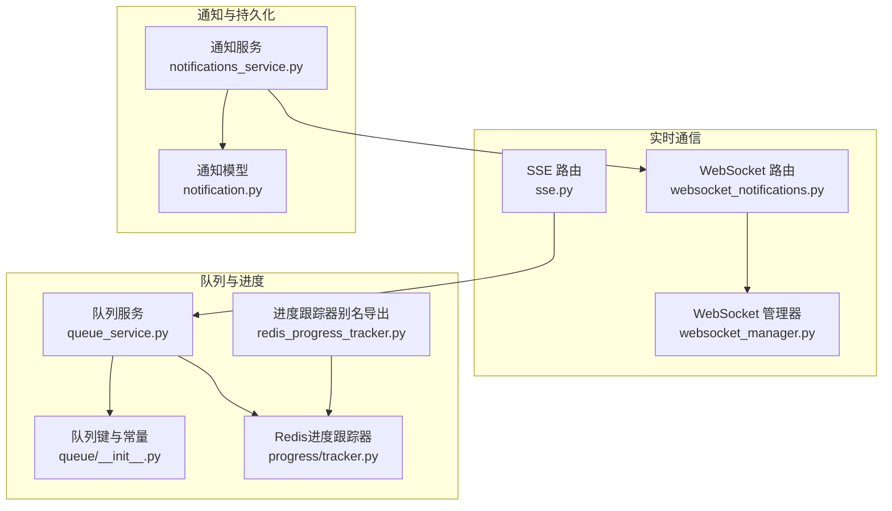
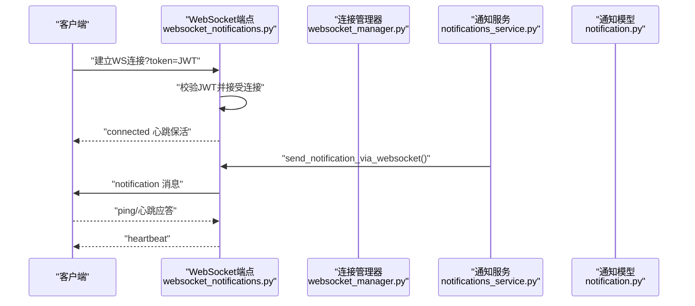
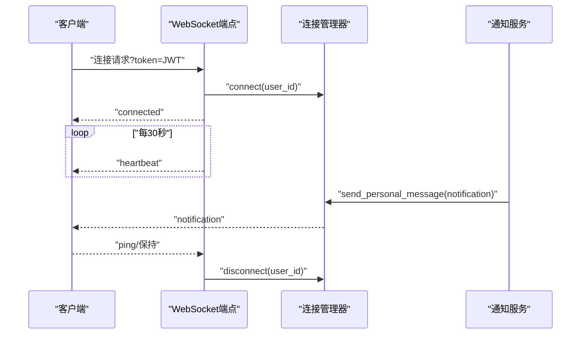
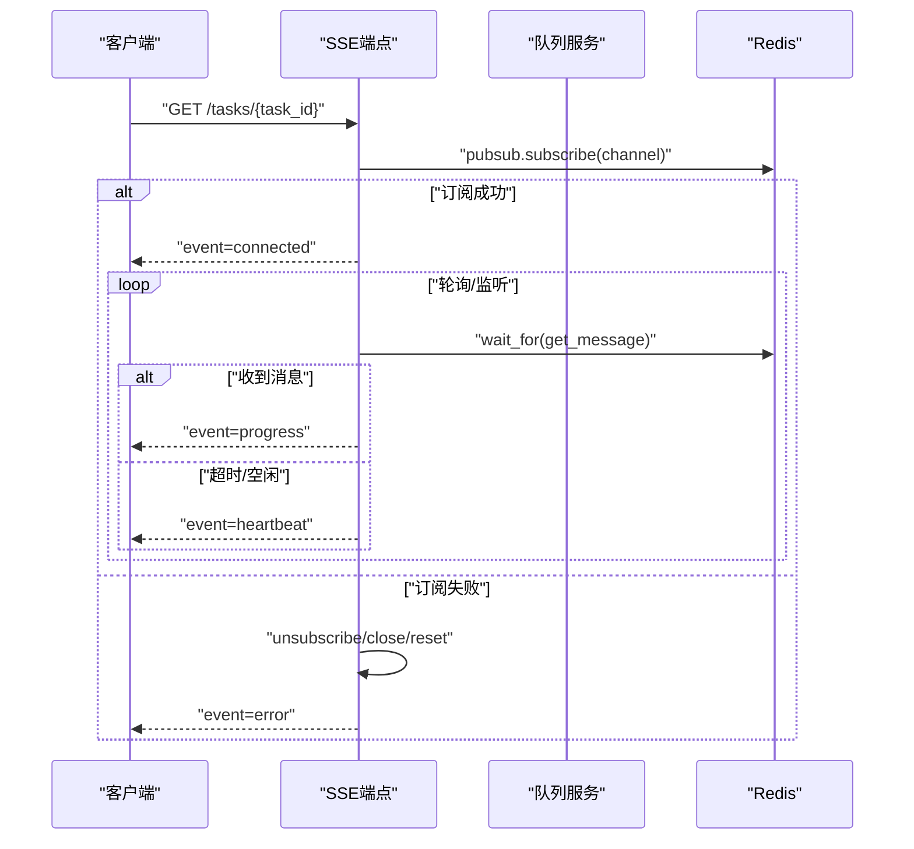
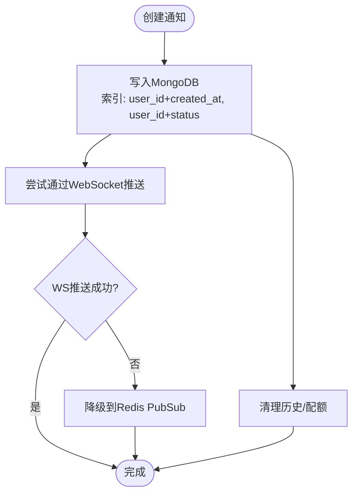
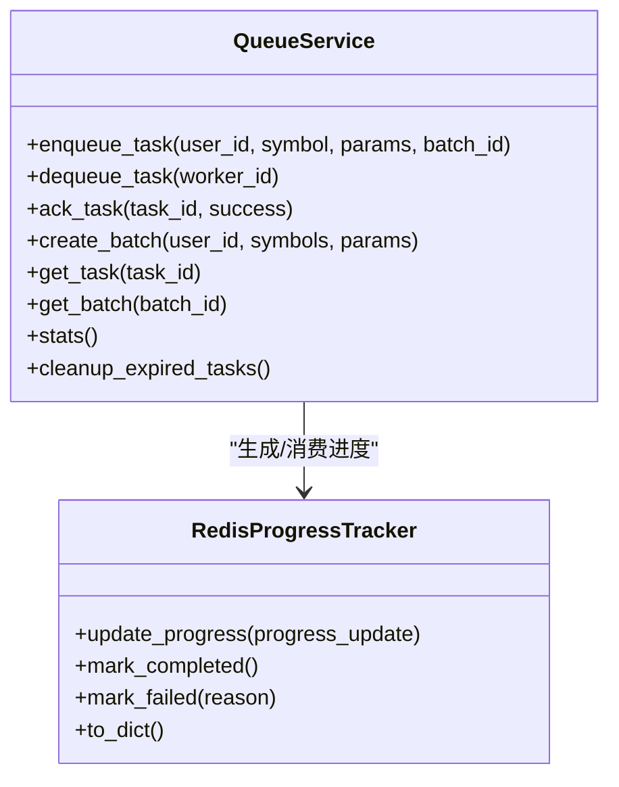
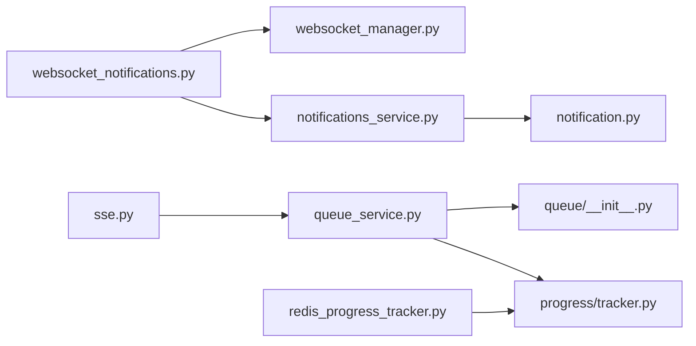

# 实时通信API

<cite>
**本文引用的文件**
- [websocket_notifications.py](file://app/routers/websocket_notifications.py)
- [sse.py](file://app/routers/sse.py)
- [websocket_manager.py](file://app/services/websocket_manager.py)
- [notifications_service.py](file://app/services/notifications_service.py)
- [notification.py](file://app/models/notification.py)
- [queue_service.py](file://app/services/queue_service.py)
- [queue/__init__.py](file://app/services/queue/__init__.py)
- [redis_progress_tracker.py](file://app/services/redis_progress_tracker.py)
- [progress/tracker.py](file://app/services/progress/tracker.py)
- [websocket_notifications.md](file://docs/guides/websocket_notifications.md)
- [2025-10-23-websocket-notifications-and-data-fixes.md](file://docs/blog/2025-10-23-websocket-notifications-and-data-fixes.md)
- [REDIS_CONNECTION_LEAK_ANALYSIS.md](file://docs/fixes/REDIS_CONNECTION_LEAK_ANALYSIS.md)
</cite>

## 目录
1. [简介](#简介)
2. [项目结构](#项目结构)
3. [核心组件](#核心组件)
4. [架构总览](#架构总览)
5. [详细组件分析](#详细组件分析)
6. [依赖关系分析](#依赖关系分析)
7. [性能与可靠性](#性能与可靠性)
8. [故障排查指南](#故障排查指南)
9. [结论](#结论)
10. [附录](#附录)

## 简介
本文件面向实时通信API，聚焦于WebSocket与Server-Sent Events（SSE）两种方案的实现与使用，覆盖实时通知、任务进度更新与消息队列的通信协议、消息格式与事件类型，并提供客户端连接、订阅与处理实时消息的参考路径。同时解释消息持久化、连接管理与错误恢复机制，并说明该API在提升用户体验方面的具体应用。

## 项目结构
实时通信能力主要分布在以下模块：
- WebSocket路由与连接管理：app/routers/websocket_notifications.py、app/services/websocket_manager.py
- SSE路由与进度流：app/routers/sse.py
- 通知模型与服务：app/models/notification.py、app/services/notifications_service.py
- 队列与进度跟踪：app/services/queue_service.py、app/services/queue/__init__.py、app/services/redis_progress_tracker.py、app/services/progress/tracker.py
- 文档与迁移说明：docs/guides/websocket_notifications.md、docs/blog/2025-10-23-websocket-notifications-and-data-fixes.md、docs/fixes/REDIS_CONNECTION_LEAK_ANALYSIS.md

图表来源
- [websocket_notifications.py](file://app/routers/websocket_notifications.py#L1-L305)
- [sse.py](file://app/routers/sse.py#L1-L259)
- [websocket_manager.py](file://app/services/websocket_manager.py#L1-L89)
- [notifications_service.py](file://app/services/notifications_service.py#L1-L142)
- [notification.py](file://app/models/notification.py#L1-L75)
- [queue_service.py](file://app/services/queue_service.py#L1-L364)
- [queue/__init__.py](file://app/services/queue/__init__.py#L1-L31)
- [redis_progress_tracker.py](file://app/services/redis_progress_tracker.py#L1-L14)
- [progress/tracker.py](file://app/services/progress/tracker.py#L1-L541)

章节来源
- [websocket_notifications.py](file://app/routers/websocket_notifications.py#L1-L305)
- [sse.py](file://app/routers/sse.py#L1-L259)
- [websocket_manager.py](file://app/services/websocket_manager.py#L1-L89)
- [notifications_service.py](file://app/services/notifications_service.py#L1-L142)
- [notification.py](file://app/models/notification.py#L1-L75)
- [queue_service.py](file://app/services/queue_service.py#L1-L364)
- [queue/__init__.py](file://app/services/queue/__init__.py#L1-L31)
- [redis_progress_tracker.py](file://app/services/redis_progress_tracker.py#L1-L14)
- [progress/tracker.py](file://app/services/progress/tracker.py#L1-L541)

## 核心组件
- WebSocket通知与任务进度端点：提供双向实时通信，支持心跳保活与连接统计。
- SSE任务/批次进度流：基于Redis PubSub或轮询队列状态，输出事件流。
- 通知服务：负责通知的持久化、去重清理与向WebSocket推送。
- 队列服务：提供任务入队、出队、并发控制、可见性超时与过期任务回收。
- 进度跟踪器：提供分析任务的步骤权重、时间估算与进度持久化。

章节来源
- [websocket_notifications.py](file://app/routers/websocket_notifications.py#L1-L305)
- [sse.py](file://app/routers/sse.py#L1-L259)
- [notifications_service.py](file://app/services/notifications_service.py#L1-L142)
- [queue_service.py](file://app/services/queue_service.py#L1-L364)
- [progress/tracker.py](file://app/services/progress/tracker.py#L1-L541)

## 架构总览
WebSocket与SSE分别服务于不同场景：
- WebSocket：适用于需要双向通信、更低延迟与更好连接管理的场景（如通知推送、任务进度双向交互）。
- SSE：适用于单向推送、浏览器原生支持且易于部署的场景（如任务/批次进度流）。

图表来源
- [websocket_notifications.py](file://app/routers/websocket_notifications.py#L109-L198)
- [websocket_manager.py](file://app/services/websocket_manager.py#L1-L89)
- [notifications_service.py](file://app/services/notifications_service.py#L34-L90)
- [notification.py](file://app/models/notification.py#L1-L75)

## 详细组件分析

### WebSocket通知与任务进度
- 端点
  - 通知端点：ws://host/api/ws/notifications?token=JWT
  - 任务进度端点：ws://host/api/ws/tasks/{task_id}?token=JWT
- 消息类型
  - 通知：type=notification
  - 连接确认：type=connected
  - 心跳：type=heartbeat
  - 任务进度：type=progress（任务端点）
- 心跳机制：后端每30秒发送一次心跳，客户端保持连接活跃。
- 连接管理：全局连接管理器维护用户到WebSocket集合的映射，支持清理死连接与广播。

图表来源
- [websocket_notifications.py](file://app/routers/websocket_notifications.py#L109-L198)
- [websocket_notifications.py](file://app/routers/websocket_notifications.py#L200-L263)
- [websocket_notifications.py](file://app/routers/websocket_notifications.py#L265-L305)
- [websocket_manager.py](file://app/services/websocket_manager.py#L1-L89)
- [notifications_service.py](file://app/services/notifications_service.py#L34-L90)

章节来源
- [websocket_notifications.py](file://app/routers/websocket_notifications.py#L1-L305)
- [websocket_manager.py](file://app/services/websocket_manager.py#L1-L89)
- [websocket_notifications.md](file://docs/guides/websocket_notifications.md#L1-L394)

### SSE任务/批次进度流
- 端点
  - 任务进度：GET /api/tasks/{task_id}
  - 批次进度：GET /api/batches/{batch_id}
- 事件类型
  - connected：连接确认
  - progress：进度更新
  - finished：批次完成事件
  - error：错误事件
- 连接生命周期
  - 订阅Redis频道或轮询队列状态，超时与空闲检测，定期心跳。
  - 订阅失败与异常时，确保PubSub连接分步关闭与重置，避免连接泄漏。
- SSE配置
  - 动态从系统配置加载轮询超时、心跳间隔、最大空闲时间等参数。

图表来源
- [sse.py](file://app/routers/sse.py#L18-L112)
- [sse.py](file://app/routers/sse.py#L113-L218)
- [sse.py](file://app/routers/sse.py#L224-L259)
- [queue_service.py](file://app/services/queue_service.py#L194-L223)

章节来源
- [sse.py](file://app/routers/sse.py#L1-L259)
- [queue_service.py](file://app/services/queue_service.py#L1-L364)
- [REDIS_CONNECTION_LEAK_ANALYSIS.md](file://docs/fixes/REDIS_CONNECTION_LEAK_ANALYSIS.md#L315-L332)

### 通知持久化与推送
- 持久化：通知写入MongoDB，带索引；支持按用户清理历史与配额上限。
- 推送：优先通过WebSocket推送；若失败则降级到Redis PubSub（兼容SSE）。
- 数据模型：通知字段包含类型、来源、链接、严重级别、状态与创建时间等。

图表来源
- [notifications_service.py](file://app/services/notifications_service.py#L34-L90)
- [notification.py](file://app/models/notification.py#L1-L75)

章节来源
- [notifications_service.py](file://app/services/notifications_service.py#L1-L142)
- [notification.py](file://app/models/notification.py#L1-L75)

### 队列与进度跟踪
- 队列服务
  - FIFO入队/出队，支持用户与全局并发限制、可见性超时与过期任务回收。
  - 批次管理：批量任务聚合与状态汇总。
- 进度跟踪器
  - 基于步骤权重与研究深度、分析师数量、模型速度估算总时长与剩余时间。
  - 进度持久化至Redis或本地文件，支持按任务ID查询。

图表来源
- [queue_service.py](file://app/services/queue_service.py#L45-L364)
- [progress/tracker.py](file://app/services/progress/tracker.py#L1-L541)

章节来源
- [queue_service.py](file://app/services/queue_service.py#L1-L364)
- [progress/tracker.py](file://app/services/progress/tracker.py#L1-L541)

## 依赖关系分析
- WebSocket端点依赖连接管理器与认证服务；通知服务依赖WebSocket端点与MongoDB/Redis。
- SSE端点依赖队列服务与Redis；队列服务依赖Redis键空间与辅助函数。
- 进度跟踪器与队列服务共同支撑任务进度的产生与消费。

图表来源
- [websocket_notifications.py](file://app/routers/websocket_notifications.py#L1-L305)
- [websocket_manager.py](file://app/services/websocket_manager.py#L1-L89)
- [notifications_service.py](file://app/services/notifications_service.py#L1-L142)
- [notification.py](file://app/models/notification.py#L1-L75)
- [sse.py](file://app/routers/sse.py#L1-L259)
- [queue_service.py](file://app/services/queue_service.py#L1-L364)
- [queue/__init__.py](file://app/services/queue/__init__.py#L1-L31)
- [redis_progress_tracker.py](file://app/services/redis_progress_tracker.py#L1-L14)
- [progress/tracker.py](file://app/services/progress/tracker.py#L1-L541)

章节来源
- [websocket_notifications.py](file://app/routers/websocket_notifications.py#L1-L305)
- [sse.py](file://app/routers/sse.py#L1-L259)
- [queue_service.py](file://app/services/queue_service.py#L1-L364)

## 性能与可靠性
- WebSocket
  - 心跳保活：每30秒发送一次心跳，降低代理超时导致的连接中断。
  - 连接统计：提供/ws/stats接口，便于监控用户连接数与总连接数。
  - 连接管理：使用锁保护活跃连接集合，清理死连接，避免内存泄漏。
- SSE
  - 订阅失败与异常时，分步关闭PubSub连接并重置，避免连接泄漏。
  - 动态配置轮询超时、心跳间隔与最大空闲时间，平衡实时性与资源占用。
- 队列与进度
  - 并发限制与可见性超时，防止任务积压与重复处理。
  - 进度持久化与估算时间，提升用户体验与可观测性。

章节来源
- [websocket_notifications.py](file://app/routers/websocket_notifications.py#L155-L198)
- [websocket_notifications.py](file://app/routers/websocket_notifications.py#L265-L269)
- [sse.py](file://app/routers/sse.py#L37-L112)
- [queue_service.py](file://app/services/queue_service.py#L237-L361)
- [progress/tracker.py](file://app/services/progress/tracker.py#L256-L299)

## 故障排查指南
- WebSocket连接失败
  - 检查JWT有效性与端点URL参数；确认Nginx代理配置（Upgrade/Connection、超时与禁用缓冲）。
  - 使用/ws/stats查看连接统计，定位异常。
- SSE连接泄漏
  - 订阅失败时必须确保unsubscribe/close/reset顺序执行；关注日志中的清理动作。
- 进度不更新
  - 确认Redis/文件持久化是否可用；检查队列服务的可见性超时与过期任务回收逻辑。
- 通知未送达
  - 若WebSocket推送失败，确认降级到Redis PubSub的通道是否正确；检查MongoDB索引与清理策略。

章节来源
- [websocket_notifications.md](file://docs/guides/websocket_notifications.md#L276-L394)
- [2025-10-23-websocket-notifications-and-data-fixes.md](file://docs/blog/2025-10-23-websocket-notifications-and-data-fixes.md#L41-L191)
- [REDIS_CONNECTION_LEAK_ANALYSIS.md](file://docs/fixes/REDIS_CONNECTION_LEAK_ANALYSIS.md#L315-L332)

## 结论
本实时通信API通过WebSocket与SSE双通道满足不同场景需求：WebSocket提供低延迟、双向通信与更好的连接管理；SSE提供简单可靠的单向推送。配合通知持久化、队列并发控制与进度跟踪，系统在可靠性、性能与用户体验方面取得平衡。建议优先采用WebSocket，必要时结合SSE实现向后兼容。

## 附录
- 客户端连接与订阅参考路径
  - WebSocket通知：参见“快速开始”中的端点与消息格式路径
    - [websocket_notifications.md](file://docs/guides/websocket_notifications.md#L20-L120)
  - WebSocket任务进度：参见“快速开始”中的端点与消息格式路径
    - [websocket_notifications.md](file://docs/guides/websocket_notifications.md#L48-L69)
  - SSE任务进度：参见“快速开始”中的端点与事件类型路径
    - [websocket_notifications.md](file://docs/guides/websocket_notifications.md#L120-L170)
  - SSE批次进度：参见“快速开始”中的端点与事件类型路径
    - [websocket_notifications.md](file://docs/guides/websocket_notifications.md#L170-L220)
- 连接管理与统计
  - WebSocket连接统计：参见“监控”中的/ws/stats路径
    - [websocket_notifications.md](file://docs/guides/websocket_notifications.md#L323-L344)
- 配置与Nginx
  - WebSocket代理配置要点：参见“配置”中的Nginx配置路径
    - [websocket_notifications.md](file://docs/guides/websocket_notifications.md#L286-L320)