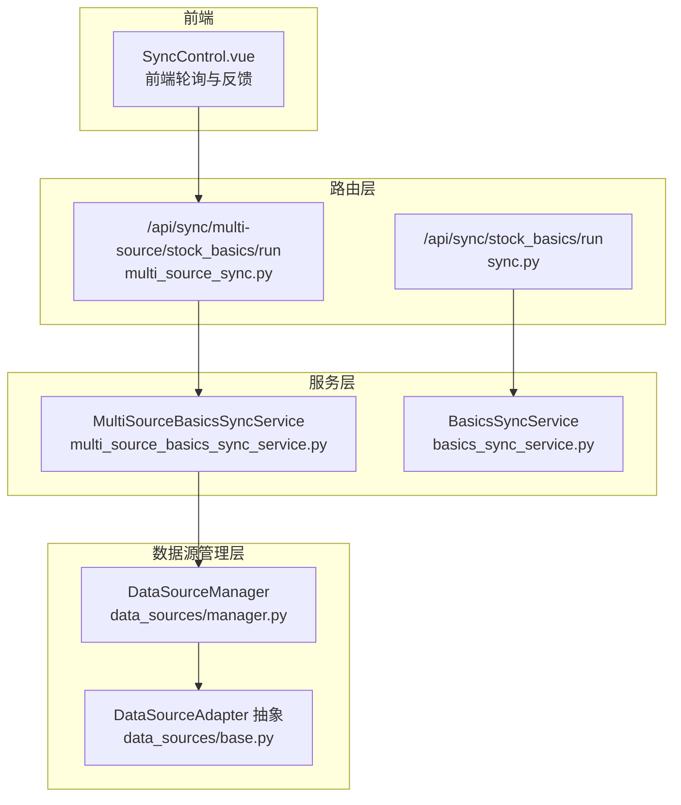
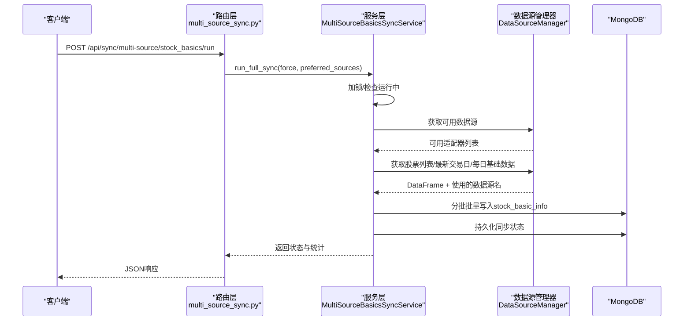
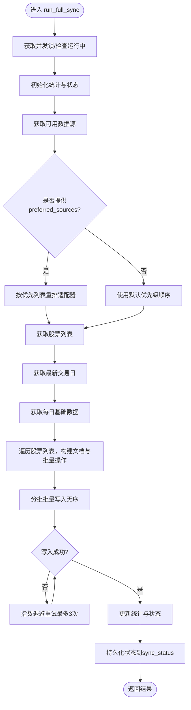
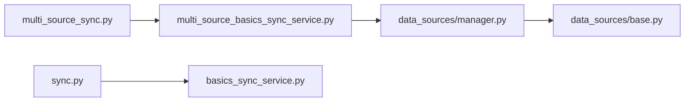

# 同步控制API

<cite>
**本文引用的文件**
- [app/routers/multi_source_sync.py](file://app/routers/multi_source_sync.py)
- [app/services/multi_source_basics_sync_service.py](file://app/services/multi_source_basics_sync_service.py)
- [app/services/data_sources/manager.py](file://app/services/data_sources/manager.py)
- [app/services/data_sources/base.py](file://app/services/data_sources/base.py)
- [app/routers/sync.py](file://app/routers/sync.py)
- [app/services/basics_sync_service.py](file://app/services/basics_sync_service.py)
- [scripts/manual_sync_trigger.py](file://scripts/manual_sync_trigger.py)
- [frontend/src/components/Sync/SyncControl.vue](file://frontend/src/components/Sync/SyncControl.vue)
</cite>

## 目录
1. [简介](#简介)
2. [项目结构](#项目结构)
3. [核心组件](#核心组件)
4. [架构总览](#架构总览)
5. [详细组件分析](#详细组件分析)
6. [依赖分析](#依赖分析)
7. [性能考虑](#性能考虑)
8. [故障排查指南](#故障排查指南)
9. [结论](#结论)
10. [附录](#附录)

## 简介
本文件聚焦于“同步控制API”的实现与使用，特别是多数据源股票基础信息同步的触发机制。文档围绕以下目标展开：
- 详述POST /api/sync/multi-source/stock_basics/run端点的请求参数、取值范围与相互关系
- 解释API如何调用multi_source_basics_sync_service触发多数据源同步任务
- 对比全量同步、增量同步与指定股票同步三类模式的业务逻辑差异
- 提供通过HTTP请求触发不同同步任务的示例路径
- 说明API与后台worker服务的交互方式
- 记录错误处理机制（参数校验失败、数据源不可用等）及响应格式与状态码
- 解释请求去重与并发控制策略，确保同步任务的稳定性

## 项目结构
与“同步控制API”直接相关的模块分布如下：
- 路由层：提供HTTP接口，解析请求参数并调用服务层
- 服务层：封装同步业务逻辑，负责并发控制、状态持久化、批量写入与重试
- 数据源管理层：统一调度多个数据源适配器，支持优先级与回退策略
- 前端组件：提供状态轮询与用户反馈

图表来源
- [app/routers/multi_source_sync.py](file://app/routers/multi_source_sync.py#L154-L191)
- [app/services/multi_source_basics_sync_service.py](file://app/services/multi_source_basics_sync_service.py#L143-L333)
- [app/services/data_sources/manager.py](file://app/services/data_sources/manager.py#L103-L201)
- [app/services/data_sources/base.py](file://app/services/data_sources/base.py#L9-L70)
- [frontend/src/components/Sync/SyncControl.vue](file://frontend/src/components/Sync/SyncControl.vue#L267-L389)

章节来源
- [app/routers/multi_source_sync.py](file://app/routers/multi_source_sync.py#L154-L191)
- [app/services/multi_source_basics_sync_service.py](file://app/services/multi_source_basics_sync_service.py#L143-L333)
- [app/services/data_sources/manager.py](file://app/services/data_sources/manager.py#L103-L201)
- [app/services/data_sources/base.py](file://app/services/data_sources/base.py#L9-L70)
- [frontend/src/components/Sync/SyncControl.vue](file://frontend/src/components/Sync/SyncControl.vue#L267-L389)

## 核心组件
- 多数据源同步服务（MultiSourceBasicsSyncService）
  - 提供并发锁与运行状态控制，避免重复启动
  - 支持批量写入与指数退避重试，保障数据库写入稳定性
  - 持久化同步状态至MongoDB集合，便于前端轮询与历史追踪
- 数据源管理器（DataSourceManager）
  - 统一管理多个数据源适配器，按优先级与可访问性选择
  - 提供股票列表、每日基础数据、最新交易日等回退式获取能力
- 路由层（FastAPI）
  - 提供多数据源同步触发端点，解析请求参数并调用服务
  - 提供基础信息同步触发端点（兼容旧实现）

章节来源
- [app/services/multi_source_basics_sync_service.py](file://app/services/multi_source_basics_sync_service.py#L58-L120)
- [app/services/data_sources/manager.py](file://app/services/data_sources/manager.py#L17-L44)
- [app/routers/multi_source_sync.py](file://app/routers/multi_source_sync.py#L154-L191)
- [app/routers/sync.py](file://app/routers/sync.py#L16-L31)

## 架构总览
POST /api/sync/multi-source/stock_basics/run的调用链路如下：
- 客户端发送HTTP请求，携带参数（如force、preferred_sources）
- 路由层解析参数并调用MultiSourceBasicsSyncService.run_full_sync
- 服务层通过DataSourceManager获取可用数据源，按优先级与回退策略拉取股票列表与财务数据
- 服务层分批执行批量写入，持久化状态并返回结果
- 前端通过轮询接口获取状态，实现用户反馈

图表来源
- [app/routers/multi_source_sync.py](file://app/routers/multi_source_sync.py#L154-L191)
- [app/services/multi_source_basics_sync_service.py](file://app/services/multi_source_basics_sync_service.py#L143-L333)
- [app/services/data_sources/manager.py](file://app/services/data_sources/manager.py#L103-L201)

## 详细组件分析

### POST /api/sync/multi-source/stock_basics/run 端点
- 请求方法与路径
  - POST /api/sync/multi-source/stock_basics/run
- 请求参数
  - force: 布尔型，默认false。当为true时允许强制启动，即使当前已在运行
  - preferred_sources: 字符串，逗号分隔的首选数据源列表，如"tushare,akshare"。若提供，将优先尝试这些数据源
- 响应结构
  - success: 布尔型，表示整体操作是否成功
  - message: 字符串，简要说明结果
  - data: 结构包含状态、统计数据、错误计数等
- 业务逻辑
  - 解析preferred_sources为列表
  - 调用服务run_full_sync，内部实现并发控制与状态持久化
  - 根据返回状态组装message（成功/带错误/失败/已在运行）

章节来源
- [app/routers/multi_source_sync.py](file://app/routers/multi_source_sync.py#L154-L191)
- [app/services/multi_source_basics_sync_service.py](file://app/services/multi_source_basics_sync_service.py#L143-L333)

### MultiSourceBasicsSyncService.run_full_sync 业务流程
- 并发控制
  - 使用asyncio.Lock确保同一时刻只有一个同步任务在运行
  - _running标志位用于快速判断是否已在运行
- 数据源选择
  - 通过DataSourceManager获取可用适配器，按优先级排序
  - 若提供preferred_sources，按提供的顺序优先尝试
- 数据获取
  - 获取股票列表（get_stock_list_with_fallback）
  - 获取最新交易日（find_latest_trade_date_with_fallback）
  - 获取每日基础数据（get_daily_basic_with_fallback），用于补充财务指标
- 数据处理与写入
  - 分批构建UpdateOne操作，每批约500条，降低超时风险
  - 批量写入采用无序批量写入，失败时进行指数退避重试（最多3次）
  - 写入集合stock_basic_info，使用(code, source)联合条件upsert
- 状态持久化
  - 将状态写入集合sync_status，键为job=stock_basics_multi_source
  - 记录started_at、finished_at、total、inserted、updated、errors、data_sources_used等

图表来源
- [app/services/multi_source_basics_sync_service.py](file://app/services/multi_source_basics_sync_service.py#L143-L333)

章节来源
- [app/services/multi_source_basics_sync_service.py](file://app/services/multi_source_basics_sync_service.py#L58-L120)
- [app/services/multi_source_basics_sync_service.py](file://app/services/multi_source_basics_sync_service.py#L143-L333)

### 数据源管理器与适配器
- DataSourceManager
  - 维护适配器列表（Tushare、AKShare、BaoStock），按优先级排序
  - 提供回退式获取能力：get_stock_list_with_fallback、get_daily_basic_with_fallback、find_latest_trade_date_with_fallback
  - 从数据库datasource_groupings读取A股市场的优先级配置，动态调整
- DataSourceAdapter 抽象
  - 定义is_available、get_stock_list、get_daily_basic、find_latest_trade_date、get_realtime_quotes、get_kline、get_news等接口
  - 优先级属性priority支持动态设置

章节来源
- [app/services/data_sources/manager.py](file://app/services/data_sources/manager.py#L17-L44)
- [app/services/data_sources/manager.py](file://app/services/data_sources/manager.py#L103-L201)
- [app/services/data_sources/base.py](file://app/services/data_sources/base.py#L9-L70)

### 前端轮询与用户反馈
- 前端组件通过定时轮询状态接口，根据状态变化提供提示
- 当状态从running变为非running时停止轮询并展示最终结果
- 轮询间隔与最大轮询次数可配置，避免无限轮询

章节来源
- [frontend/src/components/Sync/SyncControl.vue](file://frontend/src/components/Sync/SyncControl.vue#L267-L389)

### 与后台worker服务的交互
- 本仓库中，多数据源同步通过路由层直接调用服务层实现，无需额外worker进程参与
- 历史数据与财务数据的worker服务存在于其他模块（如stock_sync.py），与多数据源同步端点不同

章节来源
- [app/routers/stock_sync.py](file://app/routers/stock_sync.py#L122-L715)

## 依赖分析
- 路由层对服务层的依赖
  - multi_source_sync.py依赖get_multi_source_sync_service获取服务实例
  - sync.py依赖get_basics_sync_service获取基础同步服务实例
- 服务层对数据源管理层的依赖
  - MultiSourceBasicsSyncService通过DataSourceManager获取可用适配器与数据
- 数据源管理层对适配器抽象的依赖
  - DataSourceManager聚合多个DataSourceAdapter实现

图表来源
- [app/routers/multi_source_sync.py](file://app/routers/multi_source_sync.py#L154-L191)
- [app/services/multi_source_basics_sync_service.py](file://app/services/multi_source_basics_sync_service.py#L143-L333)
- [app/services/data_sources/manager.py](file://app/services/data_sources/manager.py#L103-L201)
- [app/services/data_sources/base.py](file://app/services/data_sources/base.py#L9-L70)
- [app/routers/sync.py](file://app/routers/sync.py#L16-L31)
- [app/services/basics_sync_service.py](file://app/services/basics_sync_service.py#L175-L359)

章节来源
- [app/routers/multi_source_sync.py](file://app/routers/multi_source_sync.py#L154-L191)
- [app/services/multi_source_basics_sync_service.py](file://app/services/multi_source_basics_sync_service.py#L143-L333)
- [app/services/data_sources/manager.py](file://app/services/data_sources/manager.py#L103-L201)
- [app/services/data_sources/base.py](file://app/services/data_sources/base.py#L9-L70)
- [app/routers/sync.py](file://app/routers/sync.py#L16-L31)
- [app/services/basics_sync_service.py](file://app/services/basics_sync_service.py#L175-L359)

## 性能考虑
- 批量写入与分批处理
  - 每批约500条，降低单次批量写入的超时风险
- 指数退避重试
  - 批量写入失败时最多重试3次，等待时间呈2^i递增
- 并发控制
  - 使用asyncio.Lock避免重复启动，减少资源竞争
- 数据库索引
  - 基础同步服务确保stock_basic_info集合的关键索引，提升upsert与查询性能

章节来源
- [app/services/multi_source_basics_sync_service.py](file://app/services/multi_source_basics_sync_service.py#L98-L142)
- [app/services/multi_source_basics_sync_service.py](file://app/services/multi_source_basics_sync_service.py#L208-L307)
- [app/services/basics_sync_service.py](file://app/services/basics_sync_service.py#L59-L109)

## 故障排查指南
- 参数校验失败
  - preferred_sources格式错误或包含不存在的数据源名称会导致回退策略失效
  - 建议：确保传入的名称与适配器名称一致（如tushare、akshare、baostock）
- 数据源不可用
  - 当所有适配器均不可用时，会抛出异常并记录失败状态
  - 建议：检查各数据源的可用性与配置，使用/get-sources-status与/test-sources端点诊断
- 同步任务已在运行
  - 默认情况下force=false，若任务已在运行则直接返回当前状态
  - 建议：如需强制重启，将force设为true
- 数据库写入失败
  - 批量写入失败会触发重试；若仍失败，错误计数增加
  - 建议：检查MongoDB连接、网络与集合权限

章节来源
- [app/routers/multi_source_sync.py](file://app/routers/multi_source_sync.py#L154-L191)
- [app/services/multi_source_basics_sync_service.py](file://app/services/multi_source_basics_sync_service.py#L143-L333)

## 结论
- POST /api/sync/multi-source/stock_basics/run提供了灵活的多数据源同步入口，支持强制启动与首选数据源指定
- 服务层通过并发锁、批量写入与重试机制保障稳定性
- 数据源管理层提供回退策略与优先级配置，增强容错能力
- 前端通过状态轮询实现良好的用户体验
- 本端点不依赖外部worker，直接在后端完成同步与状态持久化

## 附录

### 请求参数定义与取值范围
- force: 布尔型，默认false
- preferred_sources: 字符串，逗号分隔的首选数据源名称列表，如"tushare,akshare,baostock"

章节来源
- [app/routers/multi_source_sync.py](file://app/routers/multi_source_sync.py#L154-L191)

### HTTP请求示例（路径）
- 触发多数据源全量同步（含首选数据源）
  - POST /api/sync/multi-source/stock_basics/run?force=false&preferred_sources=tushare,akshare
- 获取多数据源同步状态
  - GET /api/sync/multi-source/status
- 获取基础信息同步状态（兼容旧实现）
  - GET /api/sync/stock_basics/status

章节来源
- [app/routers/multi_source_sync.py](file://app/routers/multi_source_sync.py#L137-L191)
- [app/routers/sync.py](file://app/routers/sync.py#L26-L31)

### 与后台worker服务的关系
- 多数据源同步端点直接调用服务层，无需额外worker
- 历史数据与财务数据的worker服务位于其他模块，与多数据源同步端点不同

章节来源
- [app/routers/stock_sync.py](file://app/routers/stock_sync.py#L122-L715)

### 响应格式与状态码
- 成功响应
  - success: true/false
  - message: 字符串
  - data: 包含状态、统计数据等
- 失败响应
  - 通常返回HTTP 500，detail包含错误信息
- 状态码
  - 200：成功
  - 500：服务器内部错误

章节来源
- [app/routers/multi_source_sync.py](file://app/routers/multi_source_sync.py#L154-L191)
- [app/routers/sync.py](file://app/routers/sync.py#L16-L31)

### 请求去重与并发控制
- 服务层使用asyncio.Lock确保同一时刻仅有一个同步任务运行
- _running标志位用于快速判断是否已在运行
- 默认force=false，避免重复启动

章节来源
- [app/services/multi_source_basics_sync_service.py](file://app/services/multi_source_basics_sync_service.py#L58-L120)

### 业务模式对比
- 全量同步
  - 针对股票基础信息的全量拉取与写入
  - 通过DataSourceManager回退策略获取数据
- 增量同步
  - 本端点未提供专门的“增量同步”参数；可通过历史数据worker模块实现
- 指定股票同步
  - 本端点针对“股票基础信息”，不接受股票列表参数；如需指定股票，请使用历史数据worker模块

章节来源
- [app/services/multi_source_basics_sync_service.py](file://app/services/multi_source_basics_sync_service.py#L143-L333)
- [app/routers/stock_sync.py](file://app/routers/stock_sync.py#L122-L715)