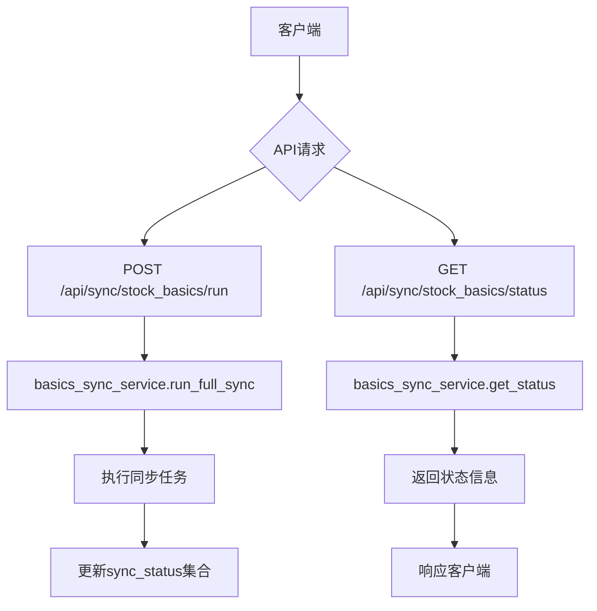
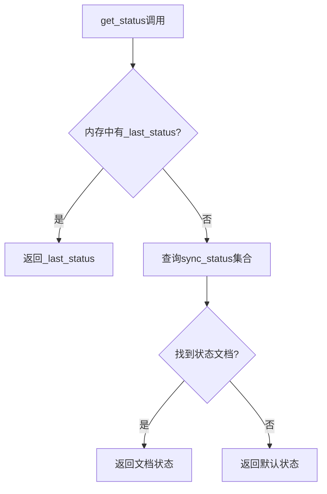
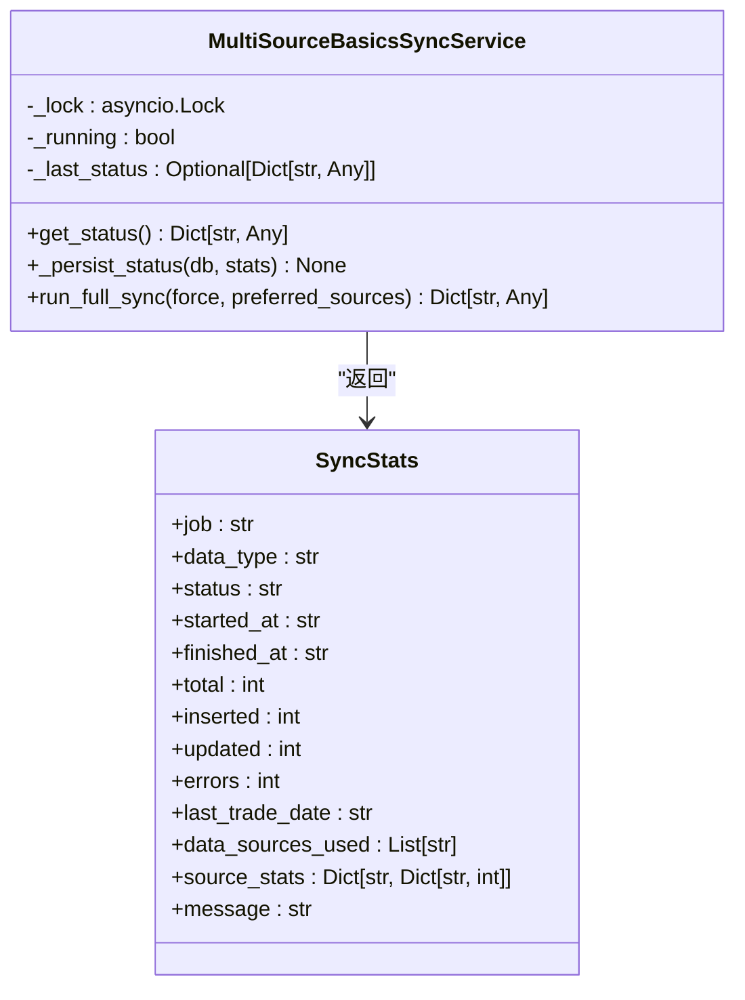
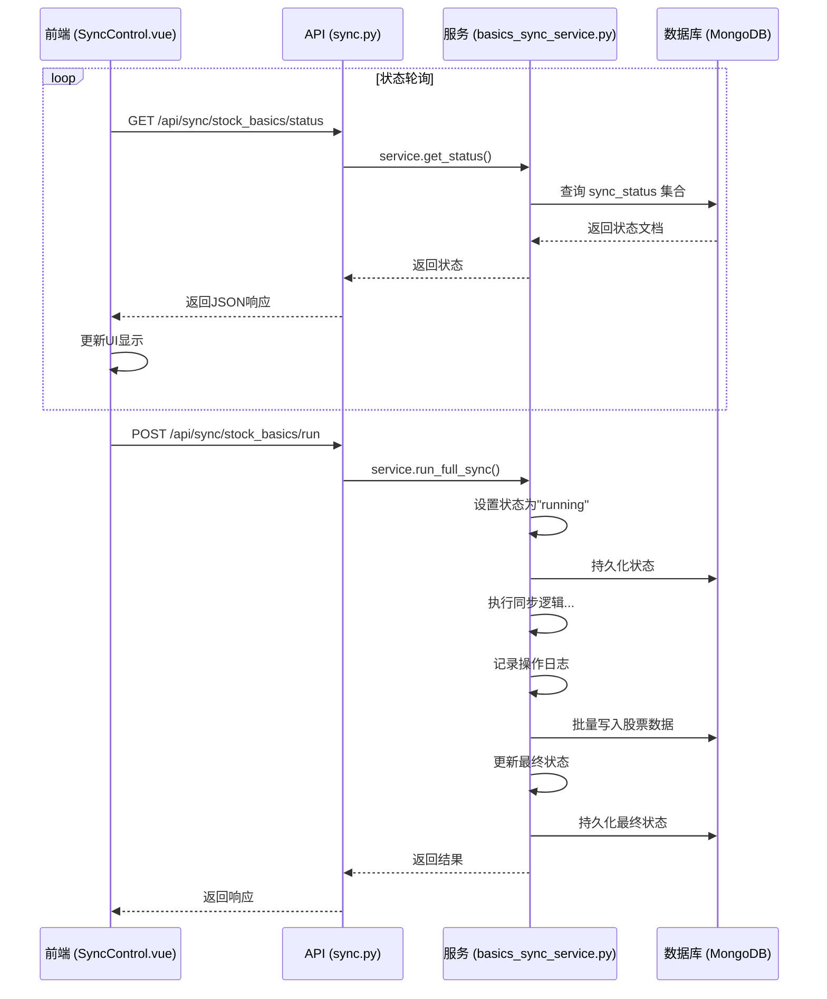
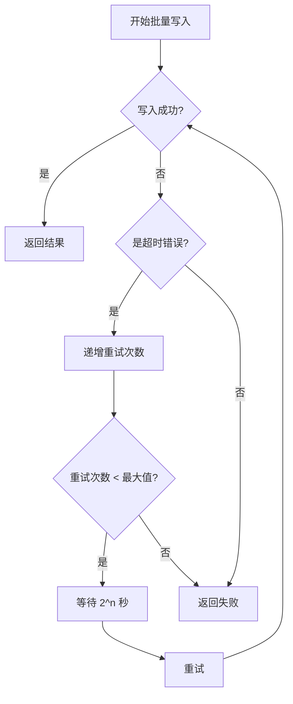

# 同步状态API

<cite>
**本文档引用的文件**   
- [sync.py](file://app/routers/sync.py)
- [basics_sync_service.py](file://app/services/basics_sync_service.py)
- [multi_source_basics_sync_service.py](file://app/services/multi_source_basics_sync_service.py)
- [operation_log_service.py](file://app/services/operation_log_service.py)
- [operation_log.py](file://app/models/operation_log.py)
- [SyncControl.vue](file://frontend/src/components/Sync/SyncControl.vue)
</cite>

## 目录
1. [简介](#简介)
2. [API端点与功能](#api端点与功能)
3. [同步状态判定逻辑](#同步状态判定逻辑)
4. [响应数据结构](#响应数据结构)
5. [多数据源状态聚合](#多数据源状态聚合)
6. [操作日志追踪](#操作日志追踪)
7. [状态轮询使用示例](#状态轮询使用示例)
8. [性能优化策略](#性能优化策略)
9. [结论](#结论)

## 简介

同步状态API是系统数据同步功能的核心监控接口，主要负责提供股票基础信息同步任务的实时执行状态。该API通过`GET /api/sync/status`端点暴露服务，允许客户端查询同步任务的当前状态，包括运行中、已完成、失败等状态，并提供详细的统计信息。

该API的设计目标是为前端用户提供清晰的同步进度反馈，同时为系统管理员提供详细的同步历史和性能指标。API通过与`operation_log_service`服务集成，实现了对同步任务全生命周期的追踪，确保了数据同步过程的可观察性和可审计性。

**Section sources**
- [sync.py](file://app/routers/sync.py#L1-L32)
- [basics_sync_service.py](file://app/services/basics_sync_service.py#L1-L420)

## API端点与功能

同步状态API提供了两个核心端点，分别用于触发同步任务和查询同步状态：

- `POST /api/sync/stock_basics/run`：触发股票基础信息的全量同步任务。该端点接受一个可选的`force`参数，用于强制重新同步，即使同步任务已在运行中。
- `GET /api/sync/stock_basics/status`：获取最近一次同步任务的状态信息。这是本文档的核心关注点，它返回一个包含同步状态、进度、统计信息等的JSON对象。

API的实现基于FastAPI框架，通过`router`装饰器定义路由，并依赖于`basics_sync_service`和`multi_source_basics_sync_service`服务来执行具体的业务逻辑。API的设计遵循RESTful原则，使用标准的HTTP状态码和JSON格式的响应体。



**Diagram sources**
- [sync.py](file://app/routers/sync.py#L16-L31)

**Section sources**
- [sync.py](file://app/routers/sync.py#L1-L32)

## 同步状态判定逻辑

同步状态的判定逻辑是通过`basics_sync_service`和`multi_source_basics_sync_service`服务中的`get_status`方法实现的。状态的判定基于存储在MongoDB `sync_status`集合中的持久化状态文档。

### 状态值定义

同步任务的状态由`SyncStats`数据类中的`status`字段表示，其可能的值包括：

- `idle`：空闲状态，表示没有同步任务在运行，且从未运行过。
- `running`：运行中状态，表示同步任务正在执行。
- `success`：成功状态，表示同步任务已成功完成，没有错误。
- `success_with_errors`：成功但有错误状态，表示同步任务完成，但处理过程中遇到了一些错误。
- `failed`：失败状态，表示同步任务执行失败。
- `never_run`：从未运行状态，表示服务已初始化，但同步任务从未被触发。

### 状态判定流程

1. **内存状态优先**：服务首先检查内存中的`_last_status`缓存。如果存在，则直接返回该状态，以减少数据库查询的开销。
2. **数据库查询**：如果内存中没有缓存状态，则查询MongoDB的`sync_status`集合，查找`job`字段为`stock_basics`或`stock_basics_multi_source`的文档。
3. **状态回退**：如果数据库中也不存在状态文档，服务会返回一个默认的`idle`或`never_run`状态。

状态的更新是在`run_full_sync`方法执行过程中完成的。当同步任务开始时，状态被设置为`running`并持久化到数据库；任务成功完成时，状态被更新为`success`或`success_with_errors`；任务失败时，状态被设置为`failed`。



**Diagram sources**
- [basics_sync_service.py](file://app/services/basics_sync_service.py#L113-L123)
- [multi_source_basics_sync_service.py](file://app/services/multi_source_basics_sync_service.py#L66-L77)

**Section sources**
- [basics_sync_service.py](file://app/services/basics_sync_service.py#L39-L50)
- [multi_source_basics_sync_service.py](file://app/services/multi_source_basics_sync_service.py#L40-L56)

## 响应数据结构

`GET /api/sync/stock_basics/status`端点的响应数据结构由`SyncStats`数据类定义，并通过JSON格式返回。响应体包含一个`success`标志、一个`data`对象和一个`message`字符串。

### 核心字段

`data`对象中的核心字段及其计算方式如下：

- `total_tasks`：对应`total`字段，表示本次同步任务需要处理的总股票数量。其值等于从数据源获取的股票列表的长度（`len(stock_df)`）。
- `completed_tasks`：对应`inserted`和`updated`字段之和，表示已成功处理的股票数量。`inserted`是数据库中新增的记录数，`updated`是已更新的记录数，两者均来自MongoDB批量写入操作的结果。
- `failed_tasks`：对应`errors`字段，表示处理失败的股票数量。它在同步过程中通过捕获异常并递增计数器来计算。

### 完整响应示例

```json
{
  "success": true,
  "data": {
    "job": "stock_basics_multi_source",
    "data_type": "stock_basics",
    "status": "success",
    "started_at": "2025-10-27T08:00:00.000000",
    "finished_at": "2025-10-27T08:05:30.000000",
    "total": 5000,
    "inserted": 100,
    "updated": 4850,
    "errors": 50,
    "last_trade_date": "20251024",
    "data_sources_used": ["stock_list:tushare", "daily_data:akshare"],
    "source_stats": {
      "tushare": {"total": 3000, "success": 2950},
      "akshare": {"total": 2000, "success": 1950}
    },
    "message": null
  },
  "message": "操作成功"
}
```

**Section sources**
- [basics_sync_service.py](file://app/services/basics_sync_service.py#L39-L57)
- [multi_source_basics_sync_service.py](file://app/services/multi_source_basics_sync_service.py#L40-L56)

## 多数据源状态聚合

系统支持从多个数据源（如Tushare、AKShare、BaoStock）获取股票数据，并实现了状态的聚合展示。这主要通过`multi_source_basics_sync_service`服务实现。

### 数据源优先级与回退

服务定义了`DataSourcePriority`枚举来管理数据源的优先级（Tushare > AKShare > BaoStock）。当主数据源不可用时，系统会自动回退到次级数据源。

### 聚合状态信息

`SyncStats`类扩展了`data_sources_used`和`source_stats`字段来记录多数据源的使用情况：
- `data_sources_used`：一个字符串列表，记录了在同步过程中实际使用的数据源及其用途（如`stock_list:tushare`）。
- `source_stats`：一个嵌套的字典，按数据源名称存储各自的统计信息，如总处理数和成功数。

这些信息在`run_full_sync`方法中被收集和更新。例如，当从Tushare获取股票列表成功时，`data_sources_used`会被追加`stock_list:tushare`，并且`source_stats`中Tushare的计数器会相应增加。



**Diagram sources**
- [multi_source_basics_sync_service.py](file://app/services/multi_source_basics_sync_service.py#L40-L56)

**Section sources**
- [multi_source_basics_sync_service.py](file://app/services/multi_source_basics_sync_service.py#L33-L38)

## 操作日志追踪

系统通过`operation_log_service`和`operation_log`模型来追踪所有同步任务的历史记录，实现了完整的审计功能。

### 操作日志模型

`OperationLogCreate`模型定义了创建日志所需的字段，包括：
- `action_type`：操作类型，如`data_import`。
- `action`：操作描述，如“运行股票基础信息同步”。
- `details`：详细信息，可以包含同步任务的参数。
- `success`：操作是否成功。
- `duration_ms`：操作耗时。

### 日志记录流程

当同步任务被触发时，系统会调用`log_operation`便捷函数来记录一条操作日志。该函数会：
1. 创建一个`OperationLogCreate`实例。
2. 调用`OperationLogService.create_log`方法。
3. 将日志信息持久化到MongoDB的`operation_logs`集合中。

前端组件`SyncControl.vue`通过轮询`GET /api/sync/stock_basics/status`来获取实时状态，并在状态变化时显示通知，这构成了一个完整的用户反馈循环。



**Diagram sources**
- [operation_log_service.py](file://app/services/operation_log_service.py#L30-L69)
- [operation_log.py](file://app/models/operation_log.py#L11-L22)
- [SyncControl.vue](file://frontend/src/components/Sync/SyncControl.vue#L332-L376)

**Section sources**
- [operation_log_service.py](file://app/services/operation_log_service.py#L1-L285)
- [operation_log.py](file://app/models/operation_log.py#L1-L138)

## 状态轮询使用示例

客户端应使用轮询机制来获取同步任务的实时状态。以下是一个使用示例：

```javascript
// 开始状态轮询
const startStatusPolling = () => {
  if (refreshTimer.value) {
    clearInterval(refreshTimer.value);
  }

  let previousStatus = syncStatus.value?.status;
  let pollCount = 0;
  const maxPolls = 60; // 最多轮询60次（5分钟）

  refreshTimer.value = setInterval(async () => {
    pollCount++;
    await fetchSyncStatus(); // 调用 GET /api/sync/stock_basics/status

    const currentStatus = syncStatus.value?.status;

    // 检测到同步完成
    if (previousStatus === 'running' && currentStatus && currentStatus !== 'running') {
      showSyncCompletionNotification(currentStatus);
      stopStatusPolling();
      return;
    }

    // 如果状态变为非运行状态，停止轮询
    if (currentStatus && !['running'].includes(currentStatus)) {
      stopStatusPolling();
      return;
    }

    // 防止无限轮询
    if (pollCount >= maxPolls) {
      stopStatusPolling();
    }

    previousStatus = currentStatus;
  }, 5000); // 每5秒轮询一次
};

// 停止轮询
const stopStatusPolling = () => {
  if (refreshTimer.value) {
    clearInterval(refreshTimer.value);
    refreshTimer.value = null;
  }
};
```

**Section sources**
- [SyncControl.vue](file://frontend/src/components/Sync/SyncControl.vue#L331-L376)

## 性能优化策略

为了确保高并发查询的响应速度，系统实施了多项性能优化策略。

### 缓存机制

系统采用了两级缓存策略：
1. **内存缓存**：`basics_sync_service`服务使用`_last_status`实例变量缓存最近的状态，避免了对数据库的频繁查询。
2. **数据库索引**：在`stock_basic_info`集合上创建了多个索引，如`code_source_unique`（复合唯一索引）、`code_index`、`source_index`等，极大地加速了upsert和查询操作。

### 数据库索引优化

`_ensure_indexes`方法确保了以下关键索引的存在：
- `(code, source)` 复合唯一索引：用于upsert操作，保证数据的唯一性。
- `code` 索引：用于按股票代码快速查询。
- `source` 索引：用于按数据源筛选数据。
- `total_mv`, `circ_mv` 等索引：用于按市值排序和筛选。

这些索引都是在后台创建的（`background=True`），以避免阻塞服务启动。

### 批量写入与重试

系统使用`bulk_write`进行批量数据库操作，并实现了指数退避重试机制。当遇到`asyncio.TimeoutError`时，会等待`2^n`秒后重试，最多重试3次，这有效处理了网络抖动和数据库负载高峰。



**Diagram sources**
- [basics_sync_service.py](file://app/services/basics_sync_service.py#L59-L112)
- [basics_sync_service.py](file://app/services/basics_sync_service.py#L130-L173)

**Section sources**
- [basics_sync_service.py](file://app/services/basics_sync_service.py#L59-L112)
- [basics_sync_service.py](file://app/services/basics_sync_service.py#L130-L173)

## 结论

同步状态API是一个功能完备、性能优化的监控接口，它通过与`operation_log_service`的深度集成，实现了对数据同步任务的全面追踪。API不仅提供了`running`、`completed`、`failed`等状态的精确判定，还通过`total_tasks`、`completed_tasks`、`failed_tasks`等字段的精确计算，为用户提供了透明的进度信息。

通过`multi_source_basics_sync_service`，API支持多数据源的聚合状态展示，增强了系统的灵活性和可靠性。前端通过轮询机制实现了实时的状态更新，提升了用户体验。最后，通过内存缓存、数据库索引和批量写入重试等策略，确保了API在高并发场景下的高性能和高可用性。