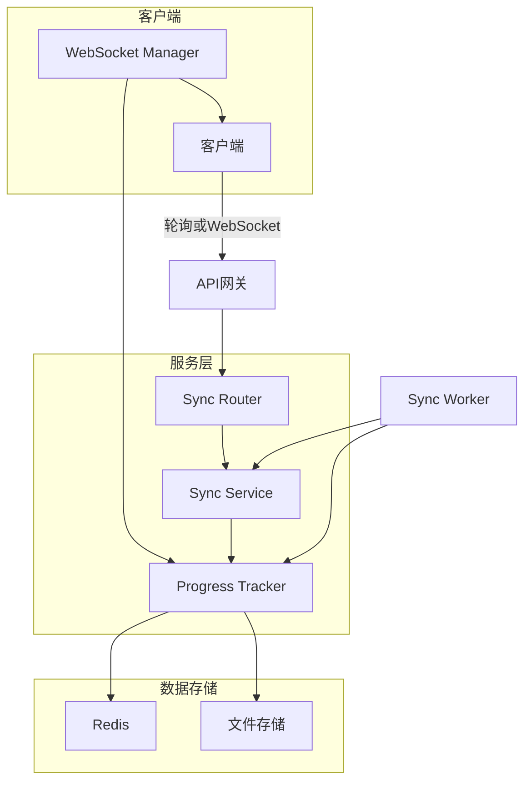
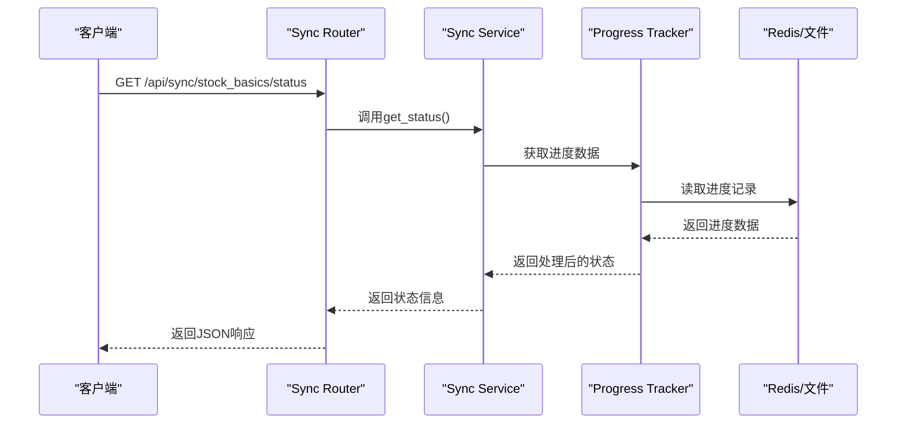
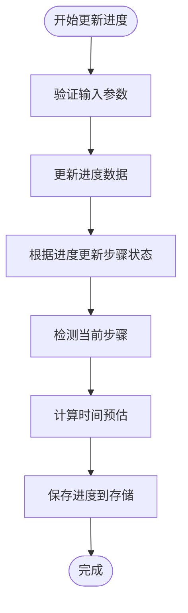
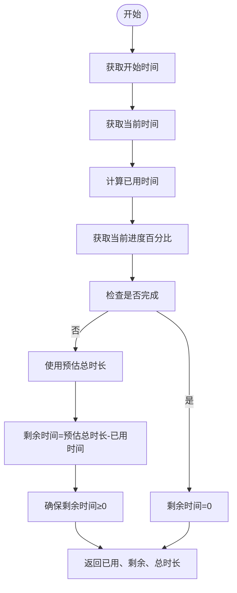
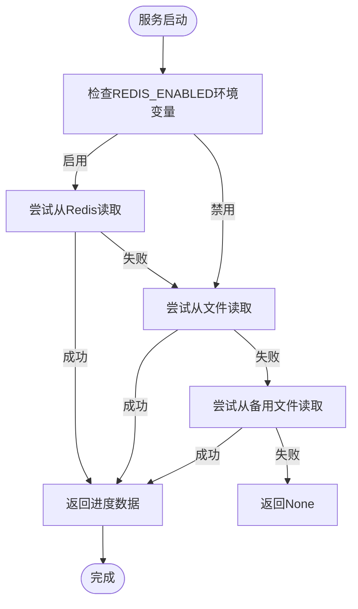

# 同步进度API

<cite>
**本文档引用文件**  
- [redis_progress_tracker.py](file://app/services/redis_progress_tracker.py)
- [tracker.py](file://app/services/progress/tracker.py)
- [sync.py](file://app/routers/sync.py)
- [basics_sync_service.py](file://app/services/basics_sync_service.py)
- [trading_time.py](file://app/utils/trading_time.py)
- [websocket_notifications.py](file://app/routers/websocket_notifications.py)
- [SyncControl.vue](file://frontend/src/components/Sync/SyncControl.vue)
</cite>

## 目录
1. [引言](#引言)
2. [进度跟踪系统架构](#进度跟踪系统架构)
3. [GET /api/sync/progress端点实现](#get-apisyncprogress端点实现)
4. [RedisProgressTracker服务详解](#redisprogresstracker服务详解)
5. [estimated_completion_time计算算法](#estimated_completion_time计算算法)
6. [前端进度获取方式](#前端进度获取方式)
7. [容错与恢复机制](#容错与恢复机制)
8. [总结](#总结)

## 引言

同步进度API是系统中用于实时监控数据同步任务状态的核心接口。该API通过`redis_progress_tracker`服务获取实时进度信息，为用户提供同步任务的总体进度、当前阶段和预计完成时间等关键指标。本文档详细说明了进度跟踪系统的实现原理，包括各组件间的协作机制、时间预估算法以及前端集成方式。

## 进度跟踪系统架构

同步进度系统采用分布式架构，由多个组件协同工作，确保进度信息的实时性和准确性。



**图示说明**：
- 客户端可以通过轮询`GET /api/sync/progress`端点或建立WebSocket连接来获取进度
- Sync Router处理API请求，调用Sync Service获取状态
- Progress Tracker是核心服务，负责跟踪和更新进度
- Redis作为主要存储，文件系统作为备用存储
- WebSocket Manager提供实时推送能力

**Diagram sources**
- [sync.py](file://app/routers/sync.py)
- [basics_sync_service.py](file://app/services/basics_sync_service.py)
- [tracker.py](file://app/services/progress/tracker.py)
- [websocket_notifications.py](file://app/routers/websocket_notifications.py)

**Section sources**
- [sync.py](file://app/routers/sync.py#L1-L32)
- [basics_sync_service.py](file://app/services/basics_sync_service.py#L1-L420)

## GET /api/sync/progress端点实现

`GET /api/sync/progress`端点是获取同步进度的主要API，通过Sync Service与Progress Tracker协作获取实时状态。

该端点的工作流程如下：
1. 接收客户端请求
2. 调用`get_basics_sync_service()`获取同步服务实例
3. 服务实例调用`get_status()`方法获取当前同步状态
4. 状态信息包含总体进度、当前阶段、统计信息等
5. 返回JSON格式的响应

响应数据结构包含以下关键字段：
- `status`: 同步状态（idle, running, success, failed等）
- `total`: 总任务数
- `inserted`: 新增记录数
- `updated`: 更新记录数
- `errors`: 错误数
- `last_trade_date`: 最近交易日期

前端组件`SyncControl.vue`实现了状态轮询机制，当同步运行时自动轮询状态更新。



**Diagram sources**
- [sync.py](file://app/routers/sync.py#L15-L32)
- [basics_sync_service.py](file://app/services/basics_sync_service.py#L113-L124)
- [tracker.py](file://app/services/progress/tracker.py#L477-L537)
- [SyncControl.vue](file://frontend/src/components/Sync/SyncControl.vue#L294-L297)

**Section sources**
- [sync.py](file://app/routers/sync.py#L15-L32)
- [basics_sync_service.py](file://app/services/basics_sync_service.py#L113-L124)

## RedisProgressTracker服务详解

`RedisProgressTracker`是进度跟踪系统的核心服务，负责管理同步任务的整个生命周期。

### 服务初始化

当创建`RedisProgressTracker`实例时，会执行以下初始化操作：
1. 根据任务ID、分析师列表、研究深度和LLM提供商初始化
2. 建立Redis连接（如果启用）
3. 生成动态分析步骤
4. 计算预估总时长
5. 保存初始状态

```python
def __init__(self, task_id: str, analysts: List[str], research_depth: str, llm_provider: str):
    self.task_id = task_id
    self.analysts = analysts
    self.research_depth = research_depth
    self.llm_provider = llm_provider
    self.redis_client = None
    self.use_redis = self._init_redis()
    
    # 初始化进度数据
    self.progress_data = {
        'task_id': task_id,
        'status': 'running',
        'progress_percentage': 0.0,
        # ... 其他字段
    }
    
    # 生成分析步骤
    self.analysis_steps = self._generate_dynamic_steps()
    self.progress_data['total_steps'] = len(self.analysis_steps)
    
    # 计算预估总时长
    base_total_time = self._get_base_total_time()
    self.progress_data['estimated_total_time'] = base_total_time
    self.progress_data['remaining_time'] = base_total_time
    
    # 保存初始状态
    self._save_progress()
```

### 进度更新机制

进度更新通过`update_progress()`方法实现，该方法会：
1. 更新进度数据
2. 根据进度百分比自动更新步骤状态
3. 检测当前步骤
4. 计算时间预估
5. 持久化进度数据



**Diagram sources**
- [tracker.py](file://app/services/progress/tracker.py#L46-L475)
- [tracker.py](file://app/services/progress/tracker.py#L300-L343)

**Section sources**
- [tracker.py](file://app/services/progress/tracker.py#L46-L475)

## estimated_completion_time计算算法

`estimated_completion_time`的计算基于复杂的算法，考虑了多个因素以提供准确的预估。

### 基础时间计算

预估总时长通过`_get_base_total_time()`方法计算，该方法考虑了三个主要因素：

```python
def _get_base_total_time(self) -> float:
    """
    根据分析师数量、研究深度、模型类型预估总时长（秒）
    """
    # 研究深度映射
    depth_map = {
        "快速": 1,
        "基础": 2,
        "标准": 3,
        "深度": 4,
        "全面": 5
    }
    d = depth_map.get(self.research_depth, 3)
    
    # 基础时间（秒）
    base_time_per_depth = {
        1: 150,  # 1级：2.5分钟
        2: 180,  # 2级：3分钟
        3: 240,  # 3级：4分钟
        4: 330,  # 4级：5.5分钟
        5: 480   # 5级：8分钟
    }.get(d, 240)
    
    # 分析师数量影响系数
    analyst_count = len(self.analysts)
    if analyst_count == 1:
        analyst_multiplier = 1.0
    elif analyst_count == 2:
        analyst_multiplier = 1.5
    elif analyst_count == 3:
        analyst_multiplier = 2.0
    elif analyst_count == 4:
        analyst_multiplier = 2.4
    else:
        analyst_multiplier = 2.4 + (analyst_count - 4) * 0.3
    
    # 模型速度影响
    model_mult = {
        'dashscope': 1.0,
        'deepseek': 0.8,
        'google': 1.2
    }.get(self.llm_provider, 1.0)
    
    # 计算总时间
    total_time = base_time_per_depth * analyst_multiplier * model_mult
    return total_time
```

### 时间预估流程

时间预估的具体流程如下：



### 交易日历因素

系统通过`trading_time.py`模块考虑交易日历因素，确保在非交易日不进行同步操作：

```python
def is_trading_time(now: Optional[datetime] = None) -> bool:
    """
    判断是否在A股交易时间或收盘后缓冲期
    """
    tz = ZoneInfo(settings.TIMEZONE)
    now = now or datetime.now(tz)
    
    # 工作日 Mon-Fri
    if now.weekday() > 4:
        return False
    
    t = now.time()
    
    # 上交所/深交所常规交易时段
    morning = dtime(9, 30)
    noon = dtime(11, 30)
    afternoon_start = dtime(13, 0)
    # 收盘后缓冲期（延长30分钟到15:30）
    buffer_end = dtime(15, 30)
    
    return (morning <= t <= noon) or (afternoon_start <= t <= buffer_end)
```

**Diagram sources**
- [tracker.py](file://app/services/progress/tracker.py#L198-L254)
- [trading_time.py](file://app/utils/trading_time.py#L14-L50)

**Section sources**
- [tracker.py](file://app/services/progress/tracker.py#L198-L254)
- [trading_time.py](file://app/utils/trading_time.py#L14-L50)

## 前端进度获取方式

前端提供了两种方式获取同步进度：轮询和WebSocket。

### 轮询方式

轮询方式通过定时调用API端点获取状态：

```typescript
// 开始状态轮询
const startStatusPolling = () => {
  if (refreshTimer.value) {
    clearInterval(refreshTimer.value)
  }

  if (props.autoRefresh) {
    let previousStatus = syncStatus.value?.status
    let pollCount = 0
    const maxPolls = 60 // 最多轮询60次（5分钟）

    refreshTimer.value = setInterval(async () => {
      pollCount++
      await fetchSyncStatus()

      const currentStatus = syncStatus.value?.status

      // 检查状态变化
      if (previousStatus === 'running' && currentStatus && currentStatus !== 'running') {
        // 同步完成，显示结果通知
        showSyncCompletionNotification(currentStatus)
        stopStatusPolling()
        return
      }

      // 更新前一个状态
      previousStatus = currentStatus

      // 防止无限轮询
      if (pollCount >= maxPolls) {
        stopStatusPolling()
      }
    }, props.refreshInterval)
  }
}
```

### WebSocket方式

WebSocket方式提供实时推送能力：

```python
@router.websocket("/ws/tasks/{task_id}")
async def websocket_task_progress_endpoint(
    websocket: WebSocket,
    task_id: str,
    token: str = Query(...)
):
    """
    WebSocket 任务进度端点
    """
    # 验证 token
    token_data = AuthService.verify_token(token)
    if not token_data:
        await websocket.close(code=1008, reason="Unauthorized")
        return
    
    # 连接 WebSocket
    await websocket.accept()
    
    # 发送连接确认
    await websocket.send_json({
        "type": "connected",
        "data": {
            "task_id": task_id,
            "timestamp": datetime.utcnow().isoformat(),
            "message": "已连接任务进度流"
        }
    })
    
    try:
        while True:
            try:
                data = await websocket.receive_text()
                logger.debug(f"📥 [WS-Task] 收到客户端消息: task={task_id}, data={data}")
            except WebSocketDisconnect:
                logger.info(f"🔌 [WS-Task] 客户端主动断开: task={task_id}")
                break
            except Exception as e:
                logger.error(f"❌ [WS-Task] 接收消息错误: {e}")
                break
    
    finally:
        logger.info(f"🔌 [WS-Task] 断开连接: task={task_id}")
```

### 精度与更新频率

- **轮询方式**：更新频率由`refreshInterval`参数控制，默认为2秒
- **WebSocket方式**：实时推送，延迟极低
- **精度**：进度百分比精确到小数点后一位
- **最大轮询次数**：60次（约5分钟），防止无限轮询

**Section sources**
- [SyncControl.vue](file://frontend/src/components/Sync/SyncControl.vue#L332-L376)
- [websocket_notifications.py](file://app/routers/websocket_notifications.py#L200-L263)

## 容错与恢复机制

进度跟踪系统设计了完善的容错机制，确保在服务重启后能正确恢复进度状态。

### 多级存储策略

系统采用Redis优先、文件系统备用的多级存储策略：

```python
def _save_progress(self) -> None:
    try:
        progress_copy = self.to_dict()
        serialized = json.dumps(progress_copy)
        if self.use_redis and self.redis_client:
            key = f"progress:{self.task_id}"
            self.redis_client.set(key, serialized)
            self.redis_client.expire(key, 3600)
        else:
            os.makedirs("./data/progress", exist_ok=True)
            with open(f"./data/progress/{self.task_id}.json", 'w', encoding='utf-8') as f:
                f.write(serialized)
    except Exception as e:
        logger.error(f"[RedisProgress] save progress failed: {self.task_id} - {e}")
```

### 服务恢复流程

当服务重启后，进度恢复流程如下：



### 错误处理

系统实现了全面的错误处理机制：
- Redis连接失败时自动降级到文件存储
- 批量写入失败时有重试机制（指数退避）
- 进度数据序列化时处理不可序列化对象
- 提供静态时间预估计算方法，确保数据完整性

**Diagram sources**
- [tracker.py](file://app/services/progress/tracker.py#L406-L420)
- [tracker.py](file://app/services/progress/tracker.py#L477-L537)

**Section sources**
- [tracker.py](file://app/services/progress/tracker.py#L406-L420)
- [tracker.py](file://app/services/progress/tracker.py#L477-L537)

## 总结

同步进度API通过`RedisProgressTracker`服务实现了高效、可靠的进度跟踪系统。系统采用Redis优先、文件系统备用的多级存储策略，确保数据的持久性和可用性。`estimated_completion_time`的计算算法综合考虑了研究深度、分析师数量和LLM提供商等多个因素，提供准确的时间预估。前端支持轮询和WebSocket两种获取方式，满足不同场景的需求。完善的容错机制确保在服务重启后能正确恢复进度状态，保证了系统的稳定性和可靠性。