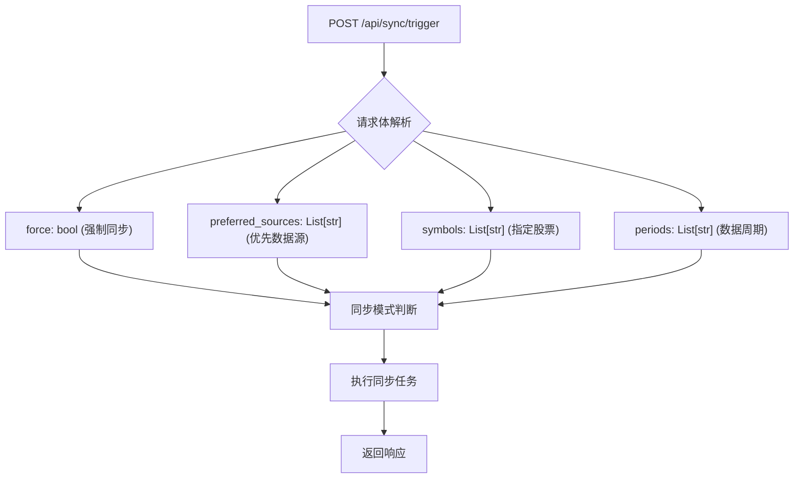
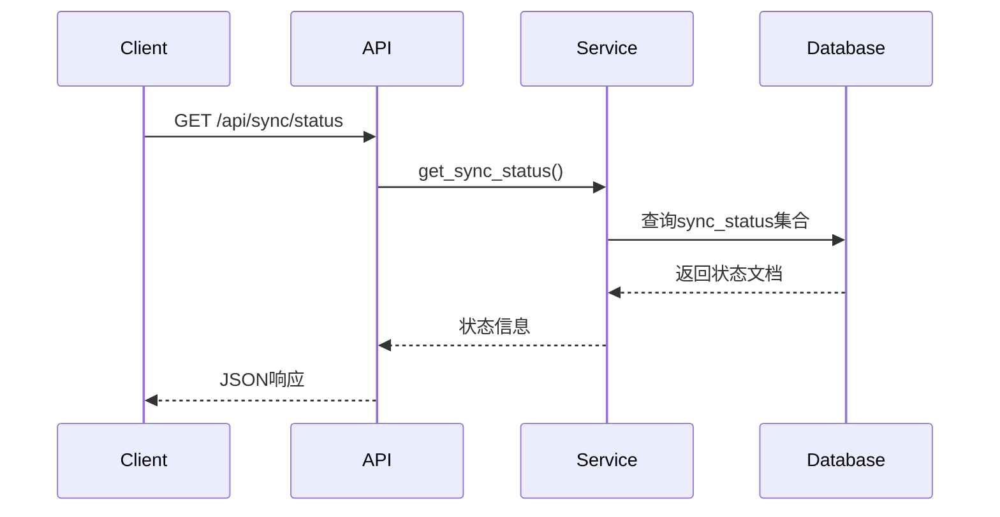
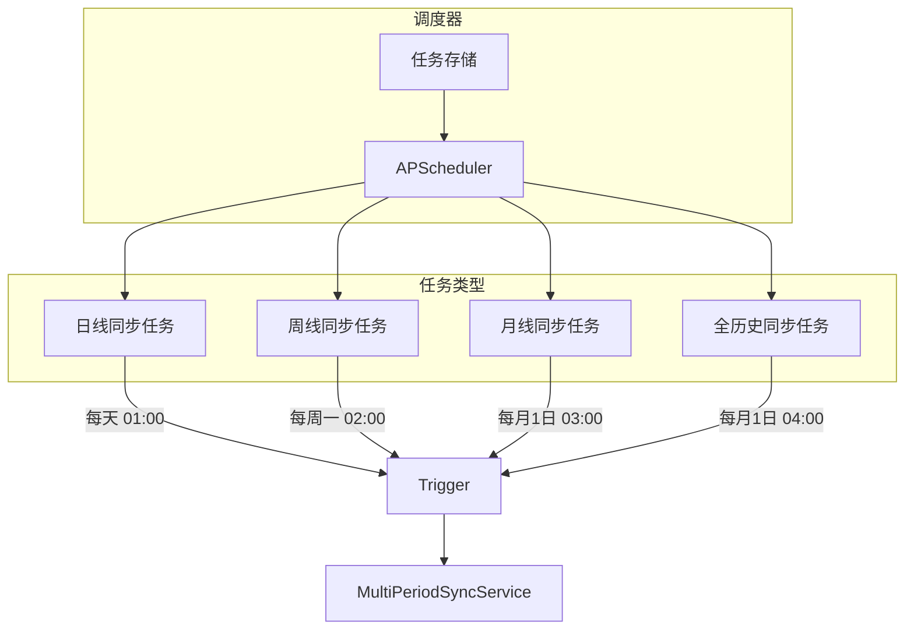
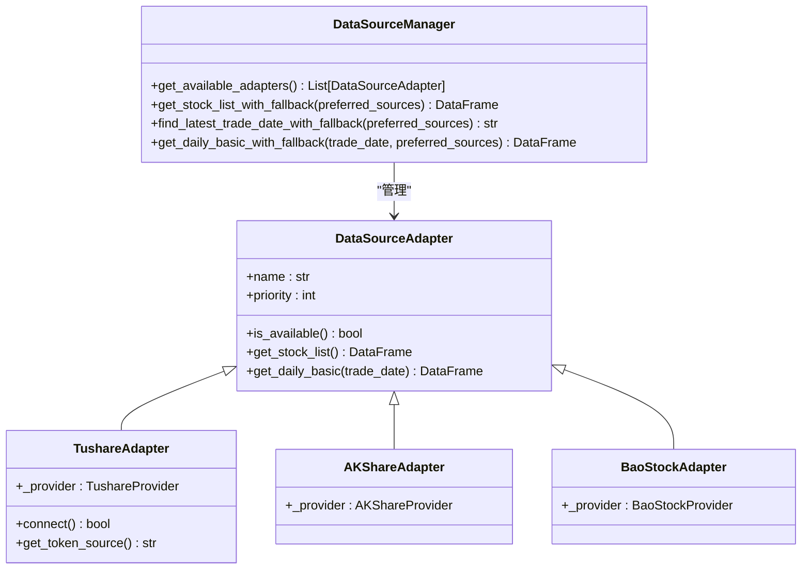
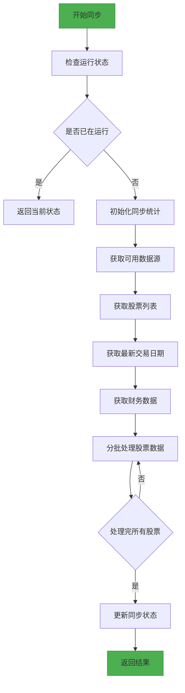
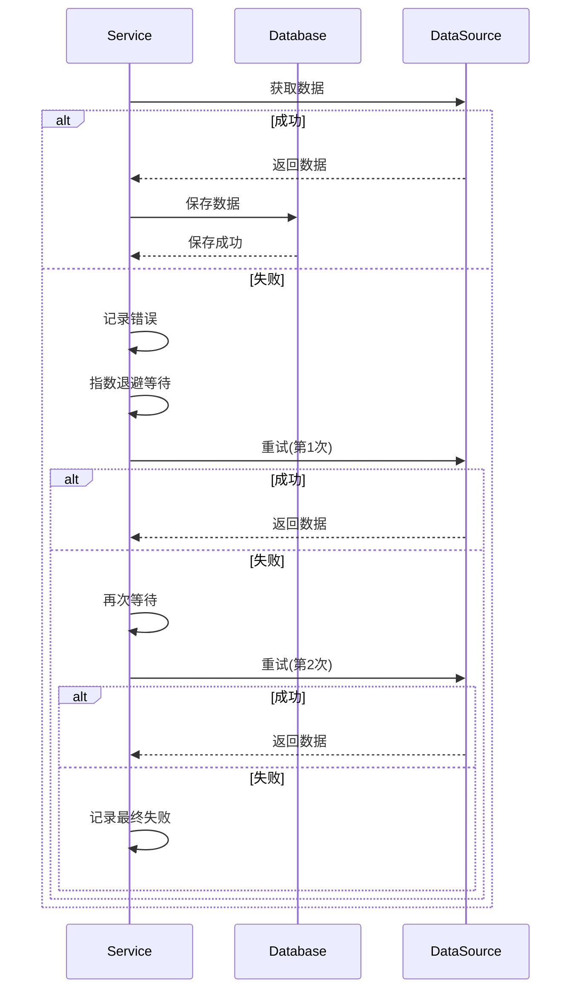
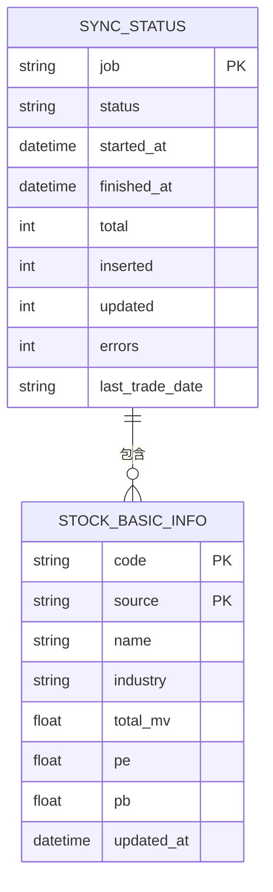

# 数据同步API

<cite>
**本文档引用的文件**   
- [sync.py](file://app/routers/sync.py)
- [multi_source_sync.py](file://app/routers/multi_source_sync.py)
- [multi_period_sync.py](file://app/routers/multi_period_sync.py)
- [basics_sync_service.py](file://app/services/basics_sync_service.py)
- [multi_source_basics_sync_service.py](file://app/services/multi_source_basics_sync_service.py)
- [multi_period_sync_service.py](file://app/worker/multi_period_sync_service.py)
- [manager.py](file://app/services/data_sources/manager.py)
- [tushare_adapter.py](file://app/services/data_sources/tushare_adapter.py)
- [akshare_adapter.py](file://app/services/data_sources/akshare_adapter.py)
- [baostock_adapter.py](file://app/services/data_sources/baostock_adapter.py)
</cite>

## 目录
1. [简介](#简介)
2. [核心API端点](#核心api端点)
3. [同步任务调度机制](#同步任务调度机制)
4. [多数据源并行同步策略](#多数据源并行同步策略)
5. [执行流程与进度跟踪](#执行流程与进度跟踪)
6. [错误重试与容错机制](#错误重试与容错机制)
7. [数据一致性保障](#数据一致性保障)
8. [资源消耗控制](#资源消耗控制)
9. [日志记录策略](#日志记录策略)
10. [使用示例](#使用示例)
11. [附录](#附录)

## 简介
数据同步API是本系统的核心功能模块，负责管理多数据源、多周期的股票基础数据和行情数据的同步。该API提供了完整的控制接口，支持全量同步、增量同步和指定股票同步等多种模式。系统集成了Tushare、AkShare和BaoStock三个主要数据源，通过优先级机制和故障转移策略确保数据获取的可靠性和完整性。同步过程采用异步执行模式，避免阻塞主线程，同时提供详细的进度跟踪和状态查询功能。本API还实现了数据一致性校验、资源消耗限制和全面的日志记录，确保系统稳定运行。

## 核心API端点

### POST /api/sync/trigger
触发数据同步任务的主端点，支持多种同步模式和参数配置。



**请求体结构**
- `force`: 布尔值，是否强制运行同步（即使已在运行中）
- `preferred_sources`: 字符串数组，优先使用的数据源列表（tushare, akshare, baostock）
- `symbols`: 字符串数组，指定要同步的股票代码列表
- `periods`: 字符串数组，要同步的数据周期（daily, weekly, monthly）
- `all_history`: 布尔值，是否同步所有历史数据

**响应格式**
```json
{
  "success": true,
  "message": "Synchronization started successfully",
  "data": {
    "job_id": "sync_123456",
    "status": "running",
    "started_at": "2025-01-01T00:00:00Z",
    "parameters": {
      "force": false,
      "preferred_sources": ["tushare", "akshare"],
      "symbols": ["000001", "600000"],
      "periods": ["daily", "weekly"]
    }
  }
}
```

**状态码**
- `200 OK`: 同步任务成功启动
- `400 Bad Request`: 请求参数无效
- `429 Too Many Requests`: 同步任务已在运行中
- `500 Internal Server Error`: 服务器内部错误

**Section sources**
- [multi_source_sync.py](file://app/routers/multi_source_sync.py#L154-L187)
- [multi_period_sync.py](file://app/routers/multi_period_sync.py#L36-L65)

### GET /api/sync/status
获取当前同步任务的状态信息。



**响应格式**
```json
{
  "success": true,
  "message": "Status retrieved successfully",
  "data": {
    "job": "stock_basics_multi_source",
    "status": "running",
    "started_at": "2025-01-01T00:00:00Z",
    "finished_at": null,
    "total": 5000,
    "inserted": 1000,
    "updated": 2000,
    "errors": 0,
    "last_trade_date": "20250101",
    "data_sources_used": ["stock_list:tushare", "daily_data:akshare"],
    "source_stats": {
      "tushare": {"inserted": 800, "updated": 1500},
      "akshare": {"inserted": 200, "updated": 500}
    }
  }
}
```

**状态码**
- `200 OK`: 成功获取状态
- `500 Internal Server Error`: 获取状态失败

**Section sources**
- [multi_source_sync.py](file://app/routers/multi_source_sync.py#L137-L148)
- [multi_source_basics_sync_service.py](file://app/services/multi_source_basics_sync_service.py#L66-L77)

### GET /api/sync/multi-source/sources/status
获取所有数据源的可用状态。

**响应格式**
```json
{
  "success": true,
  "message": "Data sources status retrieved successfully",
  "data": [
    {
      "name": "tushare",
      "priority": 1,
      "available": true,
      "description": "专业金融数据API，提供高质量的A股数据和财务指标 (Token来源: 数据库)"
    },
    {
      "name": "akshare",
      "priority": 2,
      "available": true,
      "description": "开源金融数据库，提供基础的股票信息"
    },
    {
      "name": "baostock",
      "priority": 3,
      "available": false,
      "description": "免费开源的证券数据平台，提供历史数据"
    }
  ]
}
```

**Section sources**
- [multi_source_sync.py](file://app/routers/multi_source_sync.py#L40-L82)

### GET /api/multi-period-sync/statistics
获取多周期同步的统计信息。

**响应格式**
```json
{
  "success": true,
  "data": {
    "period_statistics": {
      "daily": {
        "tushare": {"count": 100000, "latest_date": "2025-01-01"},
        "akshare": {"count": 80000, "latest_date": "2025-01-01"}
      },
      "weekly": {
        "tushare": {"count": 20000, "latest_date": "2025-01-01"},
        "akshare": {"count": 15000, "latest_date": "2025-01-01"}
      }
    },
    "last_updated": "2025-01-01T00:00:00Z"
  },
  "message": "统计信息获取成功"
}
```

**Section sources**
- [multi_period_sync.py](file://app/routers/multi_period_sync.py#L247-L258)

## 同步任务调度机制
系统采用基于APScheduler的定时任务调度机制，支持灵活的同步策略配置。



调度机制特点：
- **分层调度**：支持日、周、月不同频率的同步任务
- **动态配置**：调度参数可通过配置文件或API动态调整
- **持久化存储**：任务状态持久化到数据库，防止系统重启丢失
- **并发控制**：同一时间只允许一个同步任务运行，避免资源竞争
- **错误恢复**：任务执行失败后自动重试，最多3次

**Section sources**
- [multi_period_sync_service.py](file://app/worker/multi_period_sync_service.py#L349-L374)
- [multi_period_sync.py](file://app/routers/multi_period_sync.py)

## 多数据源并行同步策略
系统实现了多数据源的并行同步策略，支持Tushare、AkShare和BaoStock三个主要数据源。



**并行策略特点**：
1. **优先级排序**：默认优先级为Tushare(1) > AKShare(2) > BaoStock(3)
2. **故障转移**：当高优先级数据源不可用时，自动切换到低优先级数据源
3. **并行获取**：多个数据源可同时进行数据获取，提高效率
4. **结果合并**：从不同数据源获取的数据进行智能合并和去重
5. **动态调整**：可根据网络状况和数据质量动态调整数据源优先级

**数据源特性对比**：
| 数据源 | 优先级 | 特点 | 适用场景 |
|-------|-------|------|---------|
| Tushare | 1 | 数据质量高，更新及时，需Token | 生产环境主数据源 |
| AKShare | 2 | 开源免费，数据完整，更新稳定 | 备用数据源 |
| BaoStock | 3 | 免费开源，数据稳定，更新较慢 | 应急备用数据源 |

**Section sources**
- [manager.py](file://app/services/data_sources/manager.py)
- [tushare_adapter.py](file://app/services/data_sources/tushare_adapter.py)
- [akshare_adapter.py](file://app/services/data_sources/akshare_adapter.py)
- [baostock_adapter.py](file://app/services/data_sources/baostock_adapter.py)

## 执行流程与进度跟踪
同步任务的执行流程设计为可追踪和可监控的，确保操作透明。



**进度跟踪机制**：
- **状态持久化**：同步状态实时保存到MongoDB的`sync_status`集合
- **分批处理**：每500只股票为一批，处理完成后更新进度
- **日志记录**：详细记录每个处理步骤的日志，便于问题排查
- **API查询**：通过GET /api/sync/status端点实时查询进度
- **历史记录**：保存最近10次同步的历史记录，支持分页查询

**Section sources**
- [multi_source_basics_sync_service.py](file://app/services/multi_source_basics_sync_service.py#L143-L321)
- [multi_source_sync.py](file://app/routers/multi_source_sync.py#L402-L442)

## 错误重试与容错机制
系统实现了完善的错误重试和容错机制，确保数据同步的可靠性。



**重试策略**：
- **批量写入重试**：数据库批量写入失败时，采用指数退避策略重试3次
- **API调用重试**：数据源API调用失败时，等待2^n秒后重试（n为重试次数）
- **超时控制**：单次操作超时时间为10秒，避免长时间阻塞
- **错误分类**：区分可恢复错误（网络超时）和不可恢复错误（认证失败）

**容错机制**：
- **数据源切换**：当主数据源连续失败时，自动切换到备用数据源
- **部分成功**：即使部分股票同步失败，也确保其他股票的数据完整性
- **状态恢复**：系统重启后能从断点继续同步，避免重复工作
- **错误隔离**：单个股票的同步错误不会影响其他股票的处理

**Section sources**
- [basics_sync_service.py](file://app/services/basics_sync_service.py#L130-L172)
- [multi_source_basics_sync_service.py](file://app/services/multi_source_basics_sync_service.py#L98-L141)

## 数据一致性保障
为确保数据的一致性和完整性，系统实施了多层次的保障措施。



**一致性保障措施**：
1. **唯一索引**：在`stock_basic_info`集合上创建(code, source)复合唯一索引，防止重复数据
2. **事务支持**：关键操作使用MongoDB的原子操作，确保数据完整性
3. **时间戳**：每条记录包含`updated_at`字段，记录最后更新时间
4. **数据校验**：同步完成后进行数据完整性校验，验证记录数量和关键字段
5. **版本控制**：通过`data_type`字段区分不同类型的同步任务，避免状态混淆

**Section sources**
- [basics_sync_service.py](file://app/services/basics_sync_service.py#L59-L108)
- [multi_source_basics_sync_service.py](file://app/services/multi_source_basics_sync_service.py#L79-L94)

## 资源消耗控制
为避免同步任务对系统资源造成过大压力，实施了严格的资源消耗控制。

**控制策略**：
- **批处理大小**：每次数据库操作限制为500条记录，避免内存溢出
- **API限流**：在数据源调用之间添加0.5秒延迟，遵守API使用规范
- **并发控制**：同一时间只允许一个同步任务运行，防止资源竞争
- **内存监控**：定期检查内存使用情况，必要时进行垃圾回收
- **超时设置**：前端设置10分钟超时，避免长时间等待

**资源优化**：
- **索引优化**：为常用查询字段创建索引，提高查询效率
- **连接池**：使用数据库连接池，减少连接开销
- **异步处理**：采用异步非阻塞IO，提高系统吞吐量
- **缓存机制**：对频繁访问的数据进行缓存，减少重复计算

**Section sources**
- [multi_period_sync_service.py](file://app/worker/multi_period_sync_service.py#L169-L185)
- [multi_source_basics_sync_service.py](file://app/services/multi_source_basics_sync_service.py#L210-L211)

## 日志记录策略
系统采用全面的日志记录策略，确保操作可追溯和问题可排查。

**日志级别**：
- **INFO**：记录同步任务的开始、结束和关键步骤
- **WARNING**：记录可恢复的错误和异常情况
- **ERROR**：记录导致任务失败的严重错误
- **DEBUG**：记录详细的处理过程，用于问题排查

**日志内容**：
- 任务启动和结束时间
- 处理的股票数量和进度
- 使用的数据源和优先级
- 数据库操作的统计信息
- 错误详情和堆栈跟踪

**日志存储**：
- 日志文件按日期滚动，保留最近30天
- 关键操作日志同时保存到数据库，便于查询
- 支持通过API查询最近的同步日志

**Section sources**
- [multi_source_basics_sync_service.py](file://app/services/multi_source_basics_sync_service.py)
- [multi_period_sync_service.py](file://app/worker/multi_period_sync_service.py)

## 使用示例

### 触发全量同步
```bash
curl -X POST "http://localhost:8000/api/sync/trigger" \
  -H "Content-Type: application/json" \
  -d '{
    "force": false,
    "preferred_sources": ["tushare", "akshare"]
  }'
```

### 触发增量同步
```bash
curl -X POST "http://localhost:8000/api/multi-period-sync/start-incremental" \
  -H "Content-Type: application/json" \
  -d '{
    "days_back": 7,
    "periods": ["daily"],
    "data_sources": ["tushare", "akshare"]
  }'
```

### 触发指定股票同步
```bash
curl -X POST "http://localhost:8000/api/sync/trigger" \
  -H "Content-Type: application/json" \
  -d '{
    "symbols": ["000001", "600000", "300750"],
    "periods": ["daily", "weekly"],
    "preferred_sources": ["tushare"]
  }'
```

### 查询同步状态
```bash
curl -X GET "http://localhost:8000/api/sync/status"
```

### 查询数据源状态
```bash
curl -X GET "http://localhost:8000/api/sync/multi-source/sources/status"
```

**Section sources**
- [multi_source_sync.py](file://app/routers/multi_source_sync.py)
- [multi_period_sync.py](file://app/routers/multi_period_sync.py)

## 附录

### 状态码说明
| 状态码 | 说明 |
|-------|------|
| idle | 空闲状态，无同步任务运行 |
| running | 同步任务正在运行 |
| success | 同步成功完成 |
| success_with_errors | 同步完成但有部分错误 |
| failed | 同步失败 |

### 数据源优先级配置
数据源优先级可通过环境变量或数据库配置进行调整：
- `TUSHARE_PRIORITY`: Tushare优先级，默认1
- `AKSHARE_PRIORITY`: AKShare优先级，默认2  
- `BAOSTOCK_PRIORITY`: BaoStock优先级，默认3

### 性能建议
- 在非高峰时段执行全量同步
- 使用SSD存储以提高数据库性能
- 为MongoDB配置足够的内存
- 定期清理过期的同步历史记录

**Section sources**
- [multi_source_basics_sync_service.py](file://app/services/multi_source_basics_sync_service.py#L33-L37)
- [basics_sync_service.py](file://app/services/basics_sync_service.py#L34-L36)