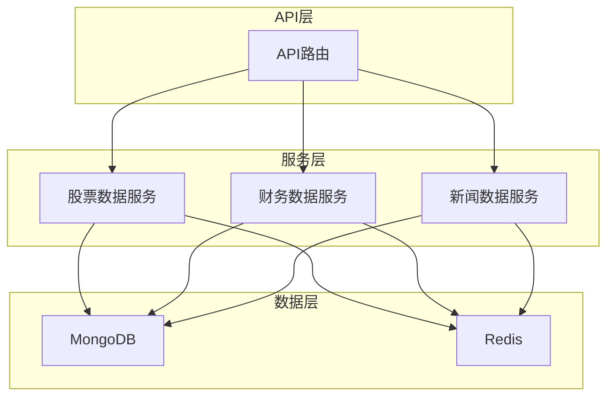
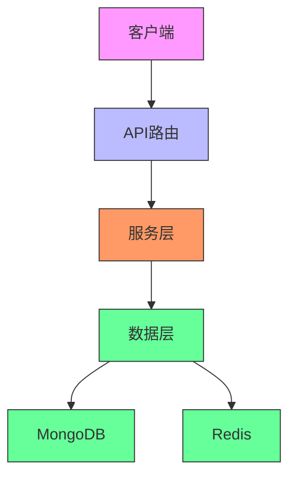
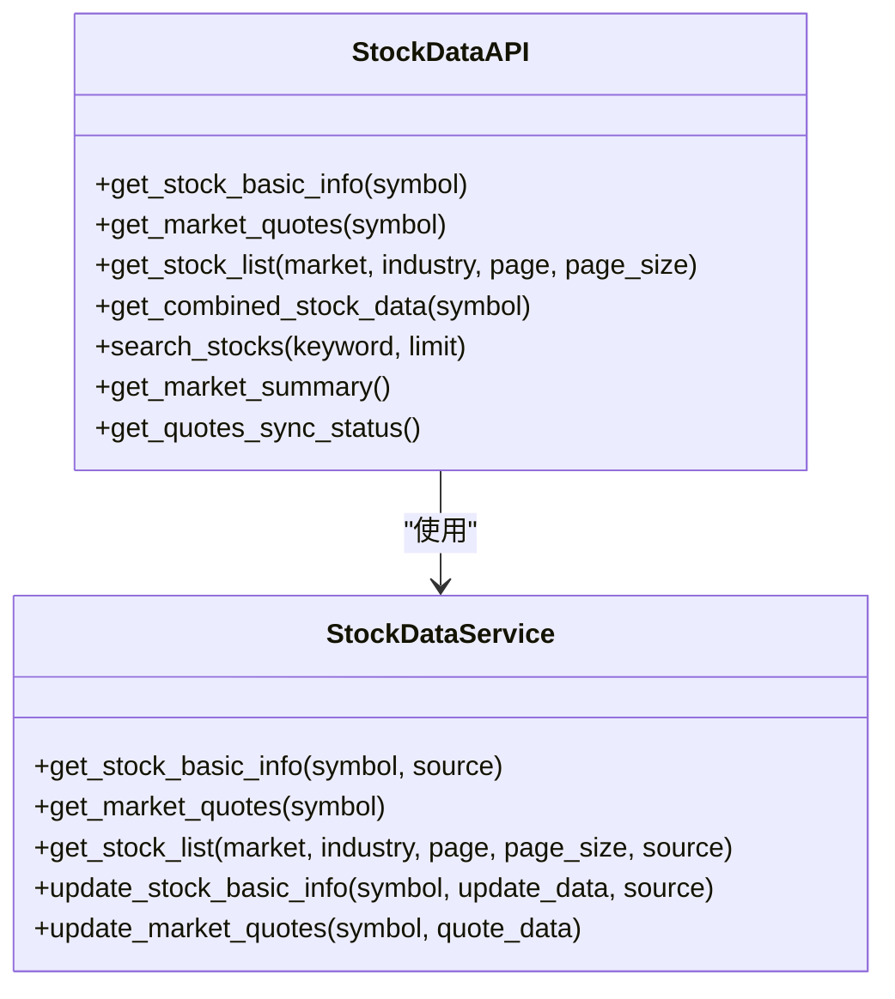
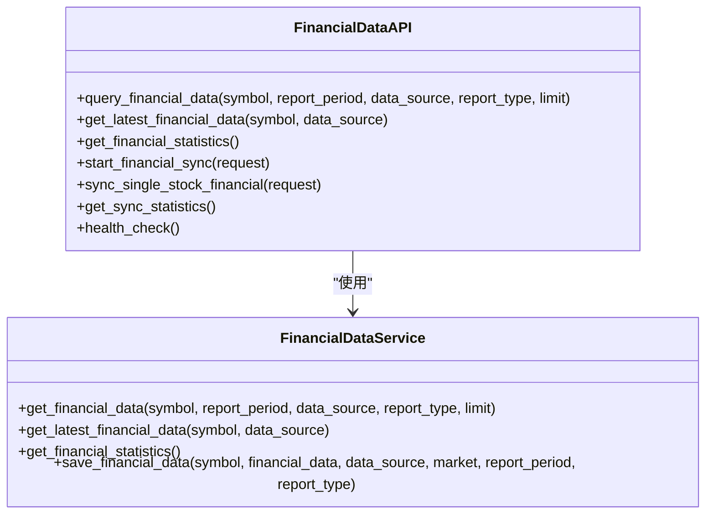
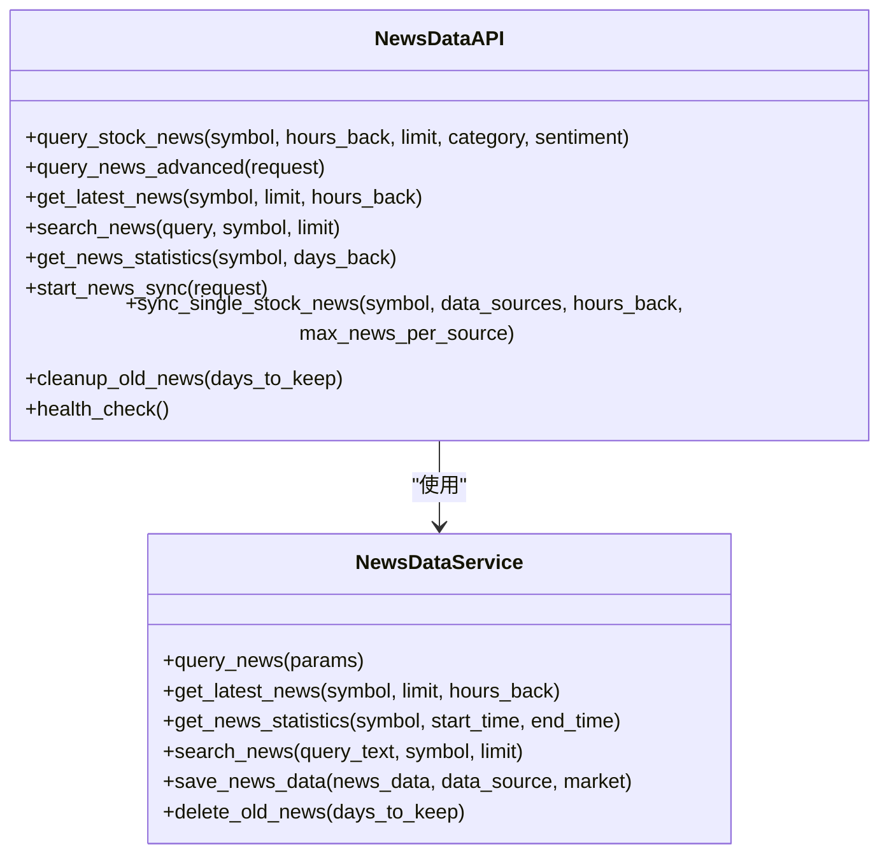
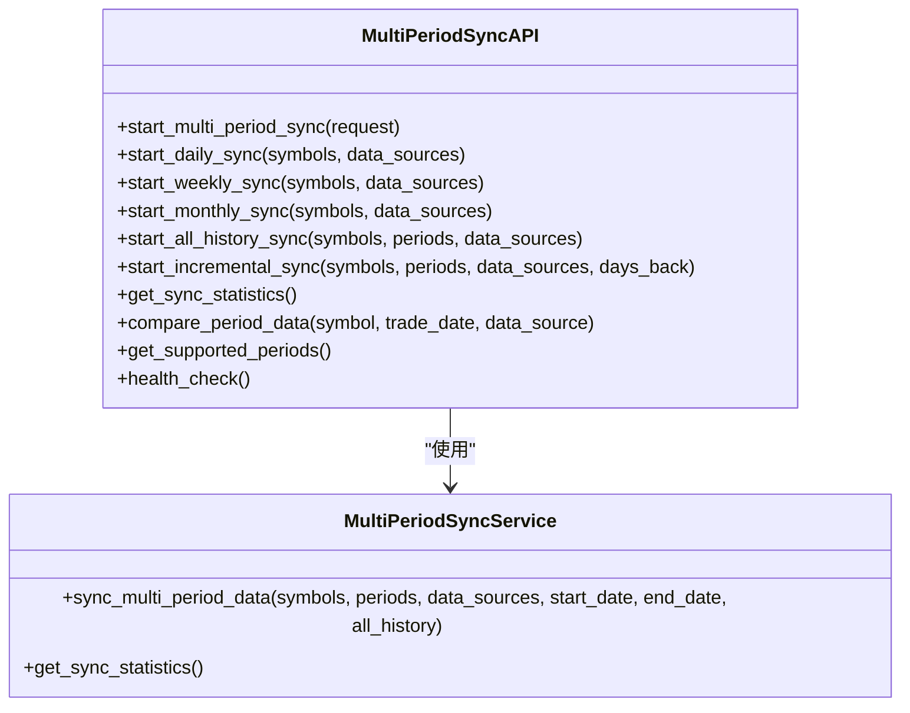
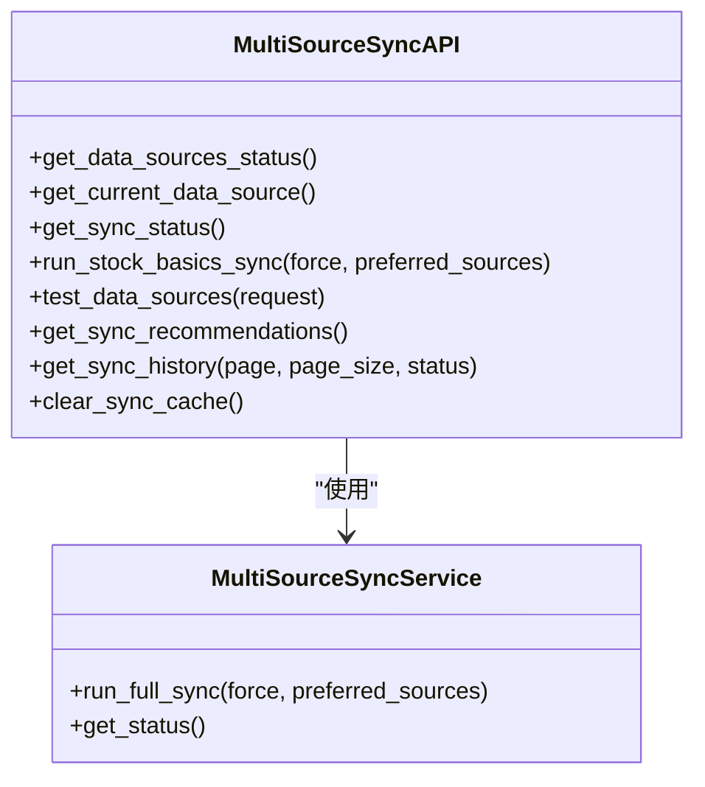
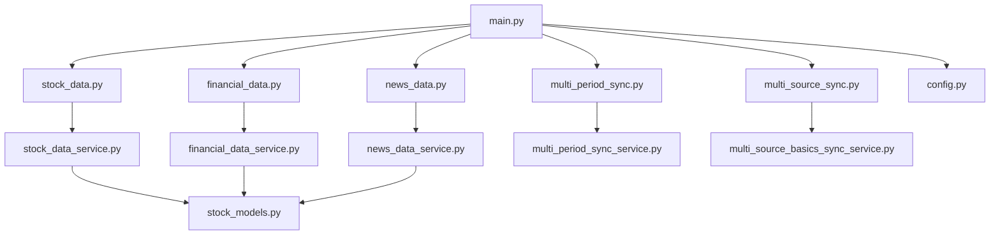

# 数据管理API

<cite>
**本文档引用的文件**   
- [main.py](file://app/main.py)
- [stock_data.py](file://app/routers/stock_data.py)
- [financial_data.py](file://app/routers/financial_data.py)
- [news_data.py](file://app/routers/news_data.py)
- [multi_period_sync.py](file://app/routers/multi_period_sync.py)
- [multi_source_sync.py](file://app/routers/multi_source_sync.py)
- [stock_data_service.py](file://app/services/stock_data_service.py)
- [financial_data_service.py](file://app/services/financial_data_service.py)
- [news_data_service.py](file://app/services/news_data_service.py)
- [stock_models.py](file://app/models/stock_models.py)
- [config.py](file://app/core/config.py)
</cite>

## 目录
1. [简介](#简介)
2. [项目结构](#项目结构)
3. [核心组件](#核心组件)
4. [架构概述](#架构概述)
5. [详细组件分析](#详细组件分析)
6. [依赖分析](#依赖分析)
7. [性能考虑](#性能考虑)
8. [故障排除指南](#故障排除指南)
9. [结论](#结论)
10. [附录](#附录) (如有必要)

## 简介
本文档旨在为数据管理API提供全面的技术文档，涵盖股票数据、财务数据和新闻数据的获取与同步功能。系统支持多数据源（Tushare、AKShare、BaoStock）和多周期（日线、周线、月线）的数据同步，通过RESTful API接口提供数据查询、更新和同步控制功能。文档详细说明了API接口规范、数据优先级处理机制和缓存策略，并提供实际使用示例。

## 项目结构
项目采用分层架构设计，主要包含以下目录：
- `app/`: 核心应用代码，包含路由、服务、模型等
- `app/routers/`: API路由定义
- `app/services/`: 业务逻辑服务层
- `app/models/`: 数据模型定义
- `app/core/`: 核心配置和工具
- `app/middleware/`: 中间件处理
- `app/utils/`: 工具函数
- `app/worker/`: 后台任务处理

系统通过FastAPI框架提供RESTful API服务，使用MongoDB存储数据，Redis用于缓存和队列管理。

**图源**
- [main.py](file://app/main.py#L604-L764)
- [stock_data.py](file://app/routers/stock_data.py#L20-L21)
- [financial_data.py](file://app/routers/financial_data.py#L17)
- [news_data.py](file://app/routers/news_data.py#L16)

**节源**
- [main.py](file://app/main.py#L604-L764)
- [app/](file://app/)

## 核心组件
系统核心组件包括：
- **股票数据API**: 提供股票基础信息和实时行情数据的查询
- **财务数据API**: 提供财务数据的查询和同步管理
- **新闻数据API**: 提供新闻数据的查询、同步和管理
- **多周期同步API**: 管理日线、周线、月线数据的同步
- **多数据源同步API**: 管理多数据源的优先级和同步

这些组件通过服务层与数据层交互，提供统一的数据访问接口。

**节源**
- [stock_data.py](file://app/routers/stock_data.py#L20-L203)
- [financial_data.py](file://app/routers/financial_data.py#L17-L307)
- [news_data.py](file://app/routers/news_data.py#L16-L513)
- [multi_period_sync.py](file://app/routers/multi_period_sync.py#L16-L394)
- [multi_source_sync.py](file://app/routers/multi_source_sync.py#L16-L488)

## 架构概述
系统采用分层架构，包含API层、服务层和数据层。API层定义RESTful接口，服务层处理业务逻辑，数据层负责数据存储和检索。

**图源**
- [main.py](file://app/main.py#L686-L729)
- [stock_data_service.py](file://app/services/stock_data_service.py#L23-L402)
- [financial_data_service.py](file://app/services/financial_data_service.py#L17-L526)
- [news_data_service.py](file://app/services/news_data_service.py#L78-L766)

## 详细组件分析

### 股票数据API分析
股票数据API提供股票基础信息和实时行情数据的查询功能。

#### API接口

**图源**
- [stock_data.py](file://app/routers/stock_data.py#L23-L383)
- [stock_data_service.py](file://app/services/stock_data_service.py#L23-L402)

**节源**
- [stock_data.py](file://app/routers/stock_data.py#L23-L383)
- [stock_data_service.py](file://app/services/stock_data_service.py#L23-L402)

### 财务数据API分析
财务数据API提供财务数据的查询和同步管理功能。

#### API接口

**图源**
- [financial_data.py](file://app/routers/financial_data.py#L49-L307)
- [financial_data_service.py](file://app/services/financial_data_service.py#L17-L526)

**节源**
- [financial_data.py](file://app/routers/financial_data.py#L49-L307)
- [financial_data_service.py](file://app/services/financial_data_service.py#L17-L526)

### 新闻数据API分析
新闻数据API提供新闻数据的查询、同步和管理功能。

#### API接口

**图源**
- [news_data.py](file://app/routers/news_data.py#L43-L513)
- [news_data_service.py](file://app/services/news_data_service.py#L78-L766)

**节源**
- [news_data.py](file://app/routers/news_data.py#L43-L513)
- [news_data_service.py](file://app/services/news_data_service.py#L78-L766)

### 多周期同步API分析
多周期同步API管理日线、周线、月线数据的同步。

#### API接口

**图源**
- [multi_period_sync.py](file://app/routers/multi_period_sync.py#L36-L394)
- [multi_period_sync_service.py](file://app/worker/multi_period_sync_service.py)

**节源**
- [multi_period_sync.py](file://app/routers/multi_period_sync.py#L36-L394)

### 多数据源同步API分析
多数据源同步API管理多数据源的优先级和同步。

#### API接口

**图源**
- [multi_source_sync.py](file://app/routers/multi_source_sync.py#L40-L488)
- [multi_source_basics_sync_service.py](file://app/services/multi_source_basics_sync_service.py)

**节源**
- [multi_source_sync.py](file://app/routers/multi_source_sync.py#L40-L488)

## 依赖分析
系统依赖关系如下：

**图源**
- [main.py](file://app/main.py#L31-L39)
- [stock_data.py](file://app/routers/stock_data.py#L10-L18)
- [financial_data.py](file://app/routers/financial_data.py#L11-L12)
- [news_data.py](file://app/routers/news_data.py#L11-L14)
- [multi_period_sync.py](file://app/routers/multi_period_sync.py#L12)
- [multi_source_sync.py](file://app/routers/multi_source_sync.py#L11-L12)

**节源**
- [main.py](file://app/main.py#L31-L39)
- [stock_data.py](file://app/routers/stock_data.py#L10-L18)
- [financial_data.py](file://app/routers/financial_data.py#L11-L12)
- [news_data.py](file://app/routers/news_data.py#L11-L14)
- [multi_period_sync.py](file://app/routers/multi_period_sync.py#L12)
- [multi_source_sync.py](file://app/routers/multi_source_sync.py#L11-L12)

## 性能考虑
系统在性能方面做了以下优化：
- 使用MongoDB索引提升查询性能
- 采用批量写入操作减少数据库IO
- 实现数据缓存机制减少重复查询
- 支持多数据源并行同步提高效率
- 配置合理的API调用频率限制

## 故障排除指南
常见问题及解决方案：
- **数据同步失败**: 检查数据源配置和网络连接
- **API响应慢**: 检查数据库索引和缓存状态
- **数据不一致**: 检查多数据源优先级配置
- **内存占用高**: 检查缓存清理策略

**节源**
- [main.py](file://app/main.py#L222-L228)
- [config.py](file://app/core/config.py#L153-L203)

## 结论
本文档详细介绍了数据管理API的设计和实现，涵盖了股票数据、财务数据和新闻数据的获取与同步功能。系统采用分层架构设计，支持多数据源和多周期的数据同步，通过RESTful API提供统一的数据访问接口。通过合理的数据优先级处理机制和缓存策略，确保了系统的高性能和可靠性。