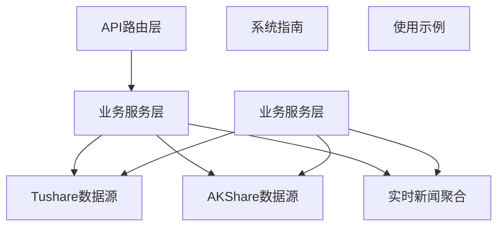
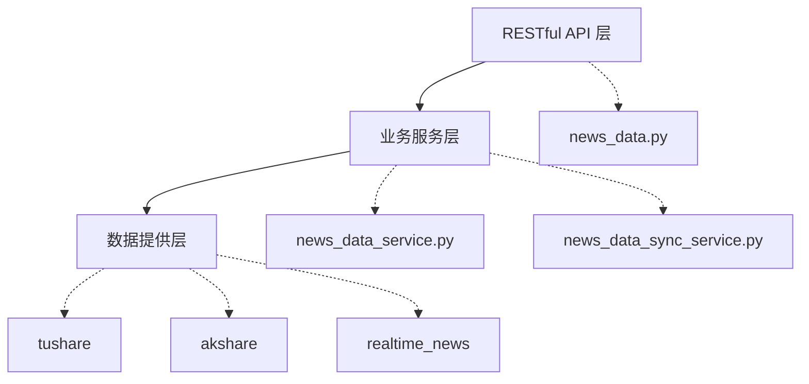
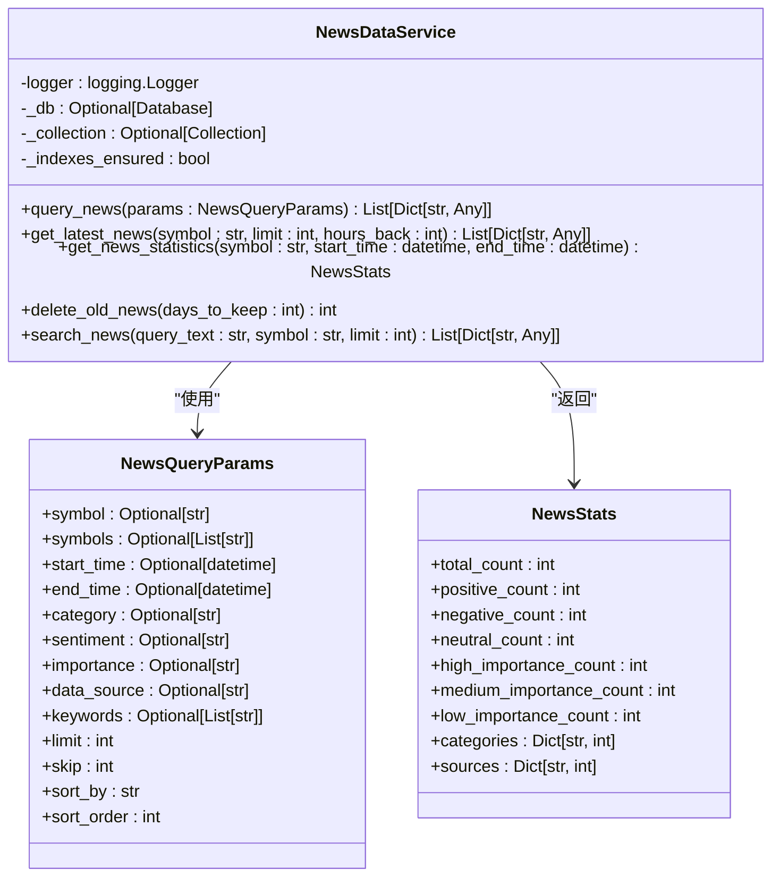
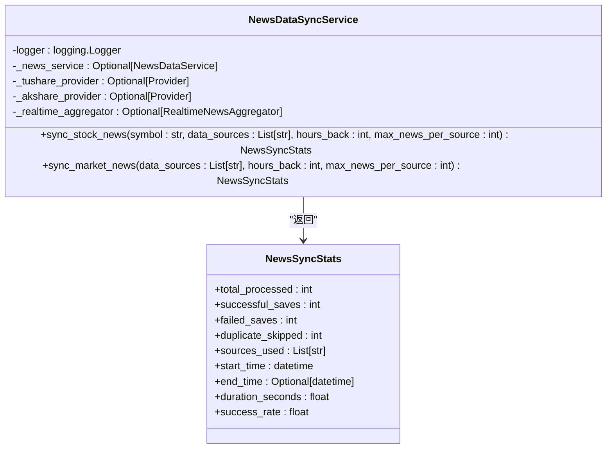
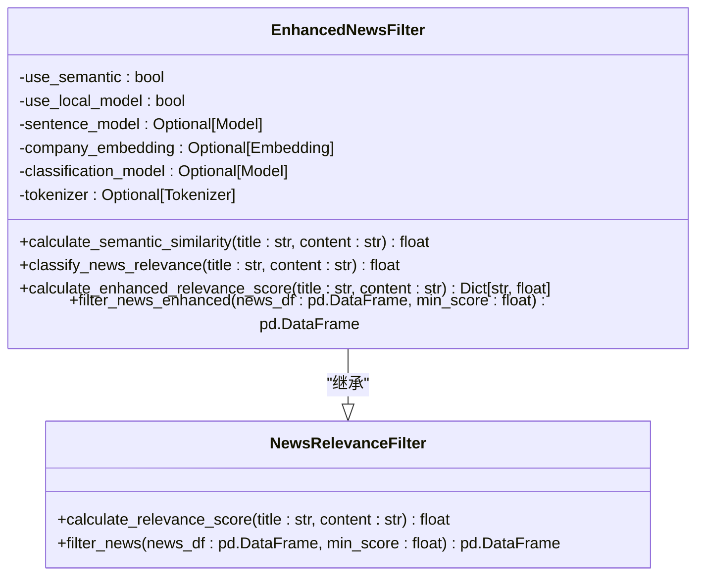
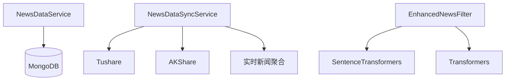

# 新闻分类API

<cite>
**本文档引用的文件**   
- [news_data.py](file://app/routers/news_data.py)
- [news_data_service.py](file://app/services/news_data_service.py)
- [news_data_sync_service.py](file://app/worker/news_data_sync_service.py)
- [README.md](file://docs/guides/news_data_system/README.md)
- [enhanced_news_filter.py](file://tradingagents/utils/enhanced_news_filter.py)
- [file_cache.py](file://tradingagents/dataflows/cache/file_cache.py)
</cite>

## 目录
1. [简介](#简介)
2. [项目结构](#项目结构)
3. [核心组件](#核心组件)
4. [架构概述](#架构概述)
5. [详细组件分析](#详细组件分析)
6. [依赖分析](#依赖分析)
7. [性能考虑](#性能考虑)
8. [故障排除指南](#故障排除指南)
9. [结论](#结论)

## 简介
新闻分类API是TradingAgents-CN系统中的关键组件，负责提供完整的新闻数据获取、存储、分析和查询功能。该API支持多数据源新闻聚合、智能情绪分析、重要性评估和高级查询功能。系统采用三层架构设计，包括RESTful API层、业务服务层和数据提供层，确保了高性能和可扩展性。

## 项目结构
新闻分类API的项目结构清晰，主要分为以下几个部分：
- **API路由层**：`app/routers/news_data.py` 提供新闻数据API接口
- **业务服务层**：`app/services/news_data_service.py` 和 `app/worker/news_data_sync_service.py` 提供新闻数据管理和同步服务
- **数据提供层**：包括AKShare、Tushare和实时新闻聚合等数据源
- **文档和示例**：`docs/guides/news_data_system/README.md` 提供详细的系统指南，`examples/demo_news_filtering.py` 提供使用示例

**Diagram sources**
- [news_data.py](file://app/routers/news_data.py)
- [news_data_service.py](file://app/services/news_data_service.py)
- [news_data_sync_service.py](file://app/worker/news_data_sync_service.py)
- [README.md](file://docs/guides/news_data_system/README.md)

**Section sources**
- [news_data.py](file://app/routers/news_data.py)
- [news_data_service.py](file://app/services/news_data_service.py)
- [news_data_sync_service.py](file://app/worker/news_data_sync_service.py)
- [README.md](file://docs/guides/news_data_system/README.md)

## 核心组件
新闻分类API的核心组件包括新闻查询服务、新闻同步服务和新闻过滤器。这些组件共同工作，确保新闻数据的高质量和高效查询。

**Section sources**
- [news_data_service.py](file://app/services/news_data_service.py)
- [news_data_sync_service.py](file://app/worker/news_data_sync_service.py)
- [enhanced_news_filter.py](file://tradingagents/utils/enhanced_news_filter.py)

## 架构概述
新闻分类API采用三层架构设计，确保了系统的高性能和可扩展性。

**Diagram sources**
- [news_data.py](file://app/routers/news_data.py)
- [news_data_service.py](file://app/services/news_data_service.py)
- [news_data_sync_service.py](file://app/worker/news_data_sync_service.py)
- [README.md](file://docs/guides/news_data_system/README.md)

## 详细组件分析

### 新闻查询服务分析
新闻查询服务是新闻分类API的核心功能之一，提供了多种查询接口，包括查询股票新闻、高级查询、获取最新新闻和全文搜索。

#### 类图

**Diagram sources**
- [news_data_service.py](file://app/services/news_data_service.py)

### 新闻同步服务分析
新闻同步服务负责从多个数据源同步新闻数据，并进行标准化处理。

#### 类图

**Diagram sources**
- [news_data_sync_service.py](file://app/worker/news_data_sync_service.py)

### 新闻过滤器分析
新闻过滤器用于提高新闻数据的质量，通过规则过滤、语义相似度和本地分类模型等多种策略进行综合评分。

#### 类图

**Diagram sources**
- [enhanced_news_filter.py](file://tradingagents/utils/enhanced_news_filter.py)

## 依赖分析
新闻分类API的依赖关系清晰，主要依赖于MongoDB数据库、AKShare、Tushare和实时新闻聚合等数据源。

**Diagram sources**
- [news_data_service.py](file://app/services/news_data_service.py)
- [news_data_sync_service.py](file://app/worker/news_data_sync_service.py)
- [enhanced_news_filter.py](file://tradingagents/utils/enhanced_news_filter.py)

**Section sources**
- [news_data_service.py](file://app/services/news_data_service.py)
- [news_data_sync_service.py](file://app/worker/news_data_sync_service.py)
- [enhanced_news_filter.py](file://tradingagents/utils/enhanced_news_filter.py)

## 性能考虑
新闻分类API在性能方面进行了多项优化，包括数据库索引优化、批量操作和连接池优化。

### 数据库优化
- **索引优化**：15个专门优化的索引，支持毫秒级查询
- **批量操作**：使用`bulk_write`进行高效批量插入
- **连接池**：MongoDB连接池优化，支持高并发访问

### 缓存策略
- **查询缓存**：热点查询结果缓存
- **数据缓存**：频繁访问的新闻数据缓存
- **统计缓存**：统计信息定期缓存更新

### 并发处理
- **异步处理**：全异步架构，支持高并发
- **批量同步**：支持多股票并发同步
- **限流控制**：API调用限流，避免数据源限制

**Section sources**
- [news_data_service.py](file://app/services/news_data_service.py)
- [file_cache.py](file://tradingagents/dataflows/cache/file_cache.py)

## 故障排除指南
### 常见问题
1. **数据库连接失败**
   - 检查MongoDB服务状态
   - 验证连接字符串配置
   - 确认网络连接正常

2. **新闻数据获取失败**
   - 检查数据源API可用性
   - 验证API Token配置
   - 确认网络访问权限

3. **查询性能慢**
   - 检查索引使用情况
   - 优化查询条件
   - 考虑增加缓存

4. **同步数据重复**
   - 检查唯一索引配置
   - 验证去重逻辑
   - 清理重复数据

**Section sources**
- [README.md](file://docs/guides/news_data_system/README.md)

## 结论
新闻分类API是TradingAgents-CN系统中的重要组成部分，提供了完整的新闻数据管理解决方案。通过多数据源聚合、智能分析、高效存储和灵活查询，该API为股票投资分析提供了强有力的支持。系统经过充分测试，性能优秀，可靠性高，是投资者不可或缺的工具。