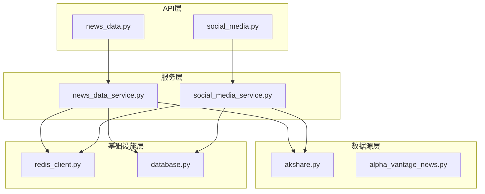
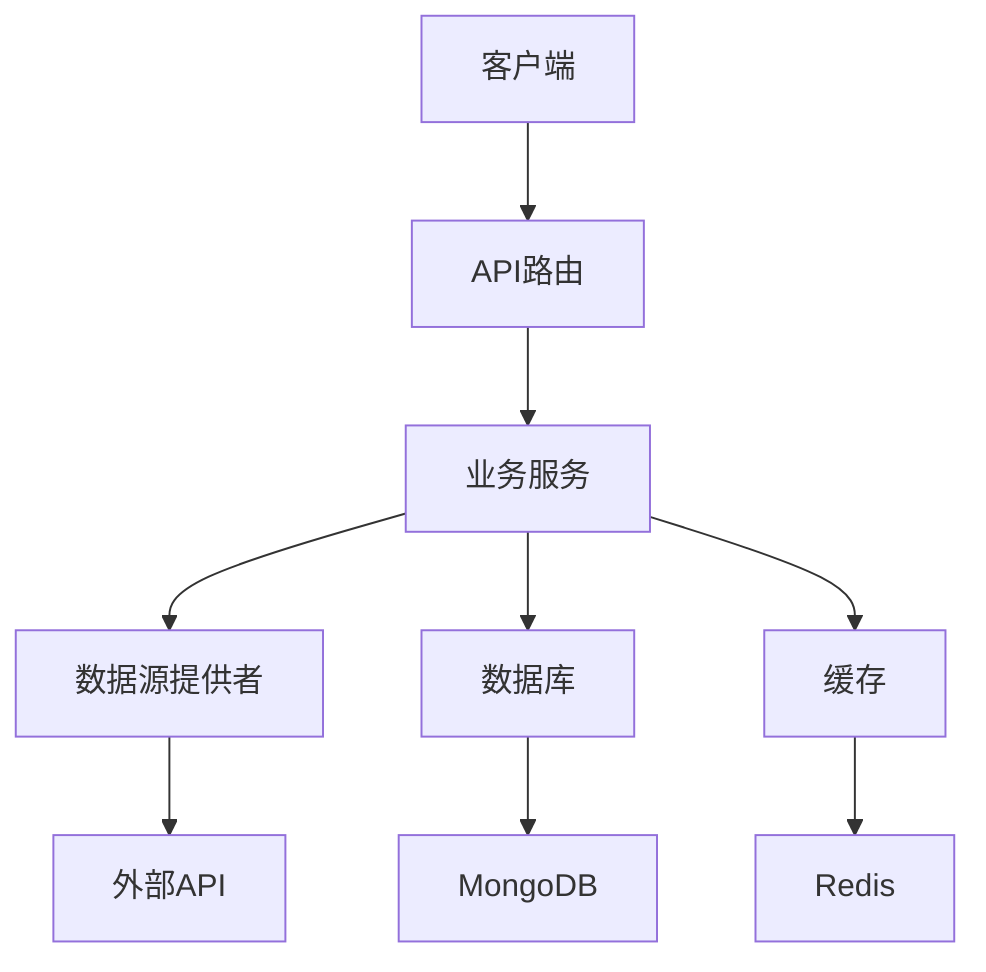
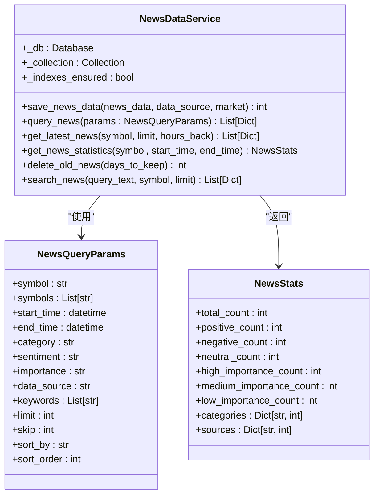
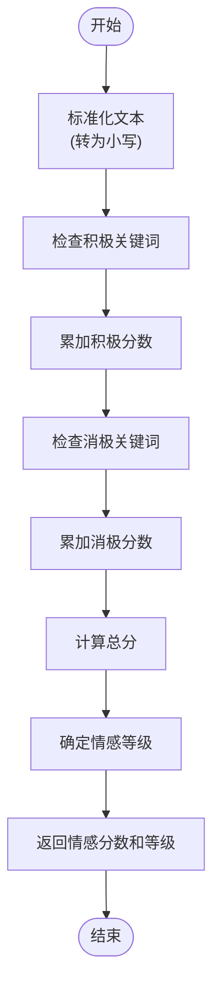
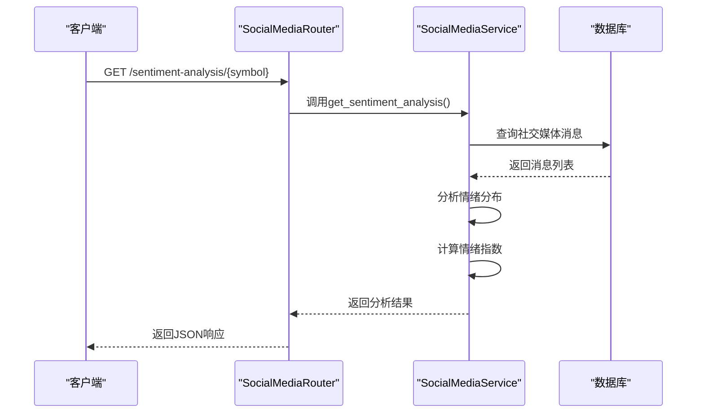
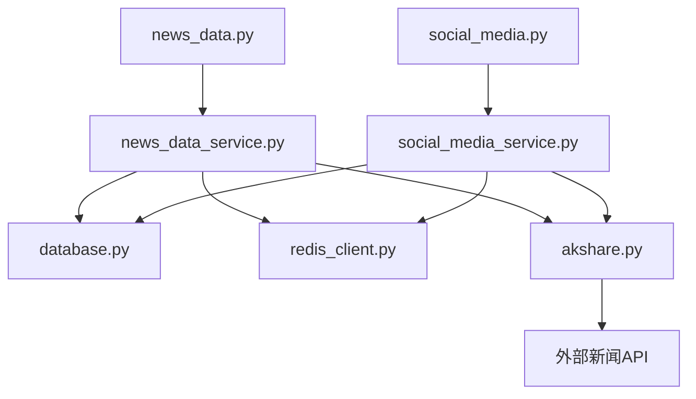

# 新闻情感分析API

<cite>
**本文档引用的文件**   
- [news_data.py](file://app/routers/news_data.py)
- [news_data_service.py](file://app/services/news_data_service.py)
- [akshare.py](file://tradingagents/dataflows/providers/china/akshare.py)
- [social_media.py](file://app/routers/social_media.py)
- [social_media_service.py](file://app/services/social_media_service.py)
- [redis_client.py](file://app/core/redis_client.py)
- [test_news_sentiment_analysis.py](file://scripts/test_news_sentiment_analysis.py)
</cite>

## 目录
1. [简介](#简介)
2. [项目结构](#项目结构)
3. [核心组件](#核心组件)
4. [架构概述](#架构概述)
5. [详细组件分析](#详细组件分析)
6. [依赖分析](#依赖分析)
7. [性能考虑](#性能考虑)
8. [故障排除指南](#故障排除指南)
9. [结论](#结论)

## 简介
本文档全面介绍了新闻情感分析API的功能和实现细节。该API旨在为股票市场提供基于新闻和社交媒体数据的情感分析服务，帮助用户理解市场情绪趋势。系统通过多种数据源获取新闻内容，并使用基于关键词的算法计算情感分数，支持按情感倾向（正面、负面、中性）过滤新闻。此外，系统还集成了社交媒体情绪分析功能，能够从多个平台收集用户情绪数据，并提供综合的情绪趋势分析。

## 项目结构
项目采用模块化设计，主要分为以下几个部分：
- `app/routers/`: 包含各种API路由，如新闻数据、社交媒体分析等
- `app/services/`: 提供核心业务逻辑服务，如新闻数据服务、社交媒体服务
- `tradingagents/dataflows/providers/`: 包含不同数据源的提供者，如AKShare、Alpha Vantage等
- `app/core/`: 核心配置和工具，如数据库连接、Redis客户端
- `scripts/`: 各种脚本，包括测试脚本和维护脚本

**Diagram sources**
- [news_data.py](file://app/routers/news_data.py)
- [news_data_service.py](file://app/services/news_data_service.py)
- [akshare.py](file://tradingagents/dataflows/providers/china/akshare.py)
- [redis_client.py](file://app/core/redis_client.py)

**Section sources**
- [news_data.py](file://app/routers/news_data.py)
- [news_data_service.py](file://app/services/news_data_service.py)

## 核心组件
新闻情感分析API的核心组件包括新闻数据服务、社交媒体分析服务和情感计算引擎。新闻数据服务负责从数据库查询和存储新闻数据，支持按股票代码、时间范围和情感倾向等多种条件过滤。社交媒体分析服务则专注于从社交媒体平台收集和分析用户情绪。情感计算引擎基于关键词匹配算法，为每条新闻分配情感分数和分类。

**Section sources**
- [news_data_service.py](file://app/services/news_data_service.py)
- [social_media_service.py](file://app/services/social_media_service.py)
- [akshare.py](file://tradingagents/dataflows/providers/china/akshare.py)

## 架构概述
系统采用分层架构设计，前端通过API路由与后端服务交互，服务层处理业务逻辑并与数据源和存储系统通信。情感分析主要在数据获取阶段完成，由数据源提供者在获取新闻时同时计算情感分数。系统使用MongoDB存储新闻数据，Redis用于缓存和队列管理，确保高性能和可扩展性。

**Diagram sources**
- [news_data.py](file://app/routers/news_data.py)
- [news_data_service.py](file://app/services/news_data_service.py)
- [akshare.py](file://tradingagents/dataflows/providers/china/akshare.py)
- [redis_client.py](file://app/core/redis_client.py)

## 详细组件分析

### 新闻数据服务分析
新闻数据服务是系统的核心组件之一，负责管理新闻数据的存储、查询和统计。服务提供了丰富的查询接口，支持按股票代码、时间范围、新闻类别和情感倾向等条件过滤新闻。

#### 类图

**Diagram sources**
- [news_data_service.py](file://app/services/news_data_service.py)

**Section sources**
- [news_data_service.py](file://app/services/news_data_service.py)

### 情感计算分析
情感计算是新闻分析的核心功能，系统使用基于关键词的规则引擎来确定新闻的情感倾向。该算法通过匹配预定义的积极和消极关键词，并根据其权重计算综合情感分数。

#### 流程图

**Diagram sources**
- [akshare.py](file://tradingagents/dataflows/providers/china/akshare.py)

**Section sources**
- [akshare.py](file://tradingagents/dataflows/providers/china/akshare.py)

### 社交媒体情绪分析
社交媒体情绪分析API提供对特定股票在社交媒体上的公众情绪分析。该功能可以按平台和时间范围统计情绪分布，并计算整体情绪指数。

#### 序列图

**Diagram sources**
- [social_media.py](file://app/routers/social_media.py)
- [social_media_service.py](file://app/services/social_media_service.py)

**Section sources**
- [social_media.py](file://app/routers/social_media.py)
- [social_media_service.py](file://app/services/social_media_service.py)

## 依赖分析
系统依赖于多个外部组件和服务，包括数据库、缓存系统和外部API。这些依赖关系确保了系统的功能完整性和性能表现。

**Diagram sources**
- [news_data.py](file://app/routers/news_data.py)
- [news_data_service.py](file://app/services/news_data_service.py)
- [social_media.py](file://app/routers/social_media.py)
- [social_media_service.py](file://app/services/social_media_service.py)
- [akshare.py](file://tradingagents/dataflows/providers/china/akshare.py)
- [redis_client.py](file://app/core/redis_client.py)

**Section sources**
- [news_data.py](file://app/routers/news_data.py)
- [news_data_service.py](file://app/services/news_data_service.py)
- [social_media.py](file://app/routers/social_media.py)
- [social_media_service.py](file://app/services/social_media_service.py)

## 性能考虑
系统在设计时充分考虑了性能因素，采用了多种优化策略来确保高效运行。

### 缓存策略
系统使用Redis作为缓存层，主要应用于以下几个方面：
- 新闻数据缓存：减少对数据库的直接查询
- 分析结果缓存：避免重复计算
- 队列管理：处理异步任务

缓存的TTL（生存时间）根据数据的更新频率动态设置，确保数据的新鲜度和性能之间的平衡。

### 更新延迟
新闻数据的更新延迟取决于数据源的更新频率和系统的同步机制。系统采用定时同步和按需同步相结合的方式：
- 定时同步：每小时自动同步最新新闻
- 按需同步：当查询特定股票新闻而数据库无数据时，实时获取并缓存

### 性能开销
情感分析的主要性能开销在于文本处理和关键词匹配。系统通过以下方式优化性能：
- 预编译关键词匹配规则
- 使用高效的字符串搜索算法
- 并行处理多条新闻的情感分析

**Section sources**
- [redis_client.py](file://app/core/redis_client.py)
- [news_data_service.py](file://app/services/news_data_service.py)

## 故障排除指南
当情感分析功能出现问题时，可以按照以下步骤进行排查：

### 情感分析失败处理
1. **检查数据源连接**：确保能够正常访问外部新闻API
2. **验证缓存状态**：检查Redis连接是否正常，缓存数据是否有效
3. **查看日志信息**：检查系统日志中的错误信息，定位问题根源
4. **测试情感计算**：使用测试脚本验证情感计算算法是否正常工作

### 常见问题
- **问题**：查询新闻时返回空结果
  - **解决方案**：检查数据库连接，确认是否有数据同步，尝试手动触发同步
- **问题**：情感分数计算不准确
  - **解决方案**：检查关键词库是否完整，验证文本预处理逻辑
- **问题**：API响应缓慢
  - **解决方案**：检查缓存命中率，优化数据库查询，增加系统资源

**Section sources**
- [test_news_sentiment_analysis.py](file://scripts/test_news_sentiment_analysis.py)
- [redis_client.py](file://app/core/redis_client.py)
- [news_data_service.py](file://app/services/news_data_service.py)

## 结论
新闻情感分析API提供了一套完整的解决方案，用于获取和分析股票相关的新闻和社交媒体情绪。系统通过模块化设计和分层架构，实现了高可维护性和可扩展性。情感计算基于规则的关键词匹配算法，虽然相对简单但有效，能够为用户提供有价值的市场情绪洞察。通过合理的缓存策略和性能优化，系统能够在保证数据新鲜度的同时提供快速的响应。未来可以考虑引入更先进的机器学习模型来提高情感分析的准确性。