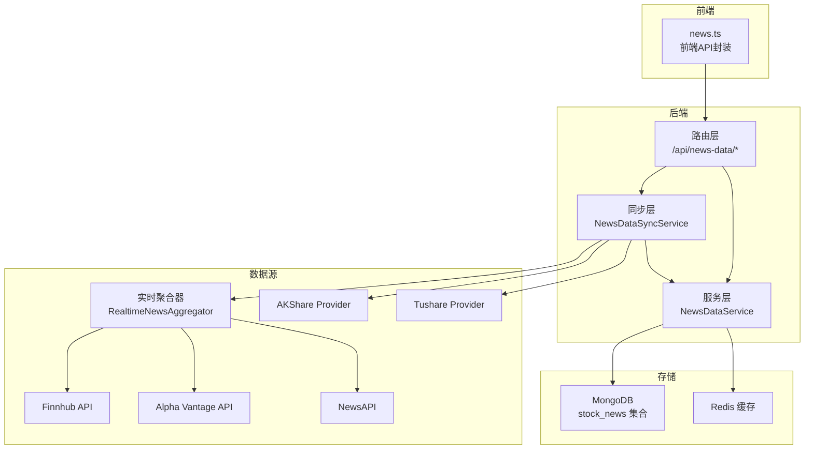
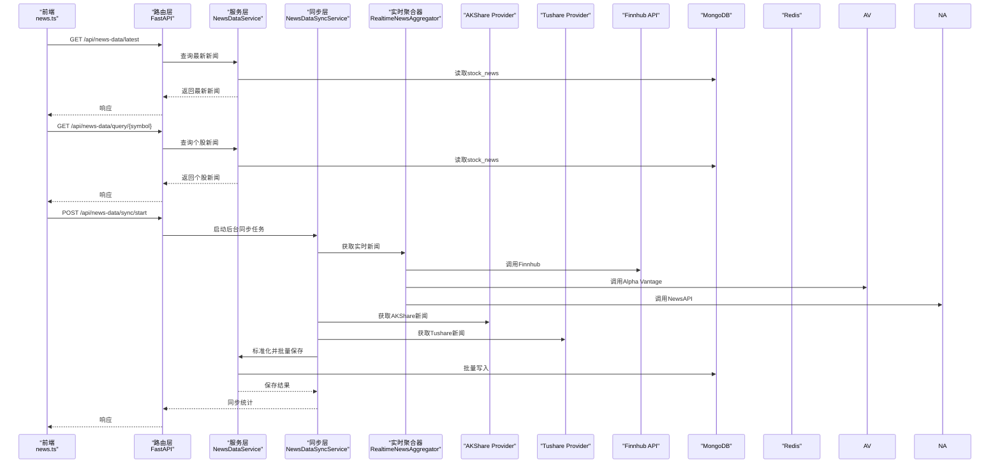
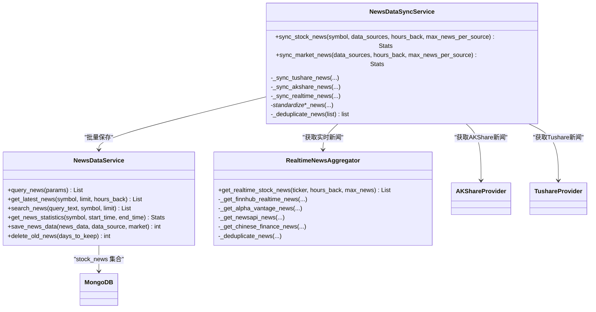

# 新闻数据API

<cite>
**本文引用的文件**
- [app/routers/news_data.py](file://app/routers/news_data.py)
- [app/services/news_data_service.py](file://app/services/news_data_service.py)
- [app/worker/news_data_sync_service.py](file://app/worker/news_data_sync_service.py)
- [frontend/src/api/news.ts](file://frontend/src/api/news.ts)
- [tradingagents/dataflows/news/realtime_news.py](file://tradingagents/dataflows/news/realtime_news.py)
- [tradingagents/dataflows/providers/china/akshare.py](file://tradingagents/dataflows/providers/china/akshare.py)
- [tradingagents/dataflows/cache/db_cache.py](file://tradingagents/dataflows/cache/db_cache.py)
- [scripts/setup/init_database.py](file://scripts/setup/init_database.py)
- [app/core/redis_client.py](file://app/core/redis_client.py)
- [docs/fixes/DASHBOARD_MARKET_NEWS_EMPTY_FIX.md](file://docs/fixes/DASHBOARD_MARKET_NEWS_EMPTY_FIX.md)
</cite>

## 目录
1. [简介](#简介)
2. [项目结构](#项目结构)
3. [核心组件](#核心组件)
4. [架构总览](#架构总览)
5. [详细组件分析](#详细组件分析)
6. [依赖关系分析](#依赖关系分析)
7. [性能考量](#性能考量)
8. [故障排查指南](#故障排查指南)
9. [结论](#结论)
10. [附录](#附录)

## 简介
本文件面向“新闻数据API”的使用者与开发者，系统化梳理市场新闻、个股新闻与新闻情感分析的获取与管理能力。内容覆盖：
- API端点与查询参数（如category、market、sentiment、page、size等）
- 响应结构（标题、内容、发布时间、来源、情感分数等字段）
- 分页机制与排序规则
- 新闻采集、清洗与聚合流程
- 多数据源（如AKShare、Tushare、Finnhub、Alpha Vantage、NewsAPI等）整合策略
- 前端调用示例（news.ts服务）
- 新闻缓存策略、更新频率与去重机制
- 新闻情感分析模型与集成方式

## 项目结构
新闻数据API由三层组成：
- 路由层：定义REST接口与参数校验
- 服务层：统一的数据访问、查询、统计与持久化
- 同步层：多数据源采集、清洗、聚合与入库
- 前端层：news.ts封装调用，提供实时新闻流

图表来源
- [app/routers/news_data.py](file://app/routers/news_data.py#L1-L120)
- [app/services/news_data_service.py](file://app/services/news_data_service.py#L1-L140)
- [app/worker/news_data_sync_service.py](file://app/worker/news_data_sync_service.py#L1-L120)
- [tradingagents/dataflows/news/realtime_news.py](file://tradingagents/dataflows/news/realtime_news.py#L1-L120)
- [tradingagents/dataflows/providers/china/akshare.py](file://tradingagents/dataflows/providers/china/akshare.py#L1435-L1479)

章节来源
- [app/routers/news_data.py](file://app/routers/news_data.py#L1-L120)
- [app/services/news_data_service.py](file://app/services/news_data_service.py#L1-L140)
- [app/worker/news_data_sync_service.py](file://app/worker/news_data_sync_service.py#L1-L120)

## 核心组件
- 路由层（FastAPI）：提供查询、最新新闻、全文搜索、统计、同步、清理等接口；支持鉴权与后台任务
- 服务层（NewsDataService）：统一查询、统计、全文检索、删除过期数据；内置索引与批量写入
- 同步层（NewsDataSyncService）：多数据源采集、标准化、去重、批量入库；提供股票与市场新闻同步
- 实时聚合器（RealtimeNewsAggregator）：优先Finnhub，其次Alpha Vantage、NewsAPI，再中文财经源；去重与排序
- 前端封装（news.ts）：封装GET /api/news-data/latest、GET /api/news-data/query/{symbol}、POST /api/news-data/sync/start等

章节来源
- [app/routers/news_data.py](file://app/routers/news_data.py#L1-L220)
- [app/services/news_data_service.py](file://app/services/news_data_service.py#L400-L767)
- [app/worker/news_data_sync_service.py](file://app/worker/news_data_sync_service.py#L1-L200)
- [frontend/src/api/news.ts](file://frontend/src/api/news.ts#L1-L99)

## 架构总览
下图展示从前端到后端、再到多数据源与存储的整体流程。

图表来源
- [frontend/src/api/news.ts](file://frontend/src/api/news.ts#L56-L99)
- [app/routers/news_data.py](file://app/routers/news_data.py#L183-L379)
- [app/services/news_data_service.py](file://app/services/news_data_service.py#L457-L755)
- [app/worker/news_data_sync_service.py](file://app/worker/news_data_sync_service.py#L89-L210)
- [tradingagents/dataflows/news/realtime_news.py](file://tradingagents/dataflows/news/realtime_news.py#L50-L145)

## 详细组件分析

### 路由与端点
- GET /api/news-data/latest
  - 查询参数：symbol（可选）、limit、hours_back
  - 功能：获取最新新闻，支持按股票或全市场
  - 响应：包含symbol、limit、hours_back、total_count、news数组
- GET /api/news-data/query/{symbol}
  - 查询参数：hours_back、limit、category、sentiment
  - 功能：查询个股新闻，优先从数据库返回，无数据时实时抓取并入库
  - 响应：包含symbol、hours_back、total_count、news数组、data_source
- POST /api/news-data/query
  - 请求体：symbol、symbols、start_time、end_time、category、sentiment、importance、data_source、keywords、limit、skip
  - 功能：高级查询，支持多股票、时间范围、分类、情感、重要性、关键词、分页
  - 响应：包含查询参数、total_count、news数组
- GET /api/news-data/search
  - 查询参数：query、symbol、limit
  - 功能：全文搜索新闻
  - 响应：包含query、symbol、total_count、news数组
- GET /api/news-data/statistics
  - 查询参数：symbol、days_back
  - 功能：统计新闻总数、情感分布、重要性分布、分类与来源
  - 响应：包含统计数据对象
- POST /api/news-data/sync/start
  - 请求体：symbol（可选）、data_sources（可选）、hours_back、max_news_per_source
  - 功能：启动后台任务同步市场或个股新闻
  - 响应：包含同步类型、参数与统计
- POST /api/news-data/sync/single
  - 请求体：symbol、data_sources、hours_back、max_news_per_source
  - 功能：同步单只股票新闻（同步执行）
  - 响应：包含同步统计
- DELETE /api/news-data/cleanup
  - 查询参数：days_to_keep
  - 功能：清理过期新闻
  - 响应：包含清理天数与删除数量
- GET /api/news-data/health
  - 功能：健康检查
  - 响应：服务状态与时间戳

章节来源
- [app/routers/news_data.py](file://app/routers/news_data.py#L183-L513)

### 服务层：NewsDataService
- 索引策略：唯一索引（url+title+publish_time）、按symbol、symbols、publish_time、data_source、category、sentiment、importance、updated_at建立复合索引
- 查询能力：支持symbol、symbols、时间范围、category、sentiment、importance、data_source、keywords（文本搜索）、分页与排序
- 统计能力：聚合统计情感分布、重要性分布、分类与来源
- 全文搜索：基于MongoDB文本索引
- 删除过期：按publish_time删除超过保留期的数据
- 批量写入：ReplaceOne去重，避免重复入库

章节来源
- [app/services/news_data_service.py](file://app/services/news_data_service.py#L87-L138)
- [app/services/news_data_service.py](file://app/services/news_data_service.py#L457-L755)

### 同步层：NewsDataSyncService
- 数据源：AKShare、Tushare、实时聚合器（Finnhub、Alpha Vantage、NewsAPI）
- 标准化：统一字段（symbol、title、content、summary、url、source、author、publish_time、category、sentiment、importance、keywords、data_source）
- 去重：基于标题与URL的组合去重
- 批量保存：调用服务层批量写入
- 统计：记录总处理数、成功保存数、失败数、重复跳过数、耗时与成功率

章节来源
- [app/worker/news_data_sync_service.py](file://app/worker/news_data_sync_service.py#L1-L200)
- [app/worker/news_data_sync_service.py](file://app/worker/news_data_sync_service.py#L291-L408)
- [app/worker/news_data_sync_service.py](file://app/worker/news_data_sync_service.py#L433-L507)

### 实时聚合器：RealtimeNewsAggregator
- 优先级：Finnhub > Alpha Vantage > NewsAPI > 中文财经源
- 去重：基于标题与URL的组合去重
- 排序：按发布时间降序
- 数量限制：返回最新max_news条
- 紧急度与相关性：根据标题与摘要评估

章节来源
- [tradingagents/dataflows/news/realtime_news.py](file://tradingagents/dataflows/news/realtime_news.py#L50-L145)
- [tradingagents/dataflows/news/realtime_news.py](file://tradingagents/dataflows/news/realtime_news.py#L571-L623)

### 前端调用示例：news.ts
- getLatestNews(symbol?, limit=10, hours_back=24)
- queryStockNews(symbol, hours_back=24, limit=20)
- syncMarketNews(hours_back=24, max_news_per_source=50)

章节来源
- [frontend/src/api/news.ts](file://frontend/src/api/news.ts#L56-L99)

### 数据源与情感分析
- 数据源：AKShare、Tushare、Finnhub、Alpha Vantage、NewsAPI
- 情感分析：同步层内置中文关键词规则进行情感与重要性评估；AKShare提供情绪分数计算逻辑
- 综合情感：多源情感可按置信度加权聚合（见中文金融情感聚合）

章节来源
- [app/worker/news_data_sync_service.py](file://app/worker/news_data_sync_service.py#L357-L408)
- [tradingagents/dataflows/providers/china/akshare.py](file://tradingagents/dataflows/providers/china/akshare.py#L1442-L1479)

## 依赖关系分析

图表来源
- [app/services/news_data_service.py](file://app/services/news_data_service.py#L457-L755)
- [app/worker/news_data_sync_service.py](file://app/worker/news_data_sync_service.py#L89-L210)
- [tradingagents/dataflows/news/realtime_news.py](file://tradingagents/dataflows/news/realtime_news.py#L50-L145)

## 性能考量
- 索引优化：针对常用查询字段建立复合索引，降低查询延迟
- 批量写入：ReplaceOne去重，减少重复写入与冲突
- 去重策略：标题+URL组合去重，减少冗余数据
- 缓存策略：系统初始化脚本设置新闻缓存TTL（如中国新闻14400秒），Redis与MongoDB双通道缓存（见脚本）
- 异步与后台任务：同步接口采用后台任务，避免阻塞主线程
- 限流与速率控制：中间件层提供速率限制（见路由层导入）

章节来源
- [app/services/news_data_service.py](file://app/services/news_data_service.py#L87-L138)
- [app/worker/news_data_sync_service.py](file://app/worker/news_data_sync_service.py#L1-L120)
- [scripts/setup/init_database.py](file://scripts/setup/init_database.py#L153-L192)
- [app/routers/news_data.py](file://app/routers/news_data.py#L1-L60)

## 故障排查指南
- 健康检查：GET /api/news-data/health
- 同步启动：POST /api/news-data/sync/start（参考文档修复指南）
- 清理过期：DELETE /api/news-data/cleanup（days_to_keep）
- 常见问题定位：
  - 数据源密钥缺失：Tushare、Finnhub、Alpha Vantage、NewsAPI需正确配置API Key
  - 索引创建失败：服务启动时会尝试创建索引，失败不会导致启动失败
  - 批量写入错误：BulkWriteError会记录部分错误并继续处理

章节来源
- [app/routers/news_data.py](file://app/routers/news_data.py#L468-L513)
- [app/worker/news_data_sync_service.py](file://app/worker/news_data_sync_service.py#L183-L227)
- [app/services/news_data_service.py](file://app/services/news_data_service.py#L221-L243)
- [docs/fixes/DASHBOARD_MARKET_NEWS_EMPTY_FIX.md](file://docs/fixes/DASHBOARD_MARKET_NEWS_EMPTY_FIX.md#L193-L222)

## 结论
本新闻数据API以“数据库优先、实时补充”为核心策略，结合多数据源采集与统一标准化，提供稳定、可扩展的新闻服务能力。通过完善的索引、批量写入与去重机制，保障查询性能与数据质量；通过缓存与后台任务提升用户体验与系统吞吐。前端news.ts封装典型场景，便于快速接入实时市场新闻流。

## 附录

### API参数与响应字段说明
- 通用查询参数
  - symbol：股票代码（查询个股新闻）
  - symbols：多个股票代码（高级查询）
  - start_time/end_time：时间范围（高级查询）
  - category：新闻类别（如company_announcement、policy_news、market_news、research_report、general）
  - sentiment：情感（positive、negative、neutral）
  - importance：重要性（high、medium、low）
  - data_source：数据源（如akshare、tushare、realtime）
  - keywords：关键词列表（高级查询）
  - limit/skip：分页控制
- 响应字段
  - 标题、内容、摘要、来源、作者、发布时间、链接
  - 股票代码、市场、符号（完整代码）
  - 分类、情感、情感分数、重要性、关键词
  - 数据源、版本、创建/更新时间
- 分页机制
  - limit：返回数量上限
  - skip：跳过数量
  - 默认按publish_time降序排序

章节来源
- [app/routers/news_data.py](file://app/routers/news_data.py#L20-L51)
- [app/services/news_data_service.py](file://app/services/news_data_service.py#L457-L551)
- [app/services/news_data_service.py](file://app/services/news_data_service.py#L552-L579)

### 缓存策略与更新频率
- 缓存键：news_{symbol}_{start_date}_{end_date}_{source}
- TTL设置：系统初始化脚本设置新闻缓存TTL（如中国新闻14400秒）
- 存储：Redis与MongoDB双通道缓存（见脚本）
- 更新频率：后台同步任务按小时回溯参数执行，避免频繁拉取

章节来源
- [scripts/setup/init_database.py](file://scripts/setup/init_database.py#L153-L192)
- [tradingagents/dataflows/cache/db_cache.py](file://tradingagents/dataflows/cache/db_cache.py#L345-L377)
- [app/worker/news_data_sync_service.py](file://app/worker/news_data_sync_service.py#L333-L408)

### 去重机制
- 数据库存储层面：唯一索引（url+title+publish_time）
- 同步层：基于标题与URL组合去重
- 实时聚合器：基于标题与URL去重，并按发布时间排序

章节来源
- [app/services/news_data_service.py](file://app/services/news_data_service.py#L96-L101)
- [app/worker/news_data_sync_service.py](file://app/worker/news_data_sync_service.py#L419-L431)
- [tradingagents/dataflows/news/realtime_news.py](file://tradingagents/dataflows/news/realtime_news.py#L571-L623)

### 前端调用示例
- 获取最新新闻：newsApi.getLatestNews(symbol?, limit, hours_back)
- 查询个股新闻：newsApi.queryStockNews(symbol, hours_back, limit)
- 同步市场新闻：newsApi.syncMarketNews(hours_back, max_news_per_source)

章节来源
- [frontend/src/api/news.ts](file://frontend/src/api/news.ts#L56-L99)

### 多数据源整合策略
- 优先级：Finnhub（实时）> Alpha Vantage > NewsAPI > AKShare/Tushare
- 标准化：统一字段与数据结构，便于后续聚合与查询
- 去重：跨源合并后再次去重
- 统计：记录各数据源使用情况与成功率

章节来源
- [app/worker/news_data_sync_service.py](file://app/worker/news_data_sync_service.py#L113-L177)
- [tradingagents/dataflows/news/realtime_news.py](file://tradingagents/dataflows/news/realtime_news.py#L50-L145)

### 情感分析模型集成
- 同步层：中文关键词规则进行情感与重要性评估
- AKShare：提供情绪分数计算逻辑（-1.0到1.0）
- 综合情感：多源情感可按置信度加权聚合

章节来源
- [app/worker/news_data_sync_service.py](file://app/worker/news_data_sync_service.py#L357-L408)
- [tradingagents/dataflows/providers/china/akshare.py](file://tradingagents/dataflows/providers/china/akshare.py#L1442-L1479)