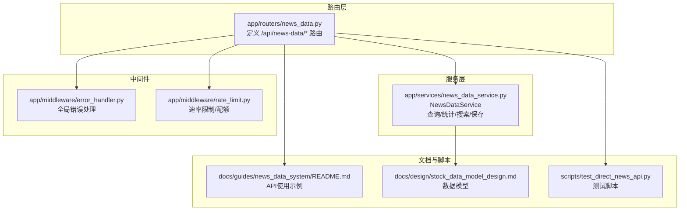
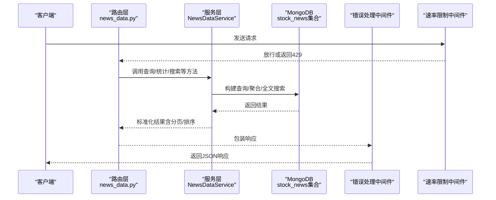
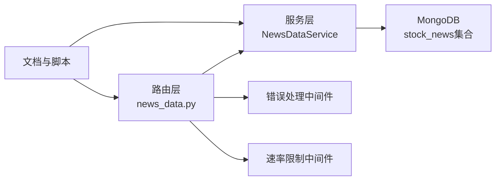

# 新闻获取API

<cite>
**本文引用的文件**
- [app/routers/news_data.py](file://app/routers/news_data.py)
- [app/services/news_data_service.py](file://app/services/news_data_service.py)
- [app/middleware/rate_limit.py](file://app/middleware/rate_limit.py)
- [app/middleware/error_handler.py](file://app/middleware/error_handler.py)
- [docs/guides/news_data_system/README.md](file://docs/guides/news_data_system/README.md)
- [docs/design/stock_data_model_design.md](file://docs/design/stock_data_model_design.md)
- [scripts/test_direct_news_api.py](file://scripts/test_direct_news_api.py)
</cite>

## 目录
1. [简介](#简介)
2. [项目结构](#项目结构)
3. [核心组件](#核心组件)
4. [架构概览](#架构概览)
5. [详细组件分析](#详细组件分析)
6. [依赖分析](#依赖分析)
7. [性能考虑](#性能考虑)
8. [故障排查指南](#故障排查指南)
9. [结论](#结论)
10. [附录](#附录)

## 简介
本文件面向“新闻获取API”的使用者与维护者，系统化梳理与该API相关的路由、服务层、数据模型、分页机制、错误处理与限流策略，并给出请求示例与响应结构说明，帮助快速理解与正确使用 GET /api/news-data/latest 与 GET /api/news-data/query/{symbol} 端点。

## 项目结构
围绕新闻API的关键模块分布如下：
- 路由层：负责接收HTTP请求、解析查询参数、调用服务层并返回统一响应包装。
- 服务层：封装数据库查询、索引保证、数据标准化、全文检索、统计聚合等业务逻辑。
- 中间件：统一错误处理与速率限制。
- 文档与脚本：提供API使用示例、数据模型设计与测试脚本。

图表来源
- [app/routers/news_data.py](file://app/routers/news_data.py#L1-L120)
- [app/services/news_data_service.py](file://app/services/news_data_service.py#L1-L120)
- [app/middleware/error_handler.py](file://app/middleware/error_handler.py#L1-L89)
- [app/middleware/rate_limit.py](file://app/middleware/rate_limit.py#L1-L177)
- [docs/guides/news_data_system/README.md](file://docs/guides/news_data_system/README.md#L120-L220)
- [docs/design/stock_data_model_design.md](file://docs/design/stock_data_model_design.md#L204-L233)
- [scripts/test_direct_news_api.py](file://scripts/test_direct_news_api.py#L136-L182)

章节来源
- [app/routers/news_data.py](file://app/routers/news_data.py#L1-L120)
- [app/services/news_data_service.py](file://app/services/news_data_service.py#L1-L120)
- [docs/guides/news_data_system/README.md](file://docs/guides/news_data_system/README.md#L120-L220)

## 核心组件
- 路由层（FastAPI Router）
  - 提供 GET /api/news-data/latest（获取最新新闻）
  - 提供 GET /api/news-data/query/{symbol}（按股票代码查询新闻）
  - 提供 POST /api/news-data/query（高级查询）
  - 提供 GET /api/news-data/search（全文搜索）
  - 提供 GET /api/news-data/statistics（统计）
  - 提供 POST /api/news-data/sync/start（后台同步任务）
  - 提供 POST /api/news-data/sync/single（同步单只股票）
  - 提供 DELETE /api/news-data/cleanup（清理过期新闻）
  - 提供 GET /api/news-data/health（健康检查）

- 服务层（NewsDataService）
  - 索引保障：确保唯一索引、时间索引、股票代码索引、分类/情感/重要性索引等
  - 查询：支持 symbol/symbols、时间范围、分类、情感、重要性、数据源、关键词（全文）等过滤
  - 分页：skip/limit 控制
  - 排序：默认按发布时间降序
  - 统计：情感分布、重要性分布、类别分布、来源分布
  - 搜索：全文搜索，按相关性排序
  - 保存：批量 upsert，基于 URL+标题+发布时间去重

- 中间件
  - 错误处理：捕获异常并返回标准化错误响应（400/403/404/500）
  - 速率限制：按用户/端点维度计数，超过阈值返回 429

章节来源
- [app/routers/news_data.py](file://app/routers/news_data.py#L183-L269)
- [app/services/news_data_service.py](file://app/services/news_data_service.py#L457-L580)
- [app/middleware/error_handler.py](file://app/middleware/error_handler.py#L15-L89)
- [app/middleware/rate_limit.py](file://app/middleware/rate_limit.py#L15-L96)

## 架构概览
下图展示了从客户端到数据库的典型调用链路，以及错误处理与限流的介入点。

图表来源
- [app/routers/news_data.py](file://app/routers/news_data.py#L183-L269)
- [app/services/news_data_service.py](file://app/services/news_data_service.py#L457-L580)
- [app/middleware/error_handler.py](file://app/middleware/error_handler.py#L15-L89)
- [app/middleware/rate_limit.py](file://app/middleware/rate_limit.py#L15-L96)

## 详细组件分析

### GET /api/news-data/latest（获取最新新闻）
- 功能：按时间窗口获取最新新闻，支持按股票代码过滤。
- 查询参数
  - symbol: 可选；为空则返回全部新闻
  - limit: 数量限制，默认值见路由定义
  - hours_back: 回溯小时数，默认值见路由定义
- 默认值
  - limit=10
  - hours_back=24
- 响应结构
  - data.symbol: 股票代码或空
  - data.limit: 请求的limit
  - data.hours_back: 请求的hours_back
  - data.total_count: 返回条数
  - data.news: 新闻数组，元素字段见“数据模型”小节
- 实现要点
  - 路由层计算起始时间并调用服务层的 get_latest_news
  - 服务层构造 NewsQueryParams 并复用 query_news 实现分页与排序
  - 返回统一包装的 ok 响应

章节来源
- [app/routers/news_data.py](file://app/routers/news_data.py#L183-L226)
- [app/services/news_data_service.py](file://app/services/news_data_service.py#L552-L580)

### GET /api/news-data/query/{symbol}（按股票代码查询新闻）
- 功能：查询某只股票在指定时间窗口内的新闻，支持按类别/情感过滤。
- 查询参数
  - hours_back: 回溯小时数，默认值见路由定义
  - limit: 数量限制，默认值见路由定义
  - category: 新闻类别过滤
  - sentiment: 情绪过滤
- 默认值
  - hours_back=24
  - limit=20
- 响应结构
  - data.symbol: 股票代码
  - data.hours_back: 请求的hours_back
  - data.total_count: 返回条数
  - data.news: 新闻数组，元素字段见“数据模型”小节
  - data.data_source: 数据来源（database/realtime）
- 实现要点
  - 路由层构建起始时间与 NewsQueryParams
  - 先从数据库查询，若无数据则实时拉取并保存后再查询
  - 返回统一包装的 ok 响应

章节来源
- [app/routers/news_data.py](file://app/routers/news_data.py#L43-L126)
- [app/services/news_data_service.py](file://app/services/news_data_service.py#L457-L547)

### POST /api/news-data/query（高级查询）
- 功能：支持多股票、时间范围、类别、情感、重要性、数据源、关键词（全文）等复杂过滤。
- 请求体字段
  - symbol: 可选
  - symbols: 可选（数组）
  - start_time/end_time: 可选
  - category/sentiment/importance/data_source: 可选
  - keywords: 可选（数组）
  - limit/skip: 可选
- 响应结构
  - data.query_params: 原样返回请求参数
  - data.total_count: 返回条数
  - data.news: 新闻数组

章节来源
- [app/routers/news_data.py](file://app/routers/news_data.py#L133-L181)
- [app/services/news_data_service.py](file://app/services/news_data_service.py#L457-L547)

### GET /api/news-data/search（全文搜索）
- 功能：对新闻标题/内容/摘要进行全文搜索，可按股票代码过滤。
- 查询参数
  - query: 关键词
  - symbol: 可选
  - limit: 可选
- 响应结构
  - data.query: 搜索词
  - data.symbol: 过滤股票代码
  - data.total_count: 返回条数
  - data.news: 新闻数组

章节来源
- [app/routers/news_data.py](file://app/routers/news_data.py#L228-L269)
- [app/services/news_data_service.py](file://app/services/news_data_service.py#L711-L755)

### GET /api/news-data/statistics（统计）
- 功能：统计情感分布、重要性分布、类别分布、来源分布。
- 查询参数
  - symbol: 可选
  - days_back: 回溯天数，默认值见路由定义
- 响应结构
  - data.symbol: 股票代码
  - data.days_back: 回溯天数
  - data.statistics: 统计对象
    - total_count
    - sentiment_distribution: positive/negative/neutral
    - importance_distribution: high/medium/low
    - categories: 类别计数
    - sources: 数据源计数

章节来源
- [app/routers/news_data.py](file://app/routers/news_data.py#L272-L327)
- [app/services/news_data_service.py](file://app/services/news_data_service.py#L581-L682)

### 数据模型与字段说明
- 文档集合：stock_news
- 关键字段
  - symbol/full_symbol/market/symbols: 股票相关标识
  - title/content/summary/url/source/author: 新闻内容与来源
  - publish_time: 发布时间
  - category/sentiment/sentiment_score/keywords/importance: 分类与标签
  - data_source/language/created_at/updated_at/version: 元数据
- 示例参考
  - 参考文档中的示例结构，字段与上述一致

章节来源
- [docs/design/stock_data_model_design.md](file://docs/design/stock_data_model_design.md#L204-L233)

### 分页机制与最佳实践
- 分页控制
  - skip/limit：服务层通过 skip(params.skip).limit(params.limit) 实现
  - 默认排序：按 publish_time 降序
- 最佳实践
  - 使用 hours_back/limit 控制返回规模
  - 对高频查询建立合适索引（服务层已确保必要索引）
  - 避免过大的 skip，建议使用“游标式”分页（基于上次结果的时间戳）以减少偏移成本

章节来源
- [app/services/news_data_service.py](file://app/services/news_data_service.py#L457-L547)

### 错误处理与HTTP状态码
- 400（参数校验错误）：由错误处理中间件捕获 ValueError 并返回
- 403（权限不足）：由错误处理中间件捕获 PermissionError 并返回
- 404（资源不存在）：由错误处理中间件捕获 FileNotFoundError 并返回
- 429（请求过于频繁）：由速率限制中间件在超过端点阈值时返回
- 500（服务器内部错误）：其他未捕获异常统一返回

章节来源
- [app/middleware/error_handler.py](file://app/middleware/error_handler.py#L15-L89)
- [app/middleware/rate_limit.py](file://app/middleware/rate_limit.py#L15-L96)

### 限流策略
- 速率限制
  - 按用户ID或IP维度，针对特定端点设置不同阈值
  - 默认阈值可配置，端点阈值可在中间件中调整
- 配额限制
  - 可选的每日配额中间件，对指定端点进行配额控制

章节来源
- [app/middleware/rate_limit.py](file://app/middleware/rate_limit.py#L15-L177)

### 实际请求示例与响应要点
- 获取最新新闻（市场/个股）
  - GET /api/news-data/latest?symbol=000001&limit=10&hours_back=24
  - GET /api/news-data/latest?limit=20&hours_back=24
- 查询股票新闻
  - GET /api/news-data/query/000001?hours_back=24&limit=20&category=company_announcement
- 高级查询
  - POST /api/news-data/query（请求体包含 symbol/symbols、start_time/end_time、category、sentiment、importance、keywords、limit、skip）
- 全文搜索
  - GET /api/news-data/search?query=银行&symbol=000001&limit=20
- 统计
  - GET /api/news-data/statistics?symbol=000001&days_back=7

章节来源
- [docs/guides/news_data_system/README.md](file://docs/guides/news_data_system/README.md#L120-L220)

## 依赖分析
- 路由层依赖服务层提供的 NewsDataService 实例
- 服务层依赖 MongoDB 集合 stock_news，确保必要索引
- 中间件在路由层之前生效，统一拦截异常与限流
- 文档与脚本提供使用示例与数据模型参考

图表来源
- [app/routers/news_data.py](file://app/routers/news_data.py#L1-L120)
- [app/services/news_data_service.py](file://app/services/news_data_service.py#L1-L120)
- [app/middleware/error_handler.py](file://app/middleware/error_handler.py#L1-L89)
- [app/middleware/rate_limit.py](file://app/middleware/rate_limit.py#L1-L177)
- [docs/guides/news_data_system/README.md](file://docs/guides/news_data_system/README.md#L120-L220)

## 性能考虑
- 索引优化：服务层已确保唯一索引、时间索引、股票代码索引、分类/情感/重要性索引等，有助于快速过滤与排序
- 批量写入：保存新闻时使用 bulk_write，提高入库效率
- 文本搜索：全文索引支持按关键词检索，按相关性排序
- 建议
  - 对高频查询增加复合索引（如 symbol+publish_time）
  - 使用 limit 控制返回规模，避免全表扫描
  - 对大偏移 skip 的场景，考虑基于时间戳的游标式分页

章节来源
- [app/services/news_data_service.py](file://app/services/news_data_service.py#L92-L138)
- [docs/guides/news_data_system/README.md](file://docs/guides/news_data_system/README.md#L307-L319)

## 故障排查指南
- 404 未找到
  - 可能原因：资源不存在或路径错误
  - 处理建议：确认端点路径与参数拼写
- 429 限流
  - 可能原因：超过端点阈值
  - 处理建议：降低请求频率或联系管理员调整阈值
- 500 内部错误
  - 可能原因：数据库异常、序列化错误（如 ObjectId 未转换）
  - 处理建议：查看服务日志；服务层已内置 ObjectId 转字符串逻辑，确保返回前转换
- ObjectId 序列化错误
  - 现象：返回 JSON 时 ObjectId 无法序列化
  - 处理建议：服务层在返回前已转换 ObjectId 为字符串；若仍出现，检查上游调用是否绕过了服务层

章节来源
- [app/middleware/error_handler.py](file://app/middleware/error_handler.py#L15-L89)
- [app/middleware/rate_limit.py](file://app/middleware/rate_limit.py#L15-L96)
- [app/services/news_data_service.py](file://app/services/news_data_service.py#L18-L38)
- [docs/fixes/mongodb_objectid_serialization_fix.md](file://docs/fixes/mongodb_objectid_serialization_fix.md#L1-L133)

## 结论
- GET /api/news-data/latest 适合快速获取最新新闻，支持按股票代码过滤
- GET /api/news-data/query/{symbol} 适合个股新闻的快速查询，支持类别与情感过滤
- POST /api/news-data/query 提供高级过滤能力，满足复杂业务场景
- 服务层提供完善的索引、分页、排序、全文搜索与统计能力
- 中间件统一处理错误与限流，保障系统稳定与安全

## 附录

### A. 查询参数与默认值对照
- GET /api/news-data/latest
  - symbol: 可选
  - limit: 默认值见路由定义
  - hours_back: 默认值见路由定义
- GET /api/news-data/query/{symbol}
  - hours_back: 默认值见路由定义
  - limit: 默认值见路由定义
  - category: 可选
  - sentiment: 可选
- POST /api/news-data/query
  - symbol/symbols/start_time/end_time/category/sentiment/importance/data_source/keywords/limit/skip

章节来源
- [app/routers/news_data.py](file://app/routers/news_data.py#L43-L126)
- [app/routers/news_data.py](file://app/routers/news_data.py#L133-L181)
- [app/routers/news_data.py](file://app/routers/news_data.py#L183-L226)

### B. 响应数据结构要点
- 通用包装
  - data: 具体业务数据
  - message: 说明信息
- GET /api/news-data/latest
  - data.symbol/data.limit/data.hours_back/data.total_count/data.news
- GET /api/news-data/query/{symbol}
  - data.symbol/data.hours_back/data.total_count/data.news/data.data_source
- POST /api/news-data/query
  - data.query_params/data.total_count/data.news
- GET /api/news-data/search
  - data.query/data.symbol/data.total_count/data.news
- GET /api/news-data/statistics
  - data.symbol/data.days_back/data.statistics.*

章节来源
- [app/routers/news_data.py](file://app/routers/news_data.py#L183-L327)

### C. 实际请求示例
- 获取最新新闻（个股）
  - GET /api/news-data/latest?symbol=000001&limit=10&hours_back=24
- 获取最新新闻（市场）
  - GET /api/news-data/latest?limit=20&hours_back=24
- 查询股票新闻
  - GET /api/news-data/query/000001?hours_back=24&limit=20&category=company_announcement
- 高级查询
  - POST /api/news-data/query（携带 symbol/symbols、start_time/end_time、category、sentiment、importance、keywords、limit、skip）
- 全文搜索
  - GET /api/news-data/search?query=银行&symbol=000001&limit=20
- 统计
  - GET /api/news-data/statistics?symbol=000001&days_back=7

章节来源
- [docs/guides/news_data_system/README.md](file://docs/guides/news_data_system/README.md#L120-L220)

### D. 测试脚本参考
- 脚本展示了如何直接调用第三方新闻接口，便于理解数据格式与字段映射

章节来源
- [scripts/test_direct_news_api.py](file://scripts/test_direct_news_api.py#L136-L182)