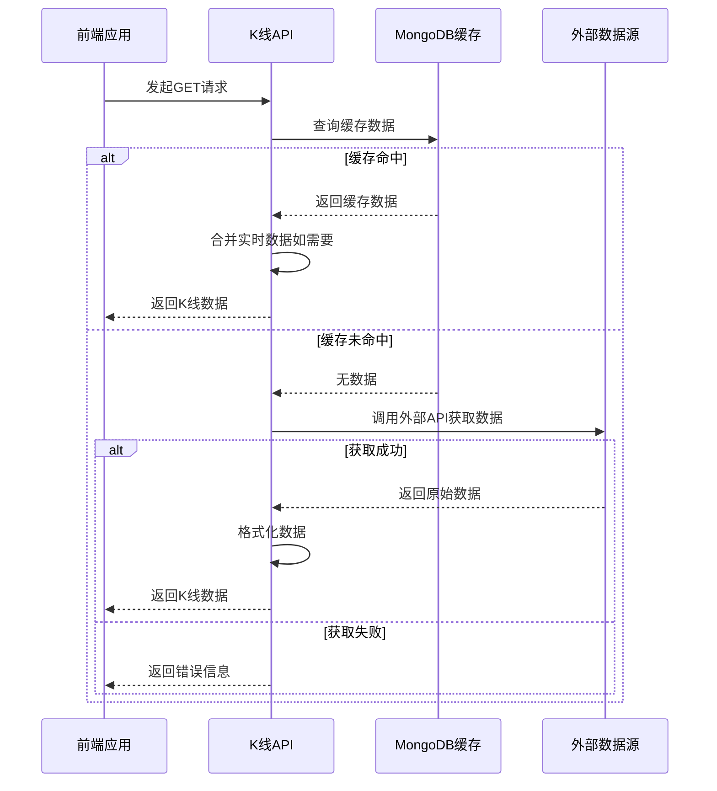
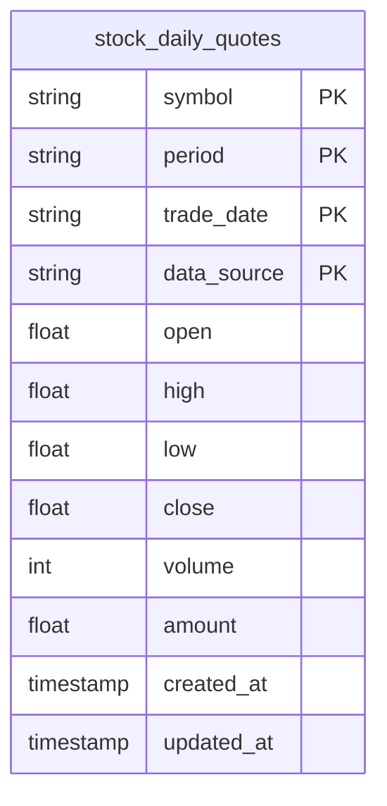
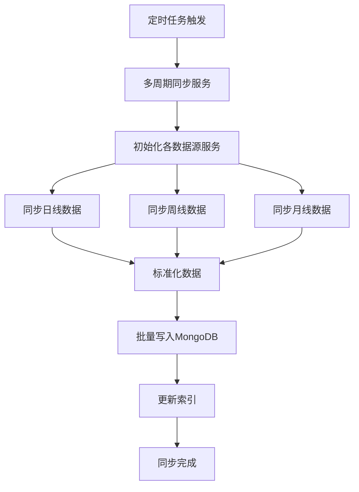

# 历史K线API

<cite>
**本文档引用文件**  
- [stocks.py](file://app/routers/stocks.py)
- [historical_data_service.py](file://app/services/historical_data_service.py)
- [multi_period_sync_service.py](file://app/worker/multi_period_sync_service.py)
- [mongodb_cache_adapter.py](file://tradingagents/dataflows/cache/mongodb_cache_adapter.py)
- [stocks.ts](file://frontend/src/api/stocks.ts)
- [Detail.vue](file://frontend/src/views/Stocks/Detail.vue)
- [foreign_stock_service.py](file://app/services/foreign_stock_service.py)
</cite>

## 目录
1. [简介](#简介)
2. [API端点](#api端点)
3. [请求参数详解](#请求参数详解)
4. [响应数据结构](#响应数据结构)
5. [数据周期与数据源支持](#数据周期与数据源支持)
6. [长时间范围请求处理](#长时间范围请求处理)
7. [多周期同步服务](#多周期同步服务)
8. [数据缓存机制](#数据缓存机制)
9. [前端调用示例](#前端调用示例)
10. [错误处理指南](#错误处理指南)

## 简介
历史K线API（`GET /api/stocks/kline`）是系统中用于获取股票历史价格数据的核心接口。该接口支持多种时间周期（如分钟线、日线、周线）的K线数据查询，为技术分析、图表展示和投资决策提供基础数据支持。系统通过后台多周期同步服务预先获取并存储历史数据，结合MongoDB缓存机制，确保API能够快速响应前端请求，同时具备处理数据源无数据、日期范围无效等异常情况的能力。

**Section sources**
- [stocks.py](file://app/routers/stocks.py#L421-L621)

## API端点
该API的端点为 `GET /api/stocks/{code}/kline`，用于获取指定股票的K线数据。

- **HTTP方法**: `GET`
- **路径参数**: `code` (股票代码)
- **认证要求**: 需要Bearer Token进行身份验证
- **功能**: 根据股票代码、周期、数据条数等参数，返回指定时间范围内的历史K线数据。



**Diagram sources**
- [stocks.py](file://app/routers/stocks.py#L421-L621)

## 请求参数详解
该API支持以下请求参数：

| 参数名 | 类型 | 必填 | 描述 | 示例值 |
| :--- | :--- | :--- | :--- | :--- |
| `code` | string | 是 | 股票代码。支持A股（6位数字）、港股（4-5位数字或带.HK后缀）、美股（字母代码）。 | `000001`, `700.HK`, `AAPL` |
| `period` | string | 否 | K线周期。默认为`day`。 | `day`, `week`, `5m` |
| `limit` | integer | 否 | 返回的数据条数。默认为120。 | `120`, `200` |
| `adj` | string | 否 | 复权方式。默认为`none`。 | `none`, `qfq`, `hfq` |
| `force_refresh` | boolean | 否 | 是否强制刷新，跳过缓存。默认为`false`。 | `true`, `false` |

**`period` 参数有效值**:
- **分钟线**: `5m`, `15m`, `30m`, `60m`
- **日线**: `day`
- **周线**: `week`
- **月线**: `month`

**`adj` 参数有效值**:
- `none`: 不复权
- `qfq`: 前复权
- `hfq`: 后复权

**Section sources**
- [stocks.py](file://app/routers/stocks.py#L424-L427)
- [stocks.ts](file://frontend/src/api/stocks.ts#L58-L60)

## 响应数据结构
API返回一个包含K线数据的JSON对象，其结构如下：

```json
{
  "success": true,
  "data": {
    "code": "000001",
    "period": "day",
    "limit": 120,
    "adj": "none",
    "source": "mongodb",
    "items": [
      {
        "time": "2023-10-27",
        "open": 4.5,
        "high": 4.6,
        "low": 4.4,
        "close": 4.55,
        "volume": 1000000,
        "amount": 45000000
      },
      // ... 更多K线数据
    ]
  },
  "message": "",
  "timestamp": "2023-10-27T10:00:00Z"
}
```

**响应体字段说明**:

| 字段名 | 类型 | 描述 |
| :--- | :--- | :--- |
| `code` | string | 股票代码 |
| `period` | string | 请求的K线周期 |
| `limit` | integer | 请求的数据条数 |
| `adj` | string | 请求的复权方式 |
| `source` | string | 数据来源，如`mongodb`、`tushare`、`akshare`等 |
| `items` | array | K线数据数组，按时间倒序排列 |

**`items` 数组中每个对象的字段说明**:

| 字段名 | 类型 | 描述 |
| :--- | :--- | :--- |
| `time` | string | 交易日期，格式为`YYYY-MM-DD` |
| `open` | number | 开盘价 |
| `high` | number | 最高价 |
| `low` | number | 最低价 |
| `close` | number | 收盘价 |
| `volume` | number | 成交量（股） |
| `amount` | number | 成交额（元） |

**Section sources**
- [stocks.py](file://app/routers/stocks.py#L613-L620)
- [stocks.ts](file://frontend/src/api/stocks.ts#L45-L63)

## 数据周期与数据源支持
系统支持多种时间周期的K线数据，并通过不同的数据源获取。

### 支持的周期
- **分钟线**: 5分钟(`5m`)、15分钟(`15m`)、30分钟(`30m`)、60分钟(`60m`)。
- **日线**: `day`。
- **周线**: `week`。
- **月线**: `month`。

### 数据源支持情况
- **A股 (CN)**: 主要通过 `Tushare`、`AKShare`、`BaoStock` 三个数据源获取。系统会根据配置的优先级顺序尝试获取数据。
- **港股 (HK)**: 通过 `Finnhub` API 获取。
- **美股 (US)**: 通过 `Alpha Vantage` 或 `Finnhub` API 获取。

数据在获取后，会经过标准化处理并存储到MongoDB的 `stock_daily_quotes` 集合中，其中 `period` 字段用于区分不同周期的数据。



**Diagram sources**
- [historical_data_service.py](file://app/services/historical_data_service.py#L277-L302)
- [docs/guides/multi_period_historical_data/README.md](file://docs/guides/multi_period_historical_data/README.md#L178-L207)

## 长时间范围请求处理
系统通过以下策略高效处理长时间范围的请求：

1.  **数据分页与限制**: API通过 `limit` 参数限制返回的数据条数，避免一次性返回过多数据导致性能问题。前端通常会分页加载历史数据。
2.  **缓存优先**: 系统优先从MongoDB缓存中读取数据。由于历史数据是预先同步的，查询操作非常快速。
3.  **降级机制**: 如果缓存中没有数据（例如，请求了非常久远且未同步的数据），API会降级到调用外部数据源API（如Tushare）获取数据，并在返回前进行超时保护（10秒）。
4.  **实时数据合并**: 对于日线数据，系统会检查是否在交易时间内。如果是，它会尝试从 `market_quotes` 集合中获取当天的实时行情，并将其合并到历史数据中，以提供最新的K线信息。

**Section sources**
- [stocks.py](file://app/routers/stocks.py#L500-L612)

## 多周期同步服务
为了确保API的高性能和低延迟，系统通过后台的 **多周期同步服务** (`multi_period_sync_service`) 预先获取并存储历史数据。

### 服务关系
历史K线API与多周期同步服务的关系是：**API提供数据查询，同步服务负责数据预加载**。API本身不直接调用外部API获取历史数据，而是优先查询由同步服务预先填充的数据库。

### 工作流程
1.  **定时同步**: 系统通过APScheduler定时任务（如每日收盘后）自动触发同步。
2.  **全量/增量同步**: 支持全历史数据同步和增量同步（仅同步最近几天的数据）。
3.  **多源多周期**: 服务会遍历所有启用的数据源（Tushare, AKShare, BaoStock），并为每个数据源同步指定的周期（日、周、月）。
4.  **数据存储**: 获取到的数据经过标准化处理后，批量存储到MongoDB的 `stock_daily_quotes` 集合中。



**Diagram sources**
- [multi_period_sync_service.py](file://app/worker/multi_period_sync_service.py#L66-L142)
- [docs/guides/multi_period_historical_data/README.md](file://docs/guides/multi_period_historical_data/README.md#L156-L195)

## 数据缓存机制
系统采用多层缓存机制来减少对上游数据源的频繁调用，提高API响应速度。

### 缓存策略
1.  **MongoDB缓存**: 这是主要的缓存层。多周期同步服务将从外部数据源获取的历史数据持久化存储在MongoDB中。API查询时，优先从MongoDB读取，这比实时调用外部API快得多。
2.  **数据源优先级**: 当从MongoDB读取时，系统会根据配置的数据源优先级（如Tushare > AKShare > BaoStock）来选择数据，确保数据质量。
3.  **降级到API**: 只有当MongoDB中没有所需数据时，API才会降级到直接调用外部数据源API，并且有10秒的超时保护，防止因外部API响应慢而阻塞。

### 缓存适配器
`MongoDBCacheAdapter` 是核心的缓存组件，它封装了与MongoDB的交互逻辑，为上层服务提供统一的缓存读取接口。

**Section sources**
- [mongodb_cache_adapter.py](file://tradingagents/dataflows/cache/mongodb_cache_adapter.py#L160-L215)
- [stocks.py](file://app/routers/stocks.py#L501-L529)

## 前端调用示例
以下是前端通过 `stocks.ts` 服务调用历史K线API，并使用ECharts进行可视化的示例。

### 1. API调用
```typescript
import { stocksApi } from '@/api/stocks'

// 获取K线数据
const res = await stocksApi.getKline('000001', 'day', 200, 'none')
const klineData = res.data.items // 获取K线数据数组
```

### 2. ECharts可视化
```javascript
// 在Vue组件的fetchKline方法中
async function fetchKline() {
  try {
    const res = await stocksApi.getKline(code.value, 'day', 200, 'none')
    const items = res.data.items

    // 提取ECharts需要的数据
    const category = items.map(item => item.time)
    const values = items.map(item => [item.open, item.close, item.low, item.high])

    // 配置ECharts选项
    kOption.value = {
      xAxis: { type: 'category', data: category },
      yAxis: { type: 'value' },
      series: [{
        type: 'candlestick',
        name: 'K线',
        data: values
      }]
    }
  } catch (e) {
    console.error('获取K线失败', e)
  }
}
```

**Section sources**
- [stocks.ts](file://frontend/src/api/stocks.ts#L107-L108)
- [Detail.vue](file://frontend/src/views/Stocks/Detail.vue#L763-L806)

## 错误处理指南
系统对常见的错误情况进行了妥善处理。

### 常见错误及处理
| 错误情况 | HTTP状态码 | 响应示例 | 处理建议 |
| :--- | :--- | :--- | :--- |
| **不支持的周期** | `400 Bad Request` | `{"detail": "不支持的period: 2m"}` | 检查 `period` 参数是否为有效值。 |
| **数据源无数据** | `500 Internal Server Error` | `{"detail": "获取K线数据失败: 无数据"}` | 可能是该股票在该周期下确实没有历史数据，或数据源暂时不可用。可尝试其他数据源或稍后重试。 |
| **日期范围无效** | `400 Bad Request` | (由MongoDB查询逻辑处理，通常返回空数组) | 检查 `start_date` 和 `end_date` 参数是否格式正确且逻辑合理。 |
| **外部API超时** | `504 Gateway Timeout` | `{"detail": "获取K线数据超时，请稍后重试"}` | 外部数据源响应过慢，建议稍后重试。 |
| **服务器内部错误** | `500 Internal Server Error` | `{"detail": "获取K线数据失败: ..."}` | 记录错误日志，联系系统管理员。 |

**Section sources**
- [stocks.py](file://app/routers/stocks.py#L447-L448)
- [stocks.py](file://app/routers/stocks.py#L543-L545)
- [stocks.py](file://app/routers/stocks.py#L470-L473)