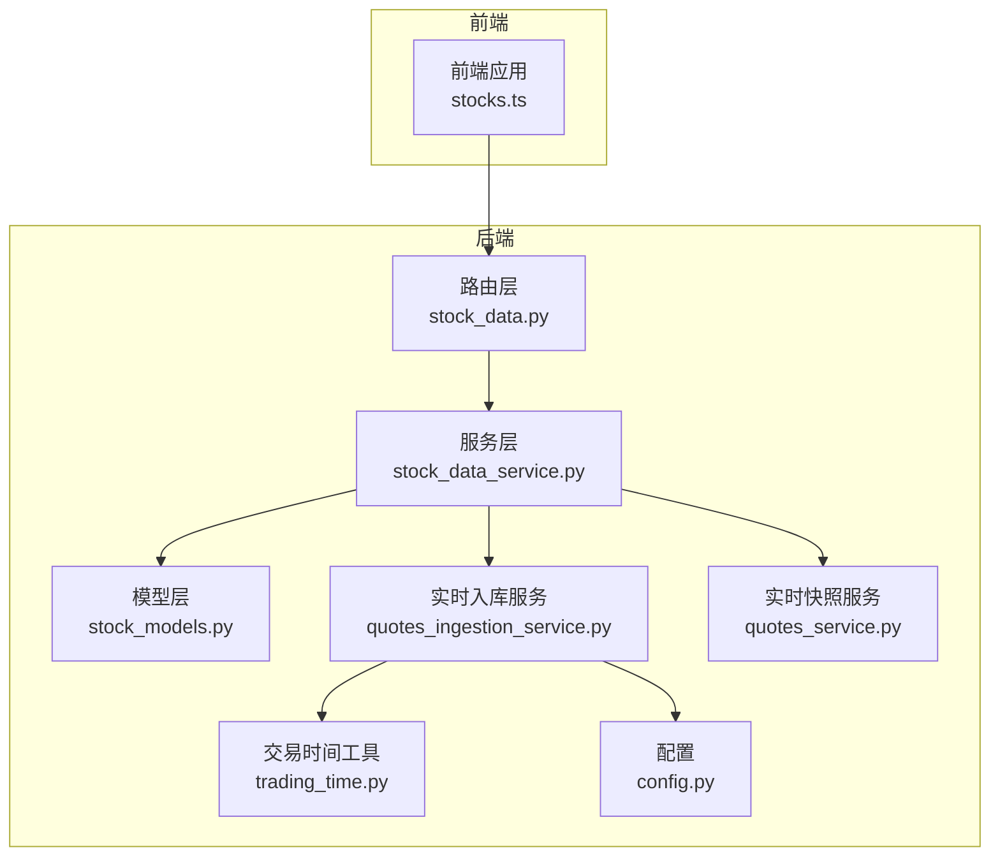
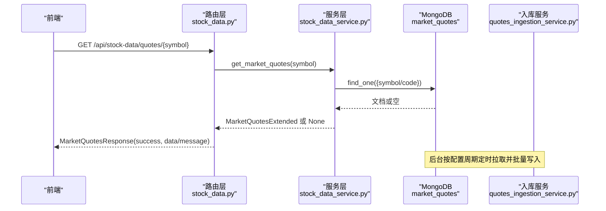
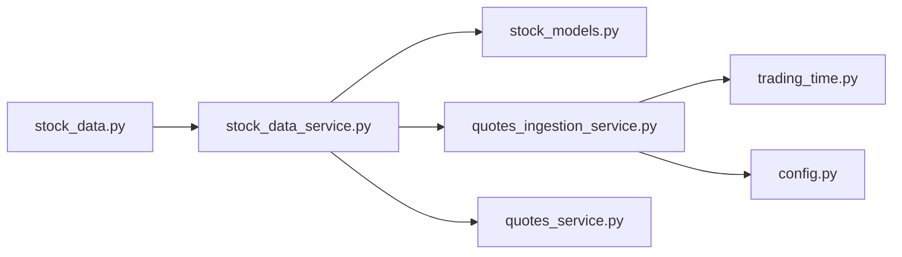

# 实时行情API

<cite>
**本文引用的文件**
- [app/routers/stock_data.py](file://app/routers/stock_data.py)
- [app/services/stock_data_service.py](file://app/services/stock_data_service.py)
- [app/models/stock_models.py](file://app/models/stock_models.py)
- [app/services/quotes_ingestion_service.py](file://app/services/quotes_ingestion_service.py)
- [app/services/quotes_service.py](file://app/services/quotes_service.py)
- [app/utils/trading_time.py](file://app/utils/trading_time.py)
- [app/core/config.py](file://app/core/config.py)
- [docs/analysis/quotes_ingestion_service_analysis.md](file://docs/analysis/quotes_ingestion_service_analysis.md)
- [docs/integration/data-sources/realtime_quotes_data_source.md](file://docs/integration/data-sources/realtime_quotes_data_source.md)
- [docs/guides/websocket_notifications.md](file://docs/guides/websocket_notifications.md)
- [frontend/src/api/stocks.ts](file://frontend/src/api/stocks.ts)
- [app/routers/websocket_notifications.py](file://app/routers/websocket_notifications.py)
- [tests/test_quotes_sync_status.py](file://tests/test_quotes_sync_status.py)
- [tests/test_trading_time_logic.py](file://tests/test_trading_time_logic.py)
</cite>

## 目录
1. [简介](#简介)
2. [项目结构](#项目结构)
3. [核心组件](#核心组件)
4. [架构总览](#架构总览)
5. [详细组件分析](#详细组件分析)
6. [依赖关系分析](#依赖关系分析)
7. [性能与更新频率](#性能与更新频率)
8. [故障排查与错误处理](#故障排查与错误处理)
9. [结论](#结论)
10. [附录](#附录)

## 简介
本文件面向“实时行情API”的使用者与维护者，聚焦于提供最新股票市场数据的接口。重点覆盖：
- 实时报价接口：GET /api/stock-data/quotes/{symbol}
- 请求参数与响应数据结构（最新价、开盘价、最高价、最低价、前收盘价、五档行情、成交额等）
- 实时数据更新频率与潜在延迟
- 后端实时数据拉取机制（quotes_ingestion_service 从 Tushare/AKShare 等数据源批量获取并入库）
- WebSocket 实时推送能力（如存在）
- 前端调用示例（stocks.ts 服务的轮询或订阅方式）
- 市场休市期间的数据状态与错误处理策略

## 项目结构
围绕实时行情API的关键目录与文件：
- 路由层：提供 /api/stock-data/quotes/{symbol} 接口
- 服务层：统一数据访问与标准化
- 模型层：定义响应数据结构
- 数据源与入库：quotes_ingestion_service 与 quotes_service
- 交易时间工具：交易时段判断与缓冲期
- 配置：实时行情采集间隔、轮换、兜底策略等
- 文档与测试：数据源说明、WebSocket 指南、交易时间逻辑测试

图表来源
- [app/routers/stock_data.py](file://app/routers/stock_data.py#L60-L94)
- [app/services/stock_data_service.py](file://app/services/stock_data_service.py#L91-L116)
- [app/models/stock_models.py](file://app/models/stock_models.py#L153-L221)
- [app/services/quotes_ingestion_service.py](file://app/services/quotes_ingestion_service.py#L1-L120)
- [app/services/quotes_service.py](file://app/services/quotes_service.py#L1-L112)
- [app/utils/trading_time.py](file://app/utils/trading_time.py#L1-L178)
- [app/core/config.py](file://app/core/config.py#L161-L184)

章节来源
- [app/routers/stock_data.py](file://app/routers/stock_data.py#L60-L94)
- [app/services/stock_data_service.py](file://app/services/stock_data_service.py#L91-L116)
- [app/models/stock_models.py](file://app/models/stock_models.py#L153-L221)
- [app/services/quotes_ingestion_service.py](file://app/services/quotes_ingestion_service.py#L1-L120)
- [app/services/quotes_service.py](file://app/services/quotes_service.py#L1-L112)
- [app/utils/trading_time.py](file://app/utils/trading_time.py#L1-L178)
- [app/core/config.py](file://app/core/config.py#L161-L184)

## 核心组件
- 路由接口：提供 GET /api/stock-data/quotes/{symbol}，返回 MarketQuotesResponse
- 服务层：StockDataService 从 market_quotes 集合查询并标准化数据
- 模型层：MarketQuotesExtended 定义行情字段（含五档行情、成交量、涨跌额等）
- 实时入库：QuotesIngestionService 定时从 Tushare/AKShare 拉取并批量写入 MongoDB
- 实时快照：QuotesService 提供 AKShare 全市场近实时快照（TTL 缓存）
- 交易时间：is_trading_time 与 _is_trading_time 支持交易时段与收盘后缓冲期
- 配置：QUOTES_INGEST_INTERVAL_SECONDS、QUOTES_ROTATION_ENABLED、兜底开关等

章节来源
- [app/routers/stock_data.py](file://app/routers/stock_data.py#L60-L94)
- [app/services/stock_data_service.py](file://app/services/stock_data_service.py#L91-L116)
- [app/models/stock_models.py](file://app/models/stock_models.py#L153-L221)
- [app/services/quotes_ingestion_service.py](file://app/services/quotes_ingestion_service.py#L1-L120)
- [app/services/quotes_service.py](file://app/services/quotes_service.py#L1-L112)
- [app/utils/trading_time.py](file://app/utils/trading_time.py#L1-L178)
- [app/core/config.py](file://app/core/config.py#L161-L184)

## 架构总览
实时行情API的端到端流程如下：
- 前端调用 GET /api/stock-data/quotes/{symbol}
- 路由层调用 StockDataService.get_market_quotes
- 服务层从 MongoDB market_quotes 查询并标准化为 MarketQuotesExtended
- 若未命中或为空，路由层返回未找到提示
- 后台定时任务（quotes_ingestion_service）按配置周期从 Tushare/AKShare 拉取并批量入库
- 交易时间工具保障交易时段与缓冲期的采集策略

图表来源
- [app/routers/stock_data.py](file://app/routers/stock_data.py#L60-L94)
- [app/services/stock_data_service.py](file://app/services/stock_data_service.py#L91-L116)
- [app/services/quotes_ingestion_service.py](file://app/services/quotes_ingestion_service.py#L597-L675)

## 详细组件分析

### 接口定义与请求/响应
- 接口路径：GET /api/stock-data/quotes/{symbol}
- 请求参数：
  - symbol：6位A股股票代码（支持传入如 000001）
- 响应模型：MarketQuotesResponse.success、MarketQuotesResponse.data（MarketQuotesExtended）
- MarketQuotesExtended 字段要点（节选）：
  - 基础行情：close、pct_chg、amount、open、high、low、pre_close、trade_date、updated_at
  - 扩展字段：current_price、change、volume、turnover_rate、volume_ratio
  - 五档行情：bid_prices、bid_volumes、ask_prices、ask_volumes
  - 时间戳：timestamp
  - 数据源与版本：data_source、data_version

章节来源
- [app/routers/stock_data.py](file://app/routers/stock_data.py#L60-L94)
- [app/models/stock_models.py](file://app/models/stock_models.py#L153-L221)

### 服务层数据访问与标准化
- StockDataService.get_market_quotes：
  - 从 market_quotes 集合按 symbol/code 查询
  - 标准化字段：symbol/code、full_symbol、market、current_price、change、data_source、data_version
  - 返回 MarketQuotesExtended

章节来源
- [app/services/stock_data_service.py](file://app/services/stock_data_service.py#L91-L116)
- [app/models/stock_models.py](file://app/models/stock_models.py#L153-L221)

### 实时数据拉取与入库机制
- QuotesIngestionService.run_once：
  - 交易时间判断与缓冲期处理
  - 接口轮换：Tushare → AKShare东方财富 → AKShare新浪财经
  - Tushare 权限检测与限流（免费用户每小时最多2次）
  - 批量 upsert 写入 market_quotes，包含 code、symbol、close、pct_chg、amount、volume、open、high、low、pre_close、trade_date、updated_at
  - 记录同步状态（成功/失败、数据源、记录数、错误信息）

章节来源
- [app/services/quotes_ingestion_service.py](file://app/services/quotes_ingestion_service.py#L1-L120)
- [app/services/quotes_ingestion_service.py](file://app/services/quotes_ingestion_service.py#L597-L675)
- [docs/analysis/quotes_ingestion_service_analysis.md](file://docs/analysis/quotes_ingestion_service_analysis.md#L331-L446)

### 实时快照服务（用于筛选与富集）
- QuotesService.get_quotes：
  - 通过 AKShare 东方财富全市场 spot 接口获取近实时快照
  - TTL 缓存（默认30秒），仅返回请求的 codes
  - 返回字段：close、pct_chg、amount（标准化处理）

章节来源
- [app/services/quotes_service.py](file://app/services/quotes_service.py#L1-L112)

### 交易时间与休市策略
- is_trading_time 与 _is_trading_time：
  - 交易时段：9:30-11:30、13:00-15:00
  - 收盘后缓冲期：15:00-15:30（确保获取到收盘价）
- 非交易时段策略：
  - QUOTES_BACKFILL_ON_OFFHOURS：非交易时段触发一次性兜底补数（使用实时接口）
  - QUOTES_BACKFILL_ON_STARTUP：启动时兜底补数

章节来源
- [app/utils/trading_time.py](file://app/utils/trading_time.py#L1-L178)
- [app/services/quotes_ingestion_service.py](file://app/services/quotes_ingestion_service.py#L606-L630)
- [app/core/config.py](file://app/core/config.py#L161-L184)
- [tests/test_quotes_sync_status.py](file://tests/test_quotes_sync_status.py#L24-L81)
- [tests/test_trading_time_logic.py](file://tests/test_trading_time_logic.py#L49-L89)

### WebSocket 实时推送（通知通道）
- WebSocket 路由：/api/ws/notifications
- 连接管理：ConnectionManager 维护 user_id -> Set[WebSocket]
- 心跳：每30秒发送 heartbeat
- 通知：优先通过 WebSocket 推送，失败则降级到 Redis PubSub（兼容旧的 SSE 客户端）
- 前端连接示例：前端 stores/notifications.ts 使用当前访问主机地址建立 ws/wss 连接，携带 token 参数

章节来源
- [app/routers/websocket_notifications.py](file://app/routers/websocket_notifications.py#L1-L199)
- [docs/guides/websocket_notifications.md](file://docs/guides/websocket_notifications.md#L98-L355)
- [frontend/src/api/stocks.ts](file://frontend/src/api/stocks.ts#L83-L121)

### 前端调用示例（轮询/订阅）
- 轮询示例：前端 stocks.ts 中 getQuote(symbol) 通过 ApiClient.get 调用 /api/stocks/{symbol}/quote
- 订阅示例：前端 stores/notifications.ts 建立 WebSocket 连接 /api/ws/notifications?token=...
- 注意：实时行情接口为 GET /api/stock-data/quotes/{symbol}，前端示例文件中使用 /api/stocks/{symbol}/quote，两者路径不同，应以后端路由为准

章节来源
- [frontend/src/api/stocks.ts](file://frontend/src/api/stocks.ts#L83-L121)
- [app/routers/stock_data.py](file://app/routers/stock_data.py#L60-L94)

## 依赖关系分析
- 路由层依赖服务层；服务层依赖模型层与数据库；入库服务依赖数据源管理器与交易时间工具；配置驱动入库策略与轮换。

图表来源
- [app/routers/stock_data.py](file://app/routers/stock_data.py#L60-L94)
- [app/services/stock_data_service.py](file://app/services/stock_data_service.py#L91-L116)
- [app/models/stock_models.py](file://app/models/stock_models.py#L153-L221)
- [app/services/quotes_ingestion_service.py](file://app/services/quotes_ingestion_service.py#L1-L120)
- [app/services/quotes_service.py](file://app/services/quotes_service.py#L1-L112)
- [app/utils/trading_time.py](file://app/utils/trading_time.py#L1-L178)
- [app/core/config.py](file://app/core/config.py#L161-L184)

## 性能与更新频率
- 实时行情入库间隔：
  - 默认 360 秒（6分钟）
  - 免费用户建议 ≥ 300 秒
  - 付费用户可设置 5-60 秒以充分利用权限
- 实时快照 TTL：30 秒（用于筛选与富集）
- 接口轮换：Tushare → AKShare东方财富 → AKShare新浪财经，避免单一接口限流
- 休市兜底：非交易时段与启动时触发一次性补数，确保返回最近可用数据

章节来源
- [app/core/config.py](file://app/core/config.py#L161-L184)
- [app/services/quotes_service.py](file://app/services/quotes_service.py#L1-L112)
- [app/services/quotes_ingestion_service.py](file://app/services/quotes_ingestion_service.py#L597-L675)
- [docs/analysis/quotes_ingestion_service_analysis.md](file://docs/analysis/quotes_ingestion_service_analysis.md#L331-L446)

## 故障排查与错误处理
- 未找到数据：
  - 路由层在服务层返回 None 时，返回 MarketQuotesResponse(success=false, message)
- 交易时间判断：
  - 使用 is_trading_time/_is_trading_time 判断是否在交易时段或缓冲期
- 非交易时段行为：
  - QUOTES_BACKFILL_ON_OFFHOURS：触发一次性兜底补数
  - QUOTES_BACKFILL_ON_STARTUP：启动时兜底补数
- Tushare 权限与限流：
  - 首次运行自动检测权限；免费用户每小时最多2次，超过则切换备用接口
- WebSocket 连接：
  - 失败自动重连（指数退避），达到最大重连次数后可降级到 SSE（兼容）

章节来源
- [app/routers/stock_data.py](file://app/routers/stock_data.py#L60-L94)
- [app/utils/trading_time.py](file://app/utils/trading_time.py#L1-L178)
- [app/services/quotes_ingestion_service.py](file://app/services/quotes_ingestion_service.py#L207-L254)
- [docs/guides/websocket_notifications.md](file://docs/guides/websocket_notifications.md#L98-L355)

## 结论
- 实时行情API通过统一的服务层与标准化模型，提供稳定、可扩展的行情数据访问。
- 后台定时任务结合接口轮换与权限检测，确保在不同数据源与限流条件下持续入库。
- 交易时间工具与兜底策略保障休市期间仍能返回最近可用数据。
- WebSocket 通知通道提供实时推送能力，具备自动重连与降级机制。
- 建议前端以 GET /api/stock-data/quotes/{symbol} 为主，结合 WebSocket 订阅通知，实现高效稳定的行情体验。

## 附录

### 数据源与自动切换
- 优先级：Tushare（付费用户可高频）→ AKShare 东方财富 → AKShare 新浪财经
- 自动切换逻辑：按优先级依次尝试，首个成功即返回

章节来源
- [docs/integration/data-sources/realtime_quotes_data_source.md](file://docs/integration/data-sources/realtime_quotes_data_source.md#L1-L60)

### 配置项参考
- QUOTES_INGEST_INTERVAL_SECONDS：实时行情采集间隔（秒）
- QUOTES_ROTATION_ENABLED：启用接口轮换
- QUOTES_BACKFILL_ON_STARTUP / QUOTES_BACKFILL_ON_OFFHOURS：启动/休市兜底开关
- QUOTES_AUTO_DETECT_TUSHARE_PERMISSION：自动检测 Tushare 权限
- TUSHARE_TOKEN/TUSHARE_TIER：Tushare 配置

章节来源
- [app/core/config.py](file://app/core/config.py#L161-L200)