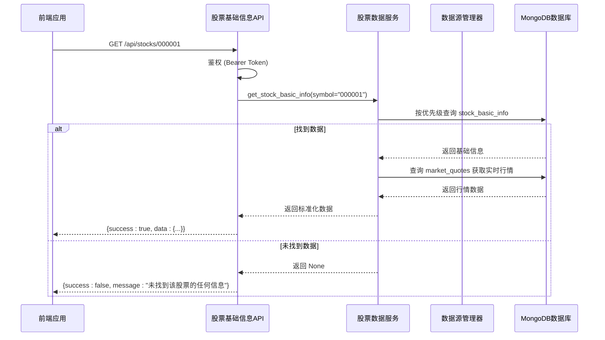
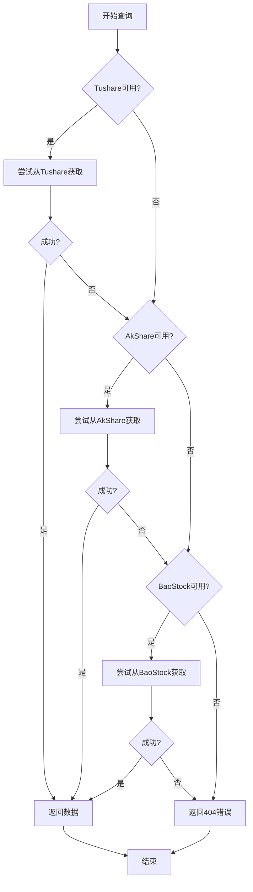

# 股票基础信息API

<cite>
**本文档引用的文件**   
- [stocks.py](file://app/routers/stocks.py)
- [stock_models.py](file://app/models/stock_models.py)
- [stock_data_service.py](file://app/services/stock_data_service.py)
- [unified_config.py](file://app/core/unified_config.py)
- [manager.py](file://app/services/data_sources/manager.py)
- [response.py](file://app/core/response.py)
- [error_handler.py](file://app/middleware/error_handler.py)
- [stocks.ts](file://frontend/src/api/stocks.ts)
</cite>

## 目录
1. [简介](#简介)
2. [核心端点](#核心端点)
3. [请求参数](#请求参数)
4. [响应数据结构](#响应数据结构)
5. [多市场股票代码识别与标准化](#多市场股票代码识别与标准化)
6. [数据源优先级与降级机制](#数据源优先级与降级机制)
7. [缓存策略](#缓存策略)
8. [前端调用示例](#前端调用示例)
9. [错误处理](#错误处理)
10. [总结](#总结)

## 简介
本API文档详细说明了`GET /api/stocks/{symbol}`端点的功能，该端点是获取股票基础信息的核心接口。系统支持A股、港股、美股等多市场股票数据的查询。API设计遵循统一的响应格式，确保了前后端交互的稳定性和一致性。该接口集成了多数据源获取、智能缓存、错误降级等高级特性，为前端应用提供稳定、高效的数据支持。

**Section sources**
- [stocks.py](file://app/routers/stocks.py#L1-L10)

## 核心端点
`GET /api/stocks/{symbol}`端点用于获取指定股票的基础信息。该端点是系统中获取个股数据的入口，它整合了行情、基本面、K线、新闻等多个子服务。API要求所有请求均需携带有效的Bearer Token进行鉴权。端点的响应体遵循统一的包结构，包含`success`、`data`、`message`和`timestamp`四个核心字段，确保了错误处理和成功响应的一致性。



**Diagram sources **
- [stocks.py](file://app/routers/stocks.py#L66-L212)
- [stock_data_service.py](file://app/services/stock_data_service.py#L33-L85)

## 请求参数
### symbol
- **描述**: 股票代码，是路径参数，直接嵌入在URL中。
- **使用方法**: 用户在URL中直接指定股票代码，例如`/api/stocks/000001`。
- **数据验证规则**: 系统通过`_detect_market_and_code`函数自动识别和标准化代码。对于6位数字（如000001）识别为A股，4-5位数字或带.HK后缀（如00700.HK）识别为港股，纯字母代码（如AAPL）识别为美股。代码会自动补全为标准格式。

### market
- **描述**: 市场类型，是可选的查询参数。
- **使用方法**: 在请求URL中以`?market=CN`的形式附加。例如`/api/stocks/AAPL?market=US`。
- **数据验证规则**: 该参数主要用于明确指定查询的市场，避免自动识别错误。其值必须是`CN`、`HK`或`US`之一。如果未提供，系统将根据`symbol`参数自动推断市场类型。

**Section sources**
- [stocks.py](file://app/routers/stocks.py#L66-L68)
- [stocks.py](file://app/routers/stocks.py#L31-L63)

## 响应数据结构
响应体中的`data`字段包含以下核心字段：

| 字段名 | 类型 | 描述 |
| :--- | :--- | :--- |
| `code` | string | 6位标准化的股票代码，如"000001"。 |
| `name` | string | 股票名称，如"平安银行"。 |
| `price` | number | 当前价格（即收盘价）。 |
| `change_percent` | number | 涨跌幅百分比，如1.61。 |
| `amount` | number | 成交额，单位为元。 |
| `volume` | number | 成交量，单位为手。 |
| `turnover_rate` | number | 换手率，百分比。 |
| `total_mv` | number | 总市值，单位为亿元。 |
| `pe` | number | 市盈率。 |
| `pb` | number | 市净率。 |
| `roe` | number | 净资产收益率。 |

**Section sources**
- [stock_models.py](file://app/models/stock_models.py#L54-L119)
- [stocks.py](file://app/routers/stocks.py#L191-L210)

## 多市场股票代码识别与标准化
系统通过`_detect_market_and_code`函数实现多市场股票代码的自动识别与标准化。其逻辑如下：
1.  **港股识别**: 如果代码以`.HK`结尾，则识别为港股，并移除后缀，将代码补全至5位。
2.  **美股识别**: 如果代码由纯字母组成，则识别为美股，代码保持不变。
3.  **A股识别**: 如果代码为6位数字，则识别为A股，代码保持不变。
4.  **默认处理**: 对于无法明确识别的代码，默认当作A股处理，并补全至6位。

此机制确保了用户可以使用多种格式的代码进行查询，系统能自动将其转换为内部统一的标准化格式，极大地提升了用户体验和系统的健壮性。

**Section sources**
- [stocks.py](file://app/routers/stocks.py#L31-L63)

## 数据源优先级与降级机制
系统采用多数据源策略，以确保数据的可用性和准确性。数据源的优先级顺序为：**Tushare > AkShare > BaoStock**。

### 优先级处理机制
1.  **配置来源**: 优先级配置存储在MongoDB的`system_configs`集合中，可通过Web后台动态调整。若数据库中无配置，则使用硬编码的默认优先级。
2.  **查询逻辑**: 当查询股票信息时，系统会按照优先级顺序依次尝试从各数据源获取数据。一旦从某个数据源成功获取到数据，即停止后续尝试，并返回该数据。
3.  **降级逻辑**: 如果首选数据源（如Tushare）因网络问题或API限制而失败，系统会自动降级到次优数据源（如AkShare）进行查询，确保服务不中断。

此机制通过`DataSourceManager`类实现，它管理着`TushareAdapter`、`AKShareAdapter`和`BaoStockAdapter`等多个适配器，并根据优先级调度它们。



**Diagram sources **
- [unified_config.py](file://app/core/unified_config.py#L259-L325)
- [manager.py](file://app/services/data_sources/manager.py#L25-L37)

## 缓存策略
该接口利用Redis和MongoDB实现高性能缓存，以减少对上游数据源API的调用频率，提高响应速度。

- **缓存后端**: 系统优先使用Redis作为缓存后端，因为它具有极高的读写性能。如果Redis不可用，则会自动降级到使用MongoDB进行缓存。
- **缓存有效期**: 缓存的有效期（TTL）由系统配置决定，通常为几分钟到几小时，具体取决于数据的更新频率。例如，实时行情数据的缓存时间较短，而基础信息的缓存时间较长。
- **缓存键**: 缓存键通常由数据源类型和查询参数（如股票代码）组合而成，确保数据的唯一性。
- **缓存清理**: 系统提供了`/api/cache/clear`端点，允许管理员手动清理缓存。同时，系统也会定期清理过期的缓存数据。

**Section sources**
- [unified_config.py](file://app/core/unified_config.py#L408-L436)
- [manager.py](file://app/services/data_sources/manager.py#L202-L218)

## 前端调用示例
以下是在Vue组件中通过`stocks.ts`服务获取并展示个股基础信息的示例代码：

```typescript
import { stocksApi } from '@/api/stocks'

export default {
  data() {
    return {
      stockData: null,
      loading: false
    }
  },
  async mounted() {
    this.loading = true
    try {
      // 调用API获取平安银行(000001)的行情数据
      const response = await stocksApi.getQuote('000001')
      if (response.success) {
        this.stockData = response.data
      } else {
        this.$message.error(response.message)
      }
    } catch (error) {
      this.$message.error('获取数据失败')
    } finally {
      this.loading = false
    }
  }
}
```

**Section sources**
- [stocks.ts](file://frontend/src/api/stocks.ts#L83-L90)

## 错误处理
当发生错误时，API会返回标准化的错误响应。

- **股票代码不存在**: 如果系统无法找到任何关于该股票的信息，会返回HTTP 404状态码，响应体为`{success: false, message: "未找到该股票的任何信息"}`。
- **所有数据源均不可用**: 如果所有配置的数据源都尝试失败，同样会返回HTTP 404错误。
- **服务器内部错误**: 如果在数据获取或处理过程中发生未知异常，会返回HTTP 500状态码，响应体为`{success: false, message: "服务器内部错误，请稍后重试"}`。

前端应用应根据`success`字段的值来判断请求是否成功，并根据`message`字段向用户展示友好的错误提示。

**Section sources**
- [stocks.py](file://app/routers/stocks.py#L149-L150)
- [error_handler.py](file://app/middleware/error_handler.py#L77-L88)

## 总结
`GET /api/stocks/{symbol}`端点是一个功能强大且健壮的API，它通过智能的代码识别、灵活的数据源优先级、高效的缓存策略和清晰的错误处理，为前端应用提供了可靠的股票数据服务。开发者可以放心地集成此API，为用户提供实时、准确的金融信息。