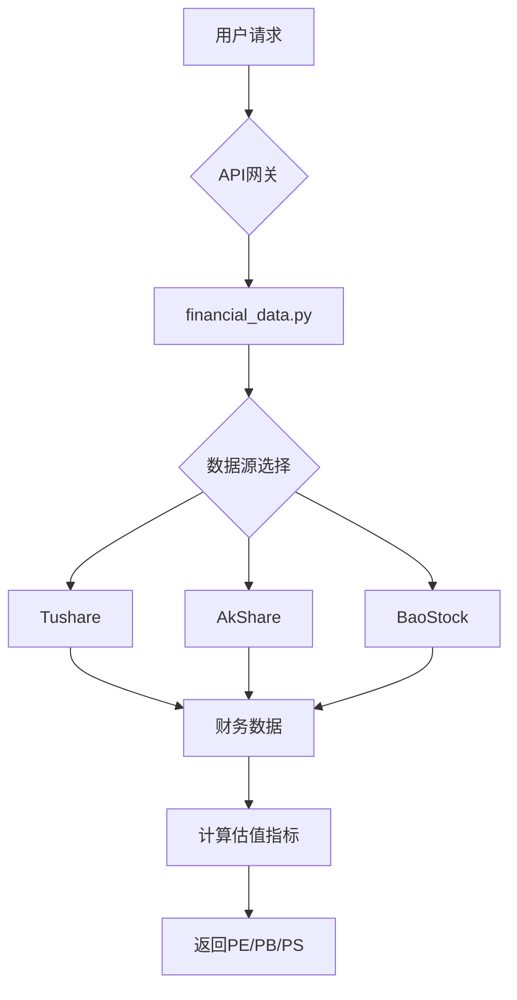
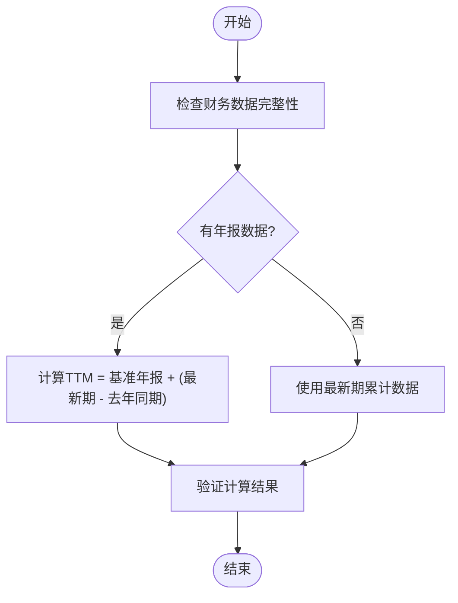
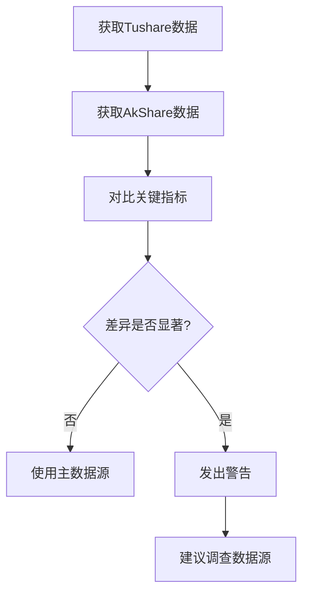

# 估值数据API

<cite>
**本文档引用文件**   
- [optimized_china_data.py](file://tradingagents/dataflows/optimized_china_data.py)
- [financial_data_service.py](file://app/services/financial_data_service.py)
- [financial_data.py](file://app/routers/financial_data.py)
- [stock_data.py](file://app/routers/stock_data.py)
- [realtime_metrics.py](file://tradingagents/dataflows/realtime_metrics.py)
- [file_cache.py](file://tradingagents/dataflows/cache/file_cache.py)
- [data_consistency_checker.py](file://app/services/data_consistency_checker.py)
</cite>

## 目录
1. [引言](#引言)
2. [估值指标获取方式](#估值指标获取方式)
3. [TTM计算逻辑](#ttm计算逻辑)
4. [实时股价与财务数据关联机制](#实时股价与财务数据关联机制)
5. [估值指标刷新策略](#估值指标刷新策略)
6. [多数据源一致性校验流程](#多数据源一致性校验流程)
7. [缓存策略与降级处理](#缓存策略与降级处理)
8. [代码示例](#代码示例)
9. [结论](#结论)

## 引言
本项目提供了一套全面的估值数据API，旨在为用户提供准确、实时的股票估值指标。系统支持PE（市盈率）、PB（市净率）、PS（市销率）等核心估值指标的计算与获取。通过集成Tushare、AkShare、BaoStock等多个数据源，系统实现了数据的冗余备份与优先级管理，确保在单一数据源失效时仍能提供可靠的数据服务。API设计遵循RESTful原则，提供清晰的端点用于查询财务数据、同步数据以及获取最新估值指标。系统还实现了智能缓存机制，有效降低了对上游数据源的API调用频率，提升了响应速度和用户体验。

**Section sources**
- [financial_data.py](file://app/routers/financial_data.py#L1-L307)

## 估值指标获取方式
估值指标的获取主要通过`financial_data`模块提供的API实现。系统支持从多个数据源获取财务数据，并根据预设的优先级进行整合。核心估值指标包括PE（市盈率）、PB（市净率）和PS（市销率），这些指标的计算依赖于从财务报表中提取的净利润、净资产和营业收入等关键数据。API端点`/api/financial-data/query/{symbol}`用于查询指定股票的财务数据，支持按报告期、数据源和报告类型进行筛选。查询结果以JSON格式返回，包含完整的财务指标列表，用户可直接用于投资分析。



**Diagram sources**
- [financial_data.py](file://app/routers/financial_data.py#L49-L87)

**Section sources**
- [financial_data.py](file://app/routers/financial_data.py#L49-L87)
- [financial_data_service.py](file://app/services/financial_data_service.py#L164-L216)

## TTM计算逻辑
TTM（滚动市盈率）的计算逻辑是系统的核心功能之一。系统通过获取最近四个季度的财务数据来计算TTM指标。具体实现中，`_calculate_ttm_metric`函数负责从财务数据中提取最近四个季度的净利润或营业收入，并进行累加。计算过程首先检查是否有完整的年报数据作为基准，然后通过“基准年报 + (最新期累计 - 去年同期累计)”的公式计算TTM值。例如，对于2025年第三季度的TTM净利润，计算公式为：2024年年报净利润 + (2025年Q3累计净利润 - 2024年Q3累计净利润)。该逻辑确保了TTM指标的准确性，避免了因使用单期数据而导致的估值偏差。



**Diagram sources**
- [optimized_china_data.py](file://tradingagents/dataflows/optimized_china_data.py#L120-L129)

**Section sources**
- [optimized_china_data.py](file://tradingagents/dataflows/optimized_china_data.py#L120-L129)
- [test_akshare_ttm_calculation.py](file://scripts/test_akshare_ttm_calculation.py#L53-L117)

## 实时股价与财务数据关联机制
实时股价与财务数据的关联机制是实现动态估值的关键。系统通过`market_quotes`集合获取股票的实时行情数据，包括当前价格、昨日收盘价等。同时，从`stock_basic_info`和`stock_financial_data`集合中获取公司的财务数据，如总股本、总资产、总负债等。这两类数据在`calculate_realtime_pe_pb`函数中进行关联计算。系统首先判断`stock_basic_info`的更新时间，如果已在当天收盘后更新，则直接使用其数据；否则，基于实时股价和昨日收盘价重新计算总股本，进而计算实时市值和估值指标。这种机制确保了盘中估值的准确性。

**Section sources**
- [realtime_metrics.py](file://tradingagents/dataflows/realtime_metrics.py#L65-L77)
- [blog/2025-10-28-realtime-pe-pb-calculation-with-fallback-strategy.md](file://docs/blog/2025-10-28-realtime-pe-pb-calculation-with-fallback-strategy.md#L46-L77)

## 估值指标刷新策略
估值指标的刷新策略结合了定时任务和实时计算两种方式。系统通过后台任务定期从Tushare、AkShare等数据源同步最新的财务数据，并存储到MongoDB数据库中。对于实时性要求高的场景，系统在用户请求时动态计算估值指标。具体策略如下：首先检查`stock_basic_info`的更新时间，如果在当天15:00后已更新，则直接使用其静态PE/PB值；否则，调用`calculate_realtime_pe_pb`函数，基于`market_quotes`的实时股价重新计算。此外，系统还实现了智能降级策略，当实时计算失败时，会降级到使用Tushare的静态PE/PB值，确保始终能返回有效数据。

**Section sources**
- [realtime_metrics.py](file://tradingagents/dataflows/realtime_metrics.py#L207-L228)
- [blog/2025-10-28-realtime-pe-pb-calculation-with-fallback-strategy.md](file://docs/blog/2025-10-28-realtime-pe-pb-calculation-with-fallback-strategy.md#L194-L229)

## 多数据源一致性校验流程
多数据源环境下，系统通过`DataConsistencyChecker`服务进行数据一致性校验。该流程首先从不同数据源（如Tushare、AkShare）获取同一股票的财务数据，然后对比关键指标（如净利润、营业收入）的差异。系统根据差异的大小和置信度分数，推荐相应的处理策略。如果数据高度一致，则使用主数据源的数据；如果存在显著差异，则发出警告并建议调查数据源问题。数据源的优先级顺序为：Tushare > AkShare > BaoStock，该顺序可在系统配置中动态调整。此机制确保了在数据冲突时，系统能优先选择最可靠的数据源。



**Diagram sources**
- [data_consistency_checker.py](file://app/services/data_consistency_checker.py#L270-L288)
- [fixes/2025-10-30-data-source-priority-fixes.md](file://docs/fixes/2025-10-30-data-source-priority-fixes.md#L33-L34)

**Section sources**
- [data_consistency_checker.py](file://app/services/data_consistency_checker.py#L270-L288)
- [fixes/2025-10-30-data-source-priority-fixes.md](file://docs/fixes/2025-10-30-data-source-priority-fixes.md#L33-L34)

## 缓存策略与降级处理
系统采用多层次的缓存策略以提升性能和可靠性。缓存架构分为三层：Redis（内存缓存）、MongoDB（持久化缓存）和文件系统（降级缓存）。当用户请求数据时，系统首先尝试从Redis获取，未命中则查找MongoDB，最后降级到文件缓存。缓存的有效期（TTL）根据数据类型和市场自动确定，例如A股数据缓存1小时，美股数据缓存2小时。在数据源不可用时，系统会自动降级到其他可用数据源或返回缓存中的旧数据。例如，当Tushare API调用失败时，系统会尝试从AkShare获取数据，若所有数据源均不可用，则返回过期的缓存数据并标注“数据可能不准确”。

**Section sources**
- [file_cache.py](file://tradingagents/dataflows/cache/file_cache.py#L239-L262)
- [blog/2025-11-11-us-data-source-and-cache-system-overhaul.md](file://docs/blog/2025-11-11-us-data-source-and-cache-system-overhaul.md#L123-L132)

## 代码示例
以下代码示例展示了如何获取股票的实时估值数据并进行投资分析。首先，通过`get_financial_data_service`获取财务数据服务实例，然后调用`get_latest_financial_data`方法获取最新财务数据。接着，结合实时股价计算PE_TTM和PB等指标。最后，根据计算结果生成投资建议。

```python
# 获取财务数据服务
service = await get_financial_data_service()

# 获取最新财务数据
financial_data = await service.get_latest_financial_data(symbol="000001", data_source="tushare")

# 获取实时股价
realtime_price = await get_realtime_price("000001")

# 计算PE_TTM
if financial_data and financial_data.get("net_profit"):
    ttm_net_profit = financial_data["net_profit"]
    pe_ttm = (realtime_price * total_shares) / ttm_net_profit

# 生成投资建议
if pe_ttm < 15:
    advice = "估值较低，具有投资价值"
else:
    advice = "估值较高，建议谨慎"
```

**Section sources**
- [financial_data_service.py](file://app/services/financial_data_service.py#L218-L231)
- [realtime_metrics.py](file://tradingagents/dataflows/realtime_metrics.py#L65-L77)

## 结论
本估值数据API通过集成多数据源、实现智能缓存和动态计算，为用户提供了一套准确、可靠的估值指标服务。系统不仅解决了传统估值数据时效性差的问题，还通过完善的降级策略和一致性校验机制，确保了在各种异常情况下的服务可用性。未来，系统可进一步优化TTM计算的性能，并引入更多数据源以提高数据的覆盖范围和准确性。