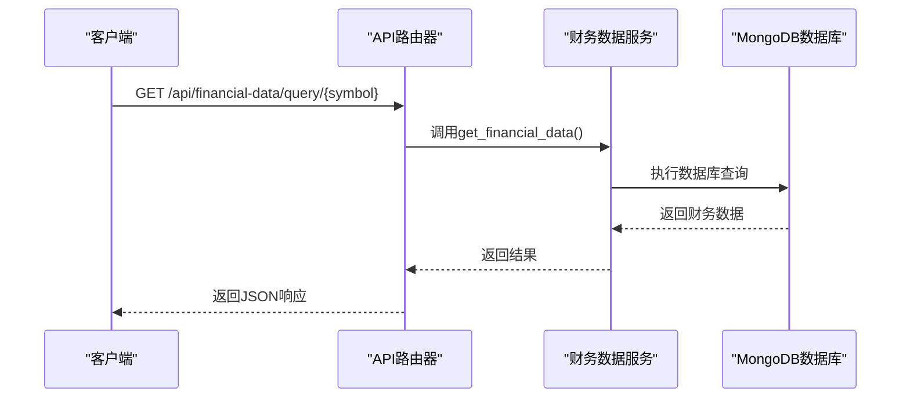
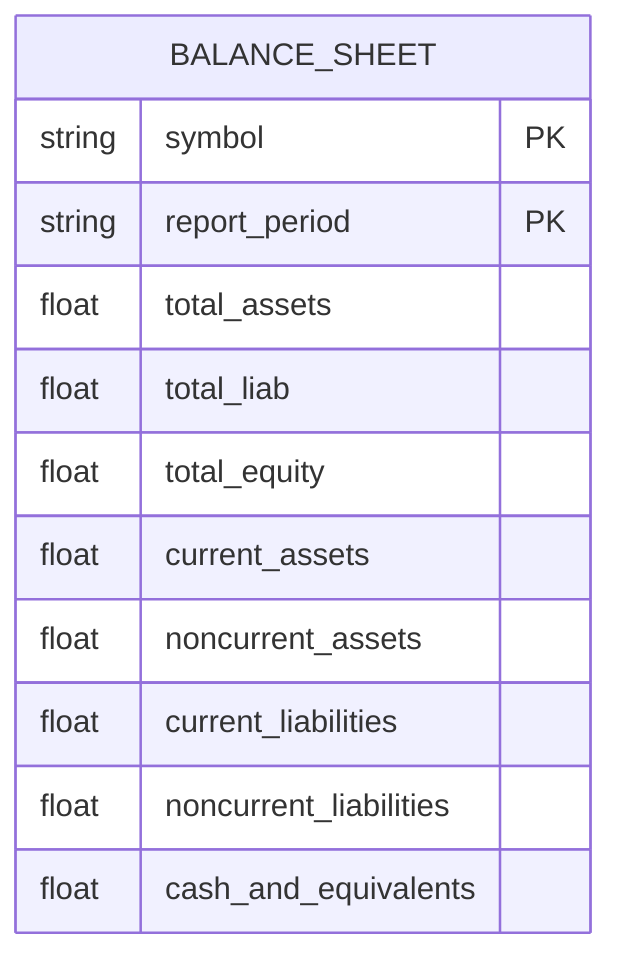
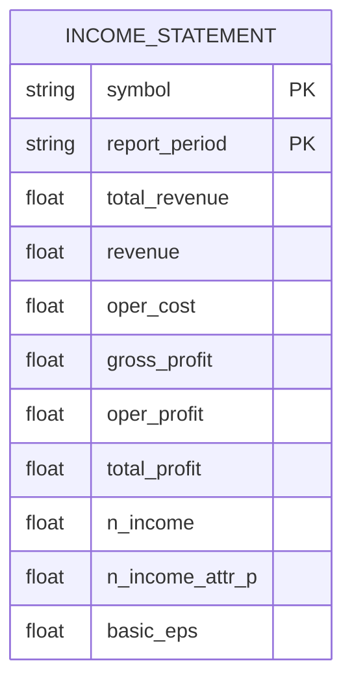
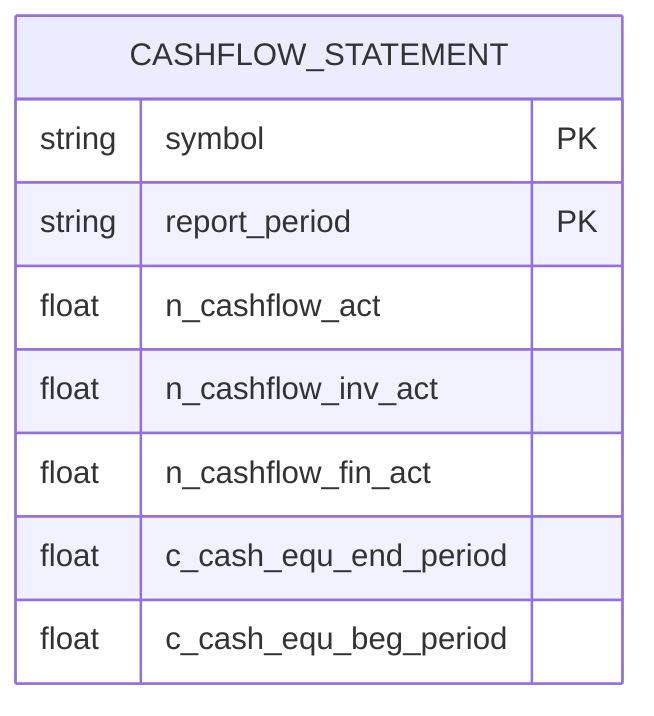
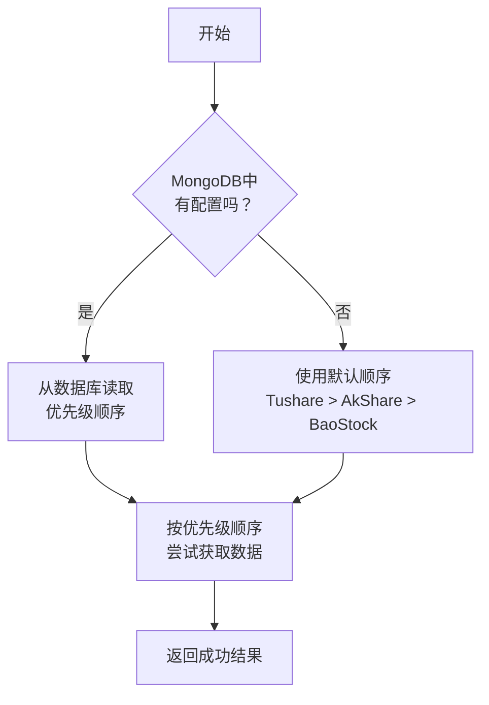
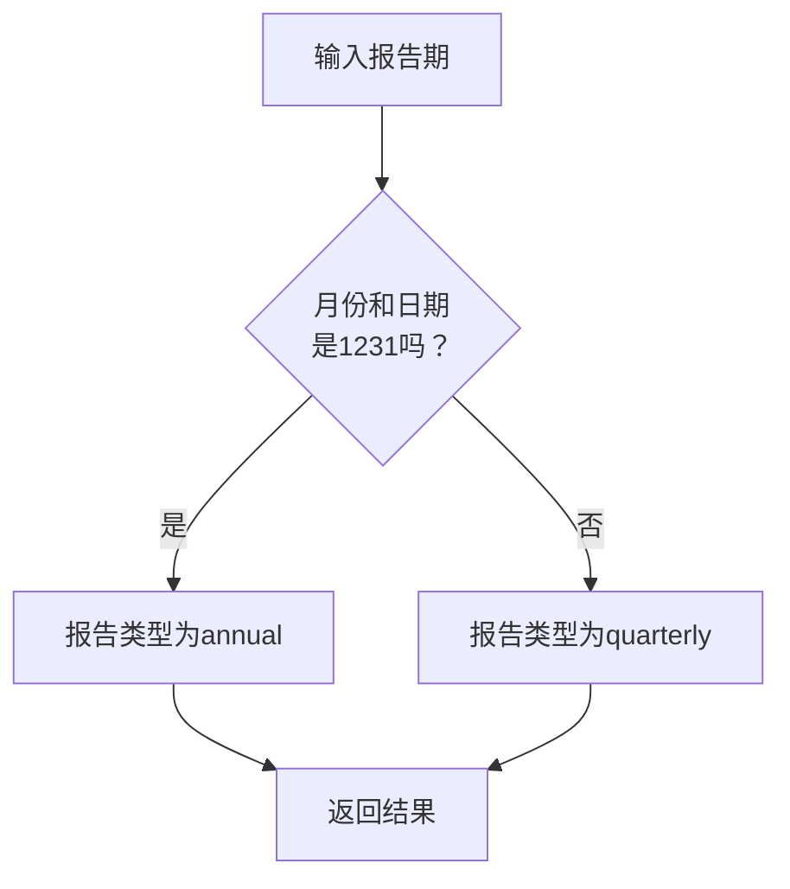

# 财务报表API

<cite>
**本文档引用的文件**   
- [financial_data.py](file://app/routers/financial_data.py)
- [financial_data_service.py](file://app/services/financial_data_service.py)
- [financial_data_sync_service.py](file://app/worker/financial_data_sync_service.py)
- [akshare.py](file://tradingagents/dataflows/providers/china/akshare.py)
- [tushare.py](file://tradingagents/dataflows/providers/china/tushare.py)
- [stock_data_models.py](file://tradingagents/models/stock_data_models.py)
- [data_source_manager.py](file://tradingagents/dataflows/data_source_manager.py)
- [data_sources.py](file://tradingagents/constants/data_sources.py)
- [unified_config.py](file://app/core/unified_config.py)
</cite>

## 目录
1. [简介](#简介)
2. [核心端点](#核心端点)
3. [财务报表数据结构](#财务报表数据结构)
4. [数据源与合并逻辑](#数据源与合并逻辑)
5. [周期参数处理](#周期参数处理)
6. [代码示例](#代码示例)
7. [数据更新与缓存策略](#数据更新与缓存策略)
8. [结论](#结论)

## 简介

财务报表API为用户提供了一套完整的财务数据查询接口，支持通过`GET /api/financial-data/{symbol}`端点获取指定股票的资产负债表、利润表和现金流量表。该API设计旨在整合多个数据源（如Tushare、AkShare等），通过统一的数据模型和优先级机制，为用户提供准确、一致的财务信息。系统采用MongoDB作为主数据存储，并实现了多级缓存和降级策略，确保在主数据源不可用时仍能提供可靠的数据服务。

**Section sources**
- [financial_data.py](file://app/routers/financial_data.py#L1-L307)
- [financial_data_service.py](file://app/services/financial_data_service.py#L1-L527)

## 核心端点

`GET /api/financial-data/query/{symbol}`是获取财务数据的核心端点。该端点支持通过`report_type`参数指定查询的财务报表类型，包括`balance_sheet`（资产负债表）、`income_statement`（利润表）和`cash_flow_statement`（现金流量表）。用户还可以通过`report_period`参数筛选特定报告期的数据，并通过`data_source`参数指定数据源。

该端点的设计遵循RESTful原则，返回结构化的JSON数据，包含股票代码、记录数量和具体的财务数据列表。系统通过`FinancialDataService`服务类处理所有查询请求，该服务类负责与MongoDB数据库交互，执行查询并返回结果。



**Diagram sources**
- [financial_data.py](file://app/routers/financial_data.py#L49-L88)
- [financial_data_service.py](file://app/services/financial_data_service.py#L164-L217)

## 财务报表数据结构

### 资产负债表

资产负债表（`balance_sheet`）展示了公司在特定报告期的资产、负债和所有者权益状况。系统从数据源获取原始数据后，将其标准化为统一的模型。关键项目包括：

- **资产**：总资产（`total_assets`）、流动资产合计（`total_cur_assets`）、非流动资产合计（`total_nca`）、货币资金（`cash_and_equivalents`）
- **负债**：总负债（`total_liab`）、流动负债合计（`total_cur_liab`）、非流动负债合计（`total_ncl`）
- **所有者权益**：股东权益合计（`total_hldr_eqy_exc_min_int`）



**Diagram sources**
- [stock_data_models.py](file://tradingagents/models/stock_data_models.py#L157-L177)
- [design/stock_data_model_design.md](file://docs/design/stock_data_model_design.md#L147-L157)

### 利润表

利润表（`income_statement`）反映了公司在报告期内的经营成果。关键项目包括：

- **营业收入**：营业总收入（`total_revenue`）、营业收入（`revenue`）
- **营业成本**：营业总成本（`oper_cost`）
- **净利润**：净利润（`n_income`）、归母净利润（`n_income_attr_p`）
- **其他**：毛利润（`gross_profit`）、营业利润（`oper_profit`）、利润总额（`total_profit`）、基本每股收益（`basic_eps`）



**Diagram sources**
- [stock_data_models.py](file://tradingagents/models/stock_data_models.py#L157-L177)
- [design/stock_data_model_design.md](file://docs/design/stock_data_model_design.md#L159-L171)

### 现金流量表

现金流量表（`cash_flow_statement`）展示了公司在报告期内的现金流入和流出情况。关键项目包括：

- **经营活动现金流**：经营活动现金流量净额（`n_cashflow_act`）
- **投资活动现金流**：投资活动现金流量净额（`n_cashflow_inv_act`）
- **筹资活动现金流**：筹资活动现金流量净额（`n_cashflow_fin_act`）
- **现金余额**：期末现金及现金等价物余额（`c_cash_equ_end_period`）、期初现金及现金等价物余额（`c_cash_equ_beg_period`）



**Diagram sources**
- [stock_data_models.py](file://tradingagents/models/stock_data_models.py#L157-L177)
- [design/stock_data_model_design.md](file://docs/design/stock_data_model_design.md#L173-L180)

## 数据源与合并逻辑

### 数据源优先级

系统支持多个数据源，包括Tushare、AkShare和BaoStock。数据源的优先级配置存储在MongoDB的`datasource_groupings`集合中，系统在启动时会从数据库加载配置。如果数据库中没有配置，则使用默认的硬编码优先级。

默认优先级顺序为：**Tushare > AkShare > BaoStock**。这意味着系统会首先尝试从Tushare获取数据，如果失败，则降级到AkShare，最后是BaoStock。



**Diagram sources**
- [data_source_manager.py](file://tradingagents/dataflows/data_source_manager.py#L137-L160)
- [unified_config.py](file://app/core/unified_config.py#L363-L402)

### 数据合并逻辑

当从不同数据源获取到同一股票的财务数据时，系统会根据数据源的优先级进行合并。高优先级数据源的数据会覆盖低优先级数据源的数据。所有数据在存储到MongoDB之前都会经过标准化处理，确保字段名称和数据格式的一致性。

标准化过程由`FinancialDataService`中的`_standardize_tushare_data`、`_standardize_akshare_data`和`_standardize_baostock_data`方法完成。这些方法会将不同数据源的原始数据映射到统一的字段名，并处理数据类型转换。

**Section sources**
- [financial_data_service.py](file://app/services/financial_data_service.py#L289-L414)
- [data_sources.py](file://tradingagents/constants/data_sources.py#L75-L140)

## 周期参数处理

`period`参数用于指定查询的报告期，支持季度和年度报表。系统通过`_determine_report_type`方法根据报告期的日期来判断报告类型。如果报告期的月份和日期为`1231`（即12月31日），则判定为年度报表（`annual`），否则为季度报表（`quarterly`）。

在数据同步过程中，系统会同时同步季报和年报数据。`FinancialDataSyncService`的`sync_financial_data`方法默认会处理`["quarterly", "annual"]`两种报告类型，确保数据库中包含完整的财务历史数据。



**Diagram sources**
- [tushare.py](file://tradingagents/dataflows/providers/china/tushare.py#L1532-L1545)
- [financial_data_sync_service.py](file://app/worker/financial_data_sync_service.py#L102-L103)

## 代码示例

以下是一个使用Python获取财务报表数据的示例：

```python
import requests

# 获取平安银行（000001）的最新资产负债表
symbol = "000001"
url = f"http://localhost:8000/api/financial-data/query/{symbol}"
params = {
    "report_type": "balance_sheet",
    "limit": 1
}

response = requests.get(url, params=params)
data = response.json()

if data["success"] and data["data"]["financial_data"]:
    balance_sheet = data["data"]["financial_data"][0]
    print(f"总资产: {balance_sheet['total_assets']}")
    print(f"总负债: {balance_sheet['total_liab']}")
    print(f"股东权益: {balance_sheet['total_hldr_eqy_exc_min_int']}")
else:
    print("未找到财务数据")
```

**Section sources**
- [financial_data.py](file://app/routers/financial_data.py#L49-L88)
- [examples/tushare_demo.py](file://examples/tushare_demo.py)

## 数据更新与缓存策略

### 数据更新频率

财务数据的更新频率取决于数据源。Tushare和AkShare的数据通常在财报发布后的1-3天内更新。系统通过`FinancialDataSyncService`定期执行同步任务，确保本地数据库的数据保持最新。用户也可以通过`/api/financial-data/sync/start`端点手动触发同步。

### 缓存策略

系统采用多级缓存策略：
1. **MongoDB缓存**：作为主缓存，存储所有标准化的财务数据。
2. **内存缓存**：在应用运行时，常用数据会被缓存在内存中，以提高访问速度。
3. **降级策略**：当主数据源（如Tushare）不可用时，系统会自动降级到备用数据源（如AkShare）。

在查询时，系统会优先从MongoDB缓存中获取数据。如果缓存中没有数据，才会尝试从上游数据源获取。

**Section sources**
- [financial_data_service.py](file://app/services/financial_data_service.py#L76-L159)
- [financial_data_sync_service.py](file://app/worker/financial_data_sync_service.py#L75-L141)

## 结论

财务报表API通过整合Tushare、AkShare等多个数据源，为用户提供了一个稳定、可靠的财务数据查询服务。系统通过优先级配置和降级策略，确保了数据的高可用性。统一的数据模型和标准化处理流程，保证了不同数据源数据的一致性和准确性。多级缓存和定期同步机制，使得系统既能快速响应查询，又能保持数据的时效性。开发者可以轻松地通过API获取所需的财务报表数据，用于投资分析、风险评估等场景。