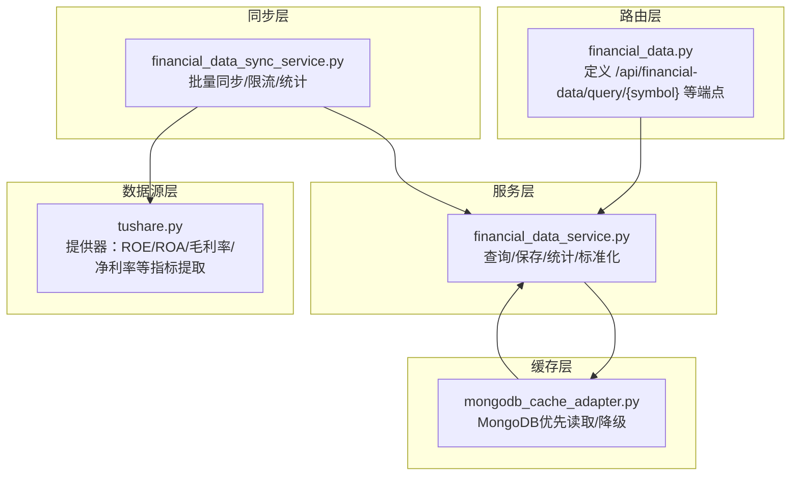
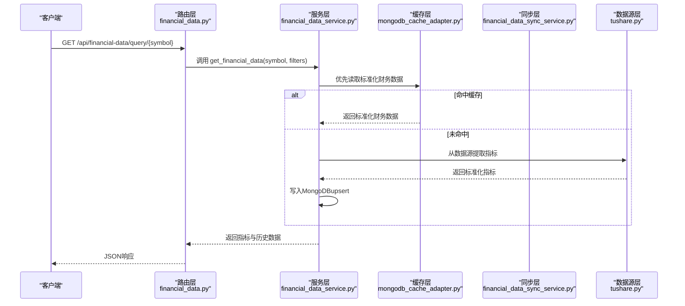
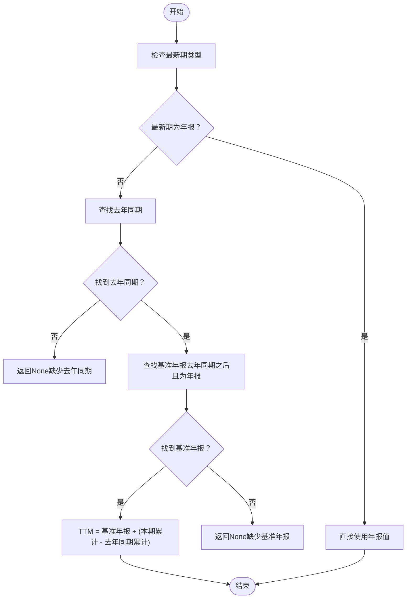
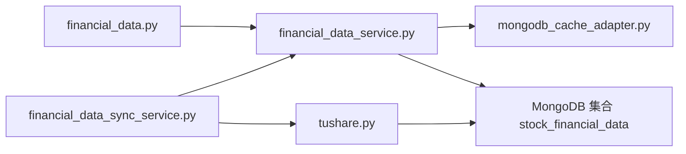

# 财务指标API

<cite>
**本文引用的文件**
- [app/routers/financial_data.py](file://app/routers/financial_data.py)
- [app/services/financial_data_service.py](file://app/services/financial_data_service.py)
- [app/worker/financial_data_sync_service.py](file://app/worker/financial_data_sync_service.py)
- [tradingagents/dataflows/providers/china/tushare.py](file://tradingagents/dataflows/providers/china/tushare.py)
- [tradingagents/dataflows/cache/mongodb_cache_adapter.py](file://tradingagents/dataflows/cache/mongodb_cache_adapter.py)
- [scripts/sync_financial_data.py](file://scripts/sync_financial_data.py)
- [scripts/test_ttm_calculation.py](file://scripts/test_ttm_calculation.py)
- [scripts/test_ttm_calculation_logic.py](file://scripts/test_ttm_calculation_logic.py)
- [tests/test_financial_data_validation.py](file://tests/test_financial_data_validation.py)
- [docs/architecture/data-source/data_priority_analysis.md](file://docs/architecture/data-source/data_priority_analysis.md)
- [scripts/setup/init_database.py](file://scripts/setup/init_database.py)
</cite>

## 目录
1. [简介](#简介)
2. [项目结构](#项目结构)
3. [核心组件](#核心组件)
4. [架构总览](#架构总览)
5. [详细组件分析](#详细组件分析)
6. [依赖关系分析](#依赖关系分析)
7. [性能与扩展性](#性能与扩展性)
8. [故障排查指南](#故障排查指南)
9. [结论](#结论)
10. [附录](#附录)

## 简介
本文件面向“财务指标API”的使用与实现，重点围绕 GET /api/financial-data/query/{symbol} 端点中 indicator_type 参数的使用，系统性说明如下内容：
- 指标类型与含义：ROE（净资产收益率）、ROA（总资产收益率）、毛利率、净利率等核心财务指标的计算方法与数据来源。
- 时间序列特性：历史数据获取与最新季度数据更新机制。
- 后端服务流程：数据预处理、异常值处理与数据验证。
- 实际使用示例：如何获取特定股票的财务指标并进行横向/纵向比较。
- 缓存策略与更新频率：数据库缓存优先与Redis TTL配置。
- 原始财务数据不完整时的估算或插值策略：TTM（最近12个月）计算规则与边界处理。

## 项目结构
财务指标API由三层组成：
- 路由层：定义HTTP端点与参数校验。
- 服务层：封装数据查询、标准化与统计。
- 同步层：负责从多数据源抓取并入库，支持批量与限流。
- 数据源层：提供器从Tushare/AKShare/BaoStock等数据源拉取并标准化财务指标。
- 缓存层：MongoDB优先读取，支持降级与数据源优先级。

图表来源
- [app/routers/financial_data.py](file://app/routers/financial_data.py#L49-L121)
- [app/services/financial_data_service.py](file://app/services/financial_data_service.py#L164-L231)
- [app/worker/financial_data_sync_service.py](file://app/worker/financial_data_sync_service.py#L75-L141)
- [tradingagents/dataflows/providers/china/tushare.py](file://tradingagents/dataflows/providers/china/tushare.py#L1382-L1393)
- [tradingagents/dataflows/cache/mongodb_cache_adapter.py](file://tradingagents/dataflows/cache/mongodb_cache_adapter.py#L221-L258)

章节来源
- [app/routers/financial_data.py](file://app/routers/financial_data.py#L49-L121)
- [app/services/financial_data_service.py](file://app/services/financial_data_service.py#L164-L231)
- [app/worker/financial_data_sync_service.py](file://app/worker/financial_data_sync_service.py#L75-L141)
- [tradingagents/dataflows/cache/mongodb_cache_adapter.py](file://tradingagents/dataflows/cache/mongodb_cache_adapter.py#L221-L258)

## 核心组件
- 路由层（financial_data.py）
  - 提供查询接口：/api/financial-data/query/{symbol}，支持 report_period、data_source、report_type、limit 等筛选参数。
  - 提供最新财务数据接口：/api/financial-data/latest/{symbol}。
  - 提供同步控制接口：启动同步、单只股票同步、同步统计、健康检查等。
- 服务层（financial_data_service.py）
  - 标准化不同数据源的财务数据，统一字段与格式。
  - 提供查询、保存、统计与索引管理。
  - 对AKShare/Tushare/BaoStock数据源进行差异化标准化。
- 同步层（financial_data_sync_service.py）
  - 并发批量同步多只股票的财务数据，支持限流与统计。
  - 为每只股票按报告类型（季度/年报）保存数据。
- 数据源层（tushare.py）
  - 提供器提取ROE、ROA、毛利率、净利率等指标，并进行安全类型转换与边界检查。
  - 实现TTM（最近12个月）计算逻辑，严格遵循“基准年报 + (本期累计 - 去年同期累计)”规则。
- 缓存层（mongodb_cache_adapter.py）
  - 优先从MongoDB读取标准化财务数据；若未命中，降级到其他数据源。
  - 支持按数据源优先级查询，保障数据一致性与可用性。

章节来源
- [app/routers/financial_data.py](file://app/routers/financial_data.py#L49-L121)
- [app/services/financial_data_service.py](file://app/services/financial_data_service.py#L164-L231)
- [app/worker/financial_data_sync_service.py](file://app/worker/financial_data_sync_service.py#L75-L141)
- [tradingagents/dataflows/providers/china/tushare.py](file://tradingagents/dataflows/providers/china/tushare.py#L1382-L1393)
- [tradingagents/dataflows/cache/mongodb_cache_adapter.py](file://tradingagents/dataflows/cache/mongodb_cache_adapter.py#L221-L258)

## 架构总览
下图展示了从HTTP请求到数据返回的关键路径，以及数据源优先级与缓存策略：

图表来源
- [app/routers/financial_data.py](file://app/routers/financial_data.py#L49-L121)
- [app/services/financial_data_service.py](file://app/services/financial_data_service.py#L164-L231)
- [tradingagents/dataflows/cache/mongodb_cache_adapter.py](file://tradingagents/dataflows/cache/mongodb_cache_adapter.py#L221-L258)
- [app/worker/financial_data_sync_service.py](file://app/worker/financial_data_sync_service.py#L75-L141)
- [tradingagents/dataflows/providers/china/tushare.py](file://tradingagents/dataflows/providers/china/tushare.py#L1382-L1393)

## 详细组件分析

### 指标类型与计算方法
- ROE（净资产收益率）
  - 数据来源：Tushare提供器中提取 roe、roe_waa、roe_dt 等字段。
  - 计算与验证：服务层与数据源层均对数值进行安全转换与范围校验，超出合理范围将标记为N/A。
- ROA（总资产收益率）
  - 数据来源：Tushare提供器中提取 roa、roa2 等字段。
  - 计算与验证：同上，超出合理范围标记为N/A。
- 毛利率（销售毛利率%）
  - 数据来源：Tushare提供器中提取 grossprofit_margin 字段。
  - 计算与验证：服务层与数据源层均进行安全转换与范围校验。
- 净利率（销售净利率%）
  - 数据来源：Tushare提供器中提取 netprofit_margin 字段。
  - 计算与验证：同上，超出合理范围标记为N/A。

章节来源
- [tradingagents/dataflows/providers/china/tushare.py](file://tradingagents/dataflows/providers/china/tushare.py#L1382-L1393)
- [app/services/financial_data_service.py](file://app/services/financial_data_service.py#L440-L479)
- [tests/test_financial_data_validation.py](file://tests/test_financial_data_validation.py#L59-L104)

### 时间序列特性与最新季度更新机制
- 历史数据获取
  - 服务层支持按 report_period、data_source、report_type、limit 等条件查询，并按报告期倒序返回。
- 最新季度数据更新
  - 同步服务按季度/年报两种报告类型批量写入MongoDB，复合唯一索引保证同一 symbol+report_period+data_source 的幂等更新。
  - 健康检查接口返回总记录数与总股票数，便于监控数据覆盖度。

章节来源
- [app/routers/financial_data.py](file://app/routers/financial_data.py#L49-L121)
- [app/services/financial_data_service.py](file://app/services/financial_data_service.py#L164-L231)
- [app/worker/financial_data_sync_service.py](file://app/worker/financial_data_sync_service.py#L75-L141)

### 后端服务流程：数据预处理、异常值处理与数据验证
- 数据预处理
  - 标准化：不同数据源字段映射到统一字段集，补充 code、full_symbol、market、report_period、report_type、data_source、version 等。
  - 安全转换：统一使用安全浮点转换函数，剔除单位与空值，避免NaN与非法字符串导致的异常。
- 异常值处理
  - 数值范围校验：ROE/ROA/毛利率/净利率设置合理范围阈值，超出范围标记为N/A并记录警告日志。
  - 缺失值处理：当字段为空或无效时，返回N/A，不进行估算。
- 数据验证
  - 索引优化：为 symbol、report_period、report_type、updated_at 等字段建立索引，提升查询与upsert性能。
  - 报告类型判定：根据报告期末尾判断季度/年报，确保后续TTM计算的正确性。

章节来源
- [app/services/financial_data_service.py](file://app/services/financial_data_service.py#L289-L514)
- [tests/test_financial_data_validation.py](file://tests/test_financial_data_validation.py#L59-L104)

### TTM（最近12个月）计算与数据不完整处理
- 计算规则
  - 基准年报必须在“去年同期”之后，且报告期末尾为1231。
  - TTM = 基准年报 + (本期累计 - 去年同期累计)。
  - 若缺少基准年报或去年同期数据，返回None（不进行简单年化）。
- 测试与验证
  - 提供多场景测试脚本，覆盖年报、中报、一季报、三季报等不同最新期情形。
  - 严格验证边界条件与异常分支，确保计算稳健。

图表来源
- [tradingagents/dataflows/providers/china/tushare.py](file://tradingagents/dataflows/providers/china/tushare.py#L1450-L1531)
- [scripts/test_ttm_calculation.py](file://scripts/test_ttm_calculation.py#L51-L105)
- [scripts/test_ttm_calculation_logic.py](file://scripts/test_ttm_calculation_logic.py#L43-L158)

章节来源
- [tradingagents/dataflows/providers/china/tushare.py](file://tradingagents/dataflows/providers/china/tushare.py#L1450-L1531)
- [scripts/sync_financial_data.py](file://scripts/sync_financial_data.py#L295-L312)
- [scripts/test_ttm_calculation.py](file://scripts/test_ttm_calculation.py#L51-L105)
- [scripts/test_ttm_calculation_logic.py](file://scripts/test_ttm_calculation_logic.py#L43-L158)

### 缓存策略与更新频率
- MongoDB优先缓存
  - 优化流程中优先从MongoDB读取标准化财务数据；若未命中，降级到数据源。
  - 通过数据源优先级配置，按市场类别与启用状态动态选择数据源。
- Redis缓存配置
  - 初始化脚本设置系统缓存配置，包含不同业务类型的TTL（如中国/美国基本面数据）。
  - 缓存统计键用于追踪命中/未命中与总请求数，便于监控与优化。
- 更新频率
  - 同步服务按季度/年报两种报告类型批量写入，具体更新周期取决于调度策略与数据源可用性。

章节来源
- [tradingagents/dataflows/cache/mongodb_cache_adapter.py](file://tradingagents/dataflows/cache/mongodb_cache_adapter.py#L221-L258)
- [docs/architecture/data-source/data_priority_analysis.md](file://docs/architecture/data-source/data_priority_analysis.md#L244-L269)
- [scripts/setup/init_database.py](file://scripts/setup/init_database.py#L153-L192)
- [app/worker/financial_data_sync_service.py](file://app/worker/financial_data_sync_service.py#L75-L141)

### 实际使用示例
- 获取某股票的财务指标
  - 请求路径：GET /api/financial-data/query/{symbol}
  - 关键参数：report_period（YYYYMMDD）、data_source（tushare/akshare/baostock）、report_type（quarterly/annual）、limit（默认10）
  - 返回内容：包含指标字段（如 ROE、ROA、毛利率、净利率）与历史记录列表
- 横向比较（多股票）
  - 分别对多只股票调用相同接口，比较同一报告期的指标差异
- 纵向比较（同一股票多期）
  - 指定 symbol 与 report_type=quarterly，多次调用以获取历史指标序列，观察趋势变化

章节来源
- [app/routers/financial_data.py](file://app/routers/financial_data.py#L49-L121)
- [app/services/financial_data_service.py](file://app/services/financial_data_service.py#L164-L231)

## 依赖关系分析
- 路由层依赖服务层进行数据查询与返回。
- 服务层依赖缓存层与数据库进行数据读写。
- 同步层依赖数据源提供器抓取数据并写入数据库。
- 数据源提供器依赖外部数据源（Tushare/AKShare/BaoStock）并进行标准化。

图表来源
- [app/routers/financial_data.py](file://app/routers/financial_data.py#L49-L121)
- [app/services/financial_data_service.py](file://app/services/financial_data_service.py#L164-L231)
- [app/worker/financial_data_sync_service.py](file://app/worker/financial_data_sync_service.py#L75-L141)
- [tradingagents/dataflows/cache/mongodb_cache_adapter.py](file://tradingagents/dataflows/cache/mongodb_cache_adapter.py#L221-L258)
- [tradingagents/dataflows/providers/china/tushare.py](file://tradingagents/dataflows/providers/china/tushare.py#L1382-L1393)

## 性能与扩展性
- 索引优化：为 symbol、report_period、report_type、updated_at 等字段建立复合索引，显著提升查询与upsert性能。
- 并发与限流：同步服务按批处理与延迟参数控制API调用速率，避免触发外部数据源限流。
- 缓存优先：优先从MongoDB读取标准化数据，减少重复计算与网络请求。
- 可扩展性：新增数据源时，只需在服务层增加标准化逻辑与在同步层扩展提供器即可。

章节来源
- [app/services/financial_data_service.py](file://app/services/financial_data_service.py#L40-L75)
- [app/worker/financial_data_sync_service.py](file://app/worker/financial_data_sync_service.py#L75-L141)

## 故障排查指南
- 无数据或返回N/A
  - 检查MongoDB中是否存在对应 symbol 的标准化财务数据。
  - 确认 report_period、data_source、report_type 是否匹配。
  - 若数据源缺失，确认同步任务是否成功执行。
- 指标异常（N/A）
  - 检查数值范围是否超出合理区间。
  - 确认数据源字段映射是否正确（如毛利率字段名）。
- TTM计算失败
  - 检查最新期是否为年报或季报，是否存在去年同期与基准年报。
  - 确认报告期格式与排序是否正确。
- 缓存未生效
  - 检查系统缓存开关与Redis连接状态。
  - 确认数据源优先级配置是否正确。

章节来源
- [tests/test_financial_data_validation.py](file://tests/test_financial_data_validation.py#L59-L104)
- [tradingagents/dataflows/providers/china/tushare.py](file://tradingagents/dataflows/providers/china/tushare.py#L1450-L1531)
- [docs/architecture/data-source/data_priority_analysis.md](file://docs/architecture/data-source/data_priority_analysis.md#L244-L269)
- [scripts/setup/init_database.py](file://scripts/setup/init_database.py#L153-L192)

## 结论
本财务指标API通过统一的服务层与标准化流程，实现了对ROE、ROA、毛利率、净利率等核心指标的稳定获取与高效查询。结合MongoDB优先缓存、严格的异常值处理与TTM计算规则，系统在数据质量与性能方面具备良好表现。建议在生产环境中：
- 明确 indicator_type 的取值范围与含义，确保前端与后端一致。
- 使用 report_period 与 report_type 精确筛选，避免跨期混淆。
- 关注缓存命中率与同步统计，及时发现数据源异常或缺失。

## 附录
- 指标字段映射参考
  - ROE：roe、roe_waa、roe_dt
  - ROA：roa、roa2
  - 毛利率：grossprofit_margin
  - 净利率：netprofit_margin
- TTM计算边界
  - 严格要求基准年报在“去年同期之后”，否则返回None。
  - 不进行简单年化，避免季节性行业误判。

章节来源
- [tradingagents/dataflows/providers/china/tushare.py](file://tradingagents/dataflows/providers/china/tushare.py#L1382-L1393)
- [scripts/sync_financial_data.py](file://scripts/sync_financial_data.py#L295-L312)