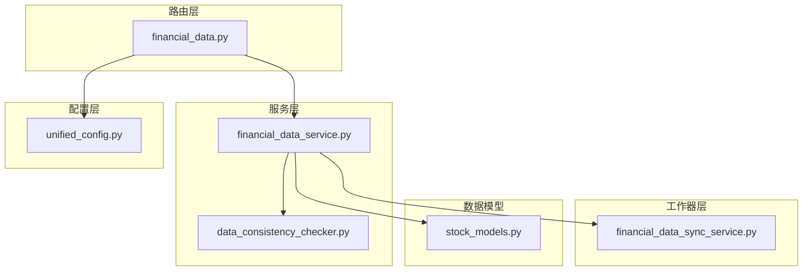
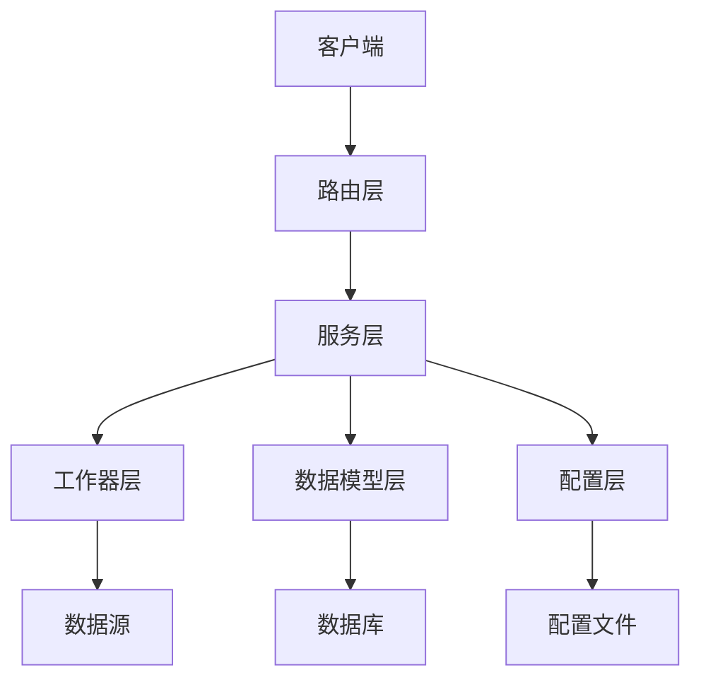
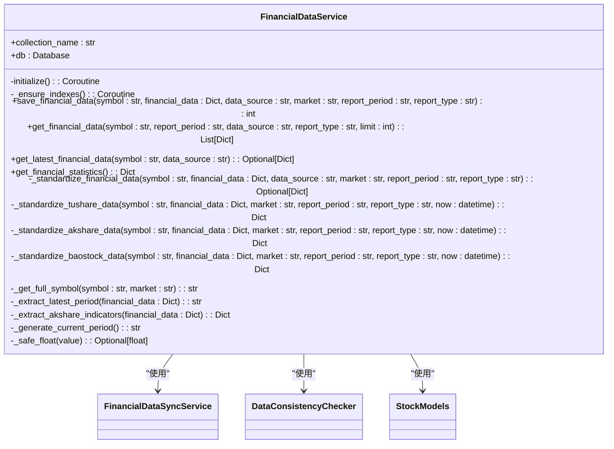
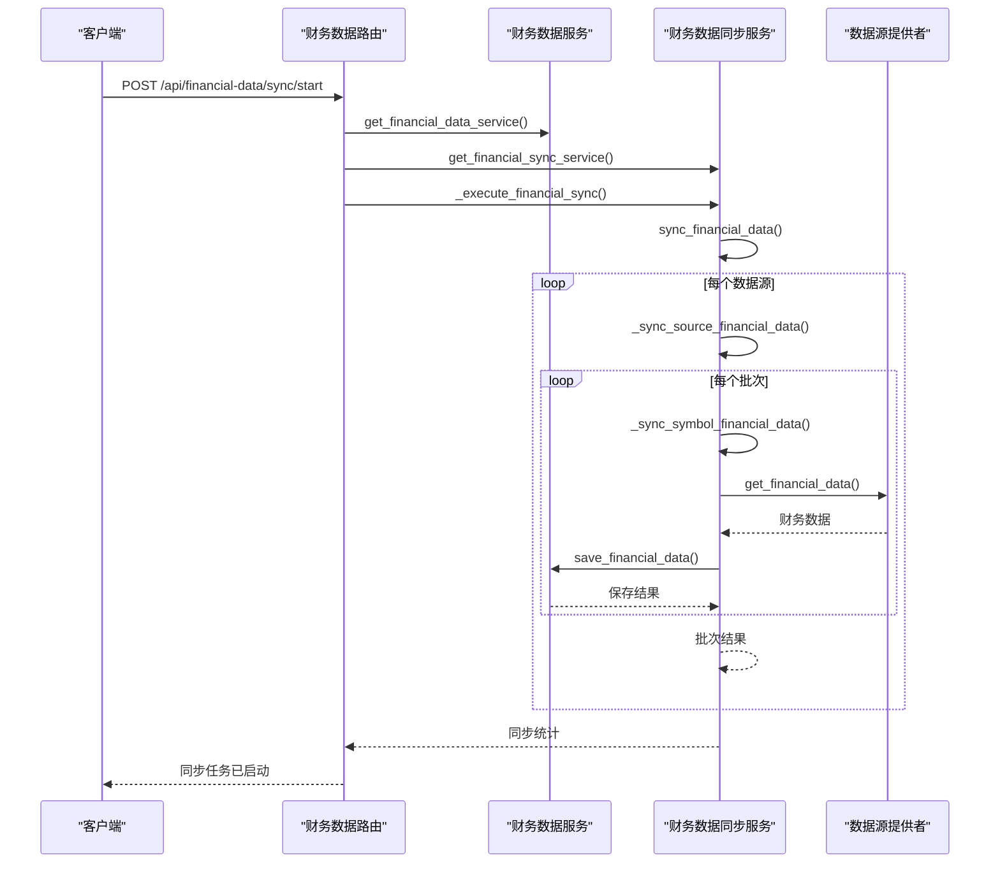
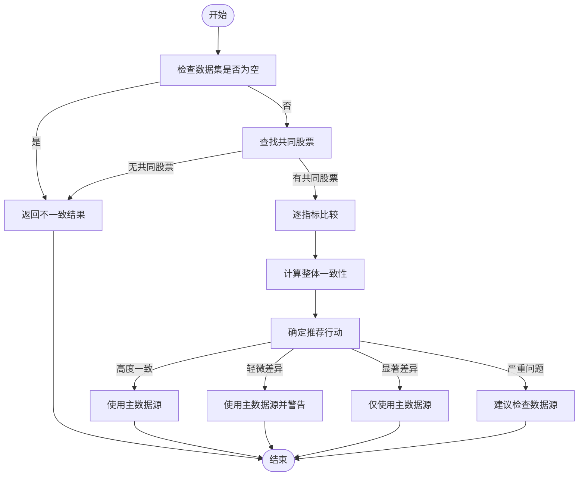
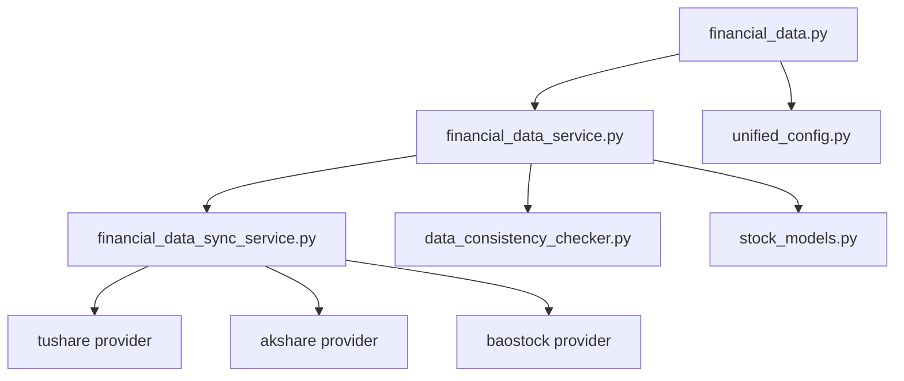

# 财务数据API

<cite>
**本文档引用文件**   
- [financial_data.py](file://app/routers/financial_data.py)
- [financial_data_service.py](file://app/services/financial_data_service.py)
- [financial_data_sync_service.py](file://app/worker/financial_data_sync_service.py)
- [stock_models.py](file://app/models/stock_models.py)
- [unified_config.py](file://app/core/unified_config.py)
- [data_consistency_checker.py](file://app/services/data_consistency_checker.py)
</cite>

## 目录
1. [简介](#简介)
2. [项目结构](#项目结构)
3. [核心组件](#核心组件)
4. [架构概述](#架构概述)
5. [详细组件分析](#详细组件分析)
6. [依赖分析](#依赖分析)
7. [性能考虑](#性能考虑)
8. [故障排除指南](#故障排除指南)
9. [结论](#结论)

## 简介
财务数据API提供了一套完整的财务数据查询和管理接口，支持从多个数据源获取股票的财务报表、财务指标和估值数据。该API设计用于支持复杂的财务分析和估值计算，包括资产负债表、利润表、现金流量表以及ROE、PE、PB等关键指标。系统实现了多源数据获取、一致性校验、TTM（滚动市盈率）计算、数据回填和缓存策略，确保数据的准确性和实时性。通过灵活的参数配置，用户可以精确筛选所需数据，并在数据源不可用时自动降级处理，保证服务的高可用性。

## 项目结构
财务数据API的项目结构清晰地划分了路由、服务、数据模型和工作器等核心组件。路由层（routers）负责处理HTTP请求，服务层（services）实现核心业务逻辑，数据模型（models）定义了数据结构，工作器（worker）处理后台同步任务。这种分层架构确保了系统的可维护性和可扩展性。

**图表来源**
- [financial_data.py](file://app/routers/financial_data.py)
- [financial_data_service.py](file://app/services/financial_data_service.py)
- [financial_data_sync_service.py](file://app/worker/financial_data_sync_service.py)
- [stock_models.py](file://app/models/stock_models.py)
- [unified_config.py](file://app/core/unified_config.py)

**章节来源**
- [financial_data.py](file://app/routers/financial_data.py#L1-L307)
- [financial_data_service.py](file://app/services/financial_data_service.py#L1-L527)

## 核心组件
财务数据API的核心组件包括财务数据服务、财务数据同步服务和数据一致性检查器。财务数据服务负责数据的存储和查询，提供了标准化的接口来访问财务数据。财务数据同步服务管理从多个数据源获取数据的后台任务，确保数据的及时更新。数据一致性检查器处理多数据源之间的数据不一致性问题，通过置信度评分和推荐行动来解决数据冲突。

**章节来源**
- [financial_data_service.py](file://app/services/financial_data_service.py#L1-L527)
- [financial_data_sync_service.py](file://app/worker/financial_data_sync_service.py#L1-L336)
- [data_consistency_checker.py](file://app/services/data_consistency_checker.py#L1-L319)

## 架构概述
财务数据API采用分层架构，从上到下分为路由层、服务层、工作器层和数据模型层。路由层接收和处理HTTP请求，服务层实现核心业务逻辑，工作器层处理后台任务，数据模型层定义数据结构。配置层提供统一的配置管理，确保系统各部分的协调工作。

**图表来源**
- [financial_data.py](file://app/routers/financial_data.py#L1-L307)
- [financial_data_service.py](file://app/services/financial_data_service.py#L1-L527)
- [financial_data_sync_service.py](file://app/worker/financial_data_sync_service.py#L1-L336)

## 详细组件分析

### 财务数据服务分析
财务数据服务是API的核心，负责财务数据的存储和查询。它提供了标准化的接口来访问财务数据，支持多种查询条件和数据源筛选。

#### 类图

**图表来源**
- [financial_data_service.py](file://app/services/financial_data_service.py#L17-L527)

### 财务数据同步服务分析
财务数据同步服务管理从多个数据源获取数据的后台任务，确保数据的及时更新。它支持配置数据源、报告类型、批处理大小和延迟设置。

#### 序列图

**图表来源**
- [financial_data.py](file://app/routers/financial_data.py#L147-L177)
- [financial_data_sync_service.py](file://app/worker/financial_data_sync_service.py#L75-L141)

### 数据一致性检查器分析
数据一致性检查器处理多数据源之间的数据不一致性问题，通过置信度评分和推荐行动来解决数据冲突。

#### 流程图

**图表来源**
- [data_consistency_checker.py](file://app/services/data_consistency_checker.py#L59-L318)

## 依赖分析
财务数据API的组件之间存在明确的依赖关系。财务数据服务依赖于财务数据同步服务、数据一致性检查器和数据模型。财务数据同步服务依赖于数据源提供者。配置层为所有组件提供统一的配置管理。

**图表来源**
- [financial_data.py](file://app/routers/financial_data.py#L11-L12)
- [financial_data_service.py](file://app/services/financial_data_service.py#L12)
- [financial_data_sync_service.py](file://app/worker/financial_data_sync_service.py#L14-L16)

**章节来源**
- [financial_data.py](file://app/routers/financial_data.py#L1-L307)
- [financial_data_service.py](file://app/services/financial_data_service.py#L1-L527)
- [financial_data_sync_service.py](file://app/worker/financial_data_sync_service.py#L1-L336)

## 性能考虑
财务数据API在设计时充分考虑了性能因素。通过批量操作和索引优化，提高了数据存储和查询的效率。异步处理和并发任务确保了后台同步任务的高效执行。缓存策略减少了对数据源的频繁请求，提高了响应速度。

## 故障排除指南
当遇到财务数据API的问题时，首先检查服务的健康状态。通过调用`/api/financial-data/health`端点，可以检查服务状态和数据库连接。如果同步任务失败，查看日志文件以确定具体错误。对于数据不一致问题，检查数据一致性检查器的报告，了解差异详情和推荐行动。

**章节来源**
- [financial_data.py](file://app/routers/financial_data.py#L241-L272)
- [financial_data_service.py](file://app/services/financial_data_service.py#L232-L287)
- [financial_data_sync_service.py](file://app/worker/financial_data_sync_service.py#L271-L281)

## 结论
财务数据API提供了一套完整的财务数据查询和管理解决方案，支持多源数据获取、一致性校验、TTM计算和数据回填。通过灵活的参数配置和降级处理策略，确保了服务的高可用性和数据的准确性。系统的分层架构和模块化设计使其易于维护和扩展，为财务分析和估值计算提供了可靠的数据支持。