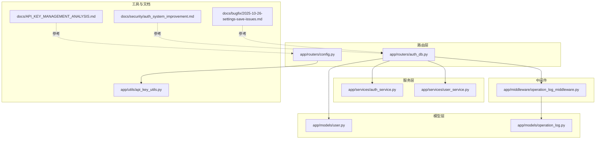
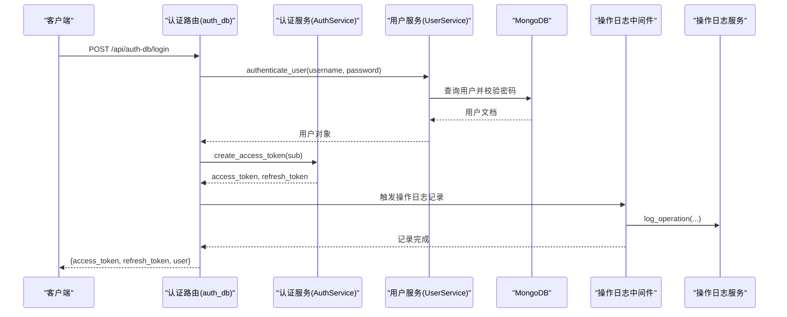
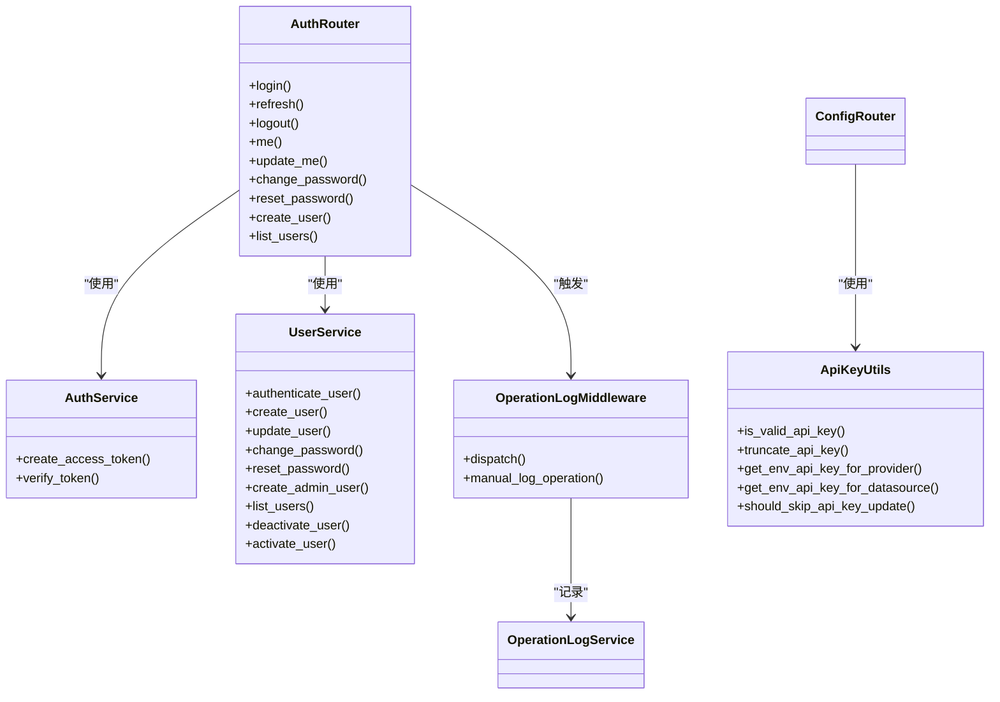
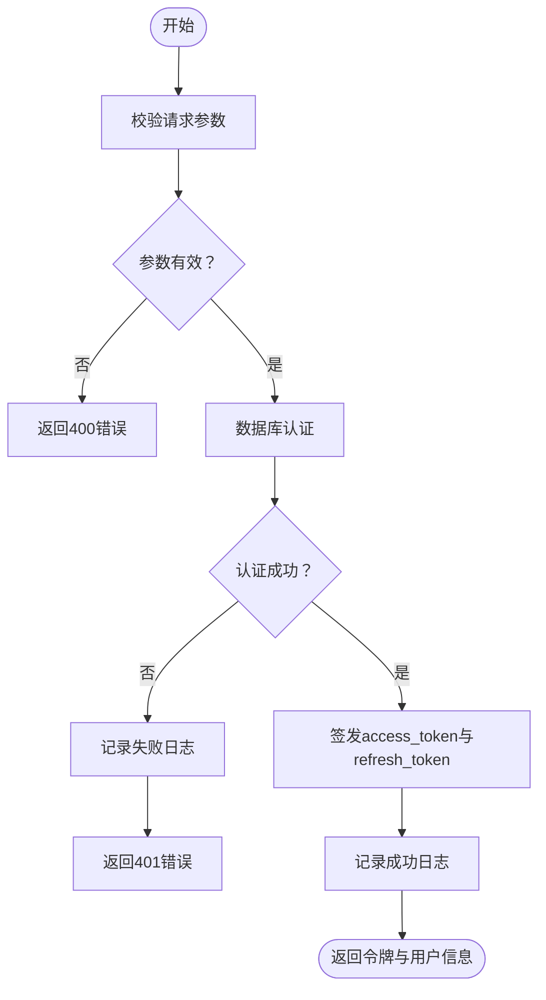
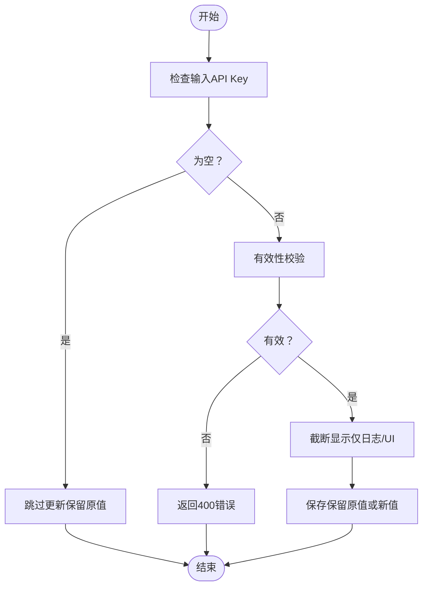

# 用户管理API

<cite>
**本文引用的文件**
- [app/routers/auth_db.py](file://app/routers/auth_db.py)
- [app/services/auth_service.py](file://app/services/auth_service.py)
- [app/services/user_service.py](file://app/services/user_service.py)
- [app/models/user.py](file://app/models/user.py)
- [app/middleware/operation_log_middleware.py](file://app/middleware/operation_log_middleware.py)
- [app/models/operation_log.py](file://app/models/operation_log.py)
- [app/utils/api_key_utils.py](file://app/utils/api_key_utils.py)
- [app/routers/config.py](file://app/routers/config.py)
- [docs/security/auth_system_improvement.md](file://docs/security/auth_system_improvement.md)
- [docs/API_KEY_MANAGEMENT_ANALYSIS.md](file://docs/API_KEY_MANAGEMENT_ANALYSIS.md)
- [docs/bugfix/2025-10-26-settings-save-issues.md](file://docs/bugfix/2025-10-26-settings-save-issues.md)
</cite>

## 目录
1. [简介](#简介)
2. [项目结构](#项目结构)
3. [核心组件](#核心组件)
4. [架构总览](#架构总览)
5. [详细组件分析](#详细组件分析)
6. [依赖关系分析](#依赖关系分析)
7. [性能考量](#性能考量)
8. [故障排查指南](#故障排查指南)
9. [结论](#结论)
10. [附录](#附录)

## 简介
本文件面向后端开发者与运维人员，系统化梳理“用户管理API”的设计与实现，覆盖用户认证、权限管理、用户配置与偏好设置、API密钥管理、以及与配置管理、操作日志系统的集成方式。文档同时提供端点清单、请求/响应格式、认证流程图、常见错误与解决方案，并给出实际使用示例与最佳实践。

## 项目结构
用户管理API主要由以下模块构成：
- 路由层：集中定义认证与用户管理相关端点
- 服务层：封装认证、用户增删改查、密码变更与重置、管理员用户创建等业务逻辑
- 模型层：定义用户、偏好设置、Token响应等数据结构
- 中间件：统一记录操作日志，辅助审计与合规
- 工具与文档：API Key校验与前端设置持久化修复等

图表来源
- [app/routers/auth_db.py](file://app/routers/auth_db.py#L1-L505)
- [app/services/auth_service.py](file://app/services/auth_service.py#L1-L61)
- [app/services/user_service.py](file://app/services/user_service.py#L1-L418)
- [app/models/user.py](file://app/models/user.py#L1-L172)
- [app/middleware/operation_log_middleware.py](file://app/middleware/operation_log_middleware.py#L1-L313)
- [app/models/operation_log.py](file://app/models/operation_log.py#L1-L138)
- [app/utils/api_key_utils.py](file://app/utils/api_key_utils.py#L1-L166)
- [app/routers/config.py](file://app/routers/config.py#L712-L744)
- [docs/security/auth_system_improvement.md](file://docs/security/auth_system_improvement.md#L56-L118)
- [docs/API_KEY_MANAGEMENT_ANALYSIS.md](file://docs/API_KEY_MANAGEMENT_ANALYSIS.md#L1-L566)
- [docs/bugfix/2025-10-26-settings-save-issues.md](file://docs/bugfix/2025-10-26-settings-save-issues.md#L133-L220)

章节来源
- [app/routers/auth_db.py](file://app/routers/auth_db.py#L1-L505)
- [app/services/auth_service.py](file://app/services/auth_service.py#L1-L61)
- [app/services/user_service.py](file://app/services/user_service.py#L1-L418)
- [app/models/user.py](file://app/models/user.py#L1-L172)
- [app/middleware/operation_log_middleware.py](file://app/middleware/operation_log_middleware.py#L1-L313)
- [app/models/operation_log.py](file://app/models/operation_log.py#L1-L138)
- [app/utils/api_key_utils.py](file://app/utils/api_key_utils.py#L1-L166)
- [app/routers/config.py](file://app/routers/config.py#L712-L744)
- [docs/security/auth_system_improvement.md](file://docs/security/auth_system_improvement.md#L56-L118)
- [docs/API_KEY_MANAGEMENT_ANALYSIS.md](file://docs/API_KEY_MANAGEMENT_ANALYSIS.md#L1-L566)
- [docs/bugfix/2025-10-26-settings-save-issues.md](file://docs/bugfix/2025-10-26-settings-save-issues.md#L133-L220)

## 核心组件
- 认证路由与控制器：提供登录、刷新、登出、获取当前用户、更新当前用户、修改密码、重置密码、创建用户、列出用户等端点
- 认证服务：负责JWT令牌的签发与校验
- 用户服务：负责用户数据库操作（创建、认证、更新、密码变更/重置、激活/禁用、管理员创建、列表）
- 用户模型：定义用户、偏好设置、创建/更新/响应模型
- 操作日志中间件：自动记录用户操作日志，支持审计与合规
- API Key工具：提供API Key有效性校验、截断显示、环境变量读取等能力
- 配置路由：对API Key进行有效性校验与处理

章节来源
- [app/routers/auth_db.py](file://app/routers/auth_db.py#L116-L505)
- [app/services/auth_service.py](file://app/services/auth_service.py#L1-L61)
- [app/services/user_service.py](file://app/services/user_service.py#L1-L418)
- [app/models/user.py](file://app/models/user.py#L1-L172)
- [app/middleware/operation_log_middleware.py](file://app/middleware/operation_log_middleware.py#L1-L313)
- [app/utils/api_key_utils.py](file://app/utils/api_key_utils.py#L1-L166)
- [app/routers/config.py](file://app/routers/config.py#L712-L744)

## 架构总览
用户管理API采用“路由-服务-模型-中间件”分层架构，结合MongoDB存储用户数据与操作日志，JWT用于无状态认证，中间件统一记录审计日志。

图表来源
- [app/routers/auth_db.py](file://app/routers/auth_db.py#L116-L218)
- [app/services/auth_service.py](file://app/services/auth_service.py#L13-L40)
- [app/services/user_service.py](file://app/services/user_service.py#L119-L159)
- [app/middleware/operation_log_middleware.py](file://app/middleware/operation_log_middleware.py#L230-L277)
- [app/models/operation_log.py](file://app/models/operation_log.py#L1-L138)

## 详细组件分析

### 认证与会话管理
- 登录
  - 方法与路径：POST /api/auth-db/login
  - 请求体：用户名、密码
  - 响应体：success、data.access_token、data.refresh_token、data.expires_in、data.user
  - 认证流程：校验输入→数据库认证→生成JWT→记录登录日志→返回令牌
- 刷新
  - 方法与路径：POST /api/auth-db/refresh
  - 请求体：refresh_token
  - 响应体：success、data.access_token、data.refresh_token、data.expires_in
  - 流程：校验refresh_token→验证用户状态→生成新令牌
- 登出
  - 方法与路径：POST /api/auth-db/logout
  - 响应体：success、data、message
  - 流程：记录登出日志→返回成功
- 当前用户
  - 方法与路径：GET /api/auth-db/me
  - 响应体：用户信息（含偏好设置）
- 更新当前用户
  - 方法与路径：PUT /api/auth-db/me
  - 支持部分更新偏好设置；支持更新语言字段并写入偏好
- 修改密码
  - 方法与路径：POST /api/auth-db/change-password
  - 请求体：旧密码、新密码
- 重置密码（管理员）
  - 方法与路径：POST /api/auth-db/reset-password
  - 请求体：用户名、新密码
- 创建用户（管理员）
  - 方法与路径：POST /api/auth-db/create-user
  - 请求体：用户名、邮箱、密码、是否管理员
- 列出用户（管理员）
  - 方法与路径：GET /api/auth-db/users
  - 查询参数：skip、limit

章节来源
- [app/routers/auth_db.py](file://app/routers/auth_db.py#L116-L505)
- [docs/security/auth_system_improvement.md](file://docs/security/auth_system_improvement.md#L56-L118)

### JWT令牌与权限
- 令牌签发：使用配置的密钥与算法生成access_token与refresh_token
- 令牌校验：解码并检查过期时间，支持过期与无效场景
- 权限控制：当前路由层通过依赖注入获取当前用户，管理员标志is_admin用于权限判断

章节来源
- [app/services/auth_service.py](file://app/services/auth_service.py#L1-L61)
- [app/routers/auth_db.py](file://app/routers/auth_db.py#L69-L115)

### 用户模型与偏好设置
- 用户模型：包含基础信息、激活状态、管理员标志、配额与统计、自选股列表、偏好设置等
- 偏好设置：分析偏好（默认市场、默认分析深度、默认分析师、自动刷新、刷新间隔）、外观设置（主题、侧边栏宽度）、语言、通知设置等
- 响应模型：序列化时间字段为ISO 8601格式

章节来源
- [app/models/user.py](file://app/models/user.py#L37-L172)

### 用户服务与数据库交互
- 用户认证：查询用户→比对哈希→检查激活状态→更新最后登录时间
- 创建用户：检查用户名/邮箱唯一性→插入默认偏好与配额→返回用户对象
- 更新用户：支持邮箱、偏好设置、配额等字段的部分更新
- 密码变更/重置：验证旧密码→更新新密码→记录更新时间
- 管理员创建：创建管理员用户并设置更高配额
- 用户列表：分页查询用户列表并返回响应模型
- 激活/禁用用户：更新is_active字段

章节来源
- [app/services/user_service.py](file://app/services/user_service.py#L56-L414)

### 操作日志与审计
- 中间件：自动记录API请求的操作类型、方法、路径、状态码、耗时、IP、UA、错误信息等
- 日志类型：包含用户登录、登出、修改密码、用户管理等类型
- 手动记录：提供便捷函数以在业务逻辑中手动记录操作日志

章节来源
- [app/middleware/operation_log_middleware.py](file://app/middleware/operation_log_middleware.py#L1-L313)
- [app/models/operation_log.py](file://app/models/operation_log.py#L1-L138)

### API Key管理与配置集成
- API Key有效性规则：长度>10、非占位符（前后缀）、非截断（不含“...”）
- API Key缩略显示：仅显示前6位与后6位
- 环境变量读取：按提供方或数据源类型读取对应环境变量
- 配置路由中的处理：对API Key进行有效性校验与占位符跳过策略

章节来源
- [app/utils/api_key_utils.py](file://app/utils/api_key_utils.py#L1-L166)
- [app/routers/config.py](file://app/routers/config.py#L712-L744)
- [docs/API_KEY_MANAGEMENT_ANALYSIS.md](file://docs/API_KEY_MANAGEMENT_ANALYSIS.md#L1-L120)

### 用户偏好设置与前端集成
- 偏好设置字段扩展：新增默认分析师、自动刷新、刷新间隔、侧边栏宽度等
- 部分更新策略：合并当前偏好与新偏好，避免覆盖未提供的字段
- 前端从后端加载设置：避免使用硬编码默认值，使用后端返回的实际值

章节来源
- [docs/bugfix/2025-10-26-settings-save-issues.md](file://docs/bugfix/2025-10-26-settings-save-issues.md#L133-L220)

## 依赖关系分析
- 路由依赖服务：auth_db路由依赖AuthService与UserService
- 服务依赖配置：AuthService依赖JWT密钥与算法配置
- 服务依赖数据库：UserService依赖MongoDB连接与集合
- 中间件依赖日志服务：OperationLogMiddleware依赖log_operation服务
- 配置路由依赖API Key工具：对API Key进行有效性校验

图表来源
- [app/routers/auth_db.py](file://app/routers/auth_db.py#L1-L505)
- [app/services/auth_service.py](file://app/services/auth_service.py#L1-L61)
- [app/services/user_service.py](file://app/services/user_service.py#L1-L418)
- [app/middleware/operation_log_middleware.py](file://app/middleware/operation_log_middleware.py#L1-L313)
- [app/utils/api_key_utils.py](file://app/utils/api_key_utils.py#L1-L166)

## 性能考量
- 令牌签发与校验：使用轻量级JWT，建议合理设置过期时间与刷新周期
- 数据库查询：认证与用户查询尽量命中索引（用户名、邮箱），避免不必要的字段投影
- 日志记录：异步记录操作日志，避免阻塞主请求链路
- 偏好设置更新：采用部分更新策略，减少写放大

[本节为通用指导，无需具体文件引用]

## 故障排查指南
- 登录失败
  - 现象：返回用户名或密码错误
  - 排查：确认用户名/密码正确、用户处于激活状态、日志中查看失败原因
- 令牌无效/过期
  - 现象：401未授权
  - 排查：使用refresh_token刷新，检查JWT密钥与算法配置
- 权限不足
  - 现象：403禁止访问
  - 排查：确认当前用户is_admin为true，或调用管理员端点
- 偏好设置未保存
  - 现象：前端显示默认值而非最新值
  - 排查：确认后端支持部分更新，前端从后端加载实际设置
- API Key无效
  - 现象：配置保存失败或提示无效
  - 排查：检查长度、占位符与截断标记，确认环境变量命名规范

章节来源
- [app/routers/auth_db.py](file://app/routers/auth_db.py#L145-L217)
- [app/services/auth_service.py](file://app/services/auth_service.py#L26-L61)
- [app/utils/api_key_utils.py](file://app/utils/api_key_utils.py#L11-L54)
- [docs/bugfix/2025-10-26-settings-save-issues.md](file://docs/bugfix/2025-10-26-settings-save-issues.md#L133-L220)

## 结论
用户管理API通过清晰的分层设计与完善的日志审计，提供了安全、可扩展的用户认证与权限控制能力。配合API Key工具与配置路由，实现了对第三方密钥的安全管理。建议在生产环境中：
- 合理设置令牌过期与刷新策略
- 使用管理员端点进行用户管理
- 严格校验与记录API Key
- 采用部分更新策略维护用户偏好设置

[本节为总结，无需具体文件引用]

## 附录

### 端点一览与使用示例
- 登录
  - 方法：POST
  - 路径：/api/auth-db/login
  - 请求体：用户名、密码
  - 响应体：access_token、refresh_token、expires_in、user
- 刷新
  - 方法：POST
  - 路径：/api/auth-db/refresh
  - 请求体：refresh_token
  - 响应体：access_token、refresh_token、expires_in
- 登出
  - 方法：POST
  - 路径：/api/auth-db/logout
  - 响应体：success、data、message
- 获取当前用户
  - 方法：GET
  - 路径：/api/auth-db/me
  - 响应体：用户信息（含偏好设置）
- 更新当前用户
  - 方法：PUT
  - 路径：/api/auth-db/me
  - 请求体：可选email、preferences、language等
  - 响应体：更新后的用户信息
- 修改密码
  - 方法：POST
  - 路径：/api/auth-db/change-password
  - 请求体：old_password、new_password
  - 响应体：success、data、message
- 重置密码（管理员）
  - 方法：POST
  - 路径：/api/auth-db/reset-password
  - 请求体：username、new_password
  - 响应体：success、data、message
- 创建用户（管理员）
  - 方法：POST
  - 路径：/api/auth-db/create-user
  - 请求体：username、email、password、is_admin
  - 响应体：success、data、message
- 列出用户（管理员）
  - 方法：GET
  - 路径：/api/auth-db/users
  - 查询参数：skip、limit
  - 响应体：success、data.users、data.total、message

章节来源
- [app/routers/auth_db.py](file://app/routers/auth_db.py#L116-L505)
- [docs/security/auth_system_improvement.md](file://docs/security/auth_system_improvement.md#L56-L118)

### 认证流程图

图表来源
- [app/routers/auth_db.py](file://app/routers/auth_db.py#L116-L218)
- [app/services/user_service.py](file://app/services/user_service.py#L119-L159)
- [app/services/auth_service.py](file://app/services/auth_service.py#L13-L40)
- [app/middleware/operation_log_middleware.py](file://app/middleware/operation_log_middleware.py#L230-L277)

### API Key处理流程

图表来源
- [app/utils/api_key_utils.py](file://app/utils/api_key_utils.py#L11-L54)
- [app/routers/config.py](file://app/routers/config.py#L712-L744)