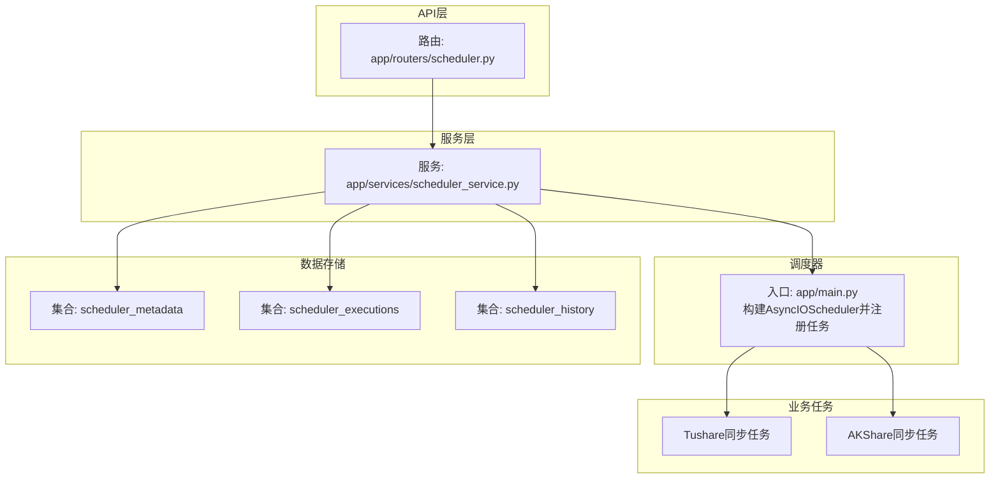
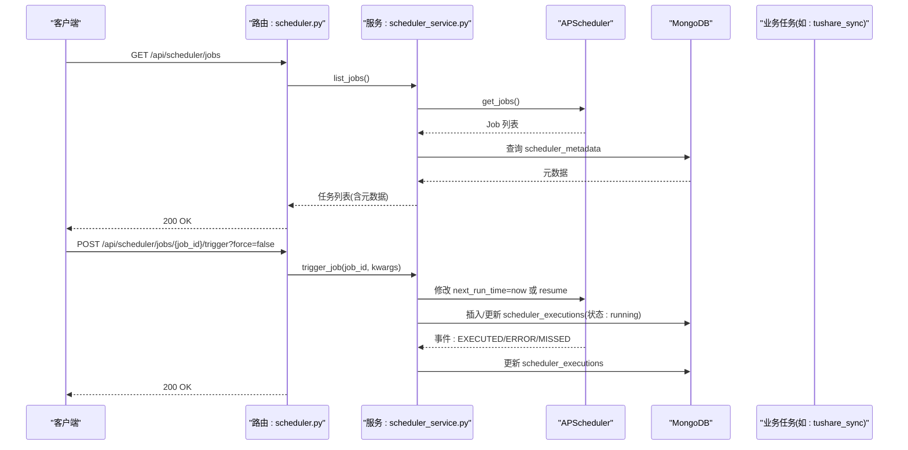
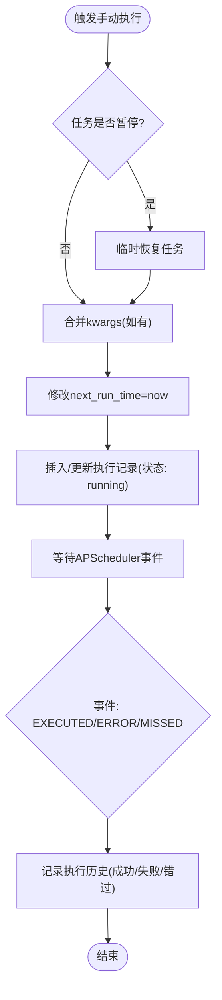
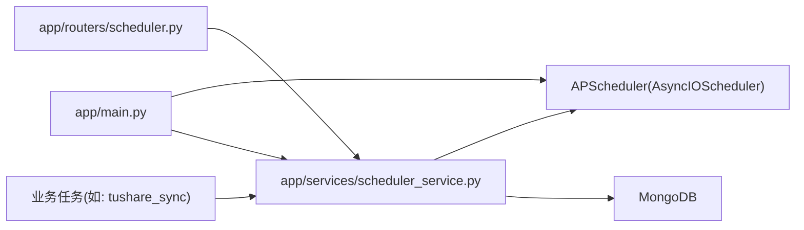

# 任务调度API

<cite>
**本文引用的文件**
- [app/routers/scheduler.py](file://app/routers/scheduler.py)
- [app/services/scheduler_service.py](file://app/services/scheduler_service.py)
- [app/main.py](file://app/main.py)
- [scripts/init_scheduler_metadata.py](file://scripts/init_scheduler_metadata.py)
- [app/worker/tushare_sync_service.py](file://app/worker/tushare_sync_service.py)
- [app/worker/akshare_sync_service.py](file://app/worker/akshare_sync_service.py)
- [frontend/src/api/scheduler.ts](file://frontend/src/api/scheduler.ts)
- [docs/guides/scheduler_management.md](file://docs/guides/scheduler_management.md)
</cite>

## 目录
1. [简介](#简介)
2. [项目结构](#项目结构)
3. [核心组件](#核心组件)
4. [架构总览](#架构总览)
5. [详细组件分析](#详细组件分析)
6. [依赖关系分析](#依赖关系分析)
7. [性能考量](#性能考量)
8. [故障排查指南](#故障排查指南)
9. [结论](#结论)
10. [附录](#附录)

## 简介
本文件面向开发者与运维人员，系统化梳理“任务调度API”的设计与实现，覆盖定时任务的创建、查询、启用/禁用、手动触发与执行状态监控；详解基于 APscheduler 的异步调度器、任务元数据存储于 MongoDB 的实现方式；并提供多数据源同步任务与定期分析任务的配置示例，以及任务执行日志、错误重试策略与告警通知机制的说明。

## 项目结构
- 路由层：提供 /api/scheduler 下的 REST 接口，包括任务列表、详情、暂停/恢复、手动触发、历史查询、统计与健康检查等。
- 服务层：封装 APscheduler 异步调度器，负责事件监听、历史记录、元数据管理、进度更新与僵尸任务检测。
- 应用入口：在启动阶段构建调度器、注册各类数据源同步任务，并将调度器实例注入服务层。
- 数据存储：MongoDB 中的 scheduler_metadata、scheduler_executions、scheduler_history 三类集合分别承载任务元数据、执行记录与操作历史。
- 前端接口契约：定义了任务、执行记录、统计与健康检查的数据结构，便于前后端对接。

图表来源
- [app/routers/scheduler.py](file://app/routers/scheduler.py#L1-L120)
- [app/services/scheduler_service.py](file://app/services/scheduler_service.py#L1-L120)
- [app/main.py](file://app/main.py#L270-L580)

章节来源
- [app/routers/scheduler.py](file://app/routers/scheduler.py#L1-L120)
- [app/services/scheduler_service.py](file://app/services/scheduler_service.py#L1-L120)
- [app/main.py](file://app/main.py#L270-L580)

## 核心组件
- 路由与控制器
  - 提供 /api/scheduler/jobs、/api/scheduler/jobs/{job_id}、/api/scheduler/jobs/{job_id}/pause、/api/scheduler/jobs/{job_id}/resume、/api/scheduler/jobs/{job_id}/trigger、/api/scheduler/jobs/{job_id}/history、/api/scheduler/history、/api/scheduler/stats、/api/scheduler/health、/api/scheduler/executions、/api/scheduler/jobs/{job_id}/executions、/api/scheduler/jobs/{job_id}/execution-stats、/api/scheduler/executions/{execution_id}/cancel、/api/scheduler/executions/{execution_id}/mark-failed、/api/scheduler/executions/{execution_id} 等端点。
  - 管理员鉴权：暂停/恢复/手动触发/元数据更新等操作均要求管理员权限。
- 调度服务
  - 基于 APscheduler AsyncIOScheduler，监听任务执行成功、失败、错过事件，自动记录执行历史。
  - 提供任务列表、详情、暂停/恢复、手动触发、历史查询、统计、健康检查、取消执行、标记失败、删除执行等能力。
  - 内置僵尸任务检测（长时间 running 的任务自动标记失败）。
- 应用入口
  - 启动时创建 AsyncIOScheduler，按配置注册多数据源同步任务（Tushare/AKShare/BaoStock/新闻），并启动调度器。
  - 将调度器实例注入服务层，使 API 可以管理任务。
- MongoDB 存储
  - scheduler_metadata：任务元数据（display_name、description、updated_at）。
  - scheduler_executions：任务执行记录（状态、计划时间、实际执行时间、进度、错误信息、是否手动触发、取消标记等）。
  - scheduler_history：任务操作历史（pause/resume/trigger 等）。

章节来源
- [app/routers/scheduler.py](file://app/routers/scheduler.py#L1-L530)
- [app/services/scheduler_service.py](file://app/services/scheduler_service.py#L1-L220)
- [app/main.py](file://app/main.py#L270-L580)

## 架构总览
下图展示了调度API的端到端流程：API 路由接收请求，调度服务与 APscheduler 协作，业务任务执行并产生事件，服务层记录执行历史与操作历史，最终通过 MongoDB 持久化。

图表来源
- [app/routers/scheduler.py](file://app/routers/scheduler.py#L180-L221)
- [app/services/scheduler_service.py](file://app/services/scheduler_service.py#L152-L219)
- [app/services/scheduler_service.py](file://app/services/scheduler_service.py#L766-L809)

## 详细组件分析

### 路由与端点
- 任务管理
  - GET /api/scheduler/jobs：获取所有任务列表（含 display_name、description）。
  - GET /api/scheduler/jobs/{job_id}：获取任务详情（含触发器、函数签名、参数等）。
  - POST /api/scheduler/jobs/{job_id}/pause：暂停任务（管理员）。
  - POST /api/scheduler/jobs/{job_id}/resume：恢复任务（管理员）。
  - PUT /api/scheduler/jobs/{job_id}/metadata：更新任务元数据（管理员）。
- 手动触发与历史
  - POST /api/scheduler/jobs/{job_id}/trigger?force=false：手动触发任务（管理员），支持 force 参数（对特定任务生效）。
  - GET /api/scheduler/jobs/{job_id}/history：任务历史（分页）。
  - GET /api/scheduler/history：全量历史（分页，支持 job_id/status 过滤）。
  - GET /api/scheduler/executions：执行记录（分页，支持 job_id/status/is_manual 过滤）。
  - GET /api/scheduler/jobs/{job_id}/executions：单任务执行记录（分页，支持过滤）。
  - GET /api/scheduler/jobs/{job_id}/execution-stats：任务执行统计。
  - POST /api/scheduler/executions/{execution_id}/cancel：取消执行（running 状态）。
  - POST /api/scheduler/executions/{execution_id}/mark-failed：标记失败（修复僵尸/异常状态）。
  - DELETE /api/scheduler/executions/{execution_id}：删除执行记录（非 running）。
- 统计与健康
  - GET /api/scheduler/stats：调度器统计（任务总数、运行中、暂停数、运行状态）。
  - GET /api/scheduler/health：调度器健康检查。

章节来源
- [app/routers/scheduler.py](file://app/routers/scheduler.py#L1-L530)

### 调度服务与事件监听
- 事件监听
  - 监听 EXECUTED、ERROR、MISSED 事件，异步记录执行历史。
  - 成功/失败时计算执行时长，记录返回值、错误信息、traceback、进度等。
- 僵尸任务检测
  - 定时任务每5分钟扫描 scheduler_executions 中超过30分钟仍为 running 的记录，标记为 failed 并记录警告。
- 手动触发
  - 若任务暂停，临时恢复后再执行一次，不自动再次暂停。
  - 支持合并 kwargs，立即创建 running 记录，便于前端即时反馈。
- 历史与统计
  - 支持按 job_id、status、is_manual 过滤执行记录。
  - 统计各状态次数与平均执行时长，返回最近一次执行信息。
- 元数据管理
  - 通过 scheduler_metadata 集合维护 display_name、description、updated_at。
  - API 层提供更新接口，服务层提供查询与 upsert 更新。

图表来源
- [app/services/scheduler_service.py](file://app/services/scheduler_service.py#L152-L219)
- [app/services/scheduler_service.py](file://app/services/scheduler_service.py#L766-L809)
- [app/services/scheduler_service.py](file://app/services/scheduler_service.py#L800-L930)

章节来源
- [app/services/scheduler_service.py](file://app/services/scheduler_service.py#L700-L930)

### 应用入口与任务注册
- 启动阶段创建 AsyncIOScheduler，按配置注册多数据源同步任务（Tushare/AKShare/BaoStock/新闻），支持 CronTrigger 或 HH:MM 方案。
- 启动后立即异步触发一次全量基础信息同步，随后按配置周期执行。
- 将调度器实例注入服务层，API 可以管理任务。

章节来源
- [app/main.py](file://app/main.py#L270-L580)

### MongoDB 集合与数据模型
- scheduler_metadata
  - 字段：job_id、display_name、description、updated_at。
  - 用途：为任务提供更友好的触发器名称与描述。
- scheduler_executions
  - 字段：job_id、job_name、status、scheduled_time、execution_time、timestamp、progress、progress_message、current_item、total_items、processed_items、updated_at、is_manual、cancel_requested、error_message、traceback。
  - 用途：记录每次执行的生命周期与状态。
- scheduler_history
  - 字段：job_id、action（pause/resume/trigger）、status（success/failed）、error_message、timestamp。
  - 用途：记录管理员操作与异常事件。

章节来源
- [app/services/scheduler_service.py](file://app/services/scheduler_service.py#L800-L1161)
- [docs/guides/scheduler_management.md](file://docs/guides/scheduler_management.md#L245-L263)

### 任务元数据初始化与管理
- 提供脚本初始化预设任务元数据（display_name、description），支持更新与列出。
- API 层提供管理员更新接口，服务层通过 upsert 写入 scheduler_metadata。

章节来源
- [scripts/init_scheduler_metadata.py](file://scripts/init_scheduler_metadata.py#L1-L211)
- [app/routers/scheduler.py](file://app/routers/scheduler.py#L57-L92)
- [app/services/scheduler_service.py](file://app/services/scheduler_service.py#L959-L1027)

### 业务任务与进度更新
- 业务任务（如 Tushare/AKShare 同步）在执行过程中可通过 update_job_progress 更新执行进度与消息，服务层会检查取消请求并及时停止。
- 服务层提供同步客户端写入 scheduler_executions，避免事件循环冲突。

章节来源
- [app/worker/tushare_sync_service.py](file://app/worker/tushare_sync_service.py#L1-L200)
- [app/worker/akshare_sync_service.py](file://app/worker/akshare_sync_service.py#L1-L200)
- [app/services/scheduler_service.py](file://app/services/scheduler_service.py#L1065-L1161)

## 依赖关系分析
- 路由依赖服务：路由层通过依赖注入获取调度服务实例。
- 服务依赖调度器：服务层持有 AsyncIOScheduler 实例，用于暂停/恢复/手动触发等。
- 服务依赖数据库：通过 get_mongo_db 获取连接，读写 scheduler_metadata、scheduler_executions、scheduler_history。
- 应用入口依赖服务：启动时创建调度器并注册任务，随后将实例注入服务层。
- 业务任务依赖服务：业务任务在执行中调用服务层进度更新与数据库写入。

图表来源
- [app/routers/scheduler.py](file://app/routers/scheduler.py#L1-L120)
- [app/services/scheduler_service.py](file://app/services/scheduler_service.py#L1-L120)
- [app/main.py](file://app/main.py#L270-L580)

章节来源
- [app/routers/scheduler.py](file://app/routers/scheduler.py#L1-L120)
- [app/services/scheduler_service.py](file://app/services/scheduler_service.py#L1-L120)
- [app/main.py](file://app/main.py#L270-L580)

## 性能考量
- 异步调度：使用 AsyncIOScheduler，避免阻塞事件循环，适合高并发任务场景。
- 事件驱动记录：通过事件监听异步写入执行历史，降低主线程压力。
- 僵尸任务检测：定期扫描长时间 running 的记录，防止资源泄漏。
- 进度更新：业务任务通过同步客户端写入进度，避免阻塞事件循环。
- 查询优化：历史查询支持分页与多字段过滤，建议在 MongoDB 上建立相应索引（参考集合说明）。

[本节为通用指导，无需具体文件引用]

## 故障排查指南
- 手动触发无效
  - 检查任务是否存在与是否暂停；若暂停，服务层会临时恢复后执行一次。
  - 确认管理员权限与 force 参数使用范围。
- 执行记录未更新
  - 确认 APscheduler 事件监听是否生效；检查服务层事件回调逻辑。
  - 检查 scheduler_executions 集合写入是否成功。
- 僵尸任务
  - 系统会每5分钟扫描并标记超过30分钟的 running 任务为 failed；可在 UI 中查看并删除或标记失败。
- 取消执行
  - 仅对 running 状态的执行记录有效；服务层会设置 cancel_requested 标记，业务任务应定期检查并优雅退出。
- 健康检查
  - 使用 /api/scheduler/health 检查调度器运行状态；若停止，需重启调度器。

章节来源
- [app/services/scheduler_service.py](file://app/services/scheduler_service.py#L722-L765)
- [app/services/scheduler_service.py](file://app/services/scheduler_service.py#L451-L537)
- [app/routers/scheduler.py](file://app/routers/scheduler.py#L444-L503)

## 结论
该任务调度API以 APscheduler 为核心，结合 MongoDB 的元数据与执行历史持久化，实现了完善的定时任务生命周期管理与可观测性。通过管理员权限控制与事件驱动记录，系统具备良好的安全性与可追溯性。业务任务可无缝接入进度上报与取消机制，满足复杂数据同步与分析场景的需求。

[本节为总结，无需具体文件引用]

## 附录

### API 端点一览与使用要点
- 任务列表与详情
  - GET /api/scheduler/jobs：返回任务列表（含 display_name、description）。
  - GET /api/scheduler/jobs/{job_id}：返回任务详情（含触发器、函数签名、参数等）。
- 启用/禁用与元数据
  - POST /api/scheduler/jobs/{job_id}/pause：暂停任务（管理员）。
  - POST /api/scheduler/jobs/{job_id}/resume：恢复任务（管理员）。
  - PUT /api/scheduler/jobs/{job_id}/metadata：更新任务元数据（管理员）。
- 手动触发与历史
  - POST /api/scheduler/jobs/{job_id}/trigger?force=false：手动触发任务（管理员）。
  - GET /api/scheduler/jobs/{job_id}/history：任务历史（分页）。
  - GET /api/scheduler/history：全量历史（分页，支持 job_id/status 过滤）。
  - GET /api/scheduler/executions：执行记录（分页，支持 job_id/status/is_manual 过滤）。
  - GET /api/scheduler/jobs/{job_id}/executions：单任务执行记录（分页，支持过滤）。
  - GET /api/scheduler/jobs/{job_id}/execution-stats：任务执行统计。
  - POST /api/scheduler/executions/{execution_id}/cancel：取消执行（running）。
  - POST /api/scheduler/executions/{execution_id}/mark-failed：标记失败。
  - DELETE /api/scheduler/executions/{execution_id}：删除执行记录（非 running）。
- 统计与健康
  - GET /api/scheduler/stats：调度器统计。
  - GET /api/scheduler/health：调度器健康检查。

章节来源
- [app/routers/scheduler.py](file://app/routers/scheduler.py#L1-L530)

### Cron 表达式与触发器
- 启动阶段支持 CronTrigger.from_crontab 或 HH:MM 方案，按配置注册多数据源同步任务。
- 业务任务在执行中可调用 update_job_progress 更新进度与消息，服务层会检查取消请求并优雅退出。

章节来源
- [app/main.py](file://app/main.py#L300-L580)
- [app/worker/tushare_sync_service.py](file://app/worker/tushare_sync_service.py#L1-L200)
- [app/worker/akshare_sync_service.py](file://app/worker/akshare_sync_service.py#L1-L200)

### 任务依赖管理与手动触发机制
- 依赖管理
  - 通过调度器注册任务时指定 id/name，API 可按 job_id 精确控制。
  - 业务任务内部可自行判断依赖（如数据源可用性、前置任务完成状态），并在执行中上报进度。
- 手动触发
  - API 支持管理员手动触发；服务层会临时恢复暂停任务并创建 running 记录，便于前端即时反馈。
  - 特定任务支持 force 参数（如行情同步），用于跳过交易时间检查等。

章节来源
- [app/routers/scheduler.py](file://app/routers/scheduler.py#L182-L221)
- [app/services/scheduler_service.py](file://app/services/scheduler_service.py#L152-L219)

### 示例：多数据源同步任务与定期分析任务
- 多数据源同步任务
  - 启动阶段按配置注册 Tushare/AKShare/BaoStock 的基础信息、行情、历史、财务与状态检查任务。
  - 业务任务在执行中批量处理、限流、更新进度与统计信息。
- 定期分析任务
  - 可在启动阶段注册分析类任务（如新闻同步），通过 CronTrigger 定时执行。
  - 业务任务内部可调用 update_job_progress 上报进度，服务层自动记录执行历史。

章节来源
- [app/main.py](file://app/main.py#L334-L571)
- [app/worker/tushare_sync_service.py](file://app/worker/tushare_sync_service.py#L74-L200)
- [app/worker/akshare_sync_service.py](file://app/worker/akshare_sync_service.py#L62-L200)

### 执行日志、错误重试与告警
- 执行日志
  - 事件监听记录成功/失败/错过事件，包含执行时长、返回值、错误信息与堆栈。
- 错误重试
  - 业务任务内部实现最大重试次数与限流策略；服务层记录失败事件并支持标记失败或删除记录。
- 告警通知
  - 前端接口契约定义了执行记录字段，可用于前端展示与交互；系统未内置告警通知机制，建议在前端或外部系统中基于执行记录进行告警。

章节来源
- [app/services/scheduler_service.py](file://app/services/scheduler_service.py#L766-L809)
- [app/services/scheduler_service.py](file://app/services/scheduler_service.py#L800-L930)
- [frontend/src/api/scheduler.ts](file://frontend/src/api/scheduler.ts#L1-L77)