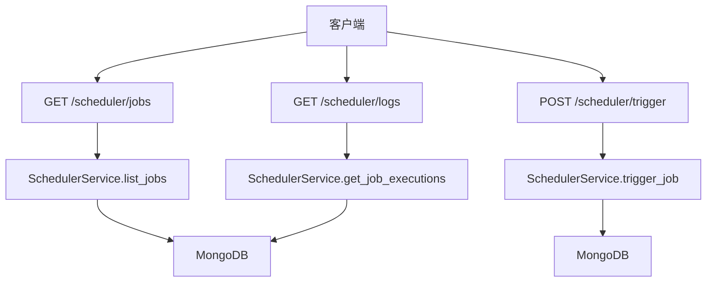
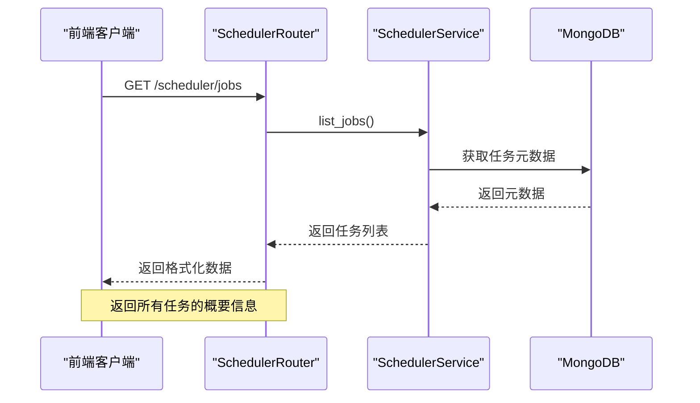
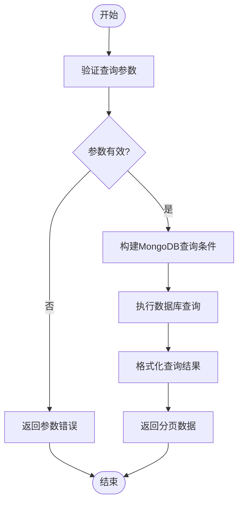
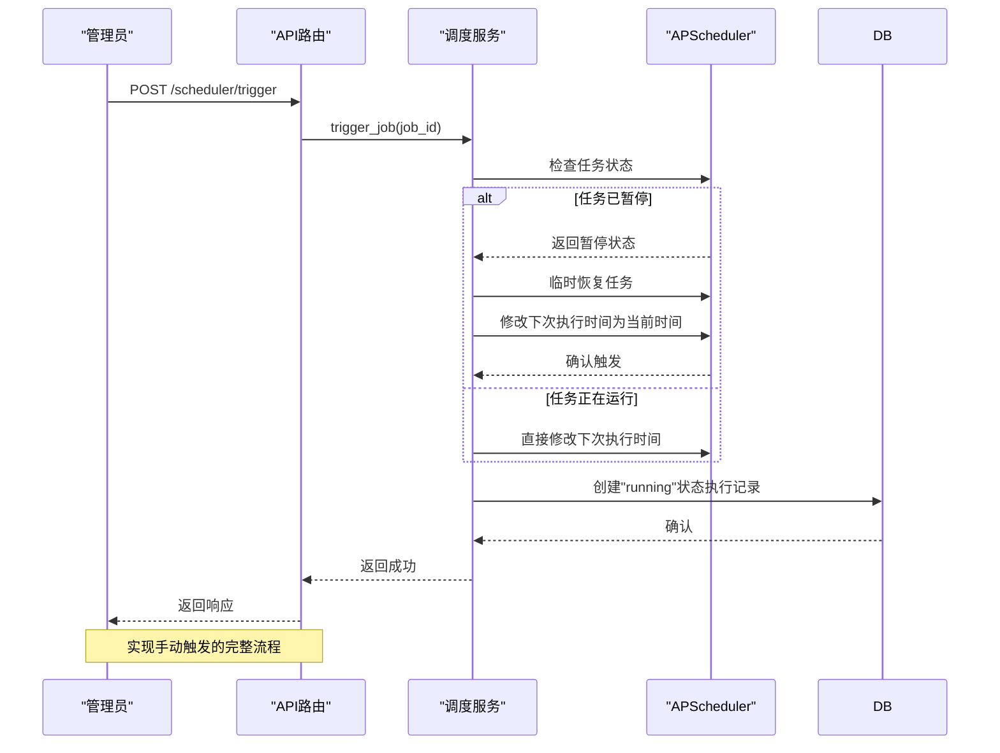
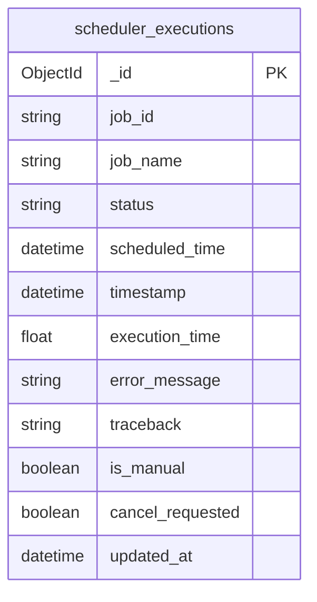
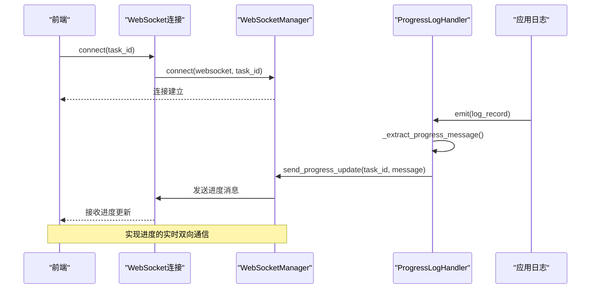
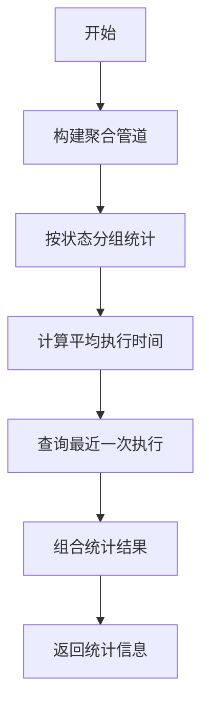
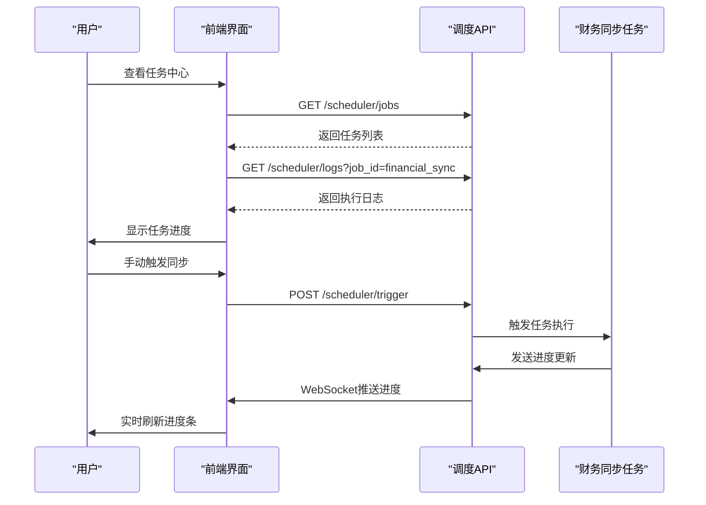

# 调度状态监控API

<cite>
**本文档引用的文件**   
- [scheduler.py](file://app/routers/scheduler.py)
- [scheduler_service.py](file://app/services/scheduler_service.py)
- [websocket_manager.py](file://app/services/websocket_manager.py)
- [log_handler.py](file://app/services/progress/log_handler.py)
- [tracker.py](file://app/services/progress/tracker.py)
</cite>

## 目录
1. [引言](#引言)
2. [核心API端点](#核心api端点)
3. [任务执行状态查询](#任务执行状态查询)
4. [日志获取与分页查询](#日志获取与分页查询)
5. [手动触发功能](#手动触发功能)
6. [执行日志存储结构](#执行日志存储结构)
7. [WebSocket任务进度推送](#websocket任务进度推送)
8. [任务执行统计与告警](#任务执行统计与告警)
9. [使用示例](#使用示例)
10. [结论](#结论)

## 引言

调度状态监控API为系统提供了全面的任务执行状态监控能力，支持对定时任务的查询、日志获取和手动触发操作。该API基于APScheduler调度框架构建，通过MongoDB存储执行日志，并利用WebSocket实现任务进度的实时推送。系统为管理员提供了对任务生命周期的完整控制，包括暂停、恢复和手动触发功能。

**Section sources**
- [scheduler.py](file://app/routers/scheduler.py#L1-L530)
- [scheduler_service.py](file://app/services/scheduler_service.py#L1-L1161)

## 核心API端点

调度状态监控API提供了三个核心端点，分别用于任务状态查询、手动触发和日志获取：

- `GET /scheduler/jobs`：获取所有定时任务列表，包括任务ID、名称、状态和下次执行时间
- `POST /scheduler/trigger`：手动触发指定任务执行
- `GET /scheduler/logs`：获取任务执行历史日志

这些端点构成了任务监控系统的基础，为前端任务中心提供了数据支持。

**Diagram sources **
- [scheduler.py](file://app/routers/scheduler.py#L39-L530)
- [scheduler_service.py](file://app/services/scheduler_service.py#L67-L800)

## 任务执行状态查询

### 任务列表查询

`GET /scheduler/jobs` 端点用于获取所有定时任务的列表信息。该接口返回每个任务的基本状态，包括：

- 任务ID和名称
- 当前状态（运行中/已暂停）
- 下次执行时间
- 触发器配置
- 自定义显示名称和描述

**Diagram sources **
- [scheduler.py](file://app/routers/scheduler.py#L39-L53)
- [scheduler_service.py](file://app/services/scheduler_service.py#L67-L85)

### 任务详情查询

通过 `GET /scheduler/jobs/{job_id}` 端点可以获取指定任务的详细信息，包括任务的完整配置、参数和执行历史统计。

**Section sources**
- [scheduler.py](file://app/routers/scheduler.py#L94-L118)
- [scheduler_service.py](file://app/services/scheduler_service.py#L87-L107)

## 日志获取与分页查询

### 分页查询机制

日志获取端点支持标准的分页查询，通过以下参数实现：

- `limit`：每页返回的数量限制（1-200）
- `offset`：偏移量，用于实现翻页
- `job_id`：任务ID过滤
- `status`：状态过滤（success/failed/missed/running）
- `is_manual`：是否手动触发过滤

**Diagram sources **
- [scheduler.py](file://app/routers/scheduler.py#L338-L378)
- [scheduler_service.py](file://app/services/scheduler_service.py#L344-L408)

### 过滤条件

系统支持多种过滤条件组合查询，允许用户根据任务ID、执行状态和触发方式等条件筛选日志记录。特别地，`is_manual` 参数可以区分手动触发和自动执行的任务。

**Section sources**
- [scheduler.py](file://app/routers/scheduler.py#L342-L346)
- [scheduler_service.py](file://app/services/scheduler_service.py#L375-L384)

## 手动触发功能

### 触发机制

`POST /scheduler/trigger` 端点允许管理员手动触发任务执行。当任务处于暂停状态时，系统会临时恢复任务以执行一次，但不会自动重新暂停。

**Diagram sources **
- [scheduler.py](file://app/routers/scheduler.py#L182-L221)
- [scheduler_service.py](file://app/services/scheduler_service.py#L152-L219)

### 强制执行模式

特定任务（如`tushare_quotes_sync`、`akshare_quotes_sync`）支持`force`参数，允许跳过交易时间检查等限制条件，实现强制执行。

**Section sources**
- [scheduler.py](file://app/routers/scheduler.py#L187-L208)
- [scheduler_service.py](file://app/services/scheduler_service.py#L180-L188)

## 执行日志存储结构

### MongoDB集合设计

系统使用MongoDB的`scheduler_executions`集合存储任务执行日志，主要字段包括：

- `_id`：执行记录ID（ObjectId）
- `job_id`：任务ID
- `job_name`：任务名称
- `status`：执行状态（success/failed/missed/running）
- `scheduled_time`：计划执行时间
- `timestamp`：实际执行时间戳
- `execution_time`：执行耗时（秒）
- `error_message`：错误信息
- `traceback`：堆栈跟踪
- `is_manual`：是否手动触发
- `cancel_requested`：取消请求标记

**Diagram sources **
- [scheduler_service.py](file://app/services/scheduler_service.py#L205-L211)
- [scheduler_service.py](file://app/services/scheduler_service.py#L774-L781)

### 索引优化

为提高查询性能，系统在关键字段上创建了复合索引：

- `{"job_id": 1, "timestamp": -1}`：按任务ID和时间倒序查询
- `{"status": 1, "timestamp": -1}`：按状态和时间查询
- `{"is_manual": 1, "timestamp": -1}`：按触发方式和时间查询

**Section sources**
- [scheduler_service.py](file://app/services/scheduler_service.py#L240-L242)
- [scheduler_service.py](file://app/services/scheduler_service.py#L385-L386)

## WebSocket任务进度推送

### 实时推送机制

系统通过WebSocket实现任务进度的实时推送，前端可以建立连接并监听特定任务的进度更新。

**Diagram sources **
- [websocket_manager.py](file://app/services/websocket_manager.py#L14-L89)
- [log_handler.py](file://app/services/progress/log_handler.py#L15-L186)

### 进度跟踪器

`RedisProgressTracker`类负责管理任务的进度状态，包括：

- 动态生成分析步骤
- 计算预估总时长
- 更新当前进度百分比
- 管理步骤状态转换

**Section sources**
- [tracker.py](file://app/services/progress/tracker.py#L46-L541)
- [log_handler.py](file://app/services/progress/log_handler.py#L15-L186)

## 任务执行统计与告警

### 执行耗时统计

系统自动记录每个任务的执行耗时，并计算成功率。`get_job_execution_stats`方法通过MongoDB聚合管道统计：

- 总执行次数
- 成功/失败/错失次数
- 平均执行时间
- 最近一次执行状态

**Diagram sources **
- [scheduler_service.py](file://app/services/scheduler_service.py#L577-L633)

### 告警阈值检测

系统内置了僵尸任务检测机制，定期检查长时间处于"running"状态的任务（超过30分钟），并自动将其标记为失败状态，防止任务卡死。

**Section sources**
- [scheduler_service.py](file://app/services/scheduler_service.py#L733-L764)
- [scheduler_service.py](file://app/services/scheduler_service.py#L700-L731)

## 使用示例

### 监控财务数据同步任务

**Section sources**
- [scheduler.py](file://app/routers/scheduler.py#L39-L530)
- [websocket_manager.py](file://app/services/websocket_manager.py#L14-L89)

### 获取失败任务的错误堆栈

通过`GET /scheduler/logs`接口查询状态为"failed"的日志记录，可以从`traceback`字段获取完整的错误堆栈信息，便于问题排查。

### 前端任务中心实时刷新

前端通过WebSocket连接到`/ws/progress/{task_id}`，实时接收任务进度更新，实现无需轮询的实时刷新功能。

**Section sources**
- [scheduler_service.py](file://app/services/scheduler_service.py#L774-L781)
- [log_handler.py](file://app/services/progress/log_handler.py#L74-L103)

## 结论

调度状态监控API提供了一套完整的任务监控解决方案，涵盖了任务查询、日志获取、手动触发和实时进度推送等核心功能。系统基于APScheduler和MongoDB构建，具有良好的可扩展性和稳定性。通过WebSocket实现实时通信，为前端提供了流畅的用户体验。完善的统计和告警机制确保了任务执行的可靠性和可观测性。