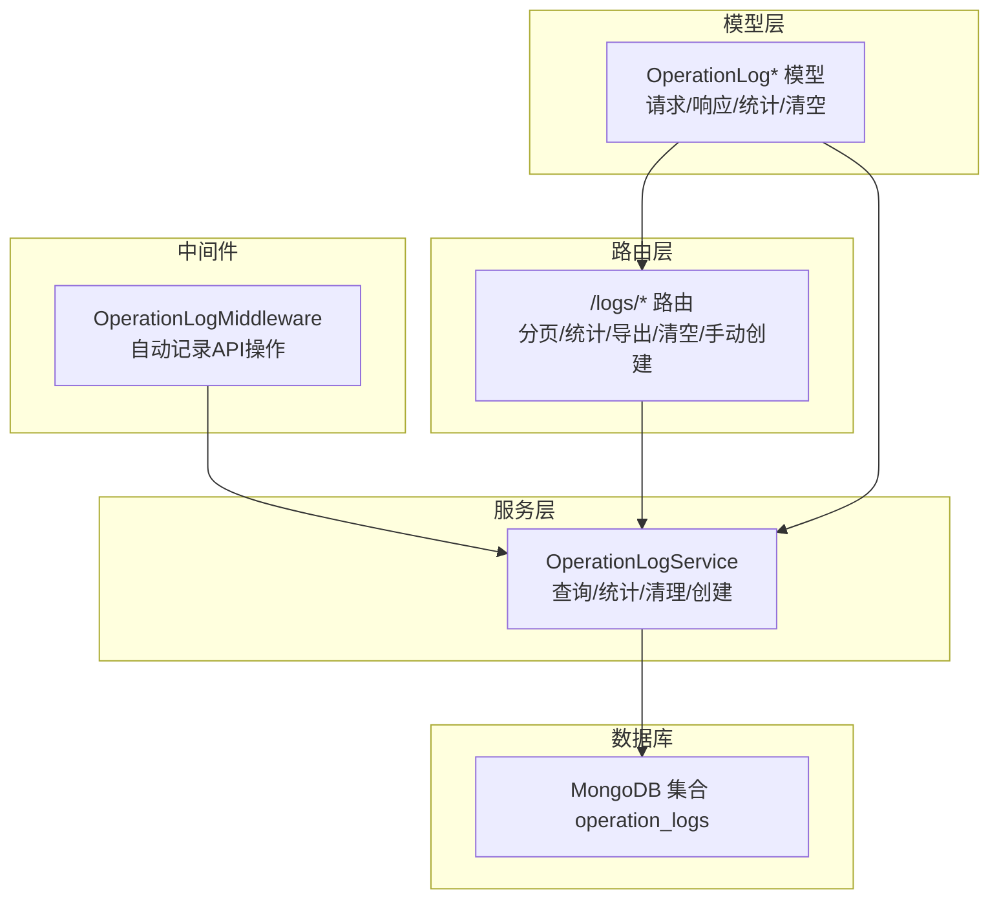
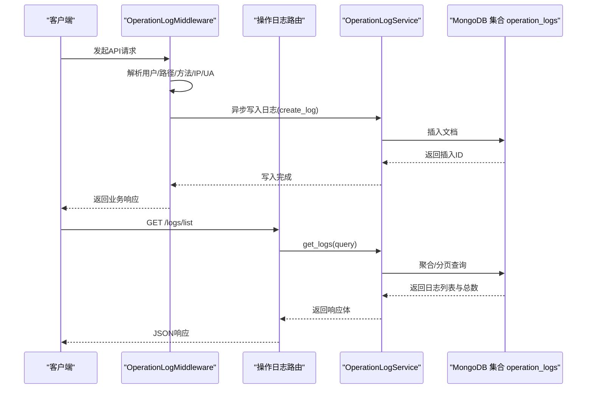
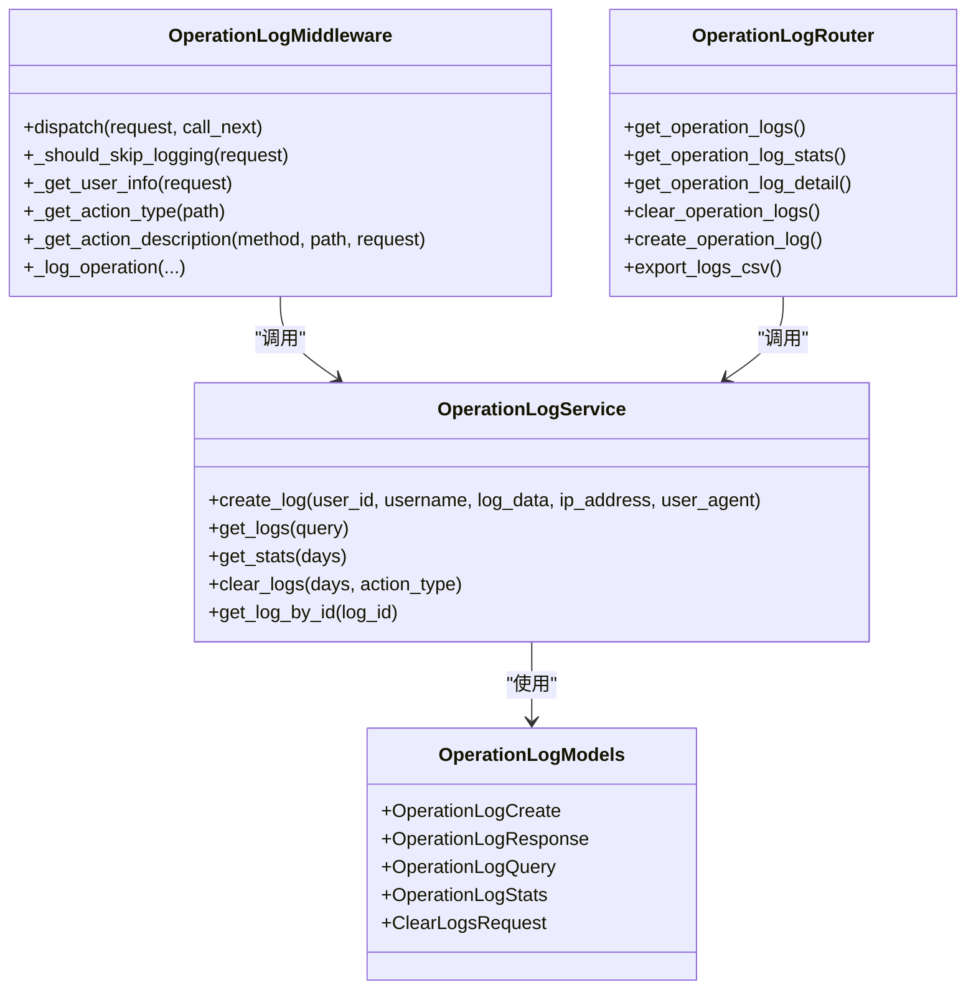

# 操作日志API

<cite>
**本文引用的文件**
- [app/middleware/operation_log_middleware.py](file://app/middleware/operation_log_middleware.py)
- [app/models/operation_log.py](file://app/models/operation_log.py)
- [app/routers/operation_logs.py](file://app/routers/operation_logs.py)
- [app/services/operation_log_service.py](file://app/services/operation_log_service.py)
- [app/core/database.py](file://app/core/database.py)
- [app/core/config.py](file://app/core/config.py)
- [tests/test_operation_logs.py](file://tests/test_operation_logs.py)
- [frontend/src/views/System/OperationLogs.vue](file://frontend/src/views/System/OperationLogs.vue)
- [web/components/operation_logs.py](file://web/components/operation_logs.py)
</cite>

## 目录
1. [简介](#简介)
2. [项目结构](#项目结构)
3. [核心组件](#核心组件)
4. [架构总览](#架构总览)
5. [详细组件分析](#详细组件分析)
6. [依赖关系分析](#依赖关系分析)
7. [性能考量](#性能考量)
8. [故障排查指南](#故障排查指南)
9. [结论](#结论)
10. [附录](#附录)

## 简介
本技术文档围绕“操作日志API”展开，系统性说明用户操作记录的采集、存储与查询机制。重点覆盖：
- 后端API端点：分页查询、过滤条件（按用户、操作类型、时间范围、成功状态、关键词）、响应格式
- 中间件实现：请求上下文捕获、用户识别、操作类型映射、异步写入策略
- 数据模型：字段定义、索引策略、存储周期与清理
- 前端集成：日志管理界面与后端API的交互示例
- 安全审计与行为分析：统计与导出能力

## 项目结构
操作日志相关代码分布在以下模块：
- 中间件层：自动拦截API请求并记录操作日志
- 路由层：对外暴露查询、统计、导出、清空、手动创建等API
- 服务层：封装MongoDB集合操作、聚合统计、分页查询、清理策略
- 模型层：定义请求/响应/统计/清空等数据结构
- 前端：Vue与Streamlit两套界面，展示日志列表、统计与导出

图表来源
- [app/middleware/operation_log_middleware.py](file://app/middleware/operation_log_middleware.py#L1-L313)
- [app/routers/operation_logs.py](file://app/routers/operation_logs.py#L1-L271)
- [app/services/operation_log_service.py](file://app/services/operation_log_service.py#L1-L285)
- [app/models/operation_log.py](file://app/models/operation_log.py#L1-L138)
- [app/core/database.py](file://app/core/database.py#L347-L369)

章节来源
- [app/middleware/operation_log_middleware.py](file://app/middleware/operation_log_middleware.py#L1-L313)
- [app/routers/operation_logs.py](file://app/routers/operation_logs.py#L1-L271)
- [app/services/operation_log_service.py](file://app/services/operation_log_service.py#L1-L285)
- [app/models/operation_log.py](file://app/models/operation_log.py#L1-L138)
- [app/core/database.py](file://app/core/database.py#L347-L369)

## 核心组件
- 中间件：自动拦截API请求，提取用户、IP、UA、耗时、状态等信息，并异步写入MongoDB
- 路由：提供分页查询、统计、导出、清空、手动创建等端点
- 服务：封装MongoDB操作、聚合统计、分页查询、清理策略
- 模型：定义请求/响应/统计/清空等数据结构与字段约束
- 前端：Vue与Streamlit界面，调用后端API并可视化展示

章节来源
- [app/middleware/operation_log_middleware.py](file://app/middleware/operation_log_middleware.py#L1-L313)
- [app/routers/operation_logs.py](file://app/routers/operation_logs.py#L1-L271)
- [app/services/operation_log_service.py](file://app/services/operation_log_service.py#L1-L285)
- [app/models/operation_log.py](file://app/models/operation_log.py#L1-L138)

## 架构总览
操作日志的采集-存储-查询链路如下：

图表来源
- [app/middleware/operation_log_middleware.py](file://app/middleware/operation_log_middleware.py#L57-L120)
- [app/services/operation_log_service.py](file://app/services/operation_log_service.py#L30-L126)
- [app/routers/operation_logs.py](file://app/routers/operation_logs.py#L25-L64)

## 详细组件分析

### 中间件：OperationLogMiddleware
- 功能要点
  - 跳过路径：健康检查、文档、SSE流、日志API自身等
  - 请求上下文捕获：用户信息、IP、UA、方法、路径、耗时
  - 操作类型映射：基于路径前缀映射到预定义类型
  - 异步写入：调用服务层创建日志，异常记录但不影响主流程
  - 用户识别：优先从请求状态获取，其次从Token解析（开源版固定返回admin）

- 关键逻辑
  - 跳过判定：全局开关、路径白名单、仅记录API与特定HTTP方法
  - IP解析：优先X-Forwarded-For或X-Real-IP，否则使用直连IP
  - 用户解析：Bearer Token -> AuthService校验 -> 返回admin用户信息
  - 操作类型与描述：路径前缀映射 + 方法动词组合
  - 异步落库：成功与否、错误信息、耗时、详情等

章节来源
- [app/middleware/operation_log_middleware.py](file://app/middleware/operation_log_middleware.py#L1-L313)

### 路由：/logs/*
- 端点一览
  - GET /logs/list：分页查询，支持时间范围、操作类型、成功状态、关键词、用户ID
  - GET /logs/stats：统计近N天的总日志数、成功/失败数、成功率、类型分布、小时分布
  - GET /logs/{log_id}：按ID获取详情
  - POST /logs/clear：清空日志（可选保留最近N天或仅清空某类型）
  - POST /logs/create：手动创建日志（供内部或特殊场景使用）
  - GET /logs/export/csv：导出CSV（按时间/类型过滤）

- 响应格式
  - 列表响应：包含logs、total、page、page_size、total_pages
  - 统计响应：包含总数、成功数、失败数、成功率、类型分布、小时分布
  - 清空响应：包含删除数量与过滤条件
  - 详情响应：包含单条日志对象
  - 错误响应：HTTP 500并携带错误信息

章节来源
- [app/routers/operation_logs.py](file://app/routers/operation_logs.py#L1-L271)

### 服务：OperationLogService
- 创建日志
  - 文档字段：用户ID/名称、操作类型、动作描述、详情、成功标志、错误信息、耗时、IP、UA、会话ID、时间戳、创建时间
  - 时间存储：使用本地时间（naive datetime）直接写入，不转换为UTC
- 查询日志
  - 过滤条件：时间范围、操作类型、成功状态、用户ID、关键词（动作、用户名、详情中的股票代码）
  - 分页：skip/limit + 按时间倒序
  - 总数：count_documents
- 统计
  - 近N天统计：总/成功/失败/成功率
  - 类型分布：按action_type分组计数
  - 小时分布：按timestamp小时分组计数（24小时）
- 清理
  - 支持按天数删除旧日志或按类型删除
- ID转换
  - 将MongoDB ObjectId转为字符串字段id

章节来源
- [app/services/operation_log_service.py](file://app/services/operation_log_service.py#L1-L285)

### 模型：OperationLog*
- 请求模型：创建日志的输入字段
- 响应模型：列表/详情输出字段，含时间字段序列化为ISO 8601字符串
- 查询模型：分页参数与过滤条件
- 统计模型：总数、成功/失败数、成功率、类型分布、小时分布
- 清空模型：保留天数与类型过滤
- 操作类型枚举：涵盖分析、配置、缓存、导入导出、系统设置、登录登出、用户管理、数据库操作、筛选、报告生成等

章节来源
- [app/models/operation_log.py](file://app/models/operation_log.py#L1-L138)

### 前端集成示例
- Vue界面（System/OperationLogs.vue）
  - 列表：分页查询、关键词/成功状态/类型过滤
  - 统计：饼图展示类型分布，折线图展示小时趋势
  - 清空：二次确认后调用清空接口
  - 导出：调用CSV导出接口
- Streamlit界面（web/components/operation_logs.py）
  - 侧边栏过滤：时间范围、用户名、操作类型
  - 展示统计概览与日志表格

章节来源
- [frontend/src/views/System/OperationLogs.vue](file://frontend/src/views/System/OperationLogs.vue#L116-L524)
- [web/components/operation_logs.py](file://web/components/operation_logs.py#L150-L226)

## 依赖关系分析

图表来源
- [app/middleware/operation_log_middleware.py](file://app/middleware/operation_log_middleware.py#L1-L313)
- [app/routers/operation_logs.py](file://app/routers/operation_logs.py#L1-L271)
- [app/services/operation_log_service.py](file://app/services/operation_log_service.py#L1-L285)
- [app/models/operation_log.py](file://app/models/operation_log.py#L1-L138)

## 性能考量
- 异步写入：中间件在请求完成后异步写入，避免阻塞主请求链路
- 分页与排序：按时间倒序+skip/limit，适合高频写入场景
- 聚合统计：使用Mongo聚合管道，减少多次查询
- 连接池：MongoDB连接池配置合理，超时参数适配历史数据查询
- 建议
  - 为高频查询字段建立索引（见下一节）
  - 控制导出数据量上限，避免一次性导出过多导致内存压力
  - 对关键词搜索使用合适的索引策略，避免全表扫描

章节来源
- [app/middleware/operation_log_middleware.py](file://app/middleware/operation_log_middleware.py#L80-L120)
- [app/services/operation_log_service.py](file://app/services/operation_log_service.py#L71-L126)
- [app/core/database.py](file://app/core/database.py#L347-L369)

## 故障排查指南
- 中间件未记录日志
  - 检查是否命中跳过路径或方法
  - 确认全局开关是否开启
  - 核对用户信息是否能从请求状态或Token解析
- 查询无结果
  - 确认时间范围格式与时区处理
  - 检查关键词是否匹配动作、用户名或详情中的股票代码
- 统计异常
  - 检查时间范围是否正确
  - 确认集合是否存在且有数据
- 导出失败
  - 检查导出接口的查询参数与Mongo连接
- 清理无效
  - 确认过滤条件（天数/类型）是否正确
- 单元测试参考
  - 可运行测试脚本验证创建、查询、统计、导出、清理等流程

章节来源
- [tests/test_operation_logs.py](file://tests/test_operation_logs.py#L1-L125)
- [app/middleware/operation_log_middleware.py](file://app/middleware/operation_log_middleware.py#L98-L119)
- [app/services/operation_log_service.py](file://app/services/operation_log_service.py#L71-L126)

## 结论
本系统通过中间件自动采集、服务层统一处理、路由层清晰暴露，实现了完整的操作日志采集-存储-查询体系。结合前端可视化与导出能力，能够满足日常审计与行为分析需求。建议后续完善索引策略与敏感信息脱敏机制，进一步提升性能与安全性。

## 附录

### API定义与过滤条件
- GET /logs/list
  - 参数：page、page_size、start_date、end_date、action_type、success、keyword、user_id
  - 响应：logs、total、page、page_size、total_pages
- GET /logs/stats
  - 参数：days（默认30）
  - 响应：total_logs、success_logs、failed_logs、success_rate、action_type_distribution、hourly_distribution
- GET /logs/{log_id}
  - 响应：单条日志详情
- POST /logs/clear
  - 请求体：days、action_type
  - 响应：deleted_count、filter
- POST /logs/create
  - 请求体：action_type、action、details、success、error_message、duration_ms、ip_address、user_agent、session_id
  - 响应：log_id
- GET /logs/export/csv
  - 参数：start_date、end_date、action_type
  - 响应：CSV文件流

章节来源
- [app/routers/operation_logs.py](file://app/routers/operation_logs.py#L25-L271)

### 数据模型字段定义
- 创建/响应/查询/统计/清空模型字段详见模型文件

章节来源
- [app/models/operation_log.py](file://app/models/operation_log.py#L1-L138)

### 索引策略
- 当前数据库初始化中创建了部分集合的索引（如stock_basic_info、market_quotes等），但未发现operation_logs集合的专用索引
- 建议为以下字段建立索引以优化查询与统计性能：
  - timestamp（时间倒序查询）
  - action_type（类型过滤）
  - success（成功状态过滤）
  - user_id（用户过滤）
  - username（用户名搜索）
  - details.stock_symbol（股票代码搜索）
- 可参考数据库初始化中的索引创建方式

章节来源
- [app/core/database.py](file://app/core/database.py#L347-L369)

### 存储周期与清理
- 服务层支持按天数清理旧日志；当前未见自动清理策略的定时任务
- 建议引入定时任务定期清理过期日志，或在业务高峰期降低清理频率

章节来源
- [app/services/operation_log_service.py](file://app/services/operation_log_service.py#L197-L227)

### 前端交互示例
- Vue界面：分页查询、统计图表、清空与导出
- Streamlit界面：侧边栏过滤与概览展示

章节来源
- [frontend/src/views/System/OperationLogs.vue](file://frontend/src/views/System/OperationLogs.vue#L116-L524)
- [web/components/operation_logs.py](file://web/components/operation_logs.py#L150-L226)

### 时间与时区说明
- 服务层创建日志时使用本地时间（naive datetime）直接写入，不转换为UTC
- 查询与统计使用MongoDB原生时间存储，返回时序列化为ISO 8601字符串

章节来源
- [app/services/operation_log_service.py](file://app/services/operation_log_service.py#L40-L66)