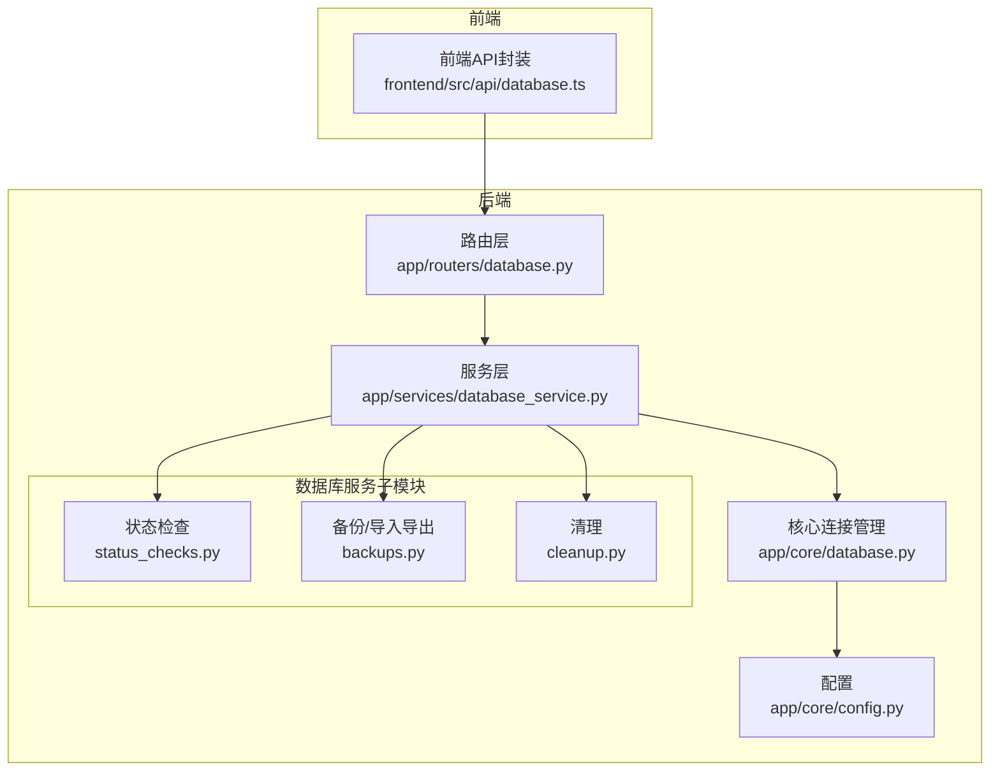
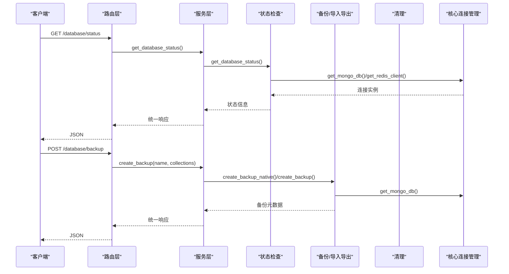
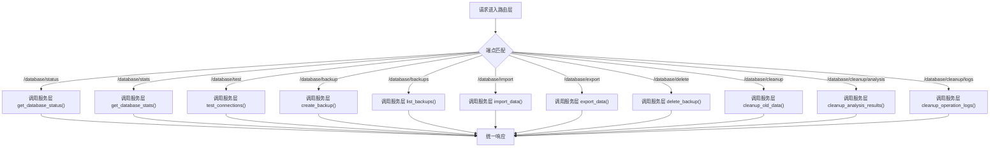
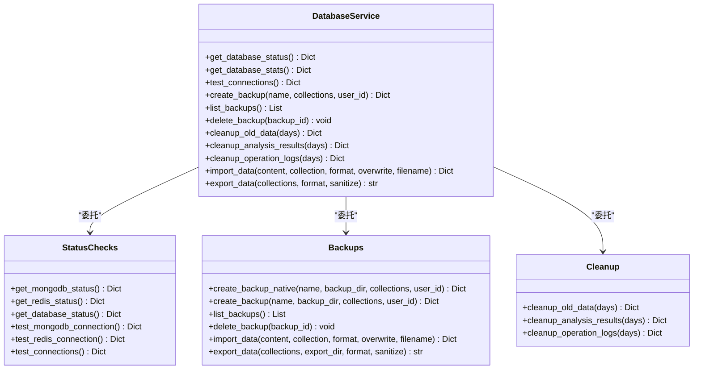
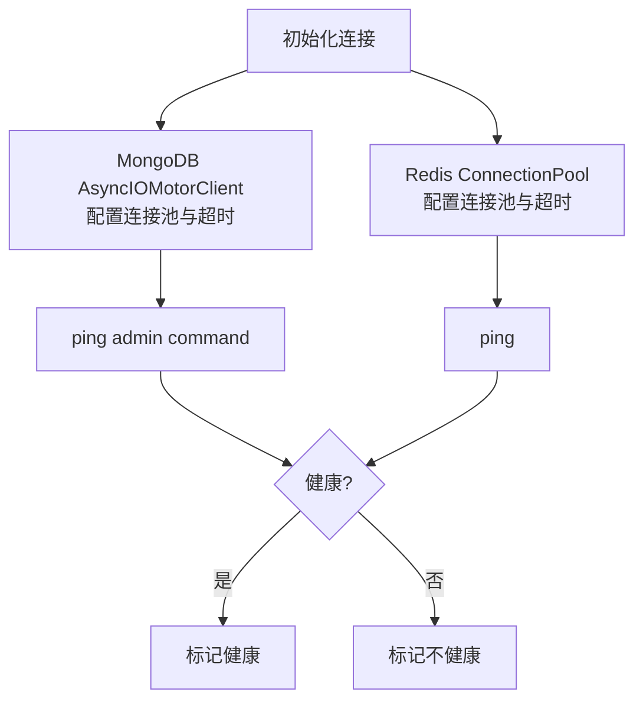
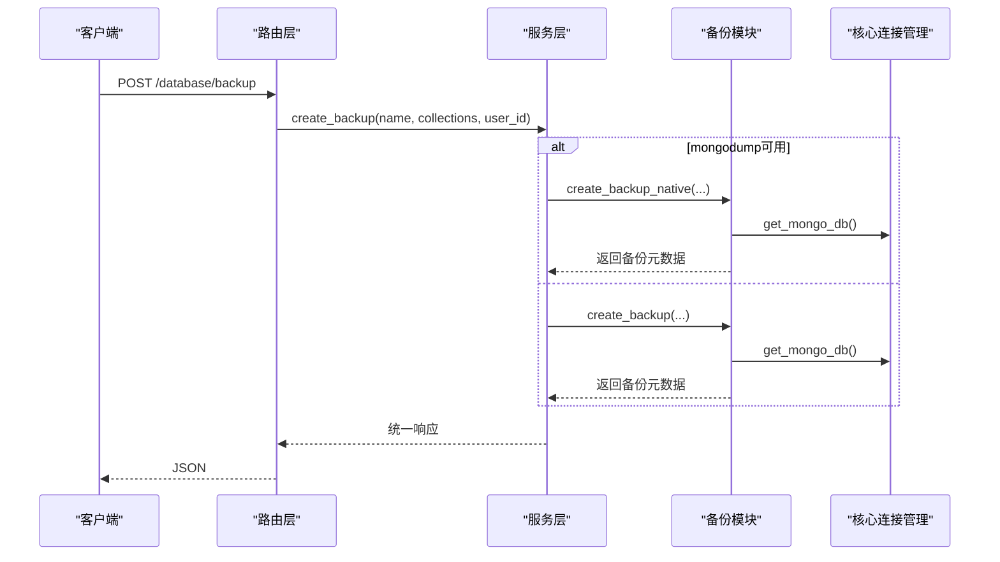
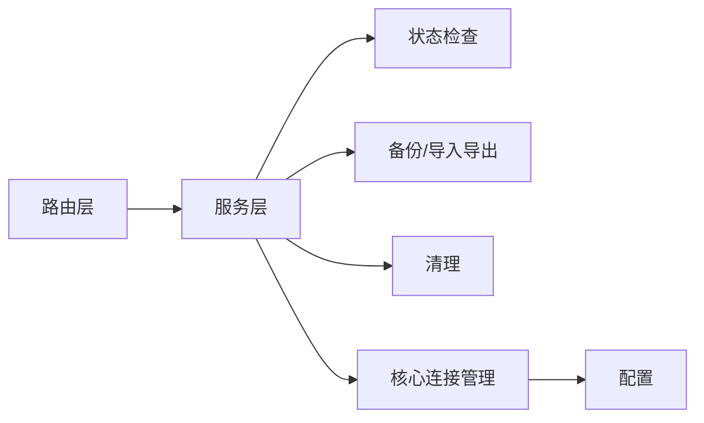

# 数据库管理API

<cite>
**本文引用的文件**
- [app/routers/database.py](file://app/routers/database.py)
- [app/services/database_service.py](file://app/services/database_service.py)
- [app/services/database/status_checks.py](file://app/services/database/status_checks.py)
- [app/services/database/cleanup.py](file://app/services/database/cleanup.py)
- [app/services/database/backups.py](file://app/services/database/backups.py)
- [app/core/database.py](file://app/core/database.py)
- [app/core/config.py](file://app/core/config.py)
- [frontend/src/api/database.ts](file://frontend/src/api/database.ts)
- [docs/architecture/database/DATABASE_MANAGEMENT_IMPLEMENTATION.md](file://docs/architecture/database/DATABASE_MANAGEMENT_IMPLEMENTATION.md)
- [docs/guides/DATABASE_BACKUP_RESTORE.md](file://docs/guides/DATABASE_BACKUP_RESTORE.md)
- [docs/blog/green-version-backup-restore-upgrade.md](file://docs/blog/green-version-backup-restore-upgrade.md)
</cite>

## 目录
1. [简介](#简介)
2. [项目结构](#项目结构)
3. [核心组件](#核心组件)
4. [架构总览](#架构总览)
5. [详细组件分析](#详细组件分析)
6. [依赖关系分析](#依赖关系分析)
7. [性能考量](#性能考量)
8. [故障排查指南](#故障排查指南)
9. [结论](#结论)
10. [附录](#附录)

## 简介
本文件面向数据库管理API的使用者与维护者，系统化梳理“数据库状态检查、备份、清理、导入导出”等能力的实现与使用方式。重点覆盖以下端点与能力：
- 数据库状态检查：/database/status、/database/test、/database/stats
- 备份与恢复：/database/backup、/database/backups、/database/import、/database/export、/database/delete
- 数据清理：/database/cleanup、/database/cleanup/analysis、/database/cleanup/logs
- 连接池与健康检查：MongoDB连接池配置、Redis连接池配置、健康检查指标与异常处理
- 与系统其他组件的协同：缓存、数据同步、队列等

## 项目结构
数据库管理API位于后端路由层，服务层负责具体逻辑，核心模块负责连接管理与健康检查，前端提供调用封装。



**图表来源**
- [app/routers/database.py](file://app/routers/database.py#L1-L320)
- [app/services/database_service.py](file://app/services/database_service.py#L1-L182)
- [app/services/database/status_checks.py](file://app/services/database/status_checks.py#L1-L100)
- [app/services/database/backups.py](file://app/services/database/backups.py#L1-L538)
- [app/services/database/cleanup.py](file://app/services/database/cleanup.py#L1-L99)
- [app/core/database.py](file://app/core/database.py#L1-L443)
- [app/core/config.py](file://app/core/config.py#L1-L200)
- [frontend/src/api/database.ts](file://frontend/src/api/database.ts#L1-L173)

**章节来源**
- [app/routers/database.py](file://app/routers/database.py#L1-L320)
- [app/services/database_service.py](file://app/services/database_service.py#L1-L182)
- [app/core/database.py](file://app/core/database.py#L1-L443)
- [app/core/config.py](file://app/core/config.py#L1-L200)
- [frontend/src/api/database.ts](file://frontend/src/api/database.ts#L1-L173)

## 核心组件
- 路由层：定义REST端点，接收请求、鉴权、调用服务层、返回统一响应结构。
- 服务层：聚合数据库状态、备份、清理、导入导出等能力，负责业务编排与错误传播。
- 数据库服务子模块：拆分职责，便于独立演进与测试。
- 核心连接管理：提供MongoDB/Redis连接池、健康检查、视图与索引初始化。
- 配置：集中管理数据库连接参数与超时策略。
- 前端API封装：提供类型化接口与常用调用方法。

**章节来源**
- [app/routers/database.py](file://app/routers/database.py#L1-L320)
- [app/services/database_service.py](file://app/services/database_service.py#L1-L182)
- [app/services/database/status_checks.py](file://app/services/database/status_checks.py#L1-L100)
- [app/services/database/backups.py](file://app/services/database/backups.py#L1-L538)
- [app/services/database/cleanup.py](file://app/services/database/cleanup.py#L1-L99)
- [app/core/database.py](file://app/core/database.py#L1-L443)
- [app/core/config.py](file://app/core/config.py#L1-L200)
- [frontend/src/api/database.ts](file://frontend/src/api/database.ts#L1-L173)

## 架构总览
数据库管理API采用“路由层-服务层-子模块-核心连接”的分层架构，配合统一的错误处理中间件，确保请求链路清晰、可观测且易维护。



**图表来源**
- [app/routers/database.py](file://app/routers/database.py#L63-L165)
- [app/services/database_service.py](file://app/services/database_service.py#L124-L178)
- [app/services/database/backups.py](file://app/services/database/backups.py#L30-L200)
- [app/services/database/status_checks.py](file://app/services/database/status_checks.py#L67-L100)
- [app/core/database.py](file://app/core/database.py#L30-L183)

## 详细组件分析

### 路由层与端点定义
- /database/status：获取数据库连接状态（MongoDB/Redis）。
- /database/stats：获取数据库统计（集合数量、文档总数、存储大小等）。
- /database/test：测试数据库连接（MongoDB/Redis）。
- /database/backup：创建备份（支持mongodump原生备份与Python实现）。
- /database/backups：列出备份。
- /database/import：导入数据（支持覆盖模式与多集合导入）。
- /database/export：导出数据（支持JSON/CSV/XLSX，支持脱敏）。
- /database/backups/{backup_id} DELETE：删除备份。
- /database/cleanup：清理旧数据（按天数清理分析任务、会话、登录尝试等）。
- /database/cleanup/analysis：清理过期分析结果。
- /database/cleanup/logs：清理操作日志。



**图表来源**
- [app/routers/database.py](file://app/routers/database.py#L63-L320)

**章节来源**
- [app/routers/database.py](file://app/routers/database.py#L63-L320)

### 服务层与子模块
- DatabaseService：统一编排状态、统计、连接测试、备份、导入导出、清理等。
- 子模块：
  - status_checks：获取MongoDB/Redis状态、连接测试。
  - backups：原生备份（mongodump）、Python备份、导入、导出、删除备份。
  - cleanup：清理旧数据、分析结果、操作日志。



**图表来源**
- [app/services/database_service.py](file://app/services/database_service.py#L1-L182)
- [app/services/database/status_checks.py](file://app/services/database/status_checks.py#L1-L100)
- [app/services/database/backups.py](file://app/services/database/backups.py#L1-L538)
- [app/services/database/cleanup.py](file://app/services/database/cleanup.py#L1-L99)

**章节来源**
- [app/services/database_service.py](file://app/services/database_service.py#L1-L182)
- [app/services/database/status_checks.py](file://app/services/database/status_checks.py#L1-L100)
- [app/services/database/backups.py](file://app/services/database/backups.py#L1-L538)
- [app/services/database/cleanup.py](file://app/services/database/cleanup.py#L1-L99)

### 数据库连接池与健康检查
- 连接池配置：MongoDB与Redis均支持最大/最小连接数、超时参数、连接池断开与重连策略。
- 健康检查：支持全局健康检查与路由层的连接测试。
- 视图与索引：启动时自动创建视图与必要索引，提升查询性能。



**图表来源**
- [app/core/database.py](file://app/core/database.py#L41-L183)
- [app/core/config.py](file://app/core/config.py#L30-L72)

**章节来源**
- [app/core/database.py](file://app/core/database.py#L1-L443)
- [app/core/config.py](file://app/core/config.py#L1-L200)

### 备份与恢复
- 原生备份（推荐）：使用mongodump命令，支持gzip压缩、多集合备份、超时保护与失败清理。
- Python备份：遍历集合导出为JSON.GZ，适合小规模或无mongodump环境。
- 备份列表与删除：记录备份元数据，支持删除备份文件与数据库记录。
- 恢复：提供mongorestore命令示例，支持全量、选择性、合并还原等场景。



**图表来源**
- [app/routers/database.py](file://app/routers/database.py#L123-L165)
- [app/services/database_service.py](file://app/services/database_service.py#L124-L178)
- [app/services/database/backups.py](file://app/services/database/backups.py#L30-L200)
- [docs/guides/DATABASE_BACKUP_RESTORE.md](file://docs/guides/DATABASE_BACKUP_RESTORE.md#L157-L235)
- [docs/blog/green-version-backup-restore-upgrade.md](file://docs/blog/green-version-backup-restore-upgrade.md#L605-L659)

**章节来源**
- [app/services/database/backups.py](file://app/services/database/backups.py#L1-L538)
- [docs/guides/DATABASE_BACKUP_RESTORE.md](file://docs/guides/DATABASE_BACKUP_RESTORE.md#L157-L235)
- [docs/blog/green-version-backup-restore-upgrade.md](file://docs/blog/green-version-backup-restore-upgrade.md#L605-L659)

### 导入导出与数据清理
- 导入：支持JSON格式，自动识别多集合导出文件；支持覆盖模式；自动转换日期与ObjectId。
- 导出：支持JSON/CSV/XLSX；支持脱敏（敏感字段清空）；支持选择集合导出。
- 清理：按天数清理分析任务、用户会话、登录尝试、操作日志等。

```mermaid
flowchart TD
Start(["导入/导出/清理入口"]) --> Detect{"检测输入类型"}
Detect --> |导入(JSON)| Parse["解析JSON到内存"]
Detect --> |导出| Collect["收集集合数据"]
Detect --> |清理| Delete["按条件删除文档"]
Parse --> Mode{"覆盖模式?"}
Mode --> |是| Drop["清空集合"]
Mode --> |否| Keep["保留现有数据"]
Collect --> Format{"格式选择"}
Format --> |JSON| JSONOut["输出JSON文件"]
Format --> |CSV| CSVOut["输出CSV文件"]
Format --> |XLSX| XLSXOut["输出Excel文件"]
Delete --> Report["统计删除数量与集合列表"]
JSONOut --> Done(["完成"])
CSVOut --> Done
XLSXOut --> Done
Report --> Done
```

**图表来源**
- [app/services/database/backups.py](file://app/services/database/backups.py#L265-L538)
- [app/services/database/cleanup.py](file://app/services/database/cleanup.py#L1-L99)

**章节来源**
- [app/services/database/backups.py](file://app/services/database/backups.py#L265-L538)
- [app/services/database/cleanup.py](file://app/services/database/cleanup.py#L1-L99)

### 健康检查指标与异常处理
- 指标定义：
  - MongoDB：连接状态、版本、uptime、connections、memory、connected_at。
  - Redis：连接状态、版本、uptime、used_memory、connected_clients、total_commands_processed。
- 异常处理：
  - 路由层捕获异常并返回统一错误响应。
  - 服务层与子模块抛出异常，由路由层转换为HTTP错误码。
  - 核心连接管理提供健康检查与错误标记。

**章节来源**
- [app/services/database/status_checks.py](file://app/services/database/status_checks.py#L1-L100)
- [app/core/database.py](file://app/core/database.py#L134-L183)
- [app/routers/database.py](file://app/routers/database.py#L63-L122)

## 依赖关系分析
- 路由层依赖服务层；服务层依赖子模块与核心连接管理。
- 子模块之间低耦合，通过服务层聚合。
- 配置集中管理，连接池参数影响整体性能与稳定性。



**图表来源**
- [app/routers/database.py](file://app/routers/database.py#L1-L320)
- [app/services/database_service.py](file://app/services/database_service.py#L1-L182)
- [app/core/database.py](file://app/core/database.py#L1-L443)
- [app/core/config.py](file://app/core/config.py#L1-L200)

**章节来源**
- [app/routers/database.py](file://app/routers/database.py#L1-L320)
- [app/services/database_service.py](file://app/services/database_service.py#L1-L182)
- [app/core/database.py](file://app/core/database.py#L1-L443)
- [app/core/config.py](file://app/core/config.py#L1-L200)

## 性能考量
- 异步与线程池：备份/导入导出等阻塞操作通过线程池执行，避免阻塞事件循环。
- 并行统计：数据库统计采用并行获取各集合统计信息。
- 连接池与超时：合理设置连接池大小与超时，平衡吞吐与延迟。
- 备份策略：优先使用mongodump原生备份，提高速度与压缩效率。

[本节为通用指导，无需具体文件引用]

## 故障排查指南
- 数据库连接失败：
  - 检查MONGO_URI/REDIS_URL与认证信息。
  - 查看连接池大小与超时配置。
  - 使用/数据库/test进行连接测试。
- 备份失败：
  - mongodump不可用时回退到Python实现。
  - 检查磁盘空间与权限。
  - 备份超时（默认1小时）需调整或减少集合规模。
- 导入失败：
  - 确认JSON格式与集合名。
  - 覆盖模式会清空集合，注意数据风险。
- 导出失败：
  - 检查集合是否存在与访问权限。
  - 脱敏模式下敏感字段会被清空。
- 清理失败：
  - 检查清理天数与集合命名。
  - 确认集合存在索引以提升删除性能。

**章节来源**
- [app/routers/database.py](file://app/routers/database.py#L123-L320)
- [app/services/database/backups.py](file://app/services/database/backups.py#L30-L200)
- [app/services/database/cleanup.py](file://app/services/database/cleanup.py#L1-L99)
- [docs/guides/DATABASE_BACKUP_RESTORE.md](file://docs/guides/DATABASE_BACKUP_RESTORE.md#L157-L235)

## 结论
数据库管理API通过清晰的分层设计与子模块化职责，提供了稳定、可扩展的数据库运维能力。结合连接池与健康检查、异步与线程池优化、以及完善的导入导出与清理策略，能够满足日常维护与灾难恢复需求。建议在生产环境中优先使用mongodump原生备份，并定期进行健康检查与清理。

[本节为总结性内容，无需具体文件引用]

## 附录

### API端点一览与调用示例（基于前端封装）
- 获取数据库状态：GET /api/system/database/status
- 获取数据库统计：GET /api/system/database/stats
- 测试数据库连接：POST /api/system/database/test
- 创建备份：POST /api/system/database/backup
- 获取备份列表：GET /api/system/database/backups
- 删除备份：DELETE /api/system/database/backups/{backup_id}
- 导入数据：POST /api/system/database/import
- 导出数据：POST /api/system/database/export
- 清理旧数据：POST /api/system/database/cleanup?days=30
- 清理分析结果：POST /api/system/database/cleanup/analysis?days=30
- 清理操作日志：POST /api/system/database/cleanup/logs?days=90

**章节来源**
- [frontend/src/api/database.ts](file://frontend/src/api/database.ts#L1-L173)

### 技术实现要点
- 状态检查：MongoDB ping/buildInfo/serverStatus，Redis info/ping。
- 备份策略：优先mongodump，否则Python实现；记录备份元数据。
- 导入导出：多集合识别、日期字段转换、脱敏策略。
- 清理规则：按天数清理分析任务、会话、登录尝试、操作日志。

**章节来源**
- [app/services/database/status_checks.py](file://app/services/database/status_checks.py#L1-L100)
- [app/services/database/backups.py](file://app/services/database/backups.py#L1-L538)
- [app/services/database/cleanup.py](file://app/services/database/cleanup.py#L1-L99)
- [docs/architecture/database/DATABASE_MANAGEMENT_IMPLEMENTATION.md](file://docs/architecture/database/DATABASE_MANAGEMENT_IMPLEMENTATION.md#L141-L213)