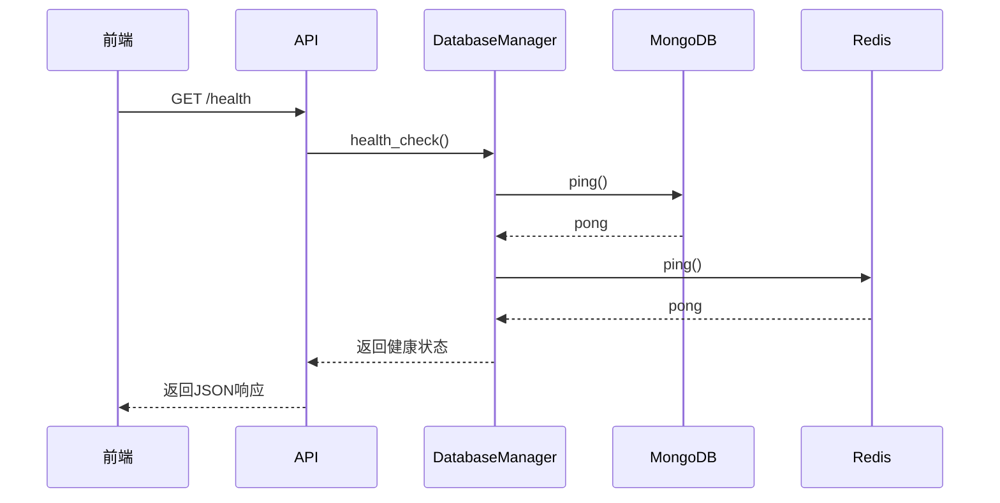
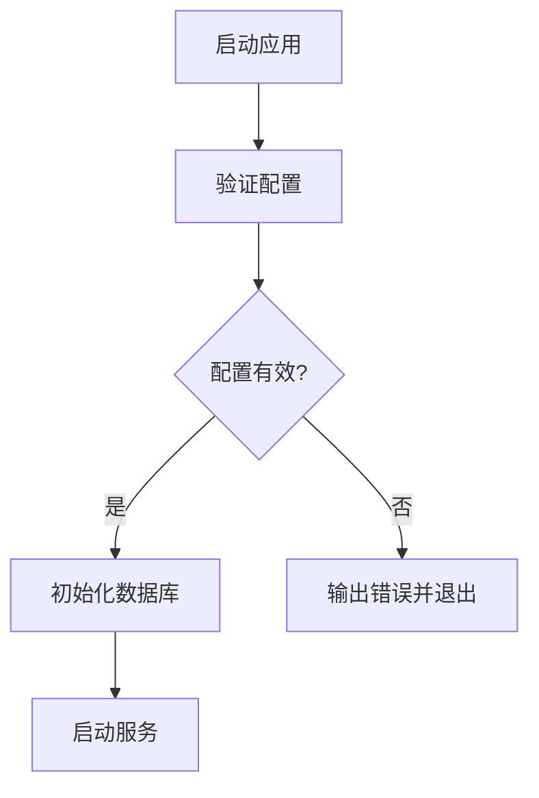

# 系统健康API

<cite>
**本文档引用文件**   
- [health.py](file://app/routers/health.py)
- [database.py](file://app/core/database.py)
- [redis_client.py](file://app/core/redis_client.py)
- [system_config.py](file://app/routers/system_config.py)
- [startup_validator.py](file://app/core/startup_validator.py)
</cite>

## 目录
1. [简介](#简介)
2. [核心健康检查端点](#核心健康检查端点)
3. [子系统健康检查机制](#子系统健康检查机制)
4. [健康状态分级与HTTP状态码](#健康状态分级与http状态码)
5. [健康检查响应结构](#健康检查响应结构)
6. [与容器化和Kubernetes的集成](#与容器化和kubernetes的集成)
7. [系统自愈与故障转移](#系统自愈与故障转移)
8. [配置验证与启动检查](#配置验证与启动检查)

## 简介
系统健康API是本应用的核心监控接口，用于评估和报告系统的整体运行状况。该API提供了一个综合的健康检查机制，能够检测多个关键子系统的状态，包括数据库连接、Redis缓存、消息队列以及外部API的可达性。通过这些检查，系统管理员和运维团队可以快速了解服务的健康状况，及时发现并解决问题。

健康检查不仅用于前端展示和用户界面的状态指示，还与Docker容器生命周期和Kubernetes探针深度集成，确保在容器编排环境中实现自动化的健康监测和故障恢复。此外，健康检查结果可用于触发系统自愈流程和故障转移策略，提高系统的可靠性和可用性。

**Section sources**
- [health.py](file://app/routers/health.py#L1-L41)

## 核心健康检查端点
系统提供了多个健康检查端点，以满足不同场景的需求。主要端点包括`/health`、`/healthz`和`/readyz`，它们分别服务于不同的目的。

- `/health`：面向前端应用的健康检查接口，返回详细的系统状态信息，包括版本号、时间戳和服务名称。
- `/healthz`：专为Kubernetes设计的存活探针（liveness probe），返回极简的健康状态，用于判断容器是否需要重启。
- `/readyz`：专为Kubernetes设计的就绪探针（readiness probe），返回系统的就绪状态，用于决定是否将流量路由到该实例。

这些端点的设计遵循了最佳实践，确保了高可用性和可扩展性。

```mermaid
flowchart TD
A[/health] --> |前端使用| B[返回详细状态]
C[/healthz] --> |Kubernetes存活探针| D[返回简单状态]
E[/readyz] --> |Kubernetes就绪探针| F[返回就绪状态]
```

**Diagram sources**
- [health.py](file://app/routers/health.py#L19-L41)

**Section sources**
- [health.py](file://app/routers/health.py#L1-L41)

## 子系统健康检查机制
系统健康检查涵盖了多个关键子系统，确保全面评估系统的健康状况。

### 数据库连接检查
数据库健康检查通过`DatabaseManager`类的`health_check`方法实现，该方法会检查MongoDB和Redis的连接状态。对于MongoDB，它会发送一个`ping`命令来验证连接；对于Redis，它会调用`ping`方法来测试连接。



**Diagram sources**
- [database.py](file://app/core/database.py#L134-L177)
- [health.py](file://app/routers/health.py#L20-L31)

### Redis缓存检查
Redis健康检查是数据库健康检查的一部分，通过`get_redis_client()`获取Redis客户端实例，并调用其`ping()`方法来验证连接。如果连接成功，返回`"status": "healthy"`；否则，返回`"status": "unhealthy"`。

### 消息队列检查
消息队列的健康状况通过`QueueService`类的`stats`方法来获取，该方法返回队列的统计信息，包括待处理、处理中、已完成和失败的任务数量。这有助于监控队列的负载和处理能力。

### 外部API可达性检查
外部API的可达性检查通过`config_service.py`中的`test_api_connection`方法实现。该方法会向指定的API端点发送请求，并根据响应状态码和内容来判断API的可用性。支持多种数据库类型（如MySQL、PostgreSQL、SQLite）的连接测试。

**Section sources**
- [database.py](file://app/core/database.py#L134-L177)
- [redis_client.py](file://app/core/redis_client.py#L40-L42)
- [queue_service.py](file://app/services/queue_service.py#L225-L235)
- [config_service.py](file://app/services/config_service.py#L1962-L2095)

## 健康状态分级与HTTP状态码
系统定义了明确的健康状态分级，并对应不同的HTTP状态码返回策略。

- **健康（Healthy）**：所有子系统均正常运行，返回HTTP 200状态码。
- **警告（Warning）**：部分非关键子系统存在问题，但不影响核心功能，返回HTTP 200状态码，但在响应体中标记警告。
- **不健康（Unhealthy）**：关键子系统（如数据库或Redis）无法连接，返回HTTP 503状态码。

这种分级策略确保了在不同情况下，客户端能够准确理解系统的健康状况，并采取相应的措施。

**Section sources**
- [health.py](file://app/routers/health.py#L20-L31)
- [database.py](file://app/core/database.py#L134-L177)

## 健康检查响应结构
健康检查的响应采用标准的JSON格式，包含成功标志、数据和消息字段。数据字段中包含了详细的健康信息，如状态、版本、时间戳和服务名称。

```json
{
  "success": true,
  "data": {
    "status": "ok",
    "version": "0.1.16",
    "timestamp": 1732483200,
    "service": "TradingAgents-CN API"
  },
  "message": "服务运行正常"
}
```

对于更详细的健康检查，如数据库状态，响应会包含具体的连接信息和性能指标。

**Section sources**
- [health.py](file://app/routers/health.py#L22-L31)

## 与容器化和Kubernetes的集成
健康检查端点与Docker容器生命周期和Kubernetes探针无缝集成。在`docker-compose.yml`文件中，可以配置`healthcheck`指令来定期调用`/healthz`端点，确保容器的健康状态。

在Kubernetes中，可以通过定义`livenessProbe`和`readinessProbe`来使用`/healthz`和`/readyz`端点。这使得Kubernetes能够自动重启不健康的容器，并在实例准备好接收流量时将其加入服务。

**Section sources**
- [health.py](file://app/routers/health.py#L33-L41)

## 系统自愈与故障转移
健康检查结果可用于触发系统自愈流程和故障转移策略。例如，当检测到数据库连接失败时，系统可以自动切换到备用数据库实例，或启动数据恢复流程。此外，通过监控队列的积压情况，可以动态调整工作节点的数量，以应对负载变化。

**Section sources**
- [database.py](file://app/core/database.py#L134-L177)
- [queue_service.py](file://app/services/queue_service.py#L225-L235)

## 配置验证与启动检查
系统在启动时会执行配置验证，确保所有必需的配置项都已正确设置。`StartupValidator`类负责验证环境变量中的配置，如MongoDB和Redis的连接信息、JWT密钥等。如果验证失败，系统将无法启动，并输出详细的错误信息。



**Diagram sources**
- [startup_validator.py](file://app/core/startup_validator.py#L44-L330)

**Section sources**
- [startup_validator.py](file://app/core/startup_validator.py#L1-L330)
- [system_config.py](file://app/routers/system_config.py#L63-L285)