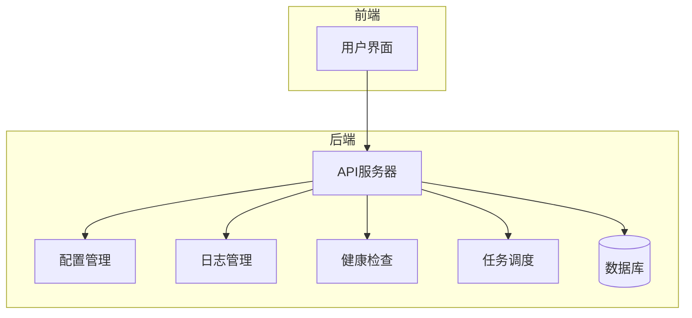
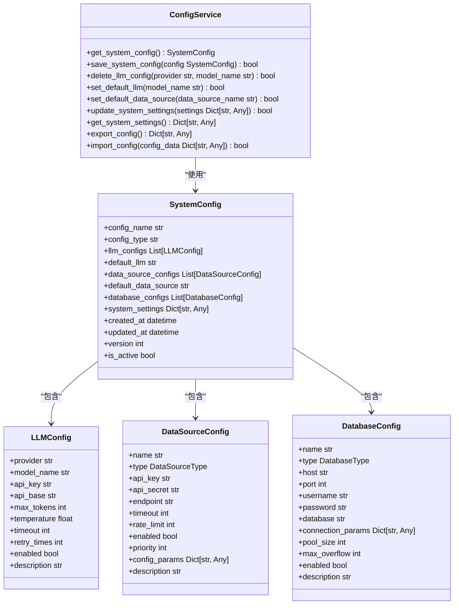
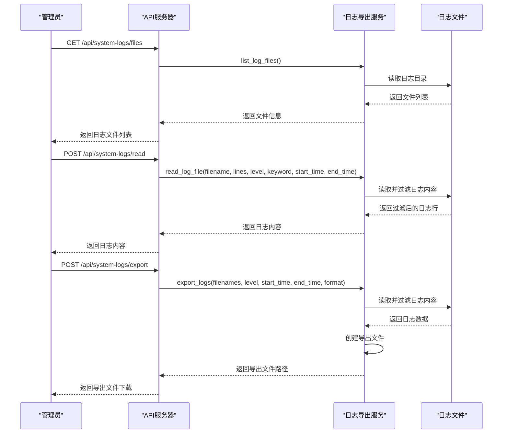
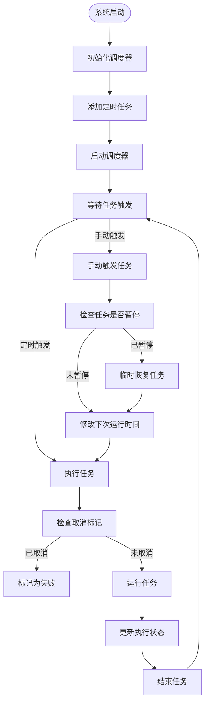

# 系统管理API

<cite>
**本文档引用的文件**   
- [main.py](file://main.py)
- [system_config.py](file://app/routers/system_config.py)
- [logs.py](file://app/routers/logs.py)
- [health.py](file://app/routers/health.py)
- [scheduler.py](file://app/routers/scheduler.py)
- [config_service.py](file://app/services/config_service.py)
- [scheduler_service.py](file://app/services/scheduler_service.py)
- [log_export_service.py](file://app/services/log_export_service.py)
- [config.py](file://app/core/config.py)
- [config.py](file://app/models/config.py)
</cite>

## 目录
1. [简介](#简介)
2. [项目结构](#项目结构)
3. [核心组件](#核心组件)
4. [架构概述](#架构概述)
5. [详细组件分析](#详细组件分析)
6. [依赖分析](#依赖分析)
7. [性能考虑](#性能考虑)
8. [故障排除指南](#故障排除指南)
9. [结论](#结论)
10. [附录](#附录) (如有必要)

## 简介
本文档详细介绍了系统管理API的实现，涵盖配置管理、数据库管理、操作日志、任务调度和系统健康检查等功能。文档详细记录了系统配置读取与更新、数据库操作、日志查询、定时任务管理等端点的实现细节。同时，说明了配置热更新机制和系统状态监控的实现方式，并提供了使用示例，展示如何通过API进行系统配置和监控。最后，解释了各管理功能之间的关系和依赖。

## 项目结构
项目结构清晰，主要分为以下几个部分：
- `app/`：包含核心应用代码，包括配置、数据库、日志、中间件、模型、路由、服务等。
- `cli/`：命令行接口相关代码。
- `config/`：配置文件，包括日志配置。
- `docker/`：Docker相关配置。
- `docs/`：文档，包括API文档、架构文档、博客、修复记录等。
- `examples/`：使用示例。
- `frontend/`：前端代码。
- `install/`：安装相关配置。
- `nginx/`：Nginx配置。
- `reports/`：报告。
- `scripts/`：各种脚本。
- `tests/`：测试代码。
- `tradingagents/`：交易代理相关代码。
- `utils/`：工具代码。
- `web/`：Web相关代码。

**Section sources**
- [main.py](file://main.py#L1-L764)

## 核心组件

系统管理API的核心组件包括配置管理、日志管理、健康检查和任务调度。这些组件通过FastAPI路由暴露给外部，允许管理员进行系统配置、监控和维护。

**Section sources**
- [main.py](file://main.py#L1-L764)
- [system_config.py](file://app/routers/system_config.py#L1-L285)
- [logs.py](file://app/routers/logs.py#L1-L235)
- [health.py](file://app/routers/health.py#L1-L41)
- [scheduler.py](file://app/routers/scheduler.py#L1-L530)

## 架构概述

系统管理API基于FastAPI构建，使用MongoDB和Redis作为数据存储。系统通过APScheduler进行任务调度，支持定时任务的创建、暂停、恢复和手动触发。配置管理服务允许动态更新系统配置，包括大模型配置、数据源配置和数据库配置。日志管理服务提供日志文件的查询、过滤和导出功能。健康检查API用于监控系统状态。



**Diagram sources **
- [main.py](file://main.py#L1-L764)
- [system_config.py](file://app/routers/system_config.py#L1-L285)
- [logs.py](file://app/routers/logs.py#L1-L235)
- [health.py](file://app/routers/health.py#L1-L41)
- [scheduler.py](file://app/routers/scheduler.py#L1-L530)

## 详细组件分析

### 配置管理分析
配置管理组件负责系统配置的读取、更新和验证。系统配置存储在MongoDB中，包括大模型配置、数据源配置和数据库配置。配置服务提供API端点，允许管理员查询和更新配置。

#### 配置管理类图


**Diagram sources **
- [config_service.py](file://app/services/config_service.py#L1-L800)
- [config.py](file://app/models/config.py#L1-L482)

### 日志管理分析
日志管理组件提供日志文件的查询、过滤和导出功能。日志文件存储在本地文件系统中，服务提供API端点，允许管理员列出日志文件、读取日志内容、导出日志文件和删除日志文件。

#### 日志管理序列图


**Diagram sources **
- [logs.py](file://app/routers/logs.py#L1-L235)
- [log_export_service.py](file://app/services/log_export_service.py#L1-L479)

### 任务调度分析
任务调度组件基于APScheduler实现，提供定时任务的管理功能。系统在启动时初始化调度器，并根据配置添加各种定时任务，如数据同步、行情入库等。API提供端点，允许管理员查询任务列表、获取任务详情、暂停/恢复任务、手动触发任务和查看任务执行历史。

#### 任务调度流程图


**Diagram sources **
- [main.py](file://main.py#L1-L764)
- [scheduler.py](file://app/routers/scheduler.py#L1-L530)
- [scheduler_service.py](file://app/services/scheduler_service.py#L1-L800)

## 依赖分析

系统管理API依赖于多个内部和外部组件。内部依赖包括FastAPI、APScheduler、Pydantic、MongoDB和Redis。外部依赖包括各种数据源API，如Tushare、AKShare和BaoStock。配置管理服务依赖于数据库服务来读取和写入配置。日志管理服务依赖于文件系统来读取和写入日志文件。任务调度服务依赖于APScheduler来管理定时任务。

```mermaid
graph TD
ConfigService --> DatabaseService : "读取/写入配置"
LogExportService --> FileSystem : "读取/写入日志文件"
SchedulerService --> APScheduler : "管理定时任务"
API --> ConfigService : "处理配置请求"
API --> LogExportService : "处理日志请求"
API --> SchedulerService : "处理调度请求"
API --> HealthCheck : "处理健康检查"
```

**Diagram sources **
- [main.py](file://main.py#L1-L764)
- [config_service.py](file://app/services/config_service.py#L1-L800)
- [log_export_service.py](file://app/services/log_export_service.py#L1-L479)
- [scheduler_service.py](file://app/services/scheduler_service.py#L1-L800)

## 性能考虑

系统管理API在设计时考虑了性能因素。配置管理服务缓存系统配置，避免频繁读取数据库。日志管理服务支持按行数、级别、关键词和时间范围过滤日志，减少数据传输量。任务调度服务使用异步任务执行，避免阻塞主线程。此外，系统支持配置热更新，无需重启服务即可应用新配置。

## 故障排除指南

### 配置验证失败
如果配置验证失败，首先检查`.env`文件中的环境变量是否正确。然后检查MongoDB中的配置是否完整。可以使用`/api/system/config/validate`端点验证配置。

### 日志文件无法读取
如果无法读取日志文件，检查日志目录是否存在，以及文件权限是否正确。可以使用`/api/system-logs/files`端点列出日志文件，确认文件是否存在。

### 定时任务未执行
如果定时任务未执行，检查调度器是否正常运行。可以使用`/api/scheduler/health`端点检查调度器健康状态。然后检查任务是否被暂停，可以使用`/api/scheduler/jobs`端点查看任务列表。

**Section sources**
- [system_config.py](file://app/routers/system_config.py#L1-L285)
- [logs.py](file://app/routers/logs.py#L1-L235)
- [scheduler.py](file://app/routers/scheduler.py#L1-L530)

## 结论

系统管理API提供了全面的系统配置、监控和维护功能。通过配置管理、日志管理、健康检查和任务调度等组件，管理员可以有效地管理系统。API设计合理，性能良好，易于使用和维护。

## 附录

### 配置管理API端点
| 端点 | 方法 | 描述 |
| --- | --- | --- |
| `/api/system/config/summary` | GET | 获取配置概要（已屏蔽敏感项） |
| `/api/system/config/validate` | GET | 验证配置完整性 |
| `/api/system/config` | PUT | 更新系统配置 |

### 日志管理API端点
| 端点 | 方法 | 描述 |
| --- | --- | --- |
| `/api/system-logs/files` | GET | 获取日志文件列表 |
| `/api/system-logs/read` | POST | 读取日志文件内容 |
| `/api/system-logs/export` | POST | 导出日志文件 |
| `/api/system-logs/statistics` | GET | 获取日志统计信息 |
| `/api/system-logs/files/{filename}` | DELETE | 删除日志文件 |

### 任务调度API端点
| 端点 | 方法 | 描述 |
| --- | --- | --- |
| `/api/scheduler/jobs` | GET | 获取所有定时任务列表 |
| `/api/scheduler/jobs/{job_id}` | GET | 获取任务详情 |
| `/api/scheduler/jobs/{job_id}/pause` | POST | 暂停任务 |
| `/api/scheduler/jobs/{job_id}/resume` | POST | 恢复任务 |
| `/api/scheduler/jobs/{job_id}/trigger` | POST | 手动触发任务 |
| `/api/scheduler/jobs/{job_id}/history` | GET | 获取任务执行历史 |
| `/api/scheduler/history` | GET | 获取所有任务执行历史 |
| `/api/scheduler/stats` | GET | 获取调度器统计信息 |
| `/api/scheduler/health` | GET | 调度器健康检查 |