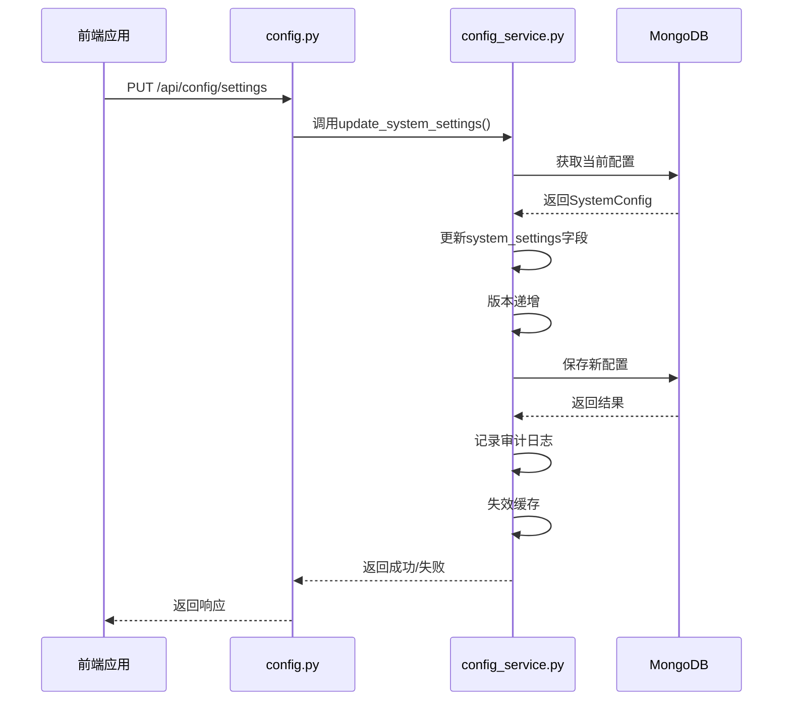
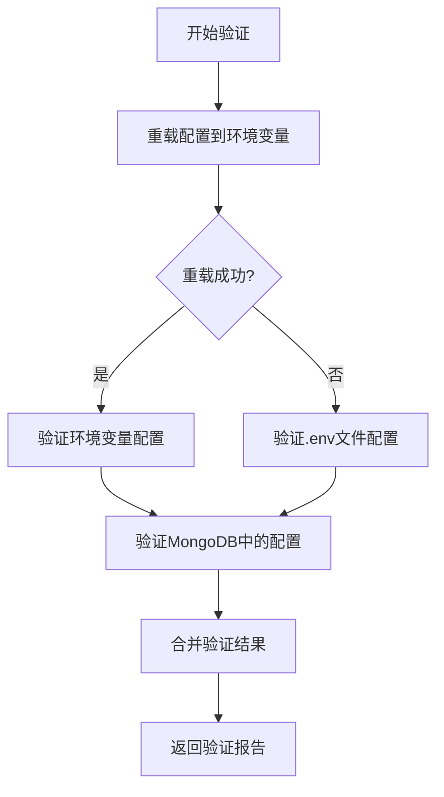
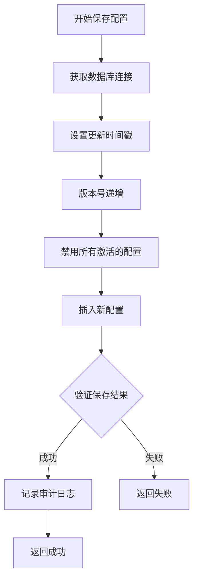
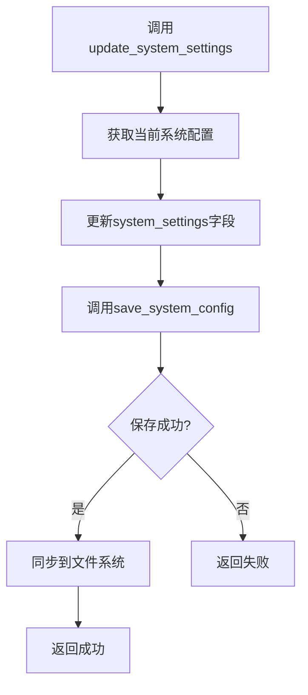
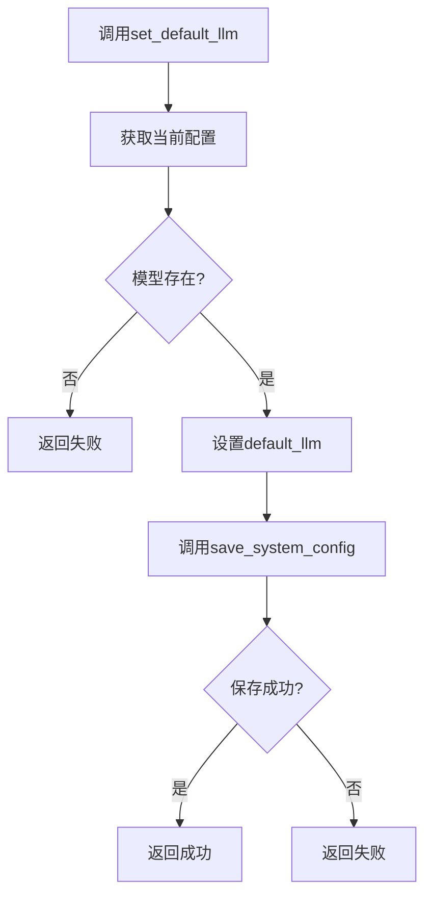
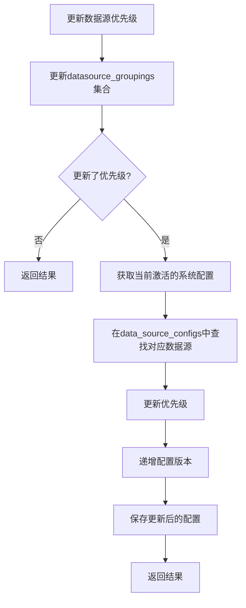
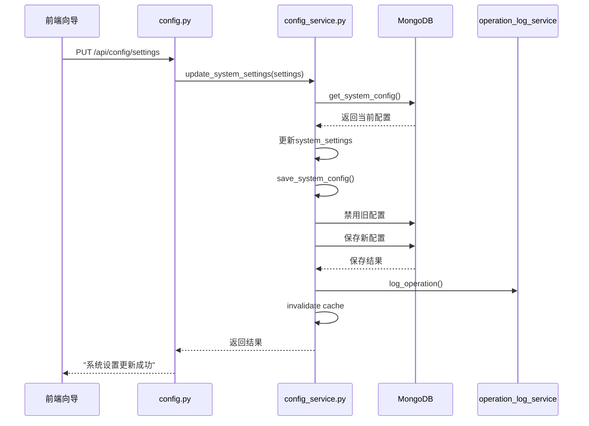

# 配置更新API

<cite>
**本文档引用的文件**   
- [config.py](file://app/routers/config.py)
- [system_config.py](file://app/routers/system_config.py)
- [config_service.py](file://app/services/config_service.py)
- [config.py](file://app/models/config.py)
</cite>

## 目录
1. [简介](#简介)
2. [配置更新端点](#配置更新端点)
3. [核心服务方法](#核心服务方法)
4. [专用更新方法](#专用更新方法)
5. [数据一致性保证](#数据一致性保证)
6. [前端配置向导流程](#前端配置向导流程)

## 简介
配置更新API提供了对系统配置的全面管理功能，支持通过RESTful接口对系统设置、大模型配置、数据源配置等进行修改。本API采用MongoDB作为持久化存储，通过版本控制和激活状态管理确保配置的原子性和一致性。所有配置更新操作都会记录审计日志，并在完成后自动失效相关缓存，确保配置变更能够立即生效。

**Section sources**
- [config_service.py](file://app/services/config_service.py#L362-L395)

## 配置更新端点
配置更新API主要通过`/api/config`和`/api/system-config`两个命名空间提供服务。`/config`端点提供完整的配置管理功能，而`/system-config`端点则专注于系统级配置的读取和验证。

### `/config/settings` 端点
该端点支持PUT方法，用于更新系统设置。请求体应包含一个键值对字典，表示需要更新的配置项。

**Diagram sources**
- [config.py](file://app/routers/config.py#L1708-L1770)
- [config_service.py](file://app/services/config_service.py#L663-L706)

### `/system-config/validate` 端点
该端点提供配置完整性验证功能，检查环境变量和数据库中的配置是否完整有效。

**Diagram sources**
- [system_config.py](file://app/routers/system_config.py#L63-L285)

**Section sources**
- [config.py](file://app/routers/config.py#L1708-L1770)
- [system_config.py](file://app/routers/system_config.py#L63-L285)

## 核心服务方法
`save_system_config`是配置管理的核心服务方法，负责将系统配置持久化到MongoDB，并处理版本控制、激活状态和审计日志等关键功能。

### `save_system_config` 方法实现
该方法实现了完整的配置保存流程，包括版本递增、激活状态管理和数据库原子操作。

**Diagram sources**
- [config_service.py](file://app/services/config_service.py#L516-L573)

该方法的关键特性包括：
- **版本递增**：每次保存配置时，版本号自动递增，确保配置的历史可追溯性
- **激活状态管理**：在保存新配置前，先将所有已激活的配置设为非激活状态，确保系统中只有一个激活的配置
- **数据库原子操作**：使用MongoDB的update_many和insert_one操作，确保配置更新的原子性
- **配置审计日志**：记录配置变更的详细信息，便于追踪和审计

**Section sources**
- [config_service.py](file://app/services/config_service.py#L516-L573)

## 专用更新方法
系统提供了多个专用更新方法，用于处理特定类型的配置更新，这些方法都基于`save_system_config`实现，但提供了更简洁的接口。

### `update_system_settings` 方法
该方法专门用于更新系统设置，接收一个包含设置项的字典作为参数。

**Diagram sources**
- [config_service.py](file://app/services/config_service.py#L663-L706)

### `set_default_llm` 和 `set_default_data_source` 方法
这两个方法分别用于设置默认大模型和默认数据源，它们首先验证指定的模型或数据源是否存在，然后更新相应的默认值。

**Diagram sources**
- [config_service.py](file://app/services/config_service.py#L619-L661)

**Section sources**
- [config_service.py](file://app/services/config_service.py#L619-L706)

## 数据一致性保证
在更新数据源优先级时，系统需要同时更新`datasource_groupings`和`system_configs`两个集合，以保证数据的一致性。

### 数据源优先级更新流程
当更新数据源在特定市场分类中的优先级时，系统会同步更新两个集合：

**Diagram sources**
- [config_service.py](file://app/services/config_service.py#L220-L283)

该流程确保了前端展示的优先级与实际数据获取时使用的优先级保持一致。`datasource_groupings`集合用于前端展示和管理，而`system_configs.data_source_configs`用于实际数据获取时的优先级判断。

**Section sources**
- [config_service.py](file://app/services/config_service.py#L220-L283)

## 前端配置向导流程
前端配置向导通过一系列API调用完成配置保存的完整流程。

**Diagram sources**
- [config.py](file://app/routers/config.py#L1708-L1770)
- [config_service.py](file://app/services/config_service.py#L663-L706)
- [operation_log_service.py](file://app/services/operation_log_service.py)

此流程展示了从用户在前端修改配置到配置最终持久化到数据库的完整过程，包括了配置更新、版本管理、审计日志记录和缓存失效等关键步骤。

**Section sources**
- [config.py](file://app/routers/config.py#L1708-L1770)
- [config_service.py](file://app/services/config_service.py#L663-L706)