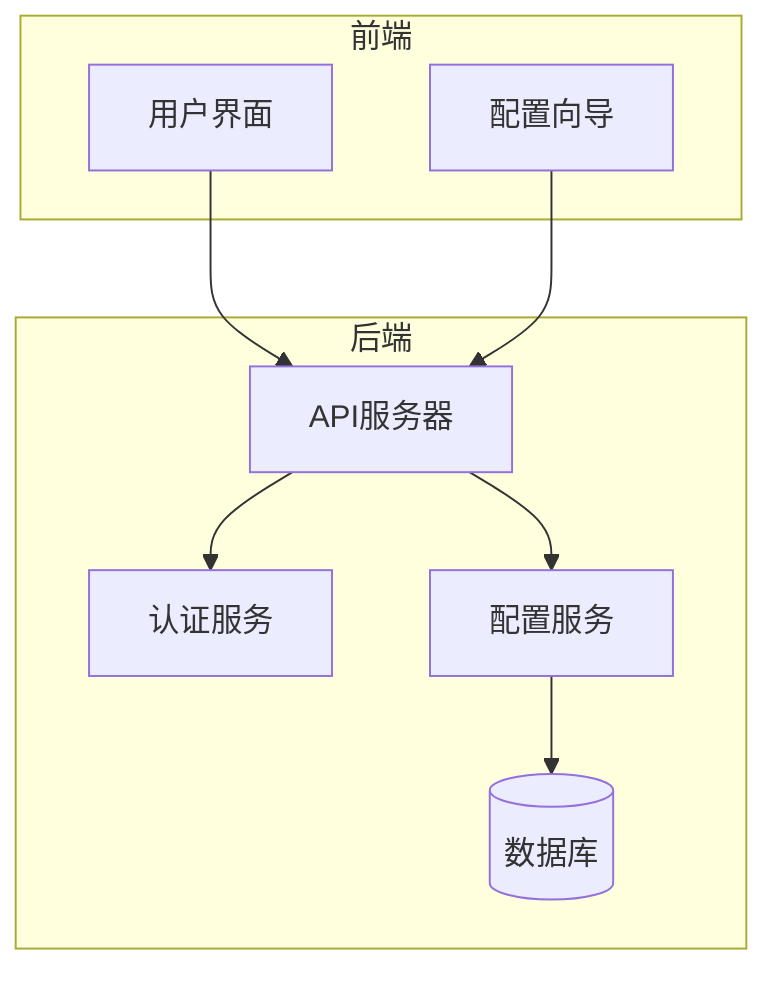
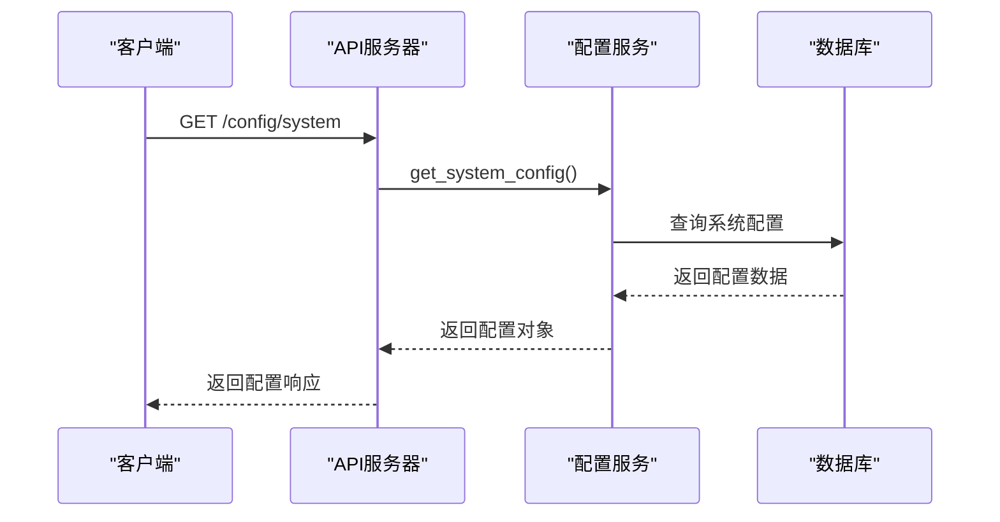
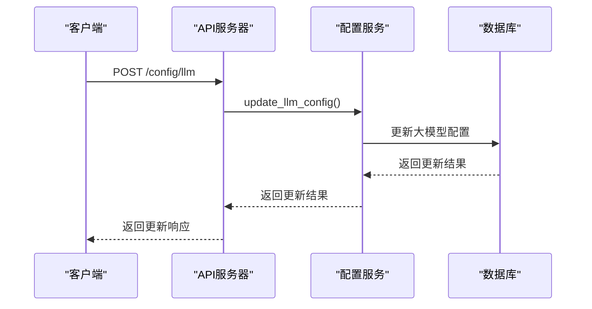
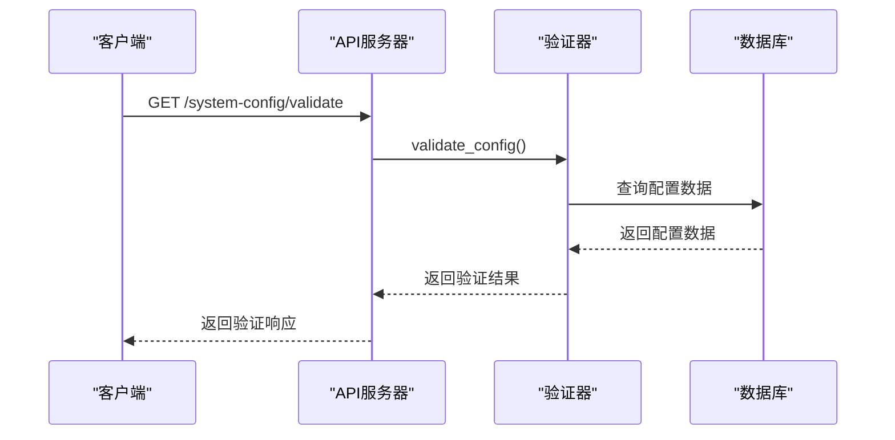
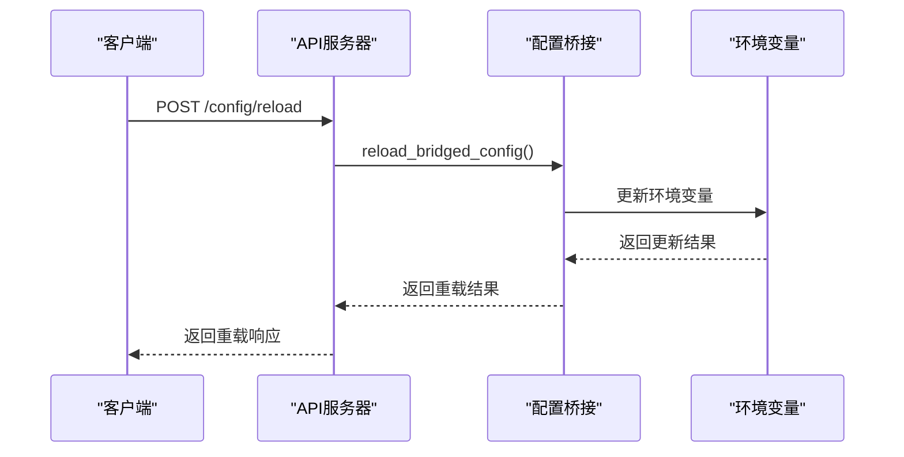
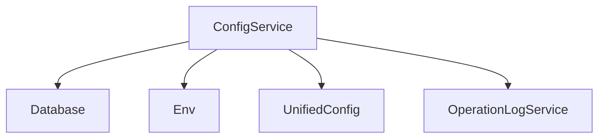

# 配置管理API

<cite>
**本文档引用的文件**   
- [config.py](file://app/routers/config.py)
- [system_config.py](file://app/routers/system_config.py)
- [unified_config.py](file://app/core/unified_config.py)
- [config_service.py](file://app/services/config_service.py)
- [config.py](file://app/models/config.py)
- [api_key_utils.py](file://app/utils/api_key_utils.py)
- [config_bridge.py](file://app/core/config_bridge.py)
- [config_provider.py](file://app/services/config_provider.py)
- [operation_log_service.py](file://app/services/operation_log_service.py)
- [startup_validator.py](file://app/core/startup_validator.py)
</cite>

## 目录
1. [简介](#简介)
2. [项目结构](#项目结构)
3. [核心组件](#核心组件)
4. [架构概述](#架构概述)
5. [详细组件分析](#详细组件分析)
6. [依赖分析](#依赖分析)
7. [性能考虑](#性能考虑)
8. [故障排除指南](#故障排除指南)
9. [结论](#结论)
10. [附录](#附录) (如有必要)

## 简介
本文档详细介绍了配置管理API，涵盖系统配置的读取、更新、验证和热重载功能。文档详细说明了`/config`和`/system-config`端点的HTTP方法、请求/响应结构、认证机制和错误处理。解释了统一配置系统（Unified Config）的工作原理，包括环境变量、配置文件和数据库配置的优先级处理。提供了代码示例，展示如何通过API动态修改LLM提供商、数据源优先级和系统参数。记录了配置变更的审计日志机制和跨服务同步策略。说明了与前端配置向导（Config Wizard）的集成方式。

## 项目结构
项目结构清晰，主要分为以下几个部分：
- `app/`：包含应用的核心代码，包括常量、核心功能、中间件、模型、路由、服务等。
- `cli/`：命令行接口相关代码。
- `config/`：配置文件目录。
- `docker/`：Docker相关配置。
- `docs/`：文档目录。
- `examples/`：示例代码。
- `frontend/`：前端代码。
- `install/`：安装相关文件。
- `nginx/`：Nginx配置。
- `reports/`：报告文件。
- `scripts/`：脚本文件。
- `tests/`：测试代码。
- `tradingagents/`：交易代理相关代码。
- `utils/`：工具类代码。
- `web/`：Web相关代码。

**Diagram sources**
- [config.py](file://app/routers/config.py#L1-L2295)
- [system_config.py](file://app/routers/system_config.py#L1-L285)

**Section sources**
- [config.py](file://app/routers/config.py#L1-L2295)
- [system_config.py](file://app/routers/system_config.py#L1-L285)

## 核心组件
配置管理API的核心组件包括：
- **配置读取**：通过`/config/system`端点获取系统配置。
- **配置更新**：通过`/config/llm`和`/config/datasource`端点更新大模型和数据源配置。
- **配置验证**：通过`/system-config/validate`端点验证配置的完整性和有效性。
- **热重载**：通过`/config/reload`端点重新加载配置并桥接到环境变量。

**Section sources**
- [config.py](file://app/routers/config.py#L1-L2295)
- [config_service.py](file://app/services/config_service.py#L1-L4352)

## 架构概述
配置管理API采用分层架构，主要包括以下几个层次：
- **路由层**：处理HTTP请求，调用服务层。
- **服务层**：处理业务逻辑，调用数据访问层。
- **数据访问层**：与数据库交互，读取和写入配置数据。
- **统一配置系统**：整合环境变量、配置文件和数据库配置，提供统一的配置管理接口。



**Diagram sources**
- [config.py](file://app/routers/config.py#L1-L2295)
- [config_service.py](file://app/services/config_service.py#L1-L4352)

## 详细组件分析
### 配置读取
配置读取功能通过`/config/system`端点实现，返回系统配置的详细信息，包括大模型配置、数据源配置、数据库配置和系统设置。



**Diagram sources**
- [config.py](file://app/routers/config.py#L171-L197)
- [config_service.py](file://app/services/config_service.py#L362-L395)

### 配置更新
配置更新功能通过`/config/llm`和`/config/datasource`端点实现，允许用户动态修改大模型和数据源配置。



**Diagram sources**
- [config.py](file://app/routers/config.py#L582-L688)
- [config_service.py](file://app/services/config_service.py#L516-L574)

### 配置验证
配置验证功能通过`/system-config/validate`端点实现，验证系统配置的完整性和有效性。



**Diagram sources**
- [system_config.py](file://app/routers/system_config.py#L63-L285)
- [startup_validator.py](file://app/core/startup_validator.py#L1-L330)

### 热重载
热重载功能通过`/config/reload`端点实现，重新加载配置并桥接到环境变量。



**Diagram sources**
- [config.py](file://app/routers/config.py#L37-L77)
- [config_bridge.py](file://app/core/config_bridge.py#L580-L588)

## 依赖分析
配置管理API依赖于多个组件和服务，包括：
- **数据库**：存储系统配置、大模型配置、数据源配置等。
- **环境变量**：提供系统运行时的配置参数。
- **统一配置系统**：整合环境变量、配置文件和数据库配置，提供统一的配置管理接口。
- **操作日志服务**：记录配置变更的审计日志。



**Diagram sources**
- [config_service.py](file://app/services/config_service.py#L1-L4352)
- [unified_config.py](file://app/core/unified_config.py#L1-L501)
- [operation_log_service.py](file://app/services/operation_log_service.py#L1-L285)

## 性能考虑
配置管理API在设计时考虑了性能优化，主要体现在以下几个方面：
- **缓存机制**：使用缓存减少数据库查询次数，提高响应速度。
- **异步处理**：对于耗时操作，采用异步处理方式，避免阻塞主线程。
- **批量操作**：支持批量更新配置，减少网络请求次数。

## 故障排除指南
### 配置读取失败
- **检查数据库连接**：确保数据库服务正常运行。
- **检查配置数据**：确保数据库中存在有效的配置数据。

### 配置更新失败
- **检查权限**：确保用户具有更新配置的权限。
- **检查配置格式**：确保配置数据格式正确。

### 配置验证失败
- **检查必需配置**：确保所有必需配置项都已正确设置。
- **检查推荐配置**：确保推荐配置项已正确设置。

### 热重载失败
- **检查环境变量**：确保环境变量已正确更新。
- **检查配置桥接**：确保配置桥接服务正常运行。

**Section sources**
- [config.py](file://app/routers/config.py#L1-L2295)
- [system_config.py](file://app/routers/system_config.py#L1-L285)
- [config_service.py](file://app/services/config_service.py#L1-L4352)

## 结论
配置管理API为系统提供了强大的配置管理功能，支持配置的读取、更新、验证和热重载。通过统一配置系统，整合了环境变量、配置文件和数据库配置，提供了灵活的配置管理方案。配置变更的审计日志机制和跨服务同步策略确保了配置的一致性和可追溯性。与前端配置向导的集成方式使得配置管理更加直观和便捷。

## 附录
### 配置示例
```json
{
  "config_name": "默认配置",
  "config_type": "system",
  "llm_configs": [
    {
      "provider": "openai",
      "model_name": "gpt-3.5-turbo",
      "api_key": "your-openai-api-key",
      "api_base": "https://api.openai.com/v1",
      "max_tokens": 4000,
      "temperature": 0.7,
      "enabled": false,
      "description": "OpenAI GPT-3.5 Turbo模型"
    }
  ],
  "default_llm": "glm-4",
  "data_source_configs": [
    {
      "name": "AKShare",
      "type": "akshare",
      "endpoint": "https://akshare.akfamily.xyz",
      "timeout": 30,
      "rate_limit": 100,
      "enabled": true,
      "priority": 1,
      "description": "AKShare开源金融数据接口"
    }
  ],
  "default_data_source": "AKShare",
  "database_configs": [
    {
      "name": "MongoDB主库",
      "type": "mongodb",
      "host": "localhost",
      "port": 27017,
      "database": "tradingagents",
      "enabled": true,
      "description": "MongoDB主数据库"
    }
  ],
  "system_settings": {
    "max_concurrent_tasks": 3,
    "default_analysis_timeout": 300,
    "enable_cache": true,
    "cache_ttl": 3600,
    "log_level": "INFO",
    "enable_monitoring": true
  }
}
```

**Section sources**
- [config.py](file://app/routers/config.py#L1-L2295)
- [config_service.py](file://app/services/config_service.py#L1-L4352)