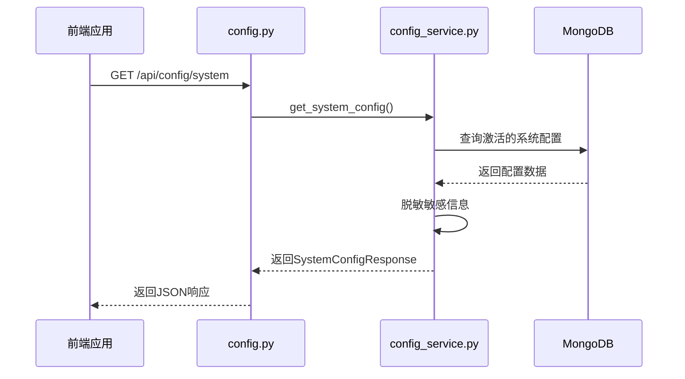
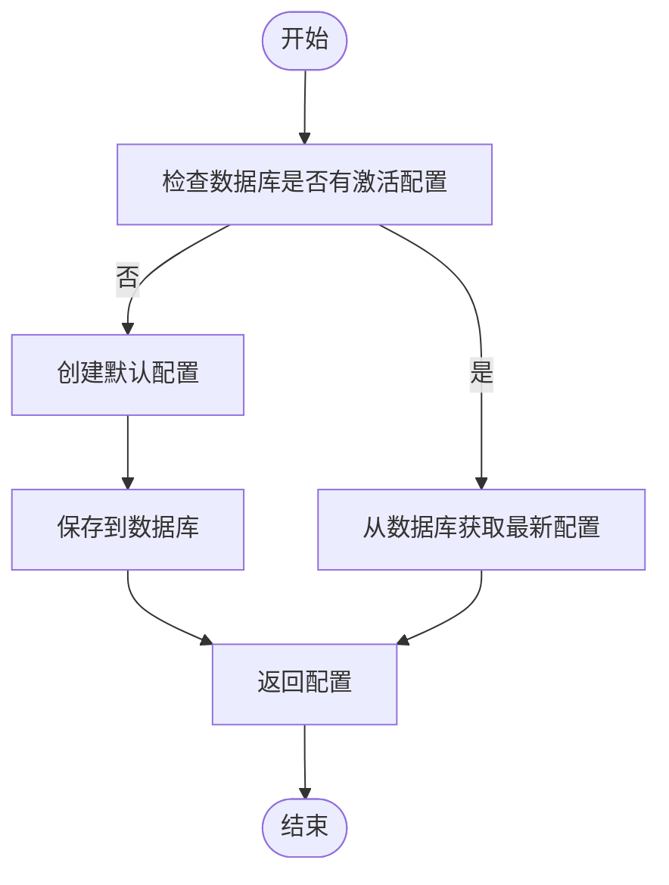
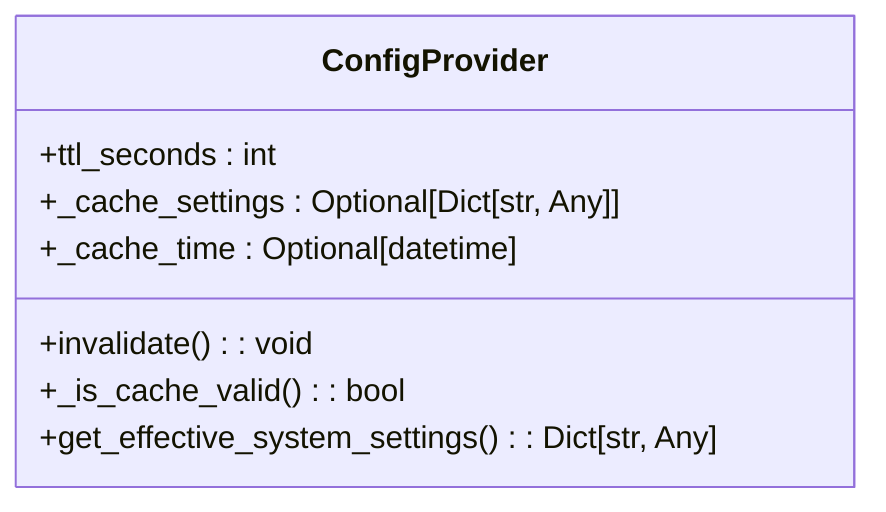
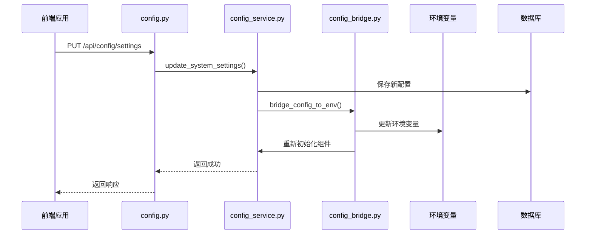
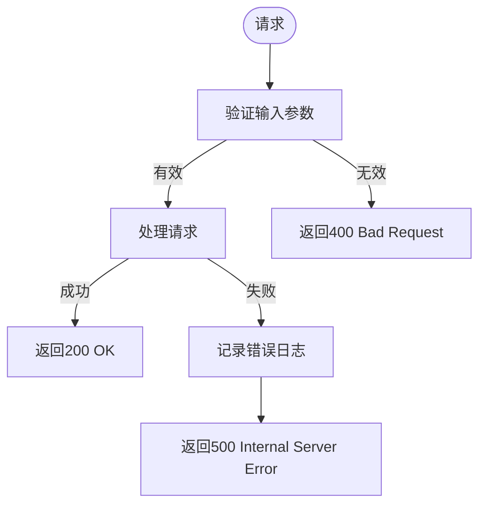
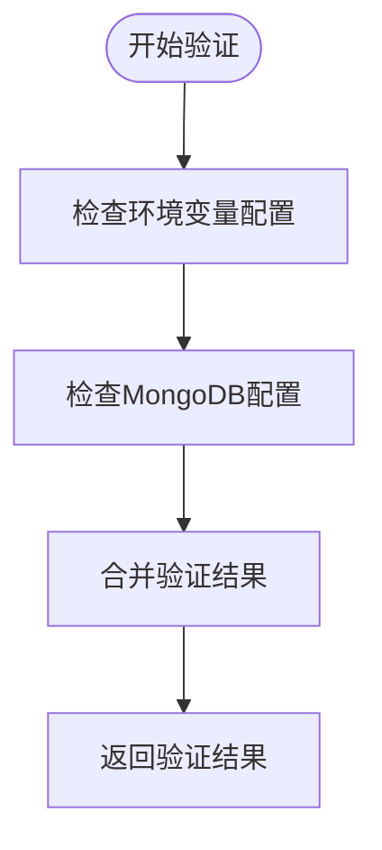

# 配置读取API

<cite>
**本文档引用的文件**   
- [config.py](file://app/routers/config.py)
- [config_service.py](file://app/services/config_service.py)
- [config.ts](file://frontend/src/api/config.ts)
- [config_bridge.py](file://app/core/config_bridge.py)
- [unified_config.py](file://app/core/unified_config.py)
- [system_config.py](file://app/routers/system_config.py)
- [config.py](file://app/models/config.py)
</cite>

## 目录
1. [简介](#简介)
2. [配置API端点](#配置api端点)
3. [系统配置获取](#系统配置获取)
4. [配置服务实现](#配置服务实现)
5. [前端API调用](#前端api调用)
6. [配置缓存与数据一致性](#配置缓存与数据一致性)
7. [错误处理与验证](#错误处理与验证)
8. [总结](#总结)

## 简介
本文档详细描述了配置读取API的实现，重点介绍`/config`和`/system-config`端点的GET方法。文档涵盖了系统配置、LLM配置、数据源配置和系统设置的获取方式，解释了`get_system_config`服务方法的实现逻辑，包括从数据库获取最新激活配置的优先级，以及在没有配置时创建默认配置的回退机制。同时提供了前端`config.ts`中API调用的实际代码示例，并说明了响应数据结构和错误处理机制。

## 配置API端点
配置API提供了多个端点来管理系统的各种配置。主要的GET方法端点包括：

- `/api/config/system`：获取系统配置
- `/api/config/llm/providers`：获取所有大模型厂家
- `/api/config/datasource`：获取所有数据源配置
- `/api/config/database`：获取所有数据库配置
- `/api/config/settings`：获取系统设置
- `/api/config/settings/meta`：获取系统设置元数据

这些端点允许前端应用获取当前系统的完整配置信息。

**Section sources**
- [config.py](file://app/routers/config.py#L171-L197)
- [system_config.py](file://app/routers/system_config.py#L52-L60)

## 系统配置获取
系统配置获取是通过`/api/config/system`端点实现的。该端点返回一个包含所有配置信息的响应，包括LLM配置、数据源配置、数据库配置和系统设置。



**Diagram sources **
- [config.py](file://app/routers/config.py#L171-L197)
- [config_service.py](file://app/services/config_service.py#L362-L381)

## 配置服务实现
配置服务的核心是`ConfigService`类，它负责从数据库获取配置、创建默认配置以及处理配置的保存和更新。

### get_system_config方法实现
`get_system_config`方法实现了从数据库获取最新激活配置的逻辑，包括在没有配置时创建默认配置的回退机制。



**Diagram sources **
- [config_service.py](file://app/services/config_service.py#L362-L381)

**Section sources**
- [config_service.py](file://app/services/config_service.py#L362-L414)

## 前端API调用
前端通过`config.ts`文件中的API客户端调用配置API。以下是实际的代码示例：

```typescript
// 配置管理API
export const configApi = {
  // 获取系统配置
  getSystemConfig(): Promise<SystemConfig> {
    return ApiClient.get('/api/config/system')
  },

  // 获取所有大模型厂家
  getLLMProviders(): Promise<LLMProvider[]> {
    return ApiClient.get('/api/config/llm/providers')
  },

  // 获取系统设置
  getSystemSettings(): Promise<Record<string, any>> {
    return ApiClient.get('/api/config/settings')
  },

  // 获取系统设置元数据
  getSystemSettingsMeta(): Promise<{ items: SettingMeta[] }> {
    return ApiClient.get('/api/config/settings/meta').then((r: any) => r.data)
  }
}
```

**Section sources**
- [config.ts](file://frontend/src/api/config.ts#L163-L164)

## 配置缓存与数据一致性
系统实现了多层配置缓存机制来保证数据的一致性和性能。

### 配置缓存机制
配置系统使用了`ConfigProvider`类来实现TTL缓存，确保配置在有效期内不会频繁查询数据库。



**Diagram sources **
- [config_provider.py](file://app/services/config_provider.py#L10-L120)

### 数据一致性保证
系统通过以下机制保证数据一致性：
1. **配置桥接**：在应用启动时，将数据库中的配置桥接到环境变量
2. **配置重载**：提供`/api/config/reload`端点，允许在配置更新后立即生效
3. **事件监听**：当配置更新时，自动触发相关组件的重新初始化



**Diagram sources **
- [config_bridge.py](file://app/core/config_bridge.py#L15-L287)
- [config_service.py](file://app/services/config_service.py#L663-L692)

**Section sources**
- [config_bridge.py](file://app/core/config_bridge.py#L15-L287)
- [config_service.py](file://app/services/config_service.py#L663-L692)

## 错误处理与验证
系统实现了完善的错误处理和配置验证机制。

### 错误处理
配置API使用标准的HTTP状态码和错误响应格式：



**Diagram sources **
- [config.py](file://app/routers/config.py#L178-L202)

### 配置验证
系统提供了`/api/config/validate`端点来验证配置的完整性和有效性：



**Diagram sources **
- [system_config.py](file://app/routers/system_config.py#L63-L284)

**Section sources**
- [system_config.py](file://app/routers/system_config.py#L63-L284)

## 总结
本文档详细介绍了配置读取API的实现，包括API端点、服务实现、前端调用、缓存机制和错误处理。系统通过多层缓存和数据一致性机制，确保了配置的高效读取和一致性。`get_system_config`方法实现了从数据库获取最新激活配置的优先级，以及在没有配置时创建默认配置的回退机制，保证了系统的稳定运行。

**Section sources**
- [config.py](file://app/routers/config.py)
- [config_service.py](file://app/services/config_service.py)
- [config.ts](file://frontend/src/api/config.ts)
- [config_bridge.py](file://app/core/config_bridge.py)
- [unified_config.py](file://app/core/unified_config.py)
- [system_config.py](file://app/routers/system_config.py)
- [config.py](file://app/models/config.py)