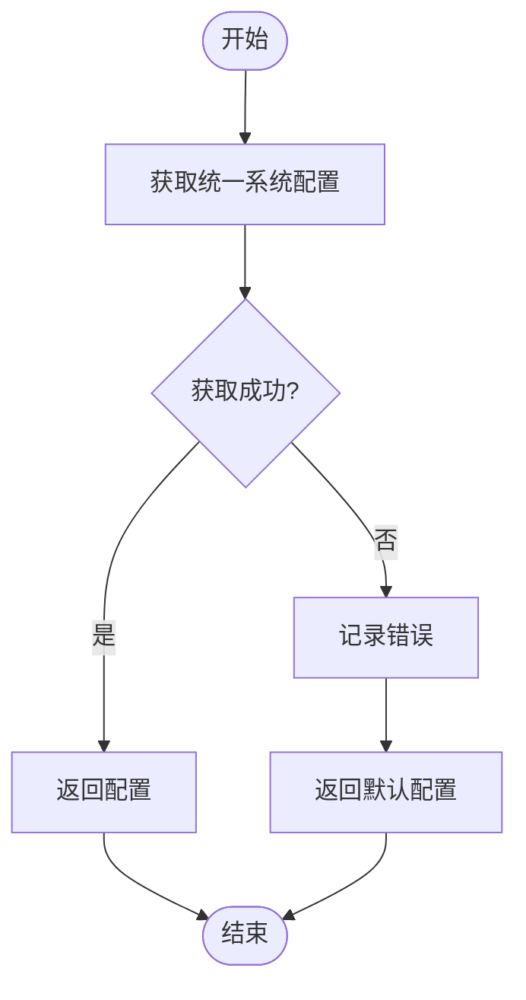
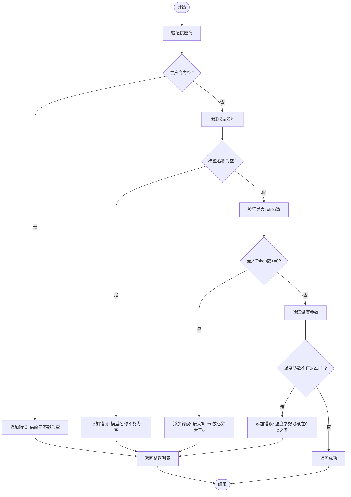
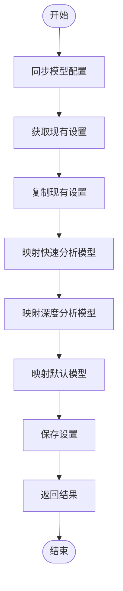
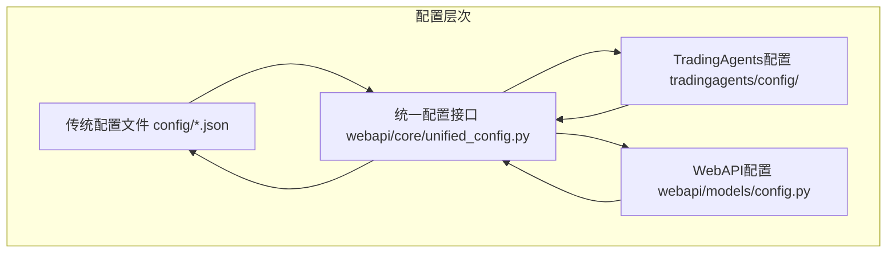
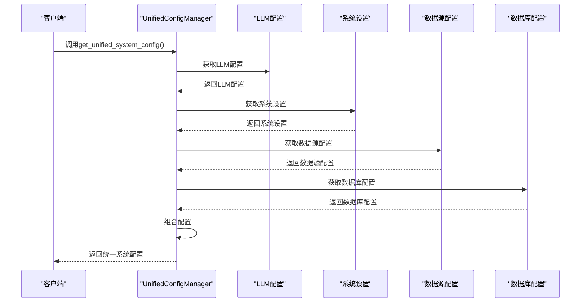
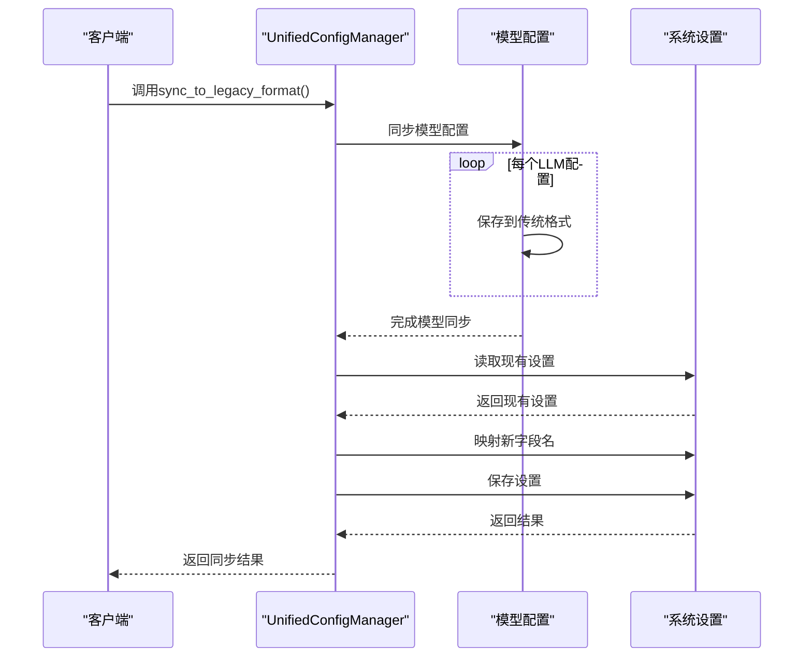
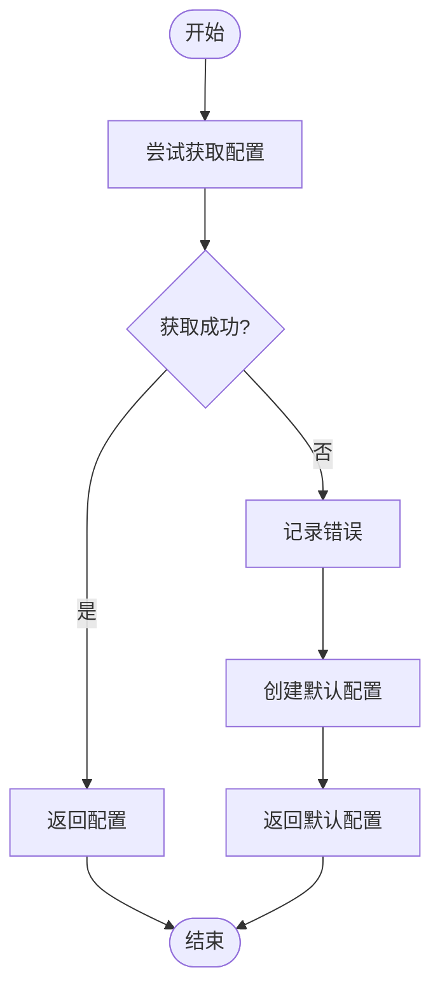
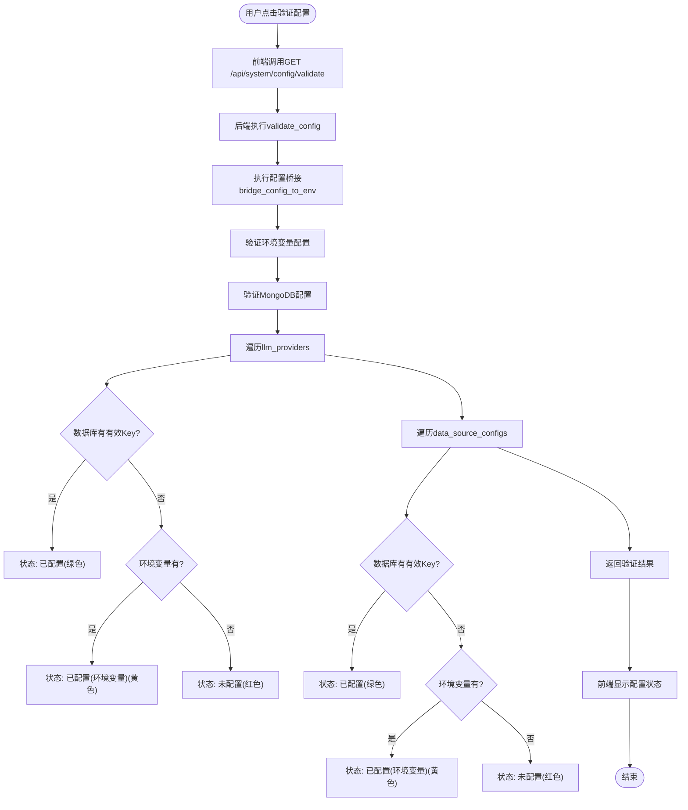

# 配置验证API

<cite>
**本文档引用的文件**   
- [unified_config.py](file://app/core/unified_config.py)
- [config.py](file://app/core/config.py)
- [config_bridge.py](file://app/core/config_bridge.py)
- [config_compat.py](file://app/core/config_compat.py)
- [config_service.py](file://app/services/config_service.py)
- [config.py](file://app/models/config.py)
</cite>

## 目录
1. [简介](#简介)
2. [配置完整性检查](#配置完整性检查)
3. [字段验证机制](#字段验证机制)
4. [兼容性处理机制](#兼容性处理机制)
5. [统一配置桥接](#统一配置桥接)
6. [错误处理与默认值策略](#错误处理与默认值策略)
7. [配置验证流程](#配置验证流程)
8. [结论](#结论)

## 简介
配置验证API是系统配置管理系统的核心组件，负责确保配置数据的完整性、正确性和兼容性。该API通过`unified_config`模块实现配置桥接，将数据库中的新格式配置与传统的JSON文件格式进行双向同步。系统提供了完整的配置验证机制，包括配置完整性检查、字段验证和兼容性处理，确保系统在各种配置环境下都能稳定运行。

**Section sources**
- [unified_config.py](file://app/core/unified_config.py#L1-L501)

## 配置完整性检查
配置完整性检查是确保系统配置数据完整性的关键机制。系统通过`UnifiedConfigManager`类实现配置完整性检查，该类提供了多种方法来验证配置数据的完整性。

系统配置完整性检查主要通过`get_unified_system_config`方法实现，该方法整合了数据库配置、环境变量和文件配置，生成统一的系统配置。在获取统一配置时，系统会进行完整性检查，如果获取配置失败，会返回默认配置以确保系统能够继续运行。

**Diagram sources**
- [unified_config.py](file://app/core/unified_config.py#L440-L465)

**Section sources**
- [unified_config.py](file://app/core/unified_config.py#L440-L465)

## 字段验证机制
字段验证机制确保配置数据的各个字段符合预期的格式和约束条件。系统在多个层面实现了字段验证，包括前端验证、后端验证和数据库验证。

前端验证通过`validateLLMConfig`、`validateDataSourceConfig`和`validateDatabaseConfig`等函数实现，这些函数对配置数据的各个字段进行验证，确保必填字段不为空，数值字段在合理范围内。

**Diagram sources**
- [frontend/src/api/config.ts](file://frontend/src/api/config.ts#L585-L598)

**Section sources**
- [frontend/src/api/config.ts](file://frontend/src/api/config.ts#L585-L598)

## 兼容性处理机制
兼容性处理机制确保新旧配置格式之间的平滑过渡。系统通过`sync_to_legacy_format`方法实现配置的双向同步，将新格式的配置转换为旧格式以保证向后兼容。

`sync_to_legacy_format`方法首先同步模型配置，然后同步系统设置。在同步系统设置时，系统会保留现有字段，并添加新字段的映射关系，确保旧系统能够正确读取新配置。

**Diagram sources**
- [unified_config.py](file://app/core/unified_config.py#L466-L497)

**Section sources**
- [unified_config.py](file://app/core/unified_config.py#L466-L497)

## 统一配置桥接
统一配置桥接是`unified_config`模块的核心功能，它实现了数据库中的新格式配置与传统JSON文件格式的双向同步。该功能通过`UnifiedConfigManager`类实现，提供了完整的配置管理接口。

### 配置桥接架构
配置桥接架构采用分层设计，将配置数据分为多个层次，包括传统配置文件、TradingAgents配置、WebAPI配置和统一配置接口。这种设计确保了系统的向后兼容性，同时提供了统一的配置管理接口。

**Diagram sources**
- [UNIFIED_CONFIG.md](file://docs/configuration/UNIFIED_CONFIG.md#L1-L294)

### get_unified_system_config方法
`get_unified_system_config`方法是统一配置桥接的核心，它整合了数据库配置、环境变量和文件配置，生成统一的系统配置。该方法首先获取LLM配置、系统设置、数据源配置和数据库配置，然后将这些配置组合成一个统一的系统配置对象。

**Diagram sources**
- [unified_config.py](file://app/core/unified_config.py#L440-L465)

### sync_to_legacy_format方法
`sync_to_legacy_format`方法负责将新格式的配置转换为旧格式，以保证向后兼容。该方法首先同步模型配置，然后同步系统设置。在同步系统设置时，系统会保留现有字段，并添加新字段的映射关系。

**Diagram sources**
- [unified_config.py](file://app/core/unified_config.py#L466-L497)

**Section sources**
- [unified_config.py](file://app/core/unified_config.py#L1-L501)

## 错误处理与默认值策略
错误处理与默认值策略确保系统在配置错误或缺失的情况下仍能正常运行。系统采用多层次的错误处理机制，包括异常捕获、日志记录和默认值填充。

当配置验证失败时，系统会记录详细的错误信息，并尝试使用默认值或回退方案。例如，在获取统一配置失败时，系统会返回一个默认配置，确保系统能够继续运行。

**Diagram sources**
- [unified_config.py](file://app/core/unified_config.py#L440-L465)

**Section sources**
- [unified_config.py](file://app/core/unified_config.py#L440-L465)

## 配置验证流程
配置验证流程是确保系统配置正确性的关键步骤。系统提供了完整的配置验证流程，包括配置桥接、环境变量验证和数据库配置验证。

配置验证流程从用户点击"验证配置"按钮开始，前端调用后端的验证接口，后端执行配置桥接，然后验证环境变量和数据库配置，最后返回验证结果。

**Diagram sources**
- [API_KEY_MANAGEMENT_ANALYSIS.md](file://docs/API_KEY_MANAGEMENT_ANALYSIS.md#L238-L267)

**Section sources**
- [API_KEY_MANAGEMENT_ANALYSIS.md](file://docs/API_KEY_MANAGEMENT_ANALYSIS.md#L238-L267)

## 结论
配置验证API通过`unified_config`模块实现了完整的配置管理功能，包括配置完整性检查、字段验证和兼容性处理。系统通过`get_unified_system_config`方法整合数据库配置、环境变量和文件配置，通过`sync_to_legacy_format`方法将新配置转换为旧格式以保证向后兼容。错误处理与默认值策略确保系统在配置错误或缺失的情况下仍能正常运行。整个配置验证流程设计合理，能够有效保证系统配置的正确性和稳定性。