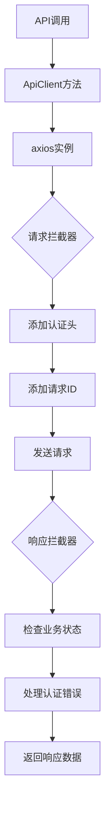
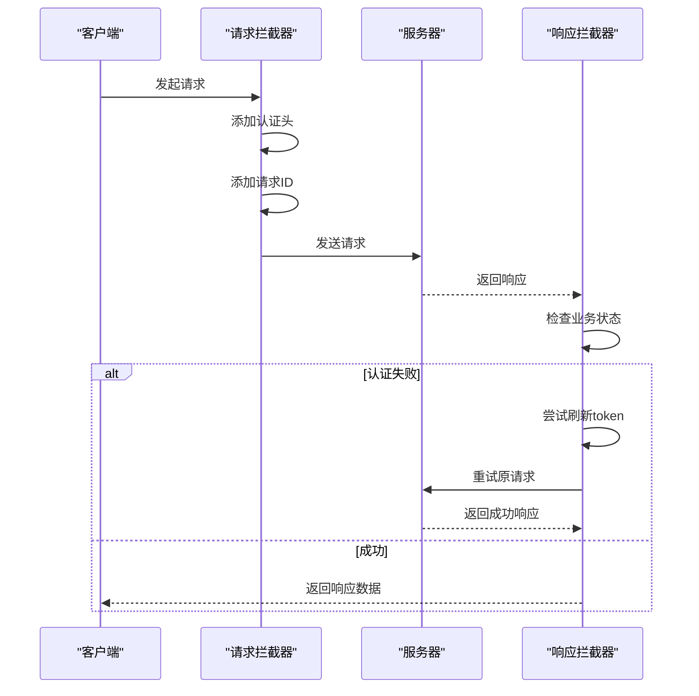
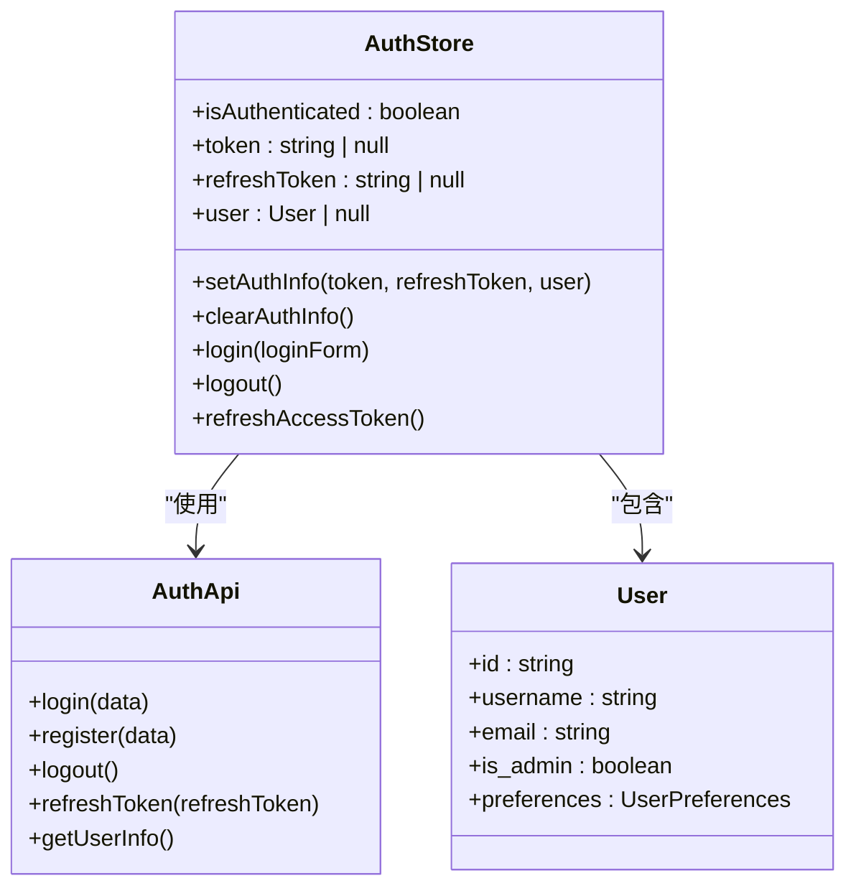
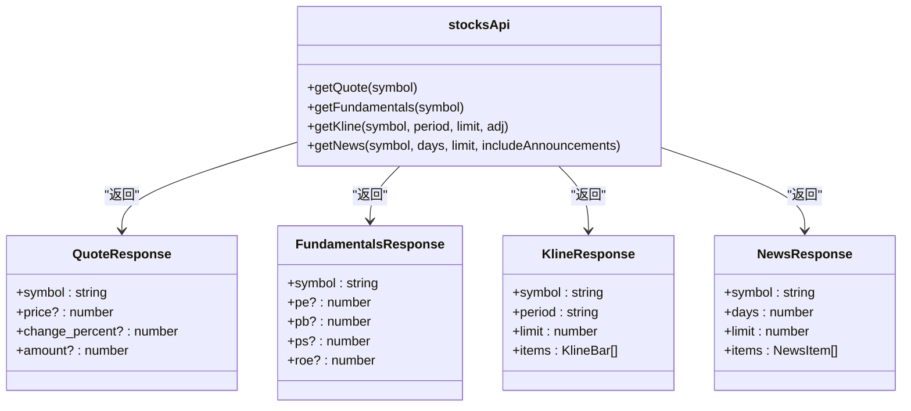
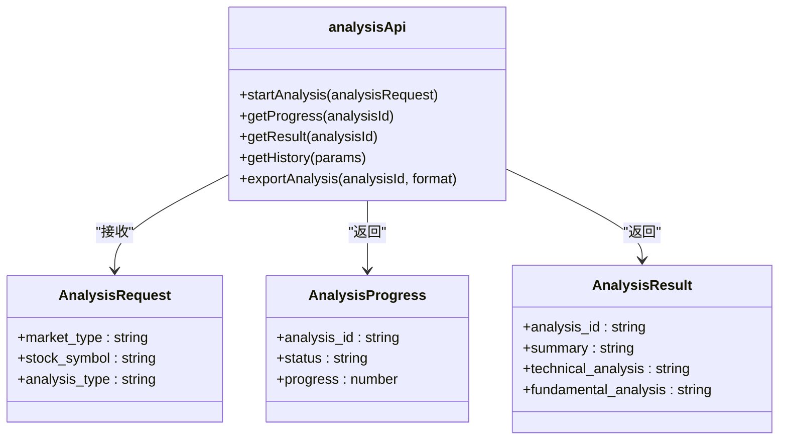
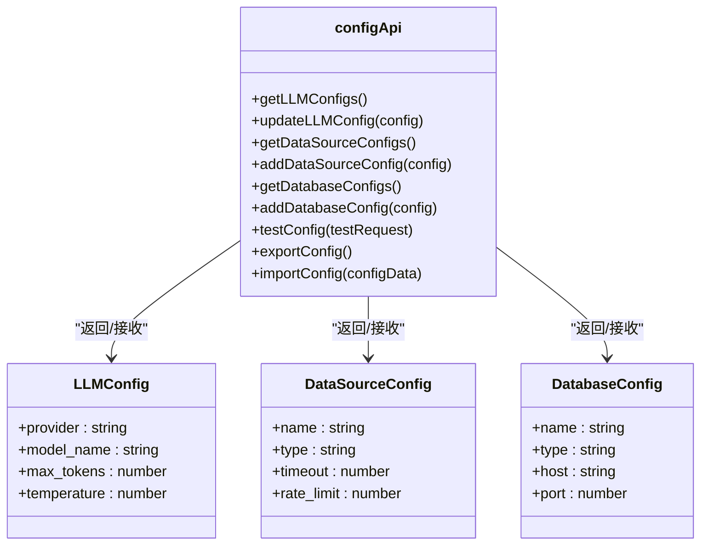
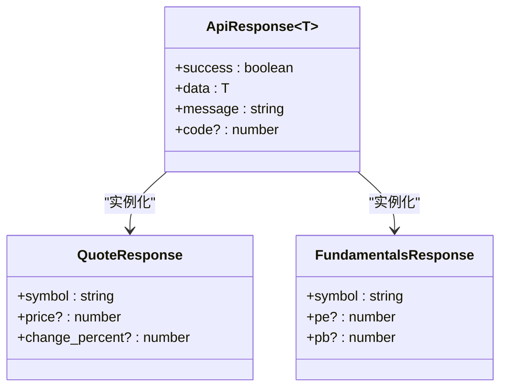

# API客户端

<cite>
**本文档引用文件**   
- [request.ts](file://frontend/src/api/request.ts)
- [stocks.ts](file://frontend/src/api/stocks.ts)
- [analysis.ts](file://frontend/src/api/analysis.ts)
- [config.ts](file://frontend/src/api/config.ts)
- [auth.ts](file://frontend/src/api/auth.ts)
- [auth.ts](file://frontend/src/stores/auth.ts)
- [types/auth.ts](file://frontend/src/types/auth.ts)
- [types/config.ts](file://frontend/src/types/config.ts)
- [types/analysis.ts](file://frontend/src/types/analysis.ts)
</cite>

## 目录
1. [简介](#简介)
2. [API服务层设计](#api服务层设计)
3. [HTTP请求处理](#http请求处理)
4. [拦截器与错误处理](#拦截器与错误处理)
5. [认证机制](#认证机制)
6. [业务API模块](#业务api模块)
7. [类型安全实现](#类型安全实现)
8. [API调用最佳实践](#api调用最佳实践)
9. [常见问题解决方案](#常见问题解决方案)

## 简介
sagacity平台的API客户端是基于TypeScript构建的前端应用，负责与后端服务进行通信。该客户端采用模块化设计，将不同的业务功能划分为独立的API模块，如股票数据、分析服务、配置管理等。通过封装的HTTP请求处理机制，实现了统一的请求/响应格式、错误处理和认证流程。类型系统确保了前后端数据交互的类型安全，减少了运行时错误。

## API服务层设计
API服务层采用分层架构设计，核心是`request.ts`文件中封装的HTTP请求处理模块。该模块基于axios库构建，提供了统一的请求配置、拦截器、错误处理和类型定义。各业务API模块（如stocks、analysis、config等）通过导入`ApiClient`类来实现具体的API调用。这种设计模式实现了关注点分离，使得业务逻辑与网络通信细节解耦，提高了代码的可维护性和可测试性。

**Section sources**
- [request.ts](file://frontend/src/api/request.ts#L1-L593)
- [stocks.ts](file://frontend/src/api/stocks.ts#L1-L123)

## HTTP请求处理
HTTP请求处理模块在`request.ts`中实现，定义了`ApiClient`类来封装各种HTTP方法。该模块使用泛型确保类型安全，所有请求方法都返回`Promise<ApiResponse<T>>`类型，其中`T`是预期的响应数据类型。请求配置接口`RequestConfig`扩展了`AxiosRequestConfig`，添加了自定义属性如`skipAuth`、`showLoading`等，用于控制请求行为。

**Diagram sources **
- [request.ts](file://frontend/src/api/request.ts#L492-L589)

**Section sources**
- [request.ts](file://frontend/src/api/request.ts#L1-L593)

## 拦截器与错误处理
拦截器是API客户端的核心组件，分为请求拦截器和响应拦截器。请求拦截器负责在发送请求前添加认证头、请求ID等信息。响应拦截器则处理服务器响应，包括业务状态码检查、认证错误处理和网络错误重试。错误处理机制实现了去重功能，避免相同错误消息重复显示。对于401未授权错误，系统会尝试刷新token，失败后才跳转到登录页。

**Diagram sources **
- [request.ts](file://frontend/src/api/request.ts#L96-L364)

**Section sources**
- [request.ts](file://frontend/src/api/request.ts#L1-L593)

## 认证机制
认证机制基于JWT（JSON Web Token）实现，相关逻辑分布在`auth.ts`模块和`auth` store中。用户登录后，token和refresh token被存储在localStorage中。`authStore`负责管理认证状态，提供`setAuthInfo`和`clearAuthInfo`方法来设置和清除认证信息。当token即将过期时，系统会自动使用refresh token获取新的访问令牌，实现无感刷新。

**Diagram sources **
- [auth.ts](file://frontend/src/stores/auth.ts#L6-L477)
- [auth.ts](file://frontend/src/api/auth.ts#L1-L59)

**Section sources**
- [auth.ts](file://frontend/src/stores/auth.ts#L1-L477)
- [auth.ts](file://frontend/src/api/auth.ts#L1-L59)
- [types/auth.ts](file://frontend/src/types/auth.ts#L1-L165)

## 业务API模块
业务API模块按功能划分，每个模块对应一个具体的业务领域。例如`stocks.ts`模块提供股票行情、基本面和K线数据的获取接口；`analysis.ts`模块提供股票分析、进度查询和结果获取接口；`config.ts`模块提供配置管理、大模型配置和数据源配置接口。这些模块通过导入`ApiClient`类来实现具体的API调用，保持了代码的一致性和可维护性。

### 股票API模块
股票API模块提供股票相关数据的访问接口，包括行情、基本面、K线和新闻数据。每个接口都使用泛型确保类型安全，返回预期的响应类型。

**Diagram sources **
- [stocks.ts](file://frontend/src/api/stocks.ts#L1-L123)

**Section sources**
- [stocks.ts](file://frontend/src/api/stocks.ts#L1-L123)

### 分析API模块
分析API模块提供股票分析服务的接口，包括启动分析、获取进度、获取结果和管理分析历史等功能。该模块还提供了常量和工具函数，用于验证请求参数和格式化数据显示。

**Diagram sources **
- [analysis.ts](file://frontend/src/api/analysis.ts#L1-L483)

**Section sources**
- [analysis.ts](file://frontend/src/api/analysis.ts#L1-L483)
- [types/analysis.ts](file://frontend/src/types/analysis.ts#L1-L274)

### 配置API模块
配置API模块提供系统配置管理的接口，包括大模型配置、数据源配置和数据库配置的增删改查操作。该模块还提供了配置测试和导入导出功能。

**Diagram sources **
- [config.ts](file://frontend/src/api/config.ts#L1-L622)

**Section sources**
- [config.ts](file://frontend/src/api/config.ts#L1-L622)
- [types/config.ts](file://frontend/src/types/config.ts#L1-L94)

## 类型安全实现
类型安全通过TypeScript的类型系统实现，所有API响应都定义了对应的接口类型。`ApiResponse<T>`接口定义了统一的响应格式，包含`success`、`data`、`message`等字段。业务模块定义了具体的响应类型，如`QuoteResponse`、`FundamentalsResponse`等。这种类型定义确保了编译时的类型检查，减少了运行时错误。

**Diagram sources **
- [request.ts](file://frontend/src/api/request.ts#L9-L16)
- [stocks.ts](file://frontend/src/api/stocks.ts#L3-L43)

**Section sources**
- [request.ts](file://frontend/src/api/request.ts#L1-L593)
- [stocks.ts](file://frontend/src/api/stocks.ts#L1-L123)

## API调用最佳实践
API调用的最佳实践包括使用正确的请求配置、处理异步操作和管理错误。建议使用`async/await`语法处理异步调用，使用try-catch块捕获和处理错误。对于需要显示加载状态的请求，应设置`showLoading: true`配置。避免直接操作localStorage中的认证信息，而应通过`authStore`来管理认证状态。

**Section sources**
- [request.ts](file://frontend/src/api/request.ts#L1-L593)
- [auth.ts](file://frontend/src/stores/auth.ts#L1-L477)

## 常见问题解决方案
常见问题包括认证失败、网络连接错误和API响应超时。对于认证失败，检查token是否过期，尝试重新登录。对于网络连接错误，检查后端服务是否正常运行。对于API响应超时，检查网络连接或增加请求超时时间。使用`testApiConnection`函数可以测试API连接状态。

**Section sources**
- [request.ts](file://frontend/src/api/request.ts#L460-L488)
- [app.ts](file://frontend/src/stores/app.ts#L207-L231)