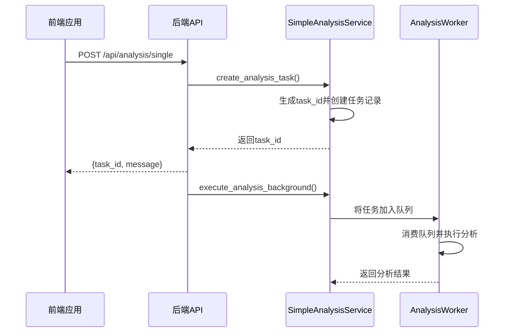
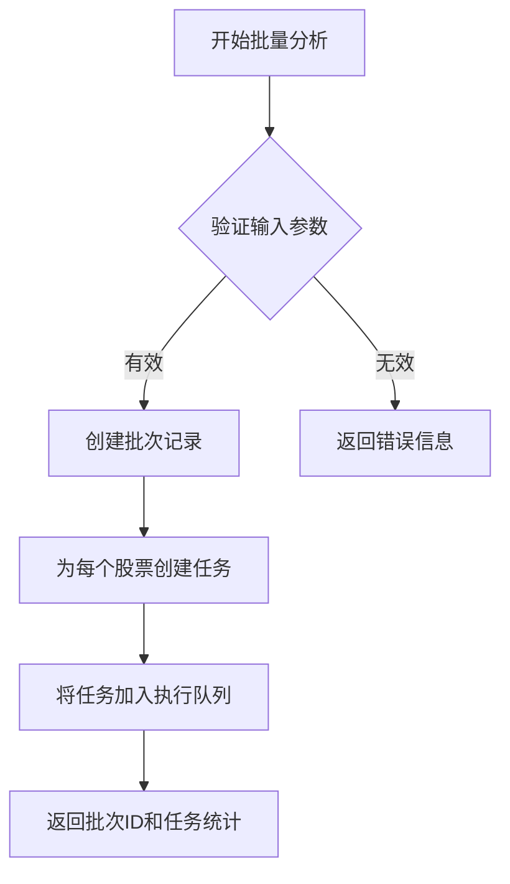
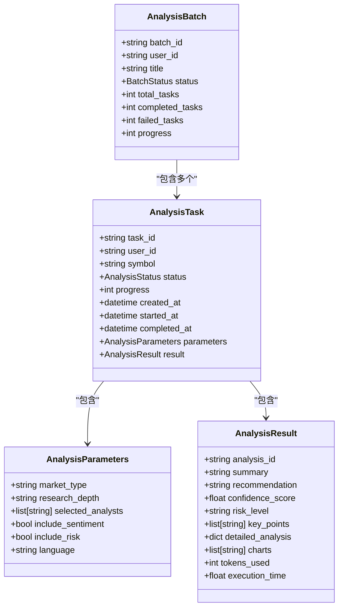
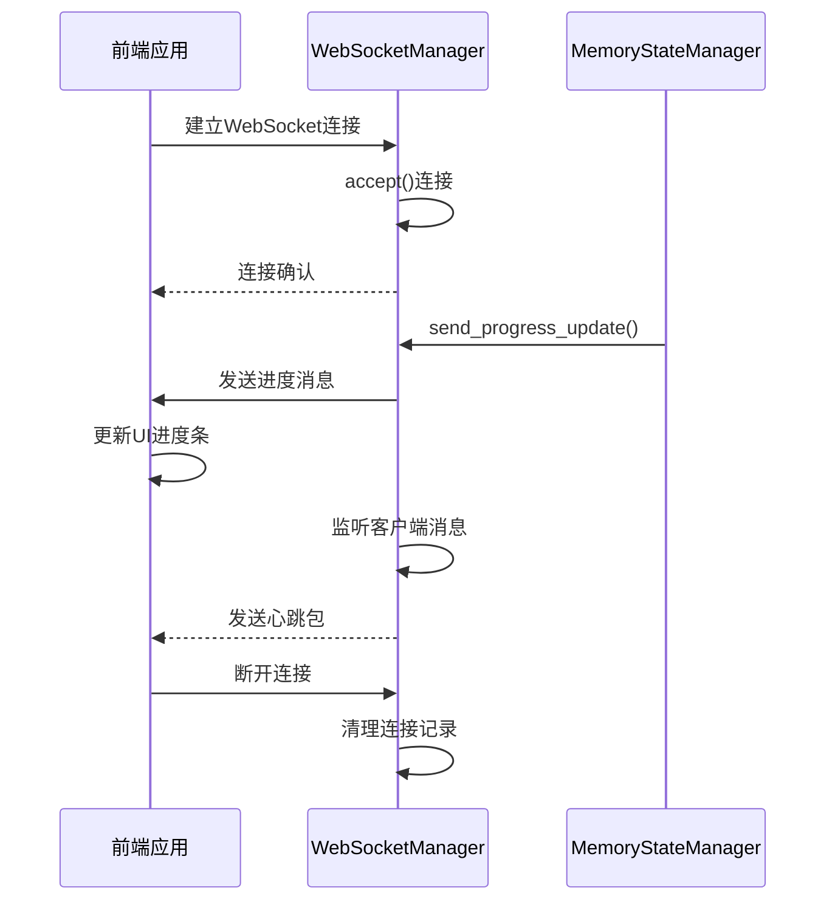

# 分析服务接口

<cite>
**本文档引用的文件**   
- [analysis.ts](file://frontend/src/api/analysis.ts)
- [analysis.py](file://app/routers/analysis.py)
- [simple_analysis_service.py](file://app/services/simple_analysis_service.py)
- [analysis_worker.py](file://app/worker/analysis_worker.py)
- [websocket_notifications.py](file://app/routers/websocket_notifications.py)
- [websocket_manager.py](file://app/services/websocket_manager.py)
- [analysis.py](file://app/models/analysis.py)
- [TaskCenter.vue](file://frontend/src/views/Tasks/TaskCenter.vue)
</cite>

## 目录
1. [简介](#简介)
2. [核心功能](#核心功能)
3. [接口参数与调用流程](#接口参数与调用流程)
4. [任务状态管理机制](#任务状态管理机制)
5. [长时间运行任务与WebSocket进度更新](#长时间运行任务与websocket进度更新)
6. [错误处理策略](#错误处理策略)
7. [性能优化建议](#性能优化建议)
8. [后端集成细节](#后端集成细节)

## 简介
分析服务接口为用户提供股票单股分析、批量分析和历史查询功能。该服务通过前后端协同工作，支持长时间运行的分析任务，并利用WebSocket实现实时进度更新。系统采用异步任务处理架构，确保高并发场景下的稳定性和响应性。

**Section sources**
- [analysis.ts](file://frontend/src/api/analysis.ts#L1-L483)
- [analysis.py](file://app/routers/analysis.py#L1-L1259)

## 核心功能
分析服务提供三大核心功能：单股分析、批量分析和分析历史查询。单股分析支持对指定股票进行全面的技术、基本面和情绪分析；批量分析允许用户同时提交多个股票的分析请求；分析历史查询则提供对已完成任务的检索和结果获取能力。

**Section sources**
- [analysis.ts](file://frontend/src/api/analysis.ts#L120-L186)
- [analysis.py](file://app/routers/analysis.py#L40-L89)

## 接口参数与调用流程
### 单股分析接口
单股分析通过`startSingleAnalysis`方法实现，接收`SingleAnalysisRequest`对象作为参数。该对象包含股票代码(symbol)和分析参数(parameters)，其中参数可配置市场类型、研究深度、分析师选择等选项。

**Diagram sources**
- [analysis.ts](file://frontend/src/api/analysis.ts#L126-L128)
- [analysis.py](file://app/routers/analysis.py#L40-L95)
- [simple_analysis_service.py](file://app/services/simple_analysis_service.py#L730-L800)
- [analysis_worker.py](file://app/worker/analysis_worker.py#L112-L132)

### 批量分析接口
批量分析通过`startBatchAnalysis`方法实现，接收包含标题、描述和股票代码列表的请求对象。系统会为每个股票创建独立的分析任务，并统一管理批次状态。

**Diagram sources**
- [analysis.ts](file://frontend/src/api/analysis.ts#L178-L186)
- [analysis.py](file://app/routers/analysis.py#L892-L907)

### 分析历史查询接口
分析历史查询通过`getHistory`方法实现，支持按状态、日期范围、股票代码等条件筛选历史记录。系统从MongoDB中检索已完成的分析任务，并返回分页结果。

**Section sources**
- [analysis.ts](file://frontend/src/api/analysis.ts#L150-L162)
- [analysis.py](file://app/routers/analysis.py#L1000-L1100)

## 任务状态管理机制
系统采用三级状态管理体系：内存状态、数据库持久化和WebSocket实时推送。`MemoryStateManager`负责在内存中维护任务状态，包括任务创建、进度更新和结果存储。所有状态变更都会同步到MongoDB数据库，确保数据持久性。

**Diagram sources**
- [analysis.py](file://app/models/analysis.py#L72-L237)
- [simple_analysis_service.py](file://app/services/simple_analysis_service.py#L591-L800)

## 长时间运行任务与WebSocket进度更新
### WebSocket连接管理
系统使用`WebSocketManager`类管理所有WebSocket连接。客户端通过`/api/ws/tasks/{task_id}`端点建立连接，服务器在任务执行期间持续推送进度更新。

**Diagram sources**
- [websocket_manager.py](file://app/services/websocket_manager.py#L1-L47)
- [websocket_notifications.py](file://app/routers/websocket_notifications.py#L287-L303)
- [TaskCenter.vue](file://frontend/src/views/Tasks/TaskCenter.vue#L204-L253)

### 进度更新机制
当分析任务执行时，`MemoryStateManager`会调用`send_progress_update`方法，通过WebSocket向客户端推送包含进度百分比、当前步骤和消息的状态更新。前端接收到消息后，解析并更新用户界面。

**Section sources**
- [memory_state_manager.py](file://app/services/memory_state_manager.py#L213-L242)
- [websocket_notifications.py](file://app/routers/websocket_notifications.py#L287-L303)

## 错误处理策略
系统实现了多层次的错误处理机制。在任务执行层面，每个任务都有最大重试次数（默认3次），当执行失败时会自动重试。对于WebSocket连接，系统实现了自动重连机制，客户端在连接断开后会按指数退避算法尝试重新连接。

此外，系统还提供了降级方案：当WebSocket不可用时，前端会自动切换到SSE（Server-Sent Events）作为备用通信方式，确保功能可用性。

**Section sources**
- [analysis_worker.py](file://app/worker/analysis_worker.py#L170-L173)
- [websocket_notifications.py](file://app/routers/websocket_notifications.py#L254-L259)

## 性能优化建议
1. **并发控制**：通过`ThreadPoolExecutor`限制同时执行的分析任务数量，避免资源耗尽
2. **缓存机制**：对股票名称等静态数据进行内存缓存，减少重复查询
3. **连接复用**：WebSocket连接建立后保持长连接，避免频繁握手开销
4. **批量操作**：在数据库操作中使用upsert等原子操作，提高写入效率
5. **异步处理**：所有耗时操作均采用异步模式，确保主线程响应性

**Section sources**
- [simple_analysis_service.py](file://app/services/simple_analysis_service.py#L601-L604)
- [analysis.py](file://app/models/analysis.py#L74-L103)

## 后端集成细节
分析服务与后端`analysis_service`的集成通过清晰的接口定义实现。前端通过REST API提交任务请求，后端服务将任务放入消息队列，由独立的Worker进程消费执行。整个流程解耦良好，支持水平扩展。

系统配置方面，通过`config_provider`获取系统设置，动态调整并发限制、超时时间等参数，实现灵活的运行时配置管理。

**Section sources**
- [analysis_service.py](file://app/services/analysis_service.py#L527-L558)
- [analysis.py](file://app/routers/analysis.py#L17-L23)