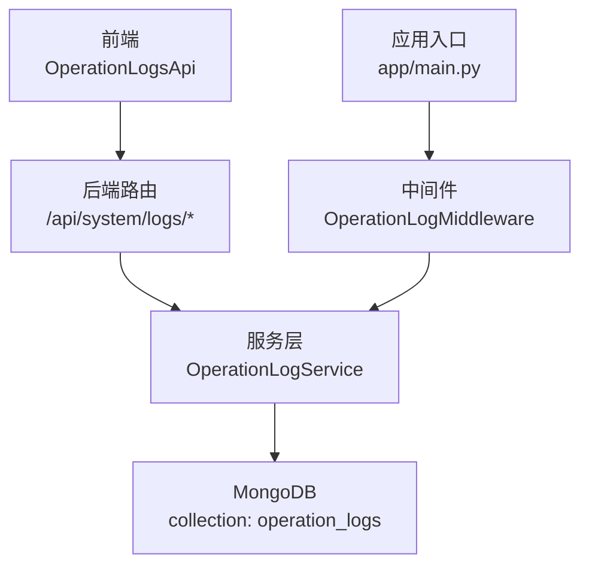
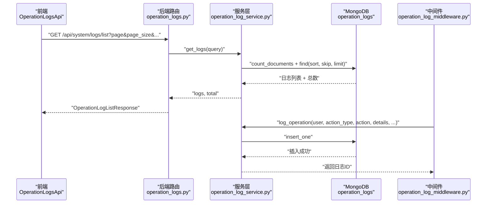
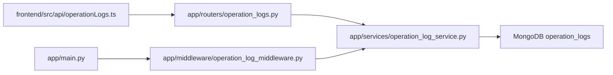

# 操作日志接口

<cite>
**本文引用的文件**
- [frontend/src/api/operationLogs.ts](file://frontend/src/api/operationLogs.ts)
- [app/routers/operation_logs.py](file://app/routers/operation_logs.py)
- [app/services/operation_log_service.py](file://app/services/operation_log_service.py)
- [app/models/operation_log.py](file://app/models/operation_log.py)
- [app/middleware/operation_log_middleware.py](file://app/middleware/operation_log_middleware.py)
- [app/main.py](file://app/main.py)
- [tests/test_operation_logs.py](file://tests/test_operation_logs.py)
</cite>

## 目录
1. [简介](#简介)
2. [项目结构](#项目结构)
3. [核心组件](#核心组件)
4. [架构总览](#架构总览)
5. [详细组件分析](#详细组件分析)
6. [依赖关系分析](#依赖关系分析)
7. [性能考虑](#性能考虑)
8. [故障排查指南](#故障排查指南)
9. [结论](#结论)

## 简介
本接口文档面向前端与后端开发者，系统性说明“操作日志”能力的前后端实现与交互，重点覆盖：
- 前端接口封装与使用方式（OperationLogsApi 类与相关类型）
- 后端路由与服务层实现（日志查询、过滤、统计、导出、清空、详情）
- 自动化日志中间件与手动记录能力
- 日志数据结构定义（字段、类型、含义）
- 大量日志场景下的分页与性能优化策略

## 项目结构
围绕“操作日志”的前后端职责划分如下：
- 前端：提供 OperationLogsApi 类，封装 GET/POST 等请求，负责参数拼装、响应解析与导出下载
- 后端路由：定义 /api/system/logs/* 接口，接收查询参数，调用服务层
- 服务层：封装 MongoDB 查询、聚合、统计、清空等逻辑
- 中间件：自动拦截 API 请求，记录用户操作日志
- 数据模型：定义请求/响应/查询/统计等 Pydantic 模型

图表来源
- [frontend/src/api/operationLogs.ts](file://frontend/src/api/operationLogs.ts#L96-L169)
- [app/routers/operation_logs.py](file://app/routers/operation_logs.py#L25-L271)
- [app/services/operation_log_service.py](file://app/services/operation_log_service.py#L71-L243)
- [app/middleware/operation_log_middleware.py](file://app/middleware/operation_log_middleware.py#L27-L120)
- [app/main.py](file://app/main.py#L630-L632)

章节来源
- [frontend/src/api/operationLogs.ts](file://frontend/src/api/operationLogs.ts#L96-L169)
- [app/routers/operation_logs.py](file://app/routers/operation_logs.py#L25-L271)
- [app/services/operation_log_service.py](file://app/services/operation_log_service.py#L71-L243)
- [app/middleware/operation_log_middleware.py](file://app/middleware/operation_log_middleware.py#L27-L120)
- [app/main.py](file://app/main.py#L630-L632)

## 核心组件
- 前端接口封装
  - OperationLogsApi：提供 getOperationLogs、getOperationLogStats、getOperationLogDetail、createOperationLog、clearOperationLogs、exportOperationLogsCSV 等静态方法
  - 类型定义：OperationLog、OperationLogQuery、OperationLogListResponse、OperationLogStats、OperationLogStatsResponse、CreateOperationLogRequest、ClearLogsRequest、ClearLogsResponse
  - 操作类型常量与映射：ActionTypes、ActionTypeNames、ActionTypeTagColors
- 后端路由
  - GET /api/system/logs/list：分页查询日志
  - GET /api/system/logs/stats：统计近 N 天日志
  - GET /api/system/logs/{log_id}：按 ID 获取详情
  - POST /api/system/logs/create：手动创建日志
  - POST /api/system/logs/clear：清空日志（可按天数与类型）
  - GET /api/system/logs/export/csv：导出 CSV
- 服务层
  - OperationLogService：实现 get_logs、get_stats、clear_logs、get_log_by_id、create_log 等
- 中间件
  - OperationLogMiddleware：自动记录 API 操作日志，支持跳过路径、方法过滤、用户识别、耗时计算、错误信息提取
- 数据模型
  - OperationLogCreate/Response：日志实体
  - OperationLogQuery：查询参数
  - OperationLogListResponse/OperationLogStatsResponse：响应包装
  - ClearLogsRequest/ClearLogsResponse：清空请求/响应
  - ActionType 常量与 ACTION_TYPE_NAMES 映射

章节来源
- [frontend/src/api/operationLogs.ts](file://frontend/src/api/operationLogs.ts#L1-L237)
- [app/routers/operation_logs.py](file://app/routers/operation_logs.py#L25-L271)
- [app/services/operation_log_service.py](file://app/services/operation_log_service.py#L71-L243)
- [app/models/operation_log.py](file://app/models/operation_log.py#L1-L138)
- [app/middleware/operation_log_middleware.py](file://app/middleware/operation_log_middleware.py#L27-L120)

## 架构总览
下图展示了从前端到后端再到数据库的整体流程，以及中间件如何自动采集日志。

图表来源
- [frontend/src/api/operationLogs.ts](file://frontend/src/api/operationLogs.ts#L101-L114)
- [app/routers/operation_logs.py](file://app/routers/operation_logs.py#L25-L64)
- [app/services/operation_log_service.py](file://app/services/operation_log_service.py#L71-L126)
- [app/middleware/operation_log_middleware.py](file://app/middleware/operation_log_middleware.py#L230-L277)

章节来源
- [frontend/src/api/operationLogs.ts](file://frontend/src/api/operationLogs.ts#L101-L114)
- [app/routers/operation_logs.py](file://app/routers/operation_logs.py#L25-L64)
- [app/services/operation_log_service.py](file://app/services/operation_log_service.py#L71-L126)
- [app/middleware/operation_log_middleware.py](file://app/middleware/operation_log_middleware.py#L230-L277)

## 详细组件分析

### 前端接口封装（OperationLogsApi）
- 方法概览
  - getOperationLogs(params)：分页查询，支持 start_date、end_date、action_type、success、keyword、page、page_size
  - getOperationLogStats(days)：统计近 N 天日志
  - getOperationLogDetail(logId)：按 ID 获取详情
  - createOperationLog(data)：手动创建日志
  - clearOperationLogs(data)：清空日志（days 或 action_type 二选一或都选）
  - exportOperationLogsCSV(params)：导出 CSV（start_date、end_date、action_type）
- 参数与响应
  - OperationLogQuery：page/page_size/时间范围/类型/成功状态/关键词
  - OperationLogListResponse：包含 logs、total、page、page_size、total_pages
  - OperationLogStatsResponse：包含 total_logs、success_logs、failed_logs、success_rate、action_type_distribution、hourly_distribution
  - ClearLogsResponse：包含 deleted_count、filter
- 操作类型与标签
  - ActionTypes：枚举操作类型常量
  - ActionTypeNames：类型到中文名映射
  - ActionTypeTagColors：类型到标签颜色映射
- 使用建议
  - 分页查询时，建议固定 page_size 在 20~100 区间内，避免过大导致内存压力
  - 导出 CSV 时，建议限制时间范围与类型，避免一次性导出过多数据

章节来源
- [frontend/src/api/operationLogs.ts](file://frontend/src/api/operationLogs.ts#L96-L169)
- [frontend/src/api/operationLogs.ts](file://frontend/src/api/operationLogs.ts#L171-L237)

### 后端路由与服务层
- 路由
  - GET /api/system/logs/list：接收分页与过滤参数，调用服务层 get_logs，返回 OperationLogListResponse
  - GET /api/system/logs/stats：接收 days，调用 get_stats，返回 OperationLogStatsResponse
  - GET /api/system/logs/{log_id}：调用 get_log_by_id，返回单条日志
  - POST /api/system/logs/create：接收 OperationLogCreate，自动提取 IP 与 UA，调用 create_log
  - POST /api/system/logs/clear：接收 ClearLogsRequest，调用 clear_logs
  - GET /api/system/logs/export/csv：构建查询，调用 get_logs，生成 CSV 并以流形式返回
- 服务层
  - get_logs：构建时间范围、类型、成功状态、用户、关键词等过滤条件；先 count_documents 再分页查询；排序按时间倒序
  - get_stats：统计总/成功/失败数、成功率；按 action_type 聚合；按小时聚合（0~23）
  - clear_logs：支持按天数与/或类型删除；返回删除数量与实际过滤条件
  - get_log_by_id：按 ObjectId 查询
  - create_log：构造日志文档（含 user_id、username、action_type、action、details、success、error_message、duration_ms、ip_address、user_agent、session_id、timestamp、created_at），插入 MongoDB
- 数据模型
  - OperationLogCreate/Response：字段完整，包含时间戳序列化为 ISO 字符串
  - OperationLogQuery：page/page_size/时间范围/类型/成功状态/关键词/user_id
  - OperationLogListResponse/OperationLogStatsResponse：统一封装
  - ClearLogsRequest/ClearLogsResponse：清空请求/响应
  - ActionType 常量与 ACTION_TYPE_NAMES 映射

章节来源
- [app/routers/operation_logs.py](file://app/routers/operation_logs.py#L25-L271)
- [app/services/operation_log_service.py](file://app/services/operation_log_service.py#L71-L243)
- [app/models/operation_log.py](file://app/models/operation_log.py#L1-L138)

### 自动化日志中间件
- 功能要点
  - 跳过路径：/health、/healthz、/readyz、/favicon.ico、/docs、/redoc、/openapi.json、/api/stream/、/api/system/logs/
  - 仅记录 API 请求（/api/）且仅记录 POST/PUT/DELETE/PATCH
  - 自动识别用户信息（从请求状态或解析 Authorization）
  - 自动计算耗时（毫秒）
  - 自动提取 IP 与 UA，构造 details（method、path、status_code、query_params）
  - 自动判定成功与否（2xx~3xx 为成功）
  - 自动映射路径到操作类型（如 /api/analysis/ -> 股票分析）
  - 自动生成动作描述（动词 + 路径片段）
  - 异步记录，不影响请求链路
- 动态开关
  - 应用启动时可通过系统设置动态控制是否启用日志记录

章节来源
- [app/middleware/operation_log_middleware.py](file://app/middleware/operation_log_middleware.py#L27-L120)
- [app/middleware/operation_log_middleware.py](file://app/middleware/operation_log_middleware.py#L138-L281)
- [app/main.py](file://app/main.py#L249-L252)

### 日志数据结构定义
- 日志实体（OperationLog/OperationLogResponse）
  - id、user_id、username、action_type、action、details、success、error_message、duration_ms、ip_address、user_agent、session_id、timestamp、created_at
  - 时间字段序列化为 ISO 8601 字符串
- 查询参数（OperationLogQuery）
  - page、page_size、start_date、end_date、action_type、success、keyword、user_id
- 列表响应（OperationLogListResponse）
  - success、data（logs、total、page、page_size、total_pages）、message
- 统计响应（OperationLogStatsResponse）
  - success、data（total_logs、success_logs、failed_logs、success_rate、action_type_distribution、hourly_distribution）、message
- 清空请求/响应（ClearLogsRequest/ClearLogsResponse）
  - days、action_type；返回 deleted_count、filter

章节来源
- [app/models/operation_log.py](file://app/models/operation_log.py#L1-L138)

### 方法使用方式与过滤规则
- getOperationLogs
  - 支持分页与多维过滤：时间范围、操作类型、成功状态、关键词、用户ID
  - 前端自动拼装查询参数并发起请求
- filterByUser
  - 通过 user_id 参数在后端进行过滤（服务层已支持）
  - 前端可在调用 getOperationLogs 时传入 user_id
- filterByAction
  - 通过 action_type 参数在后端进行过滤（服务层已支持）
  - 前端可在调用 getOperationLogs 时传入 action_type
- 其他过滤
  - keyword 支持对 action、username、details.stock_symbol 的模糊匹配（服务层已支持）

章节来源
- [frontend/src/api/operationLogs.ts](file://frontend/src/api/operationLogs.ts#L101-L114)
- [app/services/operation_log_service.py](file://app/services/operation_log_service.py#L71-L126)

### 与后端 operation_log_service 的交互机制
- 前端通过 OperationLogsApi 发起请求
- 后端路由解析参数并构造 OperationLogQuery
- 服务层执行查询/统计/清空/导出等操作
- 服务层与 MongoDB 交互，返回结构化结果
- 中间件在请求处理完成后异步记录日志

章节来源
- [frontend/src/api/operationLogs.ts](file://frontend/src/api/operationLogs.ts#L96-L169)
- [app/routers/operation_logs.py](file://app/routers/operation_logs.py#L25-L271)
- [app/services/operation_log_service.py](file://app/services/operation_log_service.py#L71-L243)

### 大量日志数据的分页处理与性能优化策略
- 分页处理
  - 后端路由固定 page_size 上限（如 100），避免一次性返回过多数据
  - 服务层先 count_documents 再分页查询，保证 total 准确
  - 前端固定合理的 page_size，避免过大导致内存压力
- 性能优化
  - 查询索引：建议在 timestamp、action_type、success、user_id、username、details.stock_symbol 等常用过滤字段建立索引
  - 聚合优化：统计接口使用聚合管道，避免全表扫描
  - 导出优化：导出接口使用较大的 page_size（如 10000），但应限制时间范围与类型，避免超大数据集
  - 中间件异步记录：避免阻塞主请求链路
  - 动态开关：通过系统设置动态关闭日志记录，降低生产环境开销
- 安全与合规
  - 导出 CSV 时仅包含必要字段，避免敏感信息泄露
  - 清空日志支持按天数与类型组合，便于合规清理

章节来源
- [app/routers/operation_logs.py](file://app/routers/operation_logs.py#L25-L64)
- [app/services/operation_log_service.py](file://app/services/operation_log_service.py#L71-L126)
- [app/middleware/operation_log_middleware.py](file://app/middleware/operation_log_middleware.py#L27-L120)
- [app/main.py](file://app/main.py#L249-L252)

## 依赖关系分析
- 前端依赖
  - ApiClient：用于发起 HTTP 请求（URL 拼装、响应解析、Blob 下载）
  - 时间格式化工具：formatDateTime
- 后端依赖
  - FastAPI 路由与依赖注入
  - MongoDB：集合 operation_logs
  - Pydantic：数据模型校验与序列化
  - APScheduler：应用生命周期管理（与日志无直接耦合）
- 中间件依赖
  - OperationLogService：日志记录
  - 认证服务：解析 Token 获取用户信息

图表来源
- [frontend/src/api/operationLogs.ts](file://frontend/src/api/operationLogs.ts#L96-L169)
- [app/routers/operation_logs.py](file://app/routers/operation_logs.py#L25-L271)
- [app/services/operation_log_service.py](file://app/services/operation_log_service.py#L71-L243)
- [app/middleware/operation_log_middleware.py](file://app/middleware/operation_log_middleware.py#L27-L120)
- [app/main.py](file://app/main.py#L630-L632)

章节来源
- [frontend/src/api/operationLogs.ts](file://frontend/src/api/operationLogs.ts#L96-L169)
- [app/routers/operation_logs.py](file://app/routers/operation_logs.py#L25-L271)
- [app/services/operation_log_service.py](file://app/services/operation_log_service.py#L71-L243)
- [app/middleware/operation_log_middleware.py](file://app/middleware/operation_log_middleware.py#L27-L120)
- [app/main.py](file://app/main.py#L630-L632)

## 性能考虑
- 查询性能
  - 对 timestamp、action_type、success、user_id 建立复合索引，提升分页与过滤效率
  - 使用聚合管道进行统计，减少多次扫描
- 导出性能
  - 导出接口一次性拉取较大批次数据，建议配合时间范围与类型过滤
  - 导出响应使用流式返回，避免一次性占用内存
- 中间件性能
  - 异步记录，避免阻塞请求
  - 跳过非关键路径与非 API 请求
- 生产环境优化
  - 动态关闭日志记录，降低系统开销
  - 合理设置 page_size，避免前端一次性渲染过多数据

[本节为通用指导，无需列出具体文件来源]

## 故障排查指南
- 常见问题
  - 查询不到数据：确认时间范围、类型、关键词是否正确；检查 page_size 是否过大
  - 统计异常：确认 days 参数范围合理；检查 MongoDB 连接与权限
  - 导出失败：确认网络稳定；检查服务器磁盘空间；适当缩小导出范围
  - 中间件未记录：确认中间件已注册；检查动态开关；确认请求路径未被跳过
- 调试步骤
  - 查看后端日志（webapi logger）定位异常
  - 使用测试脚本验证服务层方法（get_logs、get_stats、clear_logs）
  - 检查 MongoDB 集合 operation_logs 是否存在索引
- 相关测试
  - 单元测试覆盖了日志创建、查询、统计与数据库记录核验

章节来源
- [tests/test_operation_logs.py](file://tests/test_operation_logs.py#L1-L125)
- [app/routers/operation_logs.py](file://app/routers/operation_logs.py#L25-L271)
- [app/services/operation_log_service.py](file://app/services/operation_log_service.py#L71-L243)

## 结论
本接口文档系统性梳理了“操作日志”的前后端实现与交互机制，明确了数据结构、过滤规则、导出与清空策略，并给出了分页与性能优化建议。通过中间件自动化记录与服务层精细化查询，系统能够在保障可观测性的同时兼顾性能与安全。