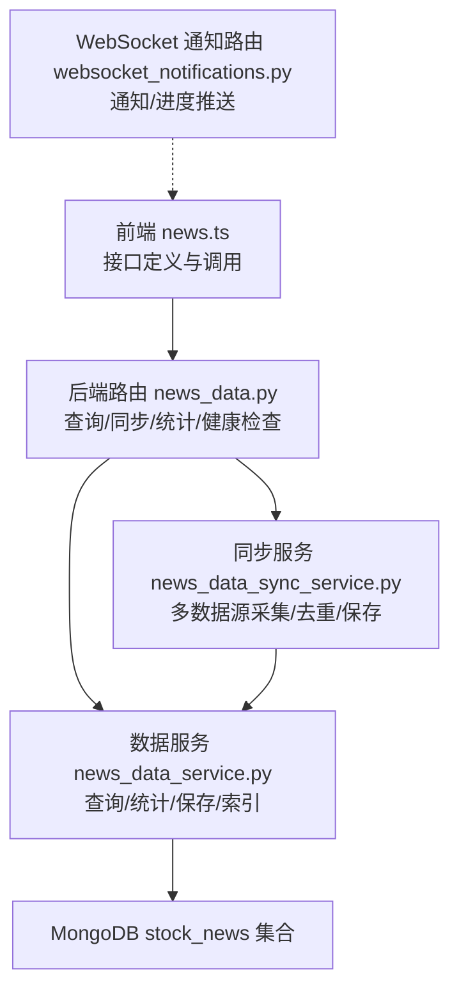
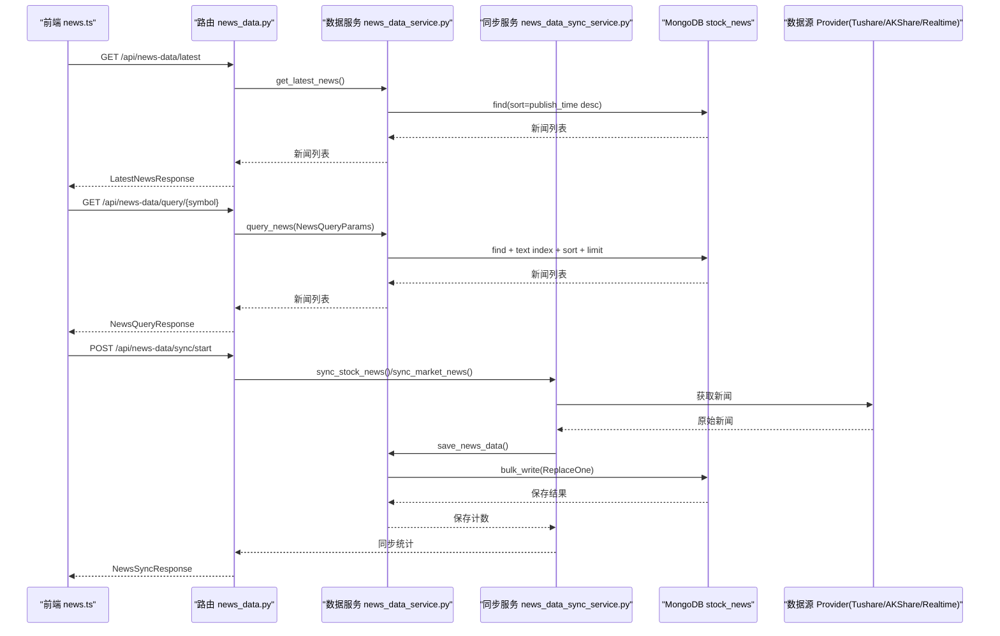

# 新闻数据接口

<cite>
**本文引用的文件**
- [news.ts](file://frontend/src/api/news.ts)
- [news_data.py](file://app/routers/news_data.py)
- [news_data_service.py](file://app/services/news_data_service.py)
- [news_data_sync_service.py](file://app/worker/news_data_sync_service.py)
- [websocket_notifications.py](file://app/routers/websocket_notifications.py)
- [websocket_notifications.md](file://docs/guides/websocket_notifications.md)
- [demo_news_filtering.py](file://examples/demo_news_filtering.py)
</cite>

## 目录
1. [简介](#简介)
2. [项目结构](#项目结构)
3. [核心组件](#核心组件)
4. [架构总览](#架构总览)
5. [详细组件分析](#详细组件分析)
6. [依赖关系分析](#依赖关系分析)
7. [性能考量](#性能考量)
8. [故障排查指南](#故障排查指南)
9. [结论](#结论)
10. [附录](#附录)

## 简介
本文件面向前端与后端开发者，系统化说明财经新闻数据接口的设计与实现，覆盖以下方面：
- 前端 news.ts 中的新闻接口定义与调用方式
- 后端 news_data_service 的数据模型、查询与统计能力
- 后端 news_data.py 路由层提供的查询、同步、统计与健康检查接口
- 新闻数据的结构定义（标题、内容、发布时间、情感分析等）
- 与多数据源（Tushare、AKShare、实时聚合）的集成与去重策略
- 实时新闻推送的 WebSocket 实现与降级方案

## 项目结构
新闻相关能力由三层构成：
- 前端 API 层：封装请求与响应类型，负责调用后端接口
- 后端路由层：FastAPI 路由，暴露查询、同步、统计等接口
- 服务层：数据服务与同步服务，负责数据标准化、索引、查询、聚合与持久化

图表来源
- [news.ts](file://frontend/src/api/news.ts#L1-L99)
- [news_data.py](file://app/routers/news_data.py#L1-L513)
- [news_data_service.py](file://app/services/news_data_service.py#L1-L767)
- [news_data_sync_service.py](file://app/worker/news_data_sync_service.py#L1-L519)
- [websocket_notifications.py](file://app/routers/websocket_notifications.py#L1-L305)

章节来源
- [news.ts](file://frontend/src/api/news.ts#L1-L99)
- [news_data.py](file://app/routers/news_data.py#L1-L513)
- [news_data_service.py](file://app/services/news_data_service.py#L1-L767)
- [news_data_sync_service.py](file://app/worker/news_data_sync_service.py#L1-L519)
- [websocket_notifications.py](file://app/routers/websocket_notifications.py#L1-L305)

## 核心组件
- 前端 news.ts
  - 定义新闻数据结构与响应结构
  - 提供获取最新新闻、查询股票新闻、同步市场新闻等 API 方法
- 后端路由 news_data.py
  - 提供查询股票新闻、高级查询、最新新闻、全文搜索、统计、同步、清理、健康检查等接口
- 数据服务 news_data_service.py
  - 定义查询参数与统计结构
  - 提供查询、统计、全文搜索、保存、清理过期数据等能力
  - 内置 MongoDB 索引与 ObjectId 转换
- 同步服务 news_data_sync_service.py
  - 多数据源采集（Tushare、AKShare、实时聚合）
  - 标准化、去重、批量保存
  - 统计同步过程中的处理数量与成功率
- WebSocket 通知 websocket_notifications.py
  - 提供通知与任务进度的 WebSocket 端点
  - 连接管理、心跳、广播与统计

章节来源
- [news.ts](file://frontend/src/api/news.ts#L1-L99)
- [news_data.py](file://app/routers/news_data.py#L1-L513)
- [news_data_service.py](file://app/services/news_data_service.py#L1-L767)
- [news_data_sync_service.py](file://app/worker/news_data_sync_service.py#L1-L519)
- [websocket_notifications.py](file://app/routers/websocket_notifications.py#L1-L305)

## 架构总览
下图展示了从前端到后端、再到数据存储与多数据源的完整链路。

图表来源
- [news.ts](file://frontend/src/api/news.ts#L1-L99)
- [news_data.py](file://app/routers/news_data.py#L1-L513)
- [news_data_service.py](file://app/services/news_data_service.py#L1-L767)
- [news_data_sync_service.py](file://app/worker/news_data_sync_service.py#L1-L519)

## 详细组件分析

### 前端接口定义（news.ts）
- 数据结构
  - NewsItem：包含标题、内容、摘要、来源、发布时间、链接、股票代码、分类、情感、重要性、数据源等字段
  - LatestNewsResponse：最新新闻响应，包含 symbol、limit、hours_back、total_count、news 列表
  - NewsQueryResponse：股票新闻查询响应，包含 symbol、hours_back、total_count、news 列表
  - NewsSyncResponse：同步响应，包含同步类型、可选 symbol、数据源列表、回溯小时数、每源最大数量
- 主要方法
  - getLatestNews：获取最新新闻（可按股票代码过滤）
  - queryStockNews：按股票代码查询新闻（带 hours_back 与 limit）
  - syncMarketNews：启动市场新闻同步（后台任务）

章节来源
- [news.ts](file://frontend/src/api/news.ts#L1-L99)

### 后端路由层（news_data.py）
- 查询接口
  - GET /api/news-data/query/{symbol}：智能获取（优先数据库，无数据时实时获取），返回最近新闻
  - POST /api/news-data/query：高级查询，支持 symbol/symbols、时间范围、分类、情感、重要性、数据源、关键词、分页等
  - GET /api/news-data/latest：获取最新新闻（可按股票或全市场）
  - GET /api/news-data/search：全文搜索新闻（支持 symbol 过滤）
- 统计接口
  - GET /api/news-data/statistics：按时间范围统计新闻数量、情感分布、重要性分布、分类与来源
- 同步接口
  - POST /api/news-data/sync/start：启动后台同步任务（股票或市场）
  - POST /api/news-data/sync/single：同步单只股票新闻（同步执行）
- 管理接口
  - DELETE /api/news-data/cleanup：清理过期新闻（按保留天数）
  - GET /api/news-data/health：健康检查
- 关键流程
  - 智能获取：先查数据库，空则实时拉取并入库，再查询返回
  - 高级查询：构建复杂查询条件（时间、分类、情感、重要性、数据源、关键词文本搜索），支持排序与分页
  - 同步：多数据源采集、去重、批量保存，并返回统计

章节来源
- [news_data.py](file://app/routers/news_data.py#L1-L513)

### 数据服务（news_data_service.py）
- 数据模型
  - NewsQueryParams：查询参数（symbol/symbols、时间范围、分类、情感、重要性、数据源、关键词、limit/skip、排序）
  - NewsStats：统计结果（总数、正/负/中性情感计数、高/中/低重要性计数、分类与来源分布）
- 核心能力
  - save_news_data/save_news_data_sync：标准化新闻数据（含符号、时间、分类、情感、重要性、关键词等），使用 URL+标题+发布时间作为唯一键进行 upsert
  - query_news：构建查询条件，支持文本搜索、时间范围、分类、情感、重要性、数据源、多股票代码等；排序与分页；返回前 3 条预览日志
  - get_latest_news：基于时间窗口的最新新闻查询
  - get_news_statistics：聚合统计情感、重要性、分类与来源分布
  - search_news：全文搜索（基于 MongoDB text 索引）
  - delete_old_news：按发布时间清理过期新闻
  - _ensure_indexes：确保必要索引存在（唯一、时间、股票代码、多股票代码、分类、情感、重要性、数据源、更新时间等）
  - convert_objectid_to_str：将 ObjectId 转为字符串，避免 JSON 序列化错误

章节来源
- [news_data_service.py](file://app/services/news_data_service.py#L1-L767)

### 同步服务（news_data_sync_service.py）
- 多数据源采集
  - Tushare：获取股票新闻，标准化并记录可用数据源
  - AKShare：获取股票新闻，标准化并记录可用数据源
  - 实时聚合：从实时聚合器获取市场或个股新闻，标准化并记录可用数据源
- 标准化与去重
  - 标准化字段：symbol、title、content、summary、url、source、author、publish_time、category、sentiment、importance、keywords、data_source
  - 去重策略：基于标题与 URL 的组合去重
- 统计指标
  - total_processed、successful_saves、failed_saves、duplicate_skipped、sources_used、duration_seconds、success_rate
- 分类、情感与重要性
  - 分类：根据标题关键词归类（公司公告、政策新闻、市场新闻、研报、通用）
  - 情感：基于关键词计数判断（积极/消极/中性）
  - 重要性：基于关键词计数判断（高/中/低）

章节来源
- [news_data_sync_service.py](file://app/worker/news_data_sync_service.py#L1-L519)

### 实时新闻推送（WebSocket）
- 通知端点
  - ws://host/api/ws/notifications?token=JWT：通知推送，支持心跳与连接确认
- 任务进度端点
  - ws://host/api/ws/tasks/{task_id}?token=JWT：任务进度推送
- 连接管理
  - ConnectionManager：按用户维护连接集合，支持发送个人消息、广播、统计
- 降级机制
  - 当 WebSocket 连接失败或达到最大重连次数后，可降级到 SSE（见文档说明）

章节来源
- [websocket_notifications.py](file://app/routers/websocket_notifications.py#L1-L305)
- [websocket_notifications.md](file://docs/guides/websocket_notifications.md#L1-L247)

## 依赖关系分析
- 前端依赖后端路由层提供的 REST 接口
- 路由层依赖数据服务与同步服务
- 数据服务依赖 MongoDB 存储
- 同步服务依赖多数据源 Provider 与数据服务
- WebSocket 路由层与前端通知 Store 交互

图表来源
- [news.ts](file://frontend/src/api/news.ts#L1-L99)
- [news_data.py](file://app/routers/news_data.py#L1-L513)
- [news_data_service.py](file://app/services/news_data_service.py#L1-L767)
- [news_data_sync_service.py](file://app/worker/news_data_sync_service.py#L1-L519)
- [websocket_notifications.py](file://app/routers/websocket_notifications.py#L1-L305)

## 性能考量
- 索引设计
  - 唯一索引：URL+标题+发布时间，避免重复
  - 单字段索引：symbol、symbols、publish_time、category、sentiment、importance、data_source、updated_at
  - 复合索引：symbol+publish_time、symbols+publish_time、symbol+category+publish_time、sentiment+importance+publish_time
  - 全文索引：title/content/summary 文本搜索
- 批量写入
  - 使用 ReplaceOne + bulk_write，减少网络往返
- 查询优化
  - 优先使用索引字段构建查询条件
  - 文本搜索配合 keywords 与时间范围
- 同步效率
  - 多数据源并行采集，去重后再批量保存
  - 统计指标便于监控与优化

章节来源
- [news_data_service.py](file://app/services/news_data_service.py#L1-L767)
- [news_data_sync_service.py](file://app/worker/news_data_sync_service.py#L1-L519)

## 故障排查指南
- 查询不到新闻
  - 检查时间范围与过滤条件是否过于严格
  - 确认 MongoDB 索引是否存在且生效
- 同步失败
  - 检查各数据源可用性与权限（如 Tushare 需要单独开通权限或积分）
  - 查看同步统计中的 failed_saves 与 duplicate_skipped
- WebSocket 无法连接
  - 确认 token 是否正确
  - 检查连接管理器统计，确认连接数与用户映射
  - 如 WebSocket 失败，可按文档说明降级到 SSE

章节来源
- [news_data.py](file://app/routers/news_data.py#L1-L513)
- [news_data_service.py](file://app/services/news_data_service.py#L1-L767)
- [news_data_sync_service.py](file://app/worker/news_data_sync_service.py#L1-L519)
- [websocket_notifications.py](file://app/routers/websocket_notifications.py#L1-L305)
- [websocket_notifications.md](file://docs/guides/websocket_notifications.md#L1-L247)

## 结论
本接口体系以“路由层—服务层—存储层”清晰分层，结合多数据源采集与统一标准化，实现了高效、可扩展的新闻数据能力。前端通过 news.ts 提供简洁的调用方式，后端通过路由与服务层支撑查询、统计、同步与管理。同时，WebSocket 通知与降级机制保障了实时推送的可靠性与用户体验。

## 附录

### 新闻数据结构定义
- 基础字段
  - 标题、内容、摘要、来源、作者、链接、发布时间
- 业务字段
  - 股票代码、完整股票代码、市场、多股票代码数组
  - 分类、情感、情感分数、重要性、关键词列表
  - 数据源、创建/更新时间、版本号
- 响应结构
  - 最新新闻响应：symbol、limit、hours_back、total_count、news 数组
  - 查询响应：symbol、hours_back、total_count、news 数组
  - 同步响应：sync_type、symbol（可选）、data_sources、hours_back、max_news_per_source

章节来源
- [news_data_service.py](file://app/services/news_data_service.py#L1-L767)
- [news.ts](file://frontend/src/api/news.ts#L1-L99)

### 核心方法参数与调用流程

#### getLatestNews（前端）
- 功能：获取最新新闻（可按股票代码过滤）
- 参数：symbol（可选）、limit、hours_back
- 调用路径：GET /api/news-data/latest

章节来源
- [news.ts](file://frontend/src/api/news.ts#L1-L99)
- [news_data.py](file://app/routers/news_data.py#L1-L513)

#### queryStockNews（前端）
- 功能：按股票代码查询新闻（带 hours_back 与 limit）
- 参数：symbol、hours_back、limit
- 调用路径：GET /api/news-data/query/{symbol}

章节来源
- [news.ts](file://frontend/src/api/news.ts#L1-L99)
- [news_data.py](file://app/routers/news_data.py#L1-L513)

#### 同步市场新闻（前端）
- 功能：启动市场新闻同步（后台任务）
- 参数：hours_back、max_news_per_source
- 调用路径：POST /api/news-data/sync/start

章节来源
- [news.ts](file://frontend/src/api/news.ts#L1-L99)
- [news_data.py](file://app/routers/news_data.py#L1-L513)

#### 高级查询（后端）
- 功能：支持 symbol/symbols、时间范围、分类、情感、重要性、数据源、关键词、分页等
- 调用路径：POST /api/news-data/query

章节来源
- [news_data.py](file://app/routers/news_data.py#L1-L513)
- [news_data_service.py](file://app/services/news_data_service.py#L1-L767)

#### 统计与全文搜索（后端）
- 统计：GET /api/news-data/statistics
- 全文搜索：GET /api/news-data/search

章节来源
- [news_data.py](file://app/routers/news_data.py#L1-L513)
- [news_data_service.py](file://app/services/news_data_service.py#L1-L767)

#### 同步执行（后端）
- 同步单只股票：POST /api/news-data/sync/single
- 同步市场：POST /api/news-data/sync/start（带 symbol 为空）

章节来源
- [news_data.py](file://app/routers/news_data.py#L1-L513)
- [news_data_sync_service.py](file://app/worker/news_data_sync_service.py#L1-L519)

### 新闻筛选与情感分析（示例参考）
- 过滤演示脚本展示了不同过滤策略（基础过滤、增强过滤、集成过滤）对新闻质量的提升
- 情感分析与重要性评估在同步服务中基于关键词规则实现

章节来源
- [demo_news_filtering.py](file://examples/demo_news_filtering.py#L1-L230)
- [news_data_sync_service.py](file://app/worker/news_data_sync_service.py#L1-L519)