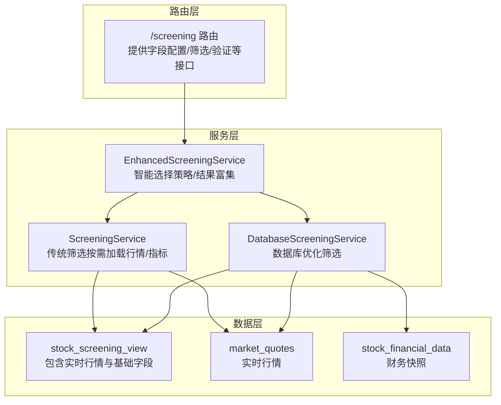
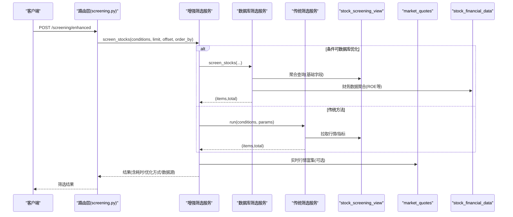
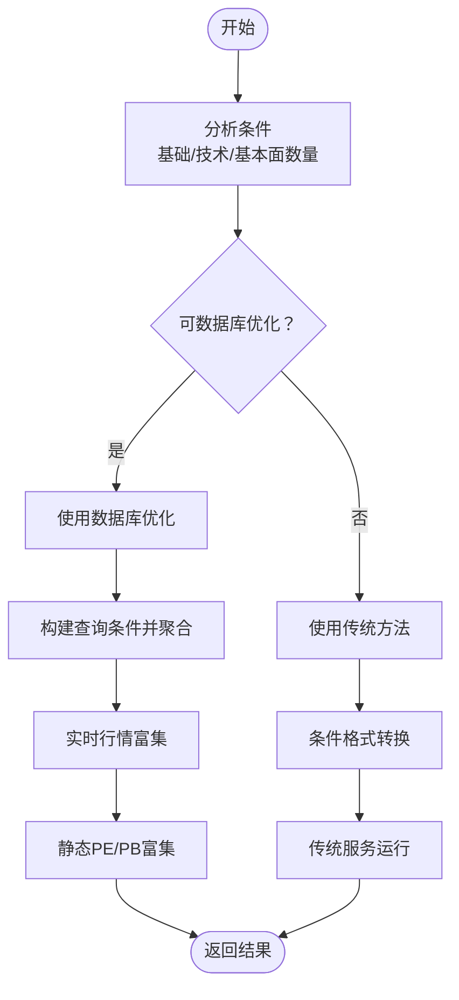
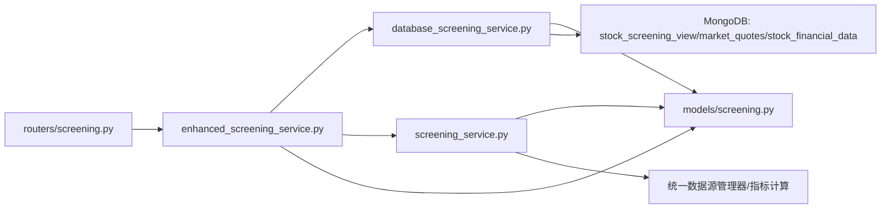

# 智能筛选接口

<cite>
**本文引用的文件**
- [app/models/screening.py](file://app/models/screening.py)
- [app/routers/screening.py](file://app/routers/screening.py)
- [app/services/enhanced_screening_service.py](file://app/services/enhanced_screening_service.py)
- [app/services/database_screening_service.py](file://app/services/database_screening_service.py)
- [app/services/screening_service.py](file://app/services/screening_service.py)
- [app/services/screening/eval_utils.py](file://app/services/screening/eval_utils.py)
- [app/services/enhanced_screening/utils.py](file://app/services/enhanced_screening/utils.py)
- [tests/test_enhanced_screening.py](file://tests/test_enhanced_screening.py)
</cite>

## 目录
1. [简介](#简介)
2. [项目结构](#项目结构)
3. [核心组件](#核心组件)
4. [架构总览](#架构总览)
5. [详细组件分析](#详细组件分析)
6. [依赖关系分析](#依赖关系分析)
7. [性能考量](#性能考量)
8. [故障排查指南](#故障排查指南)
9. [结论](#结论)
10. [附录](#附录)

## 简介
本文件面向“智能筛选接口”的使用者与维护者，系统化说明股票筛选条件配置与结果获取能力，重点覆盖以下目标：
- 说明 getScreeningResults、saveScreeningCondition、getSavedConditions 等方法的使用方式与约束
- 展示筛选条件的构建逻辑：技术指标、基本面数据与自定义规则的组合
- 说明与后端 screening_service 的交互流程
- 总结大规模数据筛选的性能优化策略

## 项目结构
围绕“智能筛选”，相关代码主要分布在以下模块：
- 路由层：提供对外 API，负责请求解析、参数校验与结果封装
- 服务层：
  - 增强筛选服务：根据条件自动选择数据库优化或传统方法，并进行结果富集
  - 数据库筛选服务：基于 MongoDB 视图与聚合，实现高性能基础字段筛选
  - 传统筛选服务：按需拉取行情与技术指标，执行条件评估
- 模型层：定义筛选条件、字段信息、响应结构等
- 工具层：条件分析、转换、评估等辅助逻辑

图表来源
- [app/routers/screening.py](file://app/routers/screening.py#L1-L272)
- [app/services/enhanced_screening_service.py](file://app/services/enhanced_screening_service.py#L1-L200)
- [app/services/database_screening_service.py](file://app/services/database_screening_service.py#L1-L120)

章节来源
- [app/routers/screening.py](file://app/routers/screening.py#L1-L272)
- [app/services/enhanced_screening_service.py](file://app/services/enhanced_screening_service.py#L1-L120)
- [app/services/database_screening_service.py](file://app/services/database_screening_service.py#L1-L120)

## 核心组件
- 筛选条件模型与字段信息
  - 定义了操作符类型、字段类型、条件结构、请求/响应结构与字段信息
  - 预置了基础字段、技术指标字段、基本面字段及支持的操作符
- 增强筛选服务
  - 自动分析条件，决定使用数据库优化还是传统方法
  - 对结果进行富集（实时行情、静态PE/PB等）
  - 提供字段统计、可用值、条件验证等能力
- 数据库筛选服务
  - 基于 MongoDB 视图与聚合，实现高性能基础字段筛选
  - 支持区间、包含、集合等操作符
  - 可按数据源优先级选择数据源
- 传统筛选服务
  - 按需拉取行情与技术指标，执行条件评估
  - 支持穿越类技术指标条件
- 路由层
  - 提供字段配置、筛选、验证等接口
  - 兼容历史格式，支持新格式请求

章节来源
- [app/models/screening.py](file://app/models/screening.py#L1-L347)
- [app/services/enhanced_screening_service.py](file://app/services/enhanced_screening_service.py#L1-L120)
- [app/services/database_screening_service.py](file://app/services/database_screening_service.py#L1-L120)
- [app/services/screening_service.py](file://app/services/screening_service.py#L1-L120)
- [app/routers/screening.py](file://app/routers/screening.py#L1-L120)

## 架构总览
下图展示了“智能筛选”从路由到服务再到数据层的整体交互：

图表来源
- [app/routers/screening.py](file://app/routers/screening.py#L192-L231)
- [app/services/enhanced_screening_service.py](file://app/services/enhanced_screening_service.py#L34-L120)
- [app/services/database_screening_service.py](file://app/services/database_screening_service.py#L96-L186)
- [app/services/screening_service.py](file://app/services/screening_service.py#L77-L186)

## 详细组件分析

### 路由层：筛选接口与字段配置
- 字段配置接口
  - GET /screening/fields：返回字段清单与分类
  - GET /screening/fields/{field_name}：返回单个字段的详细信息（含统计、可用值）
- 筛选接口
  - POST /screening/enhanced：新格式请求，支持排序、分页、数据库优化开关
  - POST /screening/run：兼容历史格式，内部转为新格式并调用增强服务
- 条件验证
  - POST /screening/validate：对条件进行合法性校验（字段/操作符/值类型）

章节来源
- [app/routers/screening.py](file://app/routers/screening.py#L47-L272)

### 增强筛选服务：智能决策与结果富集
- 自动决策
  - 分析条件类型（基础/技术/基本面），判断是否可走数据库优化路径
  - 若存在技术指标或数据库不支持的字段，则退回传统方法
- 结果富集
  - 数据库优化路径：从 market_quotes 补齐实时行情字段
  - 静态PE/PB富集：在筛选场景使用静态数据，避免批量动态计算带来的性能问题
- 字段信息与统计
  - 提供字段统计、可用值列表、条件验证等能力
- 传统方法兼容
  - 将新格式条件转换为历史格式，复用传统服务

图表来源
- [app/services/enhanced_screening_service.py](file://app/services/enhanced_screening_service.py#L34-L120)
- [app/services/enhanced_screening/utils.py](file://app/services/enhanced_screening/utils.py#L1-L77)

章节来源
- [app/services/enhanced_screening_service.py](file://app/services/enhanced_screening_service.py#L1-L200)
- [app/services/enhanced_screening/utils.py](file://app/services/enhanced_screening/utils.py#L1-L77)

### 数据库筛选服务：高性能基础字段筛选
- 查询构建
  - 将条件映射为 MongoDB 查询表达式，支持 between、in、contains 等
  - 可按数据源优先级过滤，确保一致性
- 排序与分页
  - 支持多字段排序，默认按总市值降序
- 结果富集
  - 对缺失的财务指标（如 ROE）进行聚合补充
  - 格式化输出字段，剔除 None 值
- 实时行情二次筛选
  - 对基础筛选结果按实时行情字段进行二次过滤（可选）

章节来源
- [app/services/database_screening_service.py](file://app/services/database_screening_service.py#L96-L186)
- [app/services/database_screening_service.py](file://app/services/database_screening_service.py#L191-L230)
- [app/services/database_screening_service.py](file://app/services/database_screening_service.py#L231-L252)
- [app/services/database_screening_service.py](file://app/services/database_screening_service.py#L253-L323)
- [app/services/database_screening_service.py](file://app/services/database_screening_service.py#L324-L389)
- [app/services/database_screening_service.py](file://app/services/database_screening_service.py#L390-L438)
- [app/services/database_screening_service.py](file://app/services/database_screening_service.py#L439-L555)
- [app/services/database_screening_service.py](file://app/services/database_screening_service.py#L556-L599)

### 传统筛选服务：按需加载与条件评估
- 数据获取
  - 按需拉取行情数据，计算派生指标（如涨跌幅）
  - 仅在需要技术指标时计算指标序列
- 条件评估
  - 支持穿越类技术指标条件（cross_up/cross_down）
  - 支持区间、集合、字符串包含等操作符
- 排序与分页
  - 支持多字段排序与分页

章节来源
- [app/services/screening_service.py](file://app/services/screening_service.py#L77-L186)
- [app/services/screening/eval_utils.py](file://app/services/screening/eval_utils.py#L1-L168)

### 模型层：筛选条件与字段信息
- 操作符类型：>, <, >=, <=, ==, !=, between, in, not_in, contains, cross_up, cross_down
- 字段类型：basic（基础）、technical（技术）、fundamental（基本面）
- 预置字段：基础字段（如股票代码、名称、行业、地区、市场）、市值与财务指标、交易指标、技术指标等
- 请求/响应结构：支持排序、分页、数据库优化开关

章节来源
- [app/models/screening.py](file://app/models/screening.py#L1-L347)

## 依赖关系分析
- 路由层依赖增强筛选服务；增强筛选服务同时依赖数据库筛选服务与传统筛选服务
- 数据库筛选服务依赖 MongoDB 视图与集合（stock_screening_view、market_quotes、stock_financial_data）
- 传统筛选服务依赖统一数据源管理器与指标计算工具
- 增强筛选服务依赖字段信息模型与工具函数

图表来源
- [app/routers/screening.py](file://app/routers/screening.py#L1-L120)
- [app/services/enhanced_screening_service.py](file://app/services/enhanced_screening_service.py#L1-L120)
- [app/services/database_screening_service.py](file://app/services/database_screening_service.py#L1-L120)
- [app/services/screening_service.py](file://app/services/screening_service.py#L1-L120)
- [app/models/screening.py](file://app/models/screening.py#L1-L120)

章节来源
- [app/routers/screening.py](file://app/routers/screening.py#L1-L120)
- [app/services/enhanced_screening_service.py](file://app/services/enhanced_screening_service.py#L1-L120)
- [app/services/database_screening_service.py](file://app/services/database_screening_service.py#L1-L120)
- [app/services/screening_service.py](file://app/services/screening_service.py#L1-L120)
- [app/models/screening.py](file://app/models/screening.py#L1-L120)

## 性能考量
- 自动选择最优路径
  - 当条件全部为基础字段且不涉及技术指标时，优先使用数据库优化路径，显著降低 CPU 与 IO 开销
- 数据源优先级
  - 在数据库筛选时，按系统配置的数据源优先级选择数据源，保证一致性与稳定性
- 结果富集策略
  - 筛选阶段使用静态 PE/PB，避免批量动态计算导致的性能瓶颈
  - 仅在数据库优化路径下进行实时行情富集，减少不必要的外部查询
- 排序与分页
  - 数据库侧排序与分页，避免将全量数据载入内存
- 指标计算按需
  - 仅在需要技术指标时计算指标序列，减少不必要的计算开销

章节来源
- [app/services/enhanced_screening_service.py](file://app/services/enhanced_screening_service.py#L34-L120)
- [app/services/database_screening_service.py](file://app/services/database_screening_service.py#L121-L186)
- [app/services/screening_service.py](file://app/services/screening_service.py#L102-L168)

## 故障排查指南
- 常见错误与定位
  - 条件不合法：使用 /screening/validate 校验字段、操作符与值类型
  - 数据库查询异常：检查 stock_screening_view 是否存在、字段映射是否正确
  - 数据源配置问题：确认数据源优先级配置是否正确
  - 性能异常：确认是否命中数据库优化路径；必要时关闭 use_database_optimization 强制走传统方法
- 日志与可观测性
  - 路由层与服务层均记录关键信息（请求参数、耗时、优化方式、数据源等），便于定位问题

章节来源
- [app/routers/screening.py](file://app/routers/screening.py#L155-L231)
- [app/services/enhanced_screening_service.py](file://app/services/enhanced_screening_service.py#L120-L200)
- [app/services/database_screening_service.py](file://app/services/database_screening_service.py#L121-L186)

## 结论
本智能筛选接口通过“增强筛选服务”的策略决策，结合数据库优化与传统方法的优势，在保证灵活性的同时最大化性能。配合完善的字段信息、条件验证与富集策略，能够稳定支撑大规模数据筛选场景。

## 附录

### API 一览与使用说明
- 获取字段配置
  - GET /screening/fields
  - 返回字段清单与分类
- 获取单个字段信息
  - GET /screening/fields/{field_name}
  - 返回字段详情（含统计、可用值）
- 增强筛选
  - POST /screening/enhanced
  - 请求体包含 market、date、adj、conditions、order_by、limit、offset、use_database_optimization
  - 返回 total、items、took_ms、optimization_used、source
- 兼容历史格式筛选
  - POST /screening/run
  - 请求体包含 market、date、adj、conditions（历史格式）、order_by、limit、offset
  - 返回 total、items
- 条件验证
  - POST /screening/validate
  - 请求体为条件数组
  - 返回 valid、errors、warnings

章节来源
- [app/routers/screening.py](file://app/routers/screening.py#L47-L272)

### 筛选条件构建要点
- 基础字段
  - 支持区间、集合、字符串包含等操作符
  - 示例：总市值、市盈率、行业、地区、市场等
- 技术指标
  - 支持穿越类条件（cross_up/cross_down）
  - 示例：MA、RSI、KDJ、MACD 等
- 基本面数据
  - 支持区间与数值比较
  - 示例：PE、PB、ROE、总市值等
- 自定义规则
  - 可组合多字段条件，增强服务会自动分析并选择最优路径

章节来源
- [app/models/screening.py](file://app/models/screening.py#L1-L347)
- [app/services/enhanced_screening/utils.py](file://app/services/enhanced_screening/utils.py#L1-L77)
- [app/services/screening/eval_utils.py](file://app/services/screening/eval_utils.py#L78-L158)

### 与后端 screening_service 的交互流程
- 增强服务在数据库优化不可用时，将新格式条件转换为历史格式，调用传统服务
- 传统服务按需拉取行情与技术指标，执行条件评估，返回结果

章节来源
- [app/services/enhanced_screening_service.py](file://app/services/enhanced_screening_service.py#L174-L204)
- [app/services/screening_service.py](file://app/services/screening_service.py#L77-L186)

### 保存与获取筛选条件
- 保存筛选条件
  - 建议在业务层自行实现持久化逻辑，将用户构建的 ScreeningCondition 列表序列化存储
  - 存储时建议附带创建时间、名称、标签等元信息
- 获取已保存条件
  - 从持久化存储读取后，反序列化为 ScreeningCondition 列表，再调用 /screening/enhanced 或 /screening/run 执行筛选
- 与后端接口的关系
  - 后端未提供专门的“保存/获取筛选条件”接口，以上为推荐的业务层实现方式

章节来源
- [app/models/screening.py](file://app/models/screening.py#L33-L69)
- [app/routers/screening.py](file://app/routers/screening.py#L192-L231)

### 性能优化实践
- 优先使用基础字段与区间条件，尽量避免字符串包含与跨字段比较
- 合理设置 limit 与 offset，避免一次性返回过多数据
- 使用 use_database_optimization=true 以获得最佳性能
- 对复杂条件进行拆分，先做粗筛，再做细筛

章节来源
- [app/services/enhanced_screening_service.py](file://app/services/enhanced_screening_service.py#L34-L120)
- [app/services/database_screening_service.py](file://app/services/database_screening_service.py#L121-L186)

### 示例与测试参考
- 单元测试与集成测试展示了典型筛选场景、性能对比与字段统计信息获取
- 可参考测试用例组织自己的筛选逻辑与边界条件

章节来源
- [tests/test_enhanced_screening.py](file://tests/test_enhanced_screening.py#L1-L192)