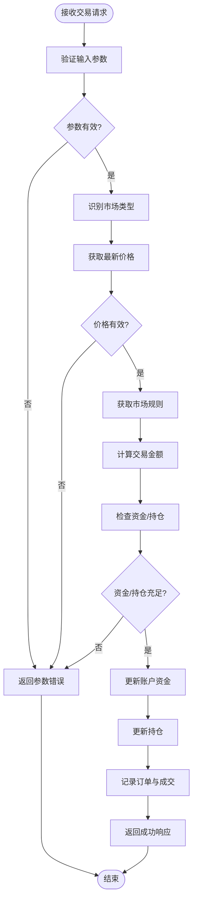
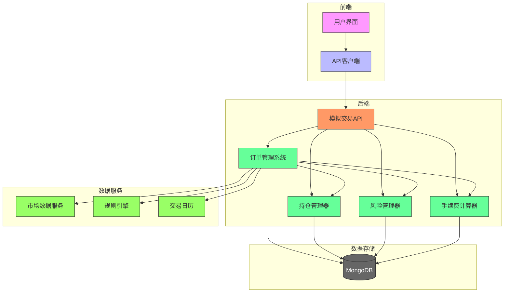
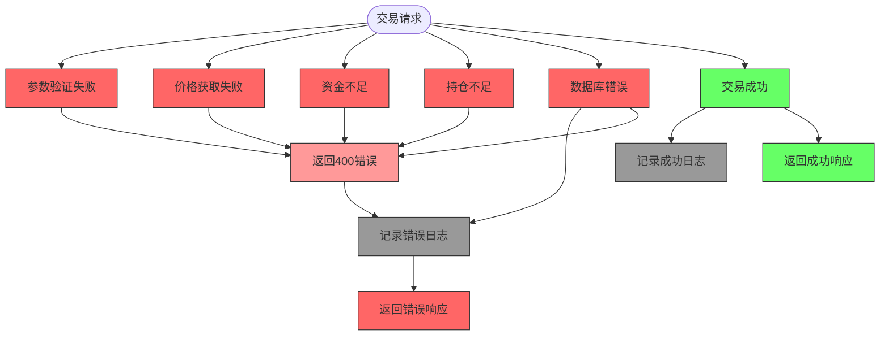

# 模拟交易接口

<cite>
**本文档引用的文件**   
- [paper.ts](file://frontend/src/api/paper.ts)
- [paper.py](file://app/routers/paper.py)
- [request.ts](file://frontend/src/api/request.ts)
- [init_paper_trading_market_rules.py](file://scripts/init_paper_trading_market_rules.py)
- [PAPER_TRADING_IMPROVEMENTS.md](file://docs/features/paper-trading/PAPER_TRADING_IMPROVEMENTS.md)
- [paper_trading_multi_market_design.md](file://docs/design/paper_trading_multi_market_design.md)
</cite>

## 目录
1. [简介](#简介)
2. [核心功能](#核心功能)
3. [API接口说明](#api接口说明)
4. [交易指令处理流程](#交易指令处理流程)
5. [后端集成与数据持久化](#后端集成与数据持久化)
6. [风险控制与异常处理](#风险控制与异常处理)
7. [市场规则配置](#市场规则配置)
8. [前端集成示例](#前端集成示例)

## 简介

模拟交易接口为用户提供了一个安全的环境来测试投资策略，无需使用真实资金。该系统支持A股、港股和美股三大市场的模拟交易，具备完整的账户管理、交易执行和持仓查询功能。系统通过与后端`paper_trading_service`服务集成，实现了交易数据的持久化存储和实时查询。

本接口设计遵循RESTful原则，通过清晰的API端点提供账户创建、买卖交易、持仓查询等核心功能。系统支持多货币账户管理，能够自动识别股票代码的市场类型，并根据相应的市场规则执行交易。

**Section sources**
- [paper.py](file://app/routers/paper.py#L1-L585)
- [paper.ts](file://frontend/src/api/paper.ts#L1-L67)

## 核心功能

模拟交易系统提供了完整的交易生命周期管理功能，包括账户管理、交易执行和持仓监控。系统支持多市场（A股、港股、美股）和多货币（人民币、港币、美元）的复杂交易场景。

核心功能包括：
- **模拟账户管理**：支持创建和重置模拟账户，初始资金配置为A股100万人民币、港股100万港币、美股10万美元
- **交易操作**：提供买入和卖出功能，支持市价单即时成交
- **持仓查询**：实时查询用户持仓情况，包括可用数量、平均成本和盈亏计算
- **订单管理**：记录所有交易订单，支持查询历史订单
- **关联分析**：支持将交易与分析报告关联，便于追踪交易决策来源

系统采用T+1交易制度处理A股交易，确保今天买入的股票不能在当天卖出，而港股和美股支持T+0交易。这种设计更真实地模拟了不同市场的交易规则。

**Section sources**
- [paper.py](file://app/routers/paper.py#L17-L21)
- [paper.py](file://app/routers/paper.py#L170-L191)
- [paper_trading_multi_market_design.md](file://docs/design/paper_trading_multi_market_design.md#L336-L383)

## API接口说明

### 账户管理接口

#### 创建/获取账户 (GET /api/paper/account)
获取或创建用户的模拟交易账户，返回账户资金和持仓汇总信息。

**请求参数**：无

**响应结构**：
```json
{
  "account": {
    "cash": {"CNY": 1000000.0, "HKD": 1000000.0, "USD": 100000.0},
    "realized_pnl": {"CNY": 0.0, "HKD": 0.0, "USD": 0.0},
    "positions_value": {"CNY": 0.0, "HKD": 0.0, "USD": 0.0},
    "equity": {"CNY": 1000000.0, "HKD": 1000000.0, "USD": 100000.0},
    "updated_at": "2024-01-01T00:00:00Z"
  },
  "positions": []
}
```

**Section sources**
- [paper.py](file://app/routers/paper.py#L270-L341)
- [paper.ts](file://frontend/src/api/paper.ts#L38-L41)

#### 重置账户 (POST /api/paper/reset)
重置用户的模拟交易账户，清除所有持仓和订单记录，恢复到初始资金状态。

**请求参数**：
- `confirm=true`：必须提供此查询参数以确认重置操作

**响应结构**：
```json
{
  "message": "账户已重置",
  "cash": {"CNY": 1000000.0, "HKD": 1000000.0, "USD": 100000.0}
}
```

**Section sources**
- [paper.py](file://app/routers/paper.py#L573-L585)

### 交易操作接口

#### 下单交易 (POST /api/paper/order)
提交买入或卖出订单，系统将根据最新市场价格即时成交。

**请求参数**：
- `code`：股票代码（支持A股6位数字、港股4-5位数字或带.HK后缀、美股字母代码）
- `side`：交易方向，"buy"或"sell"
- `quantity`：交易数量，必须大于0
- `market`：市场类型（可选，CN/HK/US），不传则自动识别
- `analysis_id`：关联的分析报告ID（可选）

**业务规则**：
1. 系统自动识别股票代码的市场类型
2. 买入时检查可用资金是否充足
3. 卖出时检查可用持仓数量是否足够
4. 根据市场规则计算手续费
5. 即时成交并更新账户和持仓

**响应结构**：
```json
{
  "order": {
    "code": "000001",
    "market": "CN",
    "currency": "CNY",
    "side": "buy",
    "quantity": 100,
    "price": 15.5,
    "amount": 1550.0,
    "commission": 5.0,
    "status": "filled",
    "created_at": "2024-01-01T10:00:00Z",
    "filled_at": "2024-01-01T10:00:01Z"
  }
}
```

**Section sources**
- [paper.py](file://app/routers/paper.py#L24-L31)
- [paper.py](file://app/routers/paper.py#L344-L530)
- [paper.ts](file://frontend/src/api/paper.ts#L43-L48)

### 持仓查询接口

#### 查询持仓 (GET /api/paper/positions)
获取用户当前的所有持仓信息。

**请求参数**：无

**响应结构**：
```json
{
  "items": [
    {
      "code": "000001",
      "market": "CN",
      "currency": "CNY",
      "quantity": 100,
      "available_qty": 100,
      "avg_cost": 15.5,
      "last_price": 16.0,
      "market_value": 1600.0,
      "unrealized_pnl": 50.0
    }
  ]
}
```

**Section sources**
- [paper.py](file://app/routers/paper.py#L533-L560)

#### 查询订单 (GET /api/paper/orders)
获取用户的历史订单记录。

**请求参数**：
- `limit`：返回记录数量，默认50，最大200

**响应结构**：
```json
{
  "items": [
    {
      "code": "000001",
      "side": "buy",
      "quantity": 100,
      "price": 15.5,
      "status": "filled",
      "created_at": "2024-01-01T10:00:00Z"
    }
  ]
}
```

**Section sources**
- [paper.py](file://app/routers/paper.py#L563-L570)

## 交易指令处理流程



**Diagram sources**
- [paper.py](file://app/routers/paper.py#L344-L530)

交易指令的处理流程包含多个关键步骤，确保交易的安全性和准确性：

1. **输入验证**：验证股票代码、交易方向和数量等基本参数
2. **市场识别**：根据股票代码格式自动识别所属市场（A股、港股、美股）
3. **价格获取**：从市场数据服务获取股票的最新成交价格
4. **规则检查**：获取相应市场的交易规则，包括T+1制度、涨跌停限制等
5. **资金检查**：买入时检查账户是否有足够资金，卖出时检查是否有足够可用持仓
6. **手续费计算**：根据市场规则计算交易手续费
7. **账户更新**：更新账户资金和持仓信息
8. **记录保存**：将订单和成交记录保存到数据库

整个流程在一次HTTP请求中完成，实现了即时成交的效果，为用户提供流畅的交易体验。

**Section sources**
- [paper.py](file://app/routers/paper.py#L344-L530)

## 后端集成与数据持久化

模拟交易系统与后端`paper_trading_service`服务深度集成，通过MongoDB数据库实现数据的持久化存储。系统设计遵循分层架构，确保数据的一致性和可靠性。

### 数据库设计

系统使用MongoDB存储以下核心数据：

**账户表 (paper_accounts)**
```javascript
{
  "user_id": "user123",
  "cash": {"CNY": 1000000.0, "HKD": 1000000.0, "USD": 100000.0},
  "realized_pnl": {"CNY": 0.0, "HKD": 0.0, "USD": 0.0},
  "settings": {"auto_currency_conversion": false, "default_market": "CN"},
  "created_at": "2024-01-01T00:00:00Z",
  "updated_at": "2024-01-01T00:00:00Z"
}
```

**持仓表 (paper_positions)**
```javascript
{
  "user_id": "user123",
  "code": "AAPL",
  "market": "US",
  "currency": "USD",
  "quantity": 100,
  "avg_cost": 150.50,
  "available_qty": 100,
  "frozen_qty": 0,
  "updated_at": "2024-01-01T00:00:00Z"
}
```

**订单表 (paper_orders)**
```javascript
{
  "user_id": "user123",
  "code": "AAPL",
  "market": "US",
  "currency": "USD",
  "side": "buy",
  "quantity": 100,
  "price": 150.50,
  "amount": 15050.0,
  "commission": 1.0,
  "status": "filled",
  "created_at": "2024-01-01T10:00:00Z",
  "filled_at": "2024-01-01T10:00:01Z",
  "analysis_id": "abc123"
}
```

**成交记录表 (paper_trades)**
```javascript
{
  "user_id": "user123",
  "code": "AAPL",
  "market": "US",
  "currency": "USD",
  "side": "buy",
  "quantity": 100,
  "price": 150.50,
  "amount": 15050.0,
  "commission": 1.0,
  "pnl": 0.0,
  "timestamp": "2024-01-01T10:00:01Z",
  "analysis_id": "abc123"
}
```

### 系统架构



**Diagram sources**
- [paper_trading_multi_market_design.md](file://docs/design/paper_trading_multi_market_design.md#L336-L383)

系统采用模块化设计，各组件职责分明：
- **订单管理系统(OMS)**：负责订单的接收、验证、路由和状态管理
- **持仓管理器(PM)**：跟踪用户持仓，计算可用数量和盈亏
- **风险管理器(RM)**：执行资金检查、持仓限制和集中度控制
- **手续费计算器(CC)**：根据市场规则计算各类交易费用

所有数据变更都通过原子操作确保一致性，并记录详细的审计日志。

**Section sources**
- [paper.py](file://app/routers/paper.py#L65-L115)
- [paper_trading_multi_market_design.md](file://docs/design/paper_trading_multi_market_design.md#L63-L120)

## 风险控制与异常处理

系统实施多层次的风险控制措施，确保交易的安全性和合规性。同时，完善的异常处理机制保障了系统的稳定运行。

### 风险控制措施

1. **资金检查**：买入交易前验证账户是否有足够资金覆盖交易金额和手续费
2. **持仓检查**：卖出交易前验证是否有足够可用持仓数量
3. **T+1限制**：A股市场实施T+1交易制度，防止当天买入的股票被卖出
4. **市场规则遵守**：遵循各市场的交易单位、价格限制等规则
5. **并发控制**：通过数据库事务确保账户和持仓数据的一致性

### 异常处理策略

系统对各种异常情况进行了全面处理：



**Diagram sources**
- [paper.py](file://app/routers/paper.py#L374-L377)
- [paper.py](file://app/routers/paper.py#L403-L407)
- [paper.py](file://app/routers/paper.py#L453-L459)

具体异常处理包括：
- **参数错误**：返回HTTP 400状态码，提示具体错误信息
- **资金不足**：明确提示所需金额和可用金额
- **持仓不足**：提示所需数量和可用数量
- **价格获取失败**：提示无法获取股票价格
- **数据库错误**：记录详细错误日志，返回通用错误信息

系统还实现了账户结构的向后兼容，能够自动迁移旧版本的单货币账户到新的多货币结构。

**Section sources**
- [paper.py](file://app/routers/paper.py#L95-L115)
- [paper.py](file://app/routers/paper.py#L374-L407)

## 市场规则配置

系统支持灵活的市场规则配置，能够适应不同市场的交易特点。市场规则存储在`paper_market_rules`集合中，包含各市场的详细交易规则。

### 市场规则示例

**A股市场规则**
```javascript
{
  "market": "CN",
  "market_name": "A股市场",
  "currency": "CNY",
  "rules": {
    "t_plus": 1,
    "price_limit": {
      "enabled": true,
      "up_limit": 10.0,
      "down_limit": -10.0,
      "st_up_limit": 5.0,
      "st_down_limit": -5.0
    },
    "lot_size": 100,
    "min_price_tick": 0.01,
    "commission": {
      "rate": 0.0003,
      "min": 5.0,
      "stamp_duty_rate": 0.001
    }
  }
}
```

**港股市场规则**
```javascript
{
  "market": "HK",
  "market_name": "港股市场",
  "currency": "HKD",
  "rules": {
    "t_plus": 0,
    "price_limit": {"enabled": false},
    "lot_size": null,
    "min_price_tick": 0.01,
    "commission": {
      "rate": 0.0003,
      "min": 3.0,
      "stamp_duty_rate": 0.0013
    }
  }
}
```

**美股市场规则**
```javascript
{
  "market": "US",
  "market_name": "美股市场",
  "currency": "USD",
  "rules": {
    "t_plus": 0,
    "price_limit": {"enabled": false},
    "lot_size": 1,
    "min_price_tick": 0.01,
    "commission": {
      "rate": 0.0,
      "min": 0.0,
      "sec_fee_rate": 0.0000278
    }
  }
}
```

市场规则通过初始化脚本`init_paper_trading_market_rules.py`进行配置，支持覆盖现有配置。系统在交易时动态加载相应市场的规则，确保交易行为符合市场规范。

**Section sources**
- [init_paper_trading_market_rules.py](file://scripts/init_paper_trading_market_rules.py#L1-L261)
- [paper.py](file://app/routers/paper.py#L118-L124)

## 前端集成示例

前端通过`paperApi`对象封装了所有模拟交易API调用，简化了使用方式。

```typescript
import { paperApi } from '@/api/paper'

// 获取账户信息
const getAccountInfo = async () => {
  try {
    const response = await paperApi.getAccount()
    if (response.success) {
      console.log('账户信息:', response.data.account)
      console.log('持仓:', response.data.positions)
    }
  } catch (error) {
    console.error('获取账户信息失败:', error)
  }
}

// 提交买入订单
const placeBuyOrder = async () => {
  try {
    const payload = {
      code: '000001',
      side: 'buy',
      quantity: 100,
      analysis_id: 'analysis123'
    }
    
    const response = await paperApi.placeOrder(payload)
    console.log('订单已提交:', response.data.order)
  } catch (error) {
    console.error('下单失败:', error)
  }
}

// 查询持仓
const getPositions = async () => {
  try {
    const response = await paperApi.getPositions()
    console.log('当前持仓:', response.data.items)
  } catch (error) {
    console.error('查询持仓失败:', error)
  }
}
```

前端还实现了错误处理、加载状态显示和请求重试机制，提升了用户体验。通过`request.ts`中的拦截器，系统能够自动处理认证过期、网络错误等常见问题。

**Section sources**
- [paper.ts](file://frontend/src/api/paper.ts#L50-L67)
- [request.ts](file://frontend/src/api/request.ts#L492-L540)
- [PAPER_TRADING_IMPROVEMENTS.md](file://docs/features/paper-trading/PAPER_TRADING_IMPROVEMENTS.md#L64-L90)