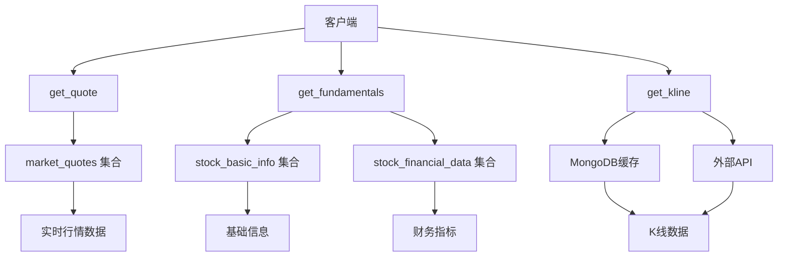
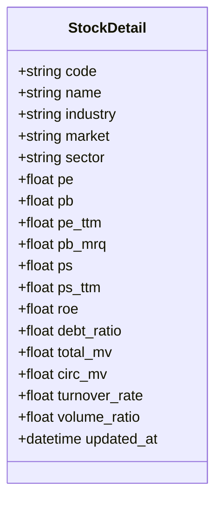
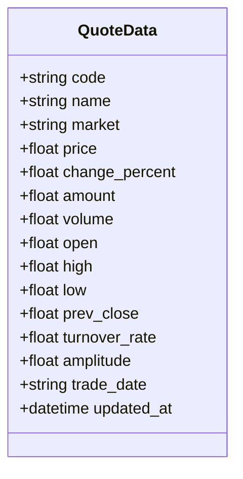
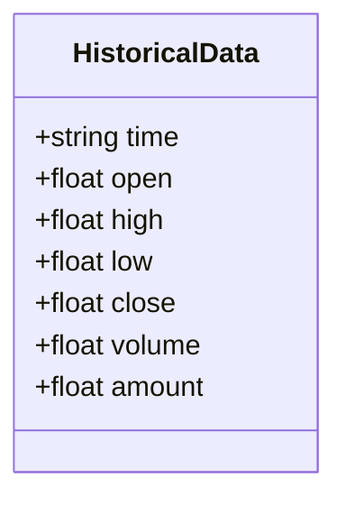
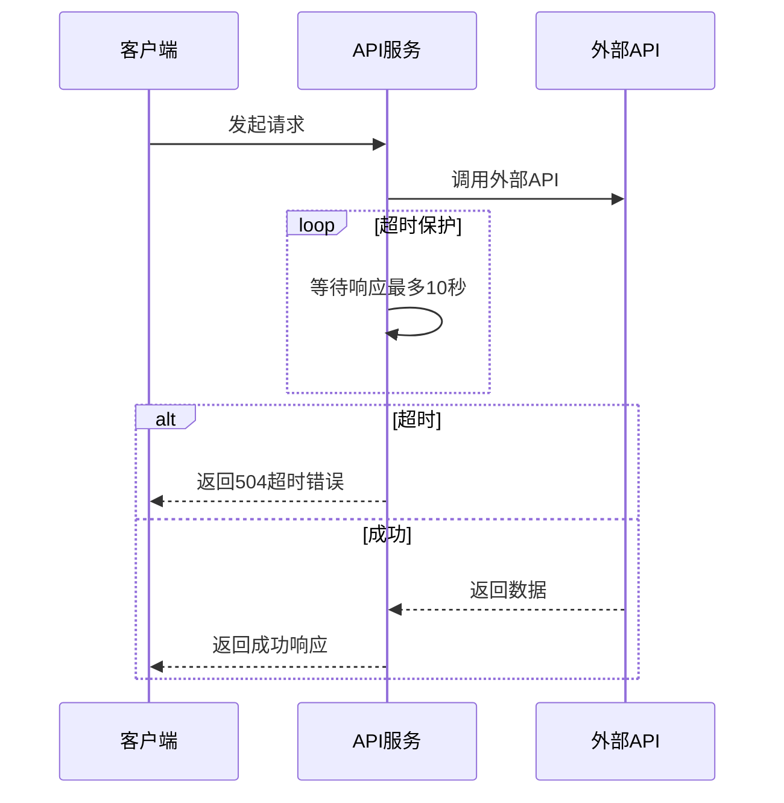
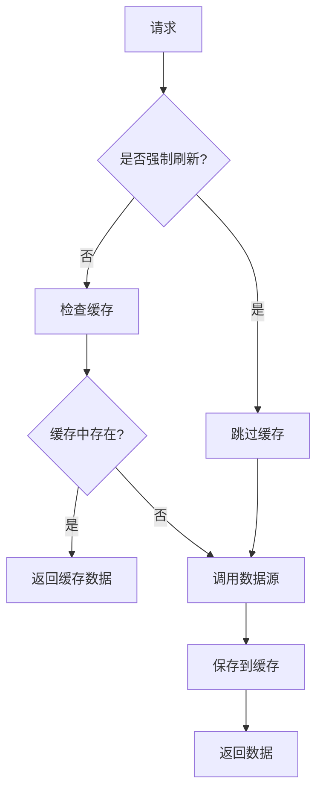
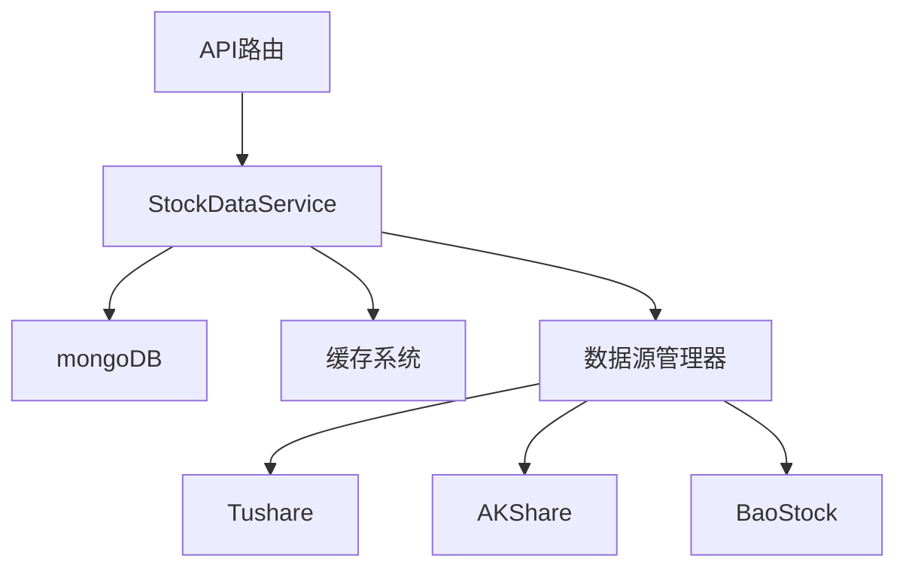
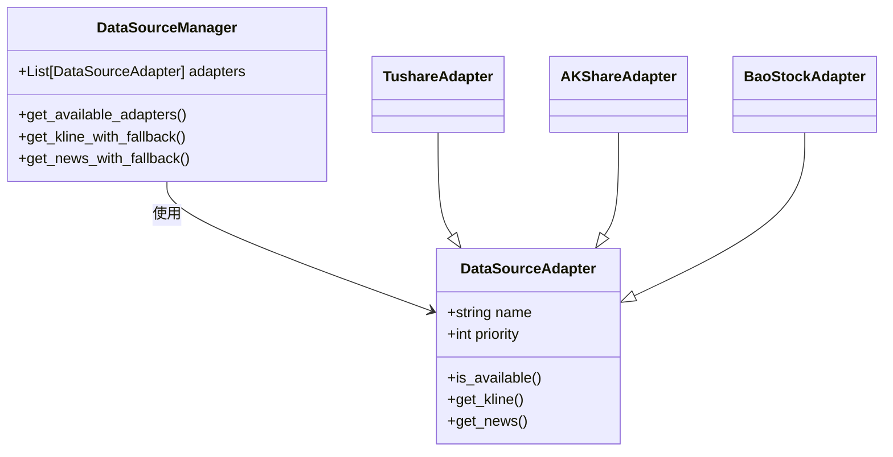

# 股票数据接口

<cite>
**本文档引用文件**   
- [stocks.py](file://app/routers/stocks.py)
- [stock_data_service.py](file://app/services/stock_data_service.py)
- [foreign_stock_service.py](file://app/services/foreign_stock_service.py)
- [stock_models.py](file://app/models/stock_models.py)
- [unified_stock_service.py](file://app/services/unified_stock_service.py)
- [response.py](file://app/core/response.py)
- [historical_data_service.py](file://app/services/historical_data_service.py)
- [manager.py](file://app/services/data_sources/manager.py)
- [realtime_metrics.py](file://tradingagents/dataflows/realtime_metrics.py)
- [mongodb_cache_adapter.py](file://tradingagents/dataflows/cache/mongodb_cache_adapter.py)
</cite>

## 目录
1. [引言](#引言)
2. [核心API接口](#核心api接口)
3. [核心方法参数详解](#核心方法参数详解)
4. [数据结构定义](#数据结构定义)
5. [调用示例](#调用示例)
6. [错误处理与超时](#错误处理与超时)
7. [数据缓存与性能优化](#数据缓存与性能优化)
8. [与后端服务的交互机制](#与后端服务的交互机制)
9. [结论](#结论)

## 引言

本接口文档详细说明了股票数据查询API的实现，涵盖了股票信息查询、实时行情获取和K线数据请求等核心功能。系统支持A股、港股和美股市场，通过统一的API接口提供标准化的数据访问服务。所有API端点均需通过Bearer Token进行鉴权，确保数据访问的安全性。接口返回统一的响应包格式，包含成功状态、数据内容、消息和时间戳，便于前端进行一致的处理。

**Section sources**
- [stocks.py](file://app/routers/stocks.py)

## 核心API接口

股票数据接口提供了多个核心端点，用于获取不同类型的股票数据。这些接口通过FastAPI框架实现，挂载在`/api/stocks`路径下。主要接口包括获取股票实时行情、基础面信息和K线数据。



**Diagram sources **
- [stocks.py](file://app/routers/stocks.py)

**Section sources**
- [stocks.py](file://app/routers/stocks.py)

## 核心方法参数详解

### getStockDetail (get_fundamentals)

`get_fundamentals`方法用于获取股票的基础面快照信息。该方法支持A股、港股和美股，通过自动识别市场类型来调用相应的服务。

**参数配置：**
- `code`: 股票代码，支持多种格式（6位数字为A股，4-5位数字或带.HK后缀为港股，纯字母为美股）
- `source`: 数据源（可选），可指定为tushare、akshare、baostock或multi_source
- `force_refresh`: 是否强制刷新，跳过缓存直接获取最新数据

当未指定数据源时，系统按优先级`tushare > multi_source > akshare > baostock`进行查询。如果所有数据源都未找到数据，则返回404错误。

**Section sources**
- [stocks.py](file://app/routers/stocks.py#L215-L418)

### getRealtimeQuotes (get_quote)

`get_quote`方法用于获取股票的实时行情数据。该方法能够自动识别股票代码的市场类型，并从相应的数据源获取数据。

**参数配置：**
- `code`: 股票代码
- `force_refresh`: 是否强制刷新，跳过缓存

对于A股，系统会从`market_quotes`集合获取实时行情，并从`stock_basic_info`集合获取基础信息。对于港股和美股，系统会调用`ForeignStockService`来获取数据。

**Section sources**
- [stocks.py](file://app/routers/stocks.py#L66-L212)

### getHistoricalData (get_kline)

`get_kline`方法用于获取股票的K线数据，支持多种周期和数据调整方式。

**参数配置：**
- `code`: 股票代码
- `period`: 数据周期，支持day、week、month、5m、15m、30m、60m
- `limit`: 返回数据条数
- `adj`: 数据调整方式，支持none、qfq（前复权）、hfq（后复权）
- `force_refresh`: 是否强制刷新

系统首先尝试从MongoDB缓存获取数据，如果缓存中没有，则降级到外部API获取。对于日线数据，在交易时间内会从`market_quotes`获取当天的实时K线数据。

**Section sources**
- [stocks.py](file://app/routers/stocks.py#L421-L621)

## 数据结构定义

### StockDetail

`StockDetail`数据结构定义了股票基础面信息的字段，包括股票代码、名称、行业、市场信息、估值指标、财务指标和交易指标等。



**Diagram sources **
- [stock_models.py](file://app/models/stock_models.py#L54-L150)

### QuoteData

`QuoteData`数据结构定义了股票实时行情的字段，包括价格、涨跌幅、成交额、成交量、开盘价、最高价、最低价、前收盘价、换手率、振幅等。



**Diagram sources **
- [stocks.py](file://app/routers/stocks.py#L191-L210)

### HistoricalData

`HistoricalData`数据结构定义了K线数据的字段，包括时间、开盘价、最高价、最低价、收盘价、成交量和成交额。



**Diagram sources **
- [stocks.py](file://app/routers/stocks.py#L613-L620)

## 调用示例

### 获取股票实时行情

```python
import requests

url = "http://localhost:8000/api/stocks/000001/quote"
headers = {"Authorization": "Bearer your_token"}
params = {"force_refresh": False}

response = requests.get(url, headers=headers, params=params)
data = response.json()
print(data)
```

### 获取股票基础面信息

```python
import requests

url = "http://localhost:8000/api/stocks/000001/fundamentals"
headers = {"Authorization": "Bearer your_token"}
params = {"source": "tushare", "force_refresh": False}

response = requests.get(url, headers=headers, params=params)
data = response.json()
print(data)
```

### 获取K线数据

```python
import requests

url = "http://localhost:8000/api/stocks/000001/kline"
headers = {"Authorization": "Bearer your_token"}
params = {"period": "day", "limit": 120, "adj": "none", "force_refresh": False}

response = requests.get(url, headers=headers, params=params)
data = response.json()
print(data)
```

**Section sources**
- [stocks.py](file://app/routers/stocks.py)

## 错误处理与超时

系统实现了完善的错误处理机制，确保在各种异常情况下能够提供有意义的反馈。

### 错误响应

当请求失败时，系统会返回标准的错误响应格式：

```json
{
  "success": false,
  "data": null,
  "message": "错误信息",
  "code": 500,
  "timestamp": "2025-10-28T10:30:00"
}
```

常见的错误包括：
- 404 Not Found：未找到指定股票的信息
- 500 Internal Server Error：获取数据失败
- 504 Gateway Timeout：外部API获取数据超时

### 超时处理

对于外部API调用，系统设置了10秒的超时保护。如果在10秒内未能获取到数据，则返回504超时错误。



**Diagram sources **
- [stocks.py](file://app/routers/stocks.py#L531-L548)

**Section sources**
- [stocks.py](file://app/routers/stocks.py)
- [response.py](file://app/core/response.py)

## 数据缓存与性能优化

系统采用了多层次的缓存策略，以提高数据访问性能和减少对外部API的依赖。

### 缓存策略

系统支持多种缓存策略，包括文件缓存、数据库缓存和自适应缓存。默认使用集成缓存系统，自动选择最佳的缓存后端。



**Diagram sources **
- [stocks.py](file://app/routers/stocks.py)
- [mongodb_cache_adapter.py](file://tradingagents/dataflows/cache/mongodb_cache_adapter.py)

### 性能优化措施

1. **索引优化**：在`stock_daily_quotes`集合上创建了复合唯一索引，提升查询和upsert性能。
2. **批量写入**：使用`bulk_write`操作批量保存历史数据，减少数据库交互次数。
3. **重试机制**：对于数据库写入操作，实现了指数退避重试机制，最多重试5次。
4. **单位转换优化**：在DataFrame层面进行向量化单位转换，比逐行转换快得多。

**Section sources**
- [historical_data_service.py](file://app/services/historical_data_service.py)
- [mongodb_cache_adapter.py](file://tradingagents/dataflows/cache/mongodb_cache_adapter.py)

## 与后端stock_data_service的交互机制

股票数据服务层（`StockDataService`）作为统一的数据访问接口，封装了对底层数据存储的访问逻辑。

### 服务架构



**Diagram sources **
- [stock_data_service.py](file://app/services/stock_data_service.py)
- [stocks.py](file://app/routers/stocks.py)

### 数据源管理

`DataSourceManager`负责管理多个数据源适配器，基于优先级排序，并提供fallback获取能力。



**Diagram sources **
- [manager.py](file://app/services/data_sources/manager.py)

**Section sources**
- [stock_data_service.py](file://app/services/stock_data_service.py)
- [manager.py](file://app/services/data_sources/manager.py)

## 结论

本文档详细介绍了股票数据接口的实现，包括核心API、参数配置、数据结构、调用示例、错误处理、缓存策略和与后端服务的交互机制。系统通过统一的API接口为A股、港股和美股提供标准化的数据访问服务，支持灵活的数据源选择和优先级配置。多层次的缓存策略和性能优化措施确保了系统的高效运行。完善的错误处理机制为客户端提供了可靠的反馈，便于进行错误诊断和处理。