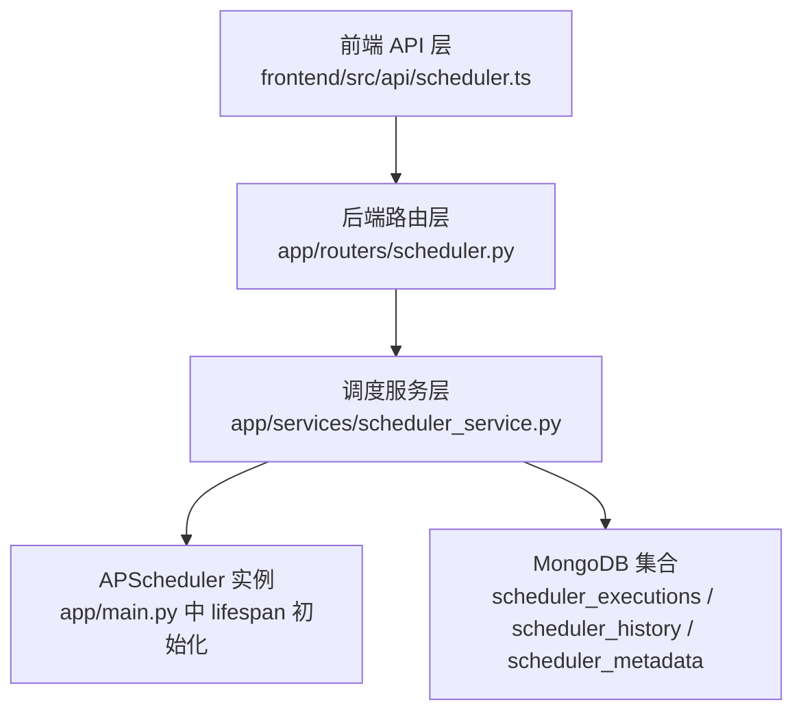
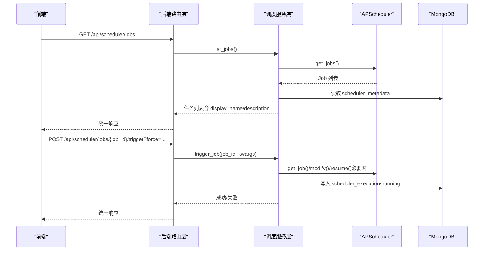
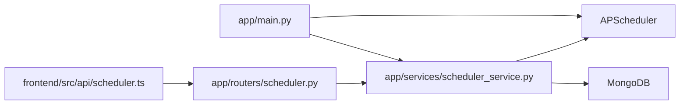
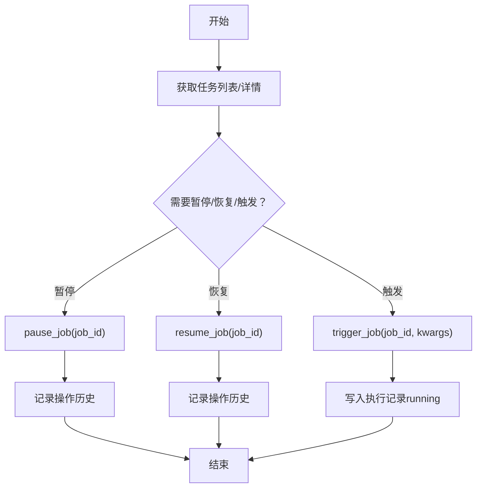

# 调度系统接口

<cite>
**本文引用的文件**
- [app/routers/scheduler.py](file://app/routers/scheduler.py)
- [app/services/scheduler_service.py](file://app/services/scheduler_service.py)
- [frontend/src/api/scheduler.ts](file://frontend/src/api/scheduler.ts)
- [app/main.py](file://app/main.py)
- [scripts/init_scheduler_metadata.py](file://scripts/init_scheduler_metadata.py)
- [docs/guides/scheduler_management.md](file://docs/guides/scheduler_management.md)
- [docs/guides/scheduler_frontend_implementation.md](file://docs/guides/scheduler_frontend_implementation.md)
</cite>

## 目录
1. [简介](#简介)
2. [项目结构](#项目结构)
3. [核心组件](#核心组件)
4. [架构总览](#架构总览)
5. [详细组件分析](#详细组件分析)
6. [依赖关系分析](#依赖关系分析)
7. [性能与可靠性](#性能与可靠性)
8. [故障排查指南](#故障排查指南)
9. [结论](#结论)
10. [附录](#附录)

## 简介
本接口文档面向“调度系统”能力，聚焦于后端调度器与前端交互的完整链路，覆盖任务生命周期管理（创建、暂停、恢复、手动触发、历史查询、统计与健康检查）、与后端调度器的通信协议、以及错误恢复机制。文档同时给出典型使用场景（定时数据同步、周期性分析任务）的配置建议与调用流程，帮助开发者快速集成与运维。

## 项目结构
调度系统由三层组成：
- 前端 API 层：封装 HTTP 请求，暴露任务管理与执行历史查询等接口
- 后端路由层：FastAPI 路由，负责鉴权、参数校验与返回统一响应
- 服务层：基于 APScheduler 的调度器服务，负责任务注册、事件监听、执行记录与元数据管理

图表来源
- [frontend/src/api/scheduler.ts](file://frontend/src/api/scheduler.ts#L1-L234)
- [app/routers/scheduler.py](file://app/routers/scheduler.py#L1-L530)
- [app/services/scheduler_service.py](file://app/services/scheduler_service.py#L1-L1161)
- [app/main.py](file://app/main.py#L270-L580)

章节来源
- [app/main.py](file://app/main.py#L270-L580)
- [app/routers/scheduler.py](file://app/routers/scheduler.py#L1-L530)
- [app/services/scheduler_service.py](file://app/services/scheduler_service.py#L1-L1161)
- [frontend/src/api/scheduler.ts](file://frontend/src/api/scheduler.ts#L1-L234)

## 核心组件
- 前端 API 封装：提供任务列表、详情、暂停/恢复、手动触发、历史查询、统计与健康检查等方法
- 后端路由：统一鉴权（管理员权限）、参数校验、返回统一响应体
- 调度服务：封装 APScheduler，提供任务 CRUD、手动触发、历史与统计查询、事件监听与僵尸任务检测
- 应用生命周期：在 FastAPI lifespan 中启动调度器并注入服务实例，确保 API 可用

章节来源
- [frontend/src/api/scheduler.ts](file://frontend/src/api/scheduler.ts#L1-L234)
- [app/routers/scheduler.py](file://app/routers/scheduler.py#L1-L530)
- [app/services/scheduler_service.py](file://app/services/scheduler_service.py#L1-L1161)
- [app/main.py](file://app/main.py#L270-L580)

## 架构总览
调度系统整体交互如下：
- 前端通过封装的 API 客户端调用后端路由
- 路由层进行权限校验与参数解析
- 服务层对接 APScheduler 并持久化执行记录与元数据
- 应用生命周期负责调度器的启动与关闭

图表来源
- [frontend/src/api/scheduler.ts](file://frontend/src/api/scheduler.ts#L1-L234)
- [app/routers/scheduler.py](file://app/routers/scheduler.py#L180-L221)
- [app/services/scheduler_service.py](file://app/services/scheduler_service.py#L152-L213)

## 详细组件分析

### 前端 API 封装（frontend/src/api/scheduler.ts）
- 能力范围
  - 任务列表与详情
  - 暂停/恢复/手动触发
  - 执行历史与统计
  - 健康检查与统计
  - 元数据更新
  - 执行记录管理（取消、标记失败、删除）
- 关键方法与参数
  - getJobs()：获取任务列表
  - getJobDetail(jobId)：获取任务详情
  - pauseJob(jobId)/resumeJob(jobId)：暂停/恢复
  - triggerJob(jobId, force?)：手动触发，支持强制参数
  - getJobHistory(jobId, {limit?, offset?}) / getAllHistory({limit?, offset?, job_id?, status?})
  - getSchedulerStats() / getSchedulerHealth()
  - updateJobMetadata(jobId, {display_name?, description?})
  - getJobExecutions({job_id?, status?, is_manual?, limit?, offset?}) / getSingleJobExecutions(jobId, ...)
  - getJobExecutionStats(jobId)
  - cancelExecution(executionId) / markExecutionFailed(executionId, reason?) / deleteExecution(executionId)

章节来源
- [frontend/src/api/scheduler.ts](file://frontend/src/api/scheduler.ts#L1-L234)

### 后端路由层（app/routers/scheduler.py）
- 权限控制
  - 查看任务：登录用户
  - 暂停/恢复/触发：管理员
- 关键端点
  - GET /api/scheduler/jobs：任务列表
  - GET /api/scheduler/jobs/{job_id}：任务详情
  - POST /api/scheduler/jobs/{job_id}/pause：暂停
  - POST /api/scheduler/jobs/{job_id}/resume：恢复
  - POST /api/scheduler/jobs/{job_id}/trigger：手动触发（支持 force 查询参数）
  - GET /api/scheduler/jobs/{job_id}/history：任务历史
  - GET /api/scheduler/history：全局历史
  - GET /api/scheduler/stats：统计
  - GET /api/scheduler/health：健康检查
  - PUT /api/scheduler/jobs/{job_id}/metadata：更新元数据
  - GET /api/scheduler/executions：执行记录列表
  - GET /api/scheduler/jobs/{job_id}/executions：单任务执行记录
  - GET /api/scheduler/jobs/{job_id}/execution-stats：任务执行统计
  - POST /api/scheduler/executions/{execution_id}/cancel：取消执行
  - POST /api/scheduler/executions/{execution_id}/mark-failed：标记失败
  - DELETE /api/scheduler/executions/{execution_id}：删除执行记录

章节来源
- [app/routers/scheduler.py](file://app/routers/scheduler.py#L1-L530)

### 调度服务层（app/services/scheduler_service.py）
- 任务生命周期
  - 列表与详情：读取 APScheduler 任务并合并元数据
  - 暂停/恢复：调用 APScheduler pause_job()/resume_job()
  - 手动触发：必要时临时恢复暂停任务，设置 next_run_time 为当前时间，并写入“running”执行记录
  - 元数据：scheduler_metadata 集合，支持 display_name/description
- 执行记录与统计
  - 事件监听：成功/失败/错过，异步写入 scheduler_executions
  - 统计：聚合执行记录，计算总数、成功率、平均耗时与最近一次执行
  - 历史查询：支持分页、过滤（job_id/status/is_manual）
- 健康与清理
  - 健康检查：返回运行状态与时间戳
  - 僵尸任务检测：定时扫描超过阈值的 running 记录并标记失败
- 进度上报与取消
  - update_job_progress：内部任务更新进度（含取消请求检查）
  - cancel_execution/mark_execution_failed/delete_execution：对执行记录进行管理

章节来源
- [app/services/scheduler_service.py](file://app/services/scheduler_service.py#L1-L1161)

### 应用生命周期与调度器初始化（app/main.py）
- 生命周期
  - lifespan 中启动调度器，注册各类数据同步任务（Tushare/AKShare/BaoStock/新闻等），并根据配置启用/暂停
  - 启动后调用 set_scheduler_instance(scheduler)，使 API 可以获取调度器服务实例
  - 应用关闭时优雅 shutdown 调度器
- 调度器事件
  - 注册事件监听器，记录执行结果与错误
  - 添加定时任务检测僵尸任务

章节来源
- [app/main.py](file://app/main.py#L270-L580)
- [app/services/scheduler_service.py](file://app/services/scheduler_service.py#L700-L765)

## 依赖关系分析
- 前端依赖后端路由层提供的统一响应结构
- 后端路由依赖调度服务层提供的业务能力
- 调度服务层依赖 APScheduler 与 MongoDB
- 应用生命周期负责调度器实例的注入与释放

图表来源
- [frontend/src/api/scheduler.ts](file://frontend/src/api/scheduler.ts#L1-L234)
- [app/routers/scheduler.py](file://app/routers/scheduler.py#L1-L530)
- [app/services/scheduler_service.py](file://app/services/scheduler_service.py#L1-L1161)
- [app/main.py](file://app/main.py#L270-L580)

## 性能与可靠性
- 性能特性
  - 异步事件驱动：事件回调通过 asyncio.create_task 异步写入数据库，避免阻塞调度器主线程
  - 本地时间存储：MongoDB 存储 naive datetime，前端统一格式化显示，减少时区转换开销
- 可靠性保障
  - 僵尸任务检测：定期扫描长时间 running 的执行记录并标记失败，防止资源泄漏
  - 统一响应与错误日志：路由层捕获异常并返回统一结构，服务层记录详细日志
  - 进度上报与取消：内部任务可上报进度并在收到取消请求时主动抛出异常中断

章节来源
- [app/services/scheduler_service.py](file://app/services/scheduler_service.py#L722-L765)
- [app/services/scheduler_service.py](file://app/services/scheduler_service.py#L800-L930)
- [app/services/scheduler_service.py](file://app/services/scheduler_service.py#L1065-L1161)

## 故障排查指南
- 常见问题
  - 调度器未初始化：后端启动时未设置调度器实例，API 会抛出“调度器实例未设置”的运行时错误
  - 权限不足：暂停/恢复/触发需要管理员权限，否则返回 403
  - 任务不存在：触发或管理任务时若 job_id 无效，服务层记录错误并返回失败
  - 执行记录状态异常：running 状态长时间未更新，可通过僵尸任务检测自动修复
- 建议排查步骤
  - 确认应用生命周期已成功启动调度器并注入实例
  - 检查 MongoDB 连接与集合索引（scheduler_executions/scheduler_history/scheduler_metadata）
  - 使用健康检查端点确认调度器运行状态
  - 查看执行历史与统计，定位失败原因

章节来源
- [app/main.py](file://app/main.py#L572-L591)
- [app/routers/scheduler.py](file://app/routers/scheduler.py#L120-L221)
- [app/services/scheduler_service.py](file://app/services/scheduler_service.py#L722-L765)

## 结论
调度系统通过清晰的三层架构实现了任务的全生命周期管理：前端以统一 API 调用后端路由，后端路由委托调度服务层与 APScheduler 协作，服务层负责事件监听、历史与统计、元数据与健康检查，并通过生命周期管理保证调度器的稳定运行。该设计既满足了运维人员对任务的可视化与可控性需求，也为内部任务的进度上报与取消提供了可靠支撑。

## 附录

### API 定义与调用方式
- 任务管理
  - GET /api/scheduler/jobs：获取任务列表
  - GET /api/scheduler/jobs/{job_id}：获取任务详情
  - POST /api/scheduler/jobs/{job_id}/pause：暂停任务（管理员）
  - POST /api/scheduler/jobs/{job_id}/resume：恢复任务（管理员）
  - POST /api/scheduler/jobs/{job_id}/trigger?force=...：手动触发任务（管理员）
- 历史与统计
  - GET /api/scheduler/jobs/{job_id}/history?limit=&offset=
  - GET /api/scheduler/history?limit=&offset=&job_id=&status=
  - GET /api/scheduler/executions?job_id=&status=&is_manual=&limit=&offset=
  - GET /api/scheduler/jobs/{job_id}/executions?status=&is_manual=&limit=&offset=
  - GET /api/scheduler/jobs/{job_id}/execution-stats
  - GET /api/scheduler/stats
  - GET /api/scheduler/health
- 元数据与执行记录管理
  - PUT /api/scheduler/jobs/{job_id}/metadata
  - POST /api/scheduler/executions/{execution_id}/cancel
  - POST /api/scheduler/executions/{execution_id}/mark-failed?reason=
  - DELETE /api/scheduler/executions/{execution_id}

章节来源
- [app/routers/scheduler.py](file://app/routers/scheduler.py#L1-L530)

### 调度任务生命周期管理流程

图表来源
- [app/services/scheduler_service.py](file://app/services/scheduler_service.py#L108-L213)

### 与后端调度器的通信协议与错误恢复
- 通信协议
  - 前端通过封装的 API 客户端发起 HTTP 请求，后端路由返回统一响应结构（success/data/message）
  - 服务层通过 APScheduler 事件回调异步写入 MongoDB，避免阻塞
- 错误恢复
  - 僵尸任务检测：扫描长时间 running 的执行记录并标记失败
  - 手动触发失败：记录失败动作与错误信息
  - 健康检查：返回调度器运行状态与时间戳，便于外部监控

章节来源
- [app/services/scheduler_service.py](file://app/services/scheduler_service.py#L722-L765)
- [app/services/scheduler_service.py](file://app/services/scheduler_service.py#L800-L930)
- [app/routers/scheduler.py](file://app/routers/scheduler.py#L302-L335)

### 实际使用场景示例
- 定时数据同步
  - 配置 Tushare/AKShare/BaoStock 的基础信息、行情、历史、财务与状态检查任务，按 CRON 或 HH:MM 配置
  - 通过路由层暂停/恢复任务，或在紧急情况下手动触发
  - 使用历史与统计接口监控执行质量
- 周期性分析任务
  - 将分析任务封装为 APScheduler 任务，使用 update_job_progress 上报进度与取消请求
  - 通过执行记录管理接口进行取消、标记失败与删除

章节来源
- [app/main.py](file://app/main.py#L334-L571)
- [app/services/scheduler_service.py](file://app/services/scheduler_service.py#L1065-L1161)
- [scripts/init_scheduler_metadata.py](file://scripts/init_scheduler_metadata.py#L1-L211)

### 前端集成要点
- 使用统一 API 客户端封装，避免双重解包
- 通过路由层鉴权与权限控制，确保只有管理员可执行暂停/恢复/触发
- 使用健康检查与统计接口提升可观测性

章节来源
- [docs/guides/scheduler_frontend_implementation.md](file://docs/guides/scheduler_frontend_implementation.md#L235-L368)
- [docs/guides/scheduler_management.md](file://docs/guides/scheduler_management.md#L190-L270)