# 配置管理接口

<cite>
**本文档引用的文件**  
- [config.py](file://app/core/config.py)
- [config_service.py](file://app/services/config_service.py)
- [config.py](file://app/routers/config.py)
- [config.ts](file://frontend/src/api/config.ts)
- [config_bridge.py](file://app/core/config_bridge.py)
- [unified_config.py](file://app/core/unified_config.py)
- [config.md](file://docs/config/architecture.md)
- [api_key_utils.py](file://app/utils/api_key_utils.py)
</cite>

## 目录
1. [简介](#简介)
2. [配置数据结构](#配置数据结构)
3. [核心方法使用](#核心方法使用)
4. [配置同步机制](#配置同步机制)
5. [安全考虑](#安全考虑)
6. [配置版本管理](#配置版本管理)
7. [附录](#附录)

## 简介
本接口文档详细说明了系统配置管理的实现，包括配置的读取、更新和验证功能。系统采用分层集中式配置方案，通过数据库作为配置的单一事实来源（SoT），同时支持环境变量和文件配置。配置管理服务提供了对LLM配置、数据源配置和系统设置的全面管理能力，确保配置变更能够实时同步到整个系统。

**Section sources**
- [config.py](file://app/core/config.py#L1-L301)
- [config_service.py](file://app/services/config_service.py#L1-L800)

## 配置数据结构
系统配置由多个核心组件构成，包括LLM配置、数据源配置和系统设置。这些配置通过Pydantic模型定义，确保了类型安全和数据验证。

### LLM配置
LLM配置定义了大模型的连接参数和行为特性，包括供应商、模型名称、API密钥、超时设置等。

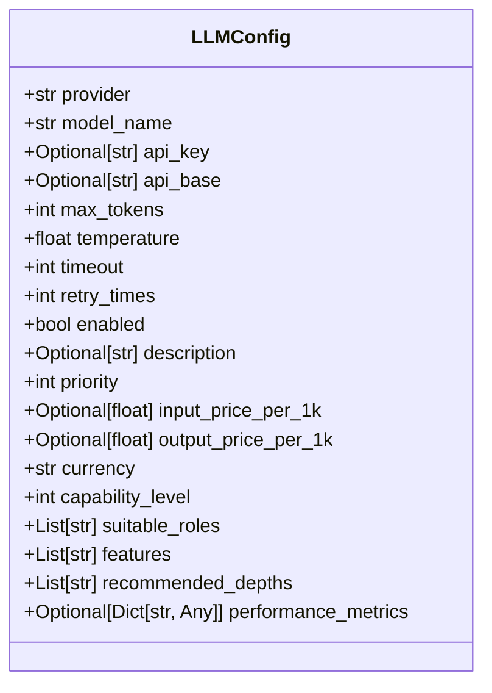

**Diagram sources**
- [config.py](file://app/core/config.py#L22-L235)
- [config.ts](file://frontend/src/api/config.ts#L34-L65)

### 数据源配置
数据源配置定义了金融数据源的连接参数和优先级，支持多种数据源类型，包括Tushare、AKShare和Finnhub。

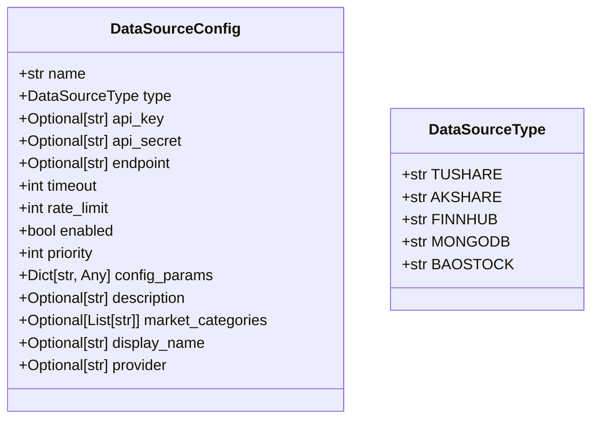

**Diagram sources**
- [config.py](file://app/core/config.py#L237-L256)
- [config.ts](file://frontend/src/api/config.ts#L67-L85)

### 系统设置
系统设置包含了影响整个系统行为的运行时参数，如并发限制、缓存策略和监控配置。

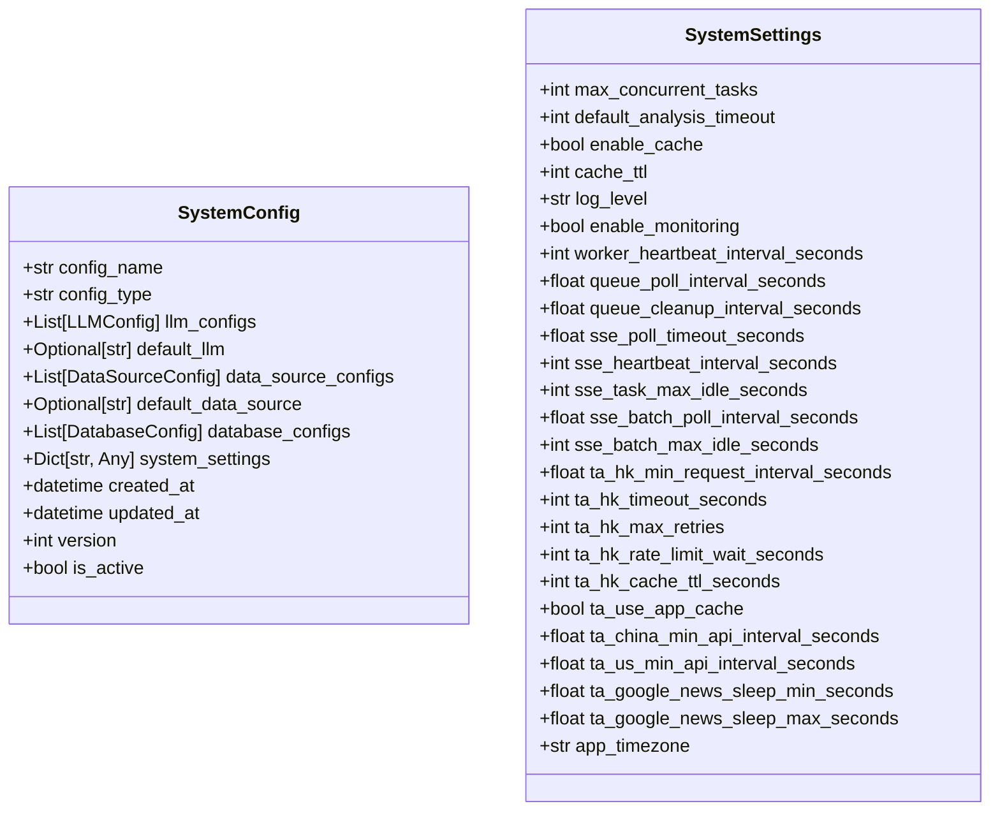

**Diagram sources**
- [config.py](file://app/core/config.py#L323-L351)
- [config_service.py](file://app/services/config_service.py#L362-L381)

## 核心方法使用
配置管理接口提供了`getConfig`、`updateConfig`和`validateConfig`等核心方法，用于配置的读取、更新和验证。

### 获取配置
`getConfig`方法用于获取当前的系统配置，优先从数据库读取最新数据。

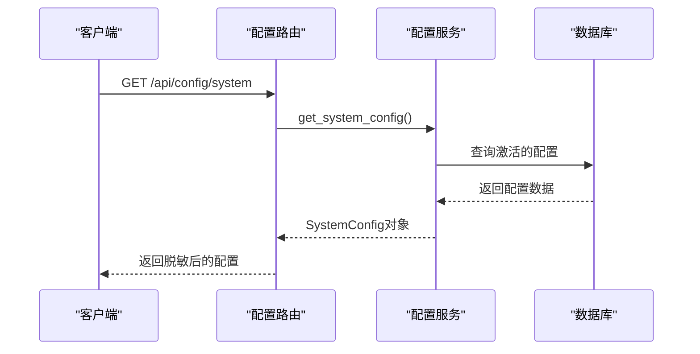

**Diagram sources**
- [config.py](file://app/routers/config.py#L171-L197)
- [config_service.py](file://app/services/config_service.py#L362-L381)

### 更新配置
`updateConfig`方法用于更新系统配置，支持LLM配置、数据源配置和系统设置的更新。

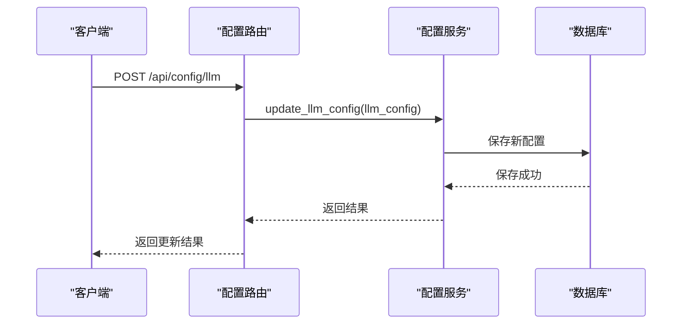

**Diagram sources**
- [config.py](file://app/routers/config.py#L582-L688)
- [config_service.py](file://app/services/config_service.py#L516-L573)

### 验证配置
`validateConfig`方法用于验证配置的有效性，确保配置值符合预期格式和范围。

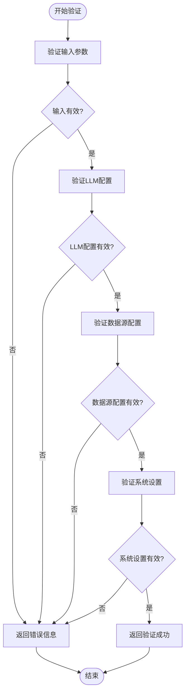

**Diagram sources**
- [config.py](file://app/routers/config.py#L470-L481)
- [config_service.py](file://app/services/config_service.py#L771-L778)

## 配置同步机制
系统采用配置桥接机制，将数据库中的配置实时同步到环境变量，确保配置变更能够立即生效。

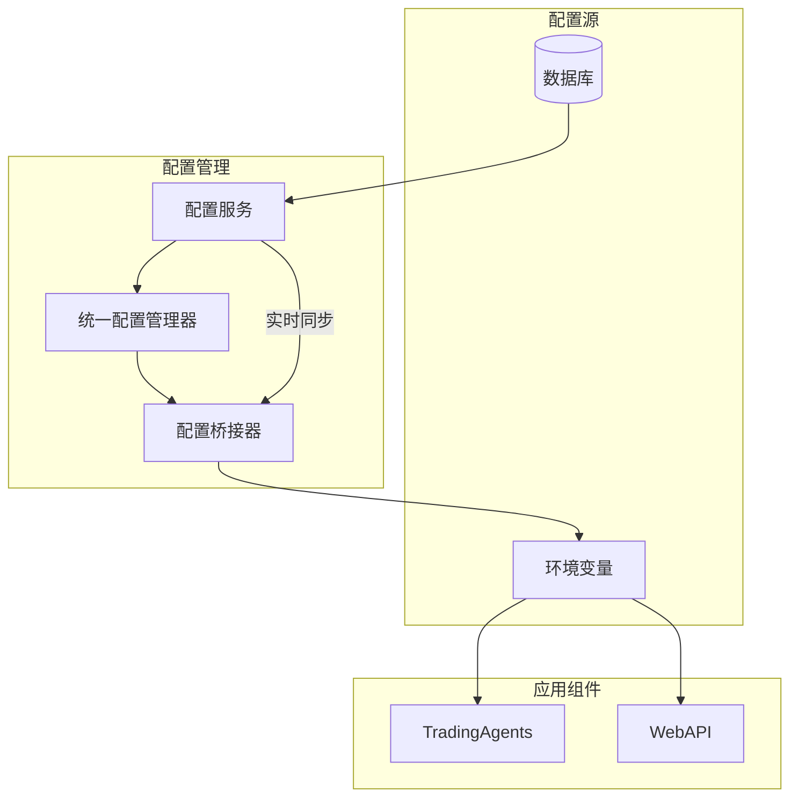

**Diagram sources**
- [config_bridge.py](file://app/core/config_bridge.py#L15-L287)
- [unified_config.py](file://app/core/unified_config.py#L34-L500)

## 安全考虑
系统在配置管理中实施了多项安全措施，保护敏感信息并防止配置泄露。

### 敏感信息保护
- API响应对敏感字段进行脱敏处理
- REST接口写入时不接受敏感字段
- 导出配置时对敏感项清空
- 生产环境不在数据库中持久化明文密钥

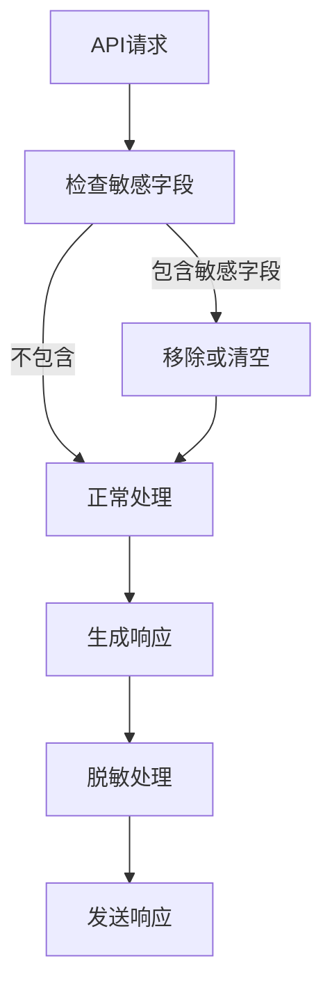

**Diagram sources**
- [config.py](file://app/routers/config.py#L83-L160)
- [api_key_utils.py](file://app/utils/api_key_utils.py#L11-L165)

### 配置验证
系统在启动时进行配置验证，确保必需的配置项已正确设置。

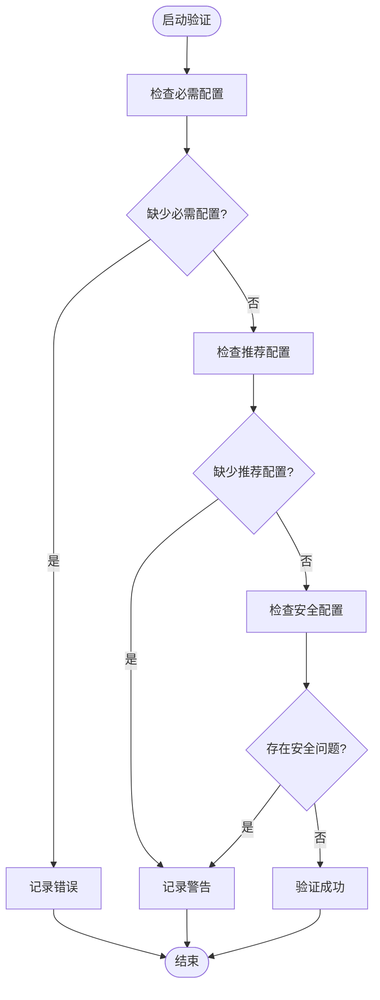

**Diagram sources**
- [startup_validator.py](file://app/core/startup_validator.py#L158-L276)
- [config.md](file://docs/config/architecture.md#L1-L39)

## 配置版本管理
系统通过版本号和激活状态管理配置，支持配置的历史追溯和回滚。

### 配置版本结构
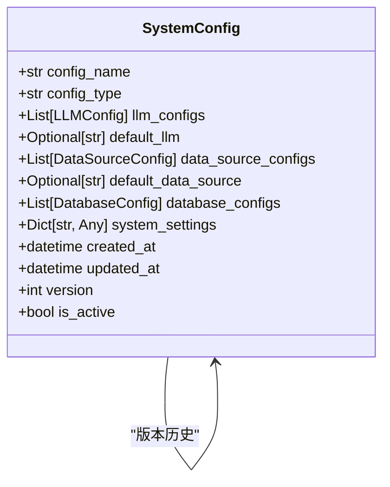

**Diagram sources**
- [config.py](file://app/models/config.py#L323-L351)
- [config_service.py](file://app/services/config_service.py#L516-L573)

### 版本管理流程
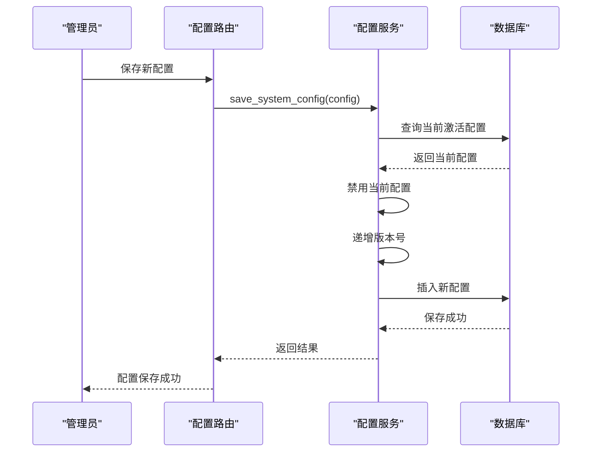

**Diagram sources**
- [config_service.py](file://app/services/config_service.py#L516-L573)
- [config.py](file://app/routers/config.py#L749-L750)

## 附录
### 配置优先级
配置的优先级顺序如下（从高到低）：
1. 请求级覆盖（仅本次请求生效）
2. 用户/租户偏好（数据库）
3. 系统运营参数（数据库）
4. 环境变量/.env
5. 代码默认值

### SoT模式开关
`Settings.CONFIG_SOT`参数控制配置的单一事实来源模式：
- `file`：以文件/env为准（推荐，生产缺省）
- `db`：以数据库为准（仅兼容旧版，不推荐）
- `hybrid`：文件/env优先，DB兜底

**Section sources**
- [config.md](file://docs/config/architecture.md#L1-L39)
- [config.py](file://app/core/config.py#L145-L149)