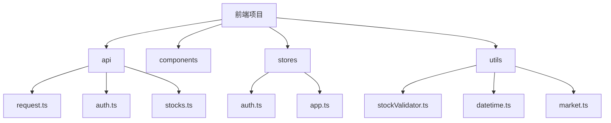
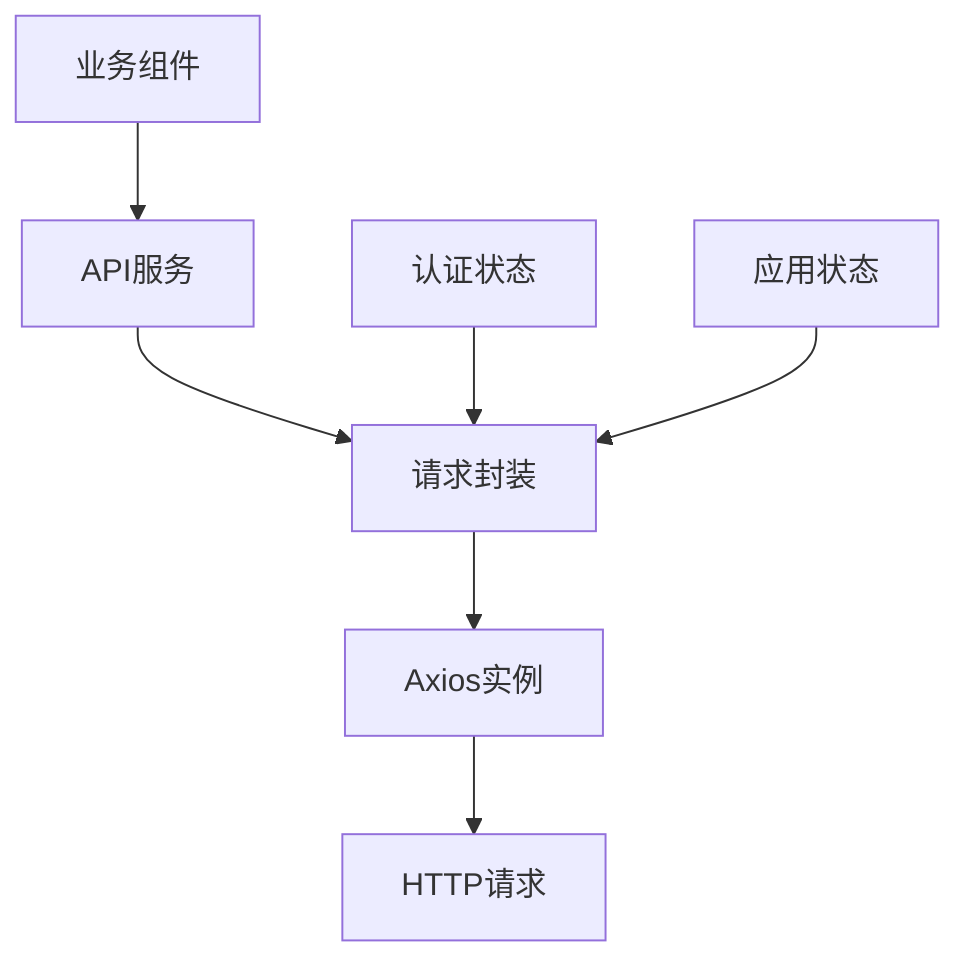
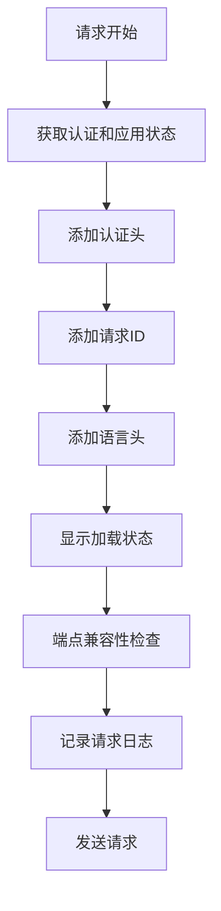
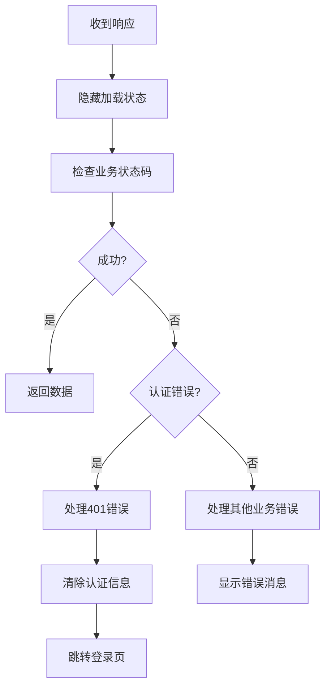
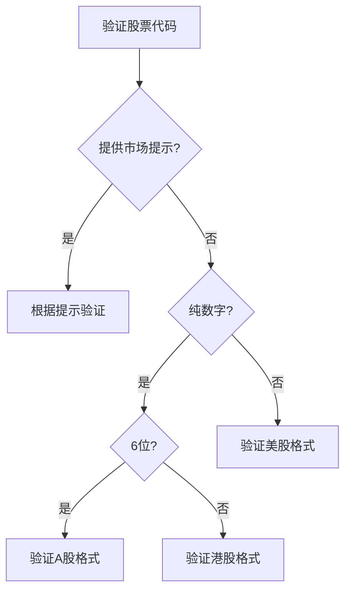
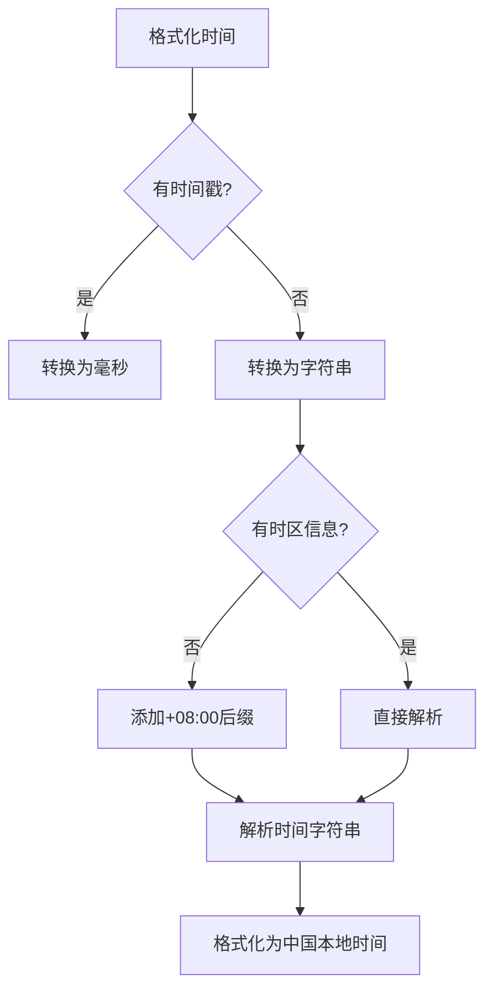
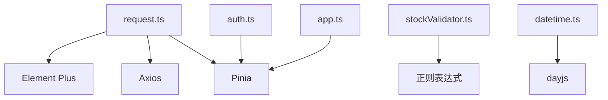

# 基础请求层

<cite>
**本文档引用的文件**  
- [request.ts](file://frontend/src/api/request.ts)
- [stockValidator.ts](file://frontend/src/utils/stockValidator.ts)
- [datetime.ts](file://frontend/src/utils/datetime.ts)
- [market.ts](file://frontend/src/utils/market.ts)
- [auth.ts](file://frontend/src/utils/auth.ts)
- [auth.ts](file://frontend/src/stores/auth.ts)
- [app.ts](file://frontend/src/stores/app.ts)
- [vite.config.ts](file://frontend/vite.config.ts)
</cite>

## 目录
1. [简介](#简介)
2. [项目结构](#项目结构)
3. [核心组件](#核心组件)
4. [架构概述](#架构概述)
5. [详细组件分析](#详细组件分析)
6. [依赖分析](#依赖分析)
7. [性能考虑](#性能考虑)
8. [故障排除指南](#故障排除指南)
9. [结论](#结论)

## 简介
本文档深入解析sagacity前端API客户端的核心架构，重点分析基于Axios的HTTP请求封装机制。文档详细说明了请求/响应拦截器、统一错误处理、自动重试策略和认证令牌注入等关键功能。同时，文档还解释了如何通过工具函数实现请求参数标准化、时间戳处理和股票代码验证，并涵盖拦截器链的执行流程、超时配置、CSRF防护机制以及自定义请求实例的扩展方法。

## 项目结构
sagacity前端项目采用模块化设计，主要目录包括`api`、`components`、`stores`、`utils`等。`api`目录包含所有API请求的封装，`stores`目录使用Pinia管理应用状态，`utils`目录包含各种工具函数。

**图表来源**
- [request.ts](file://frontend/src/api/request.ts)
- [auth.ts](file://frontend/src/stores/auth.ts)
- [app.ts](file://frontend/src/stores/app.ts)
- [stockValidator.ts](file://frontend/src/utils/stockValidator.ts)

**章节来源**
- [request.ts](file://frontend/src/api/request.ts)
- [auth.ts](file://frontend/src/stores/auth.ts)
- [app.ts](file://frontend/src/stores/app.ts)
- [stockValidator.ts](file://frontend/src/utils/stockValidator.ts)

## 核心组件
核心组件包括`request.ts`中的Axios实例封装、`auth.ts`中的认证状态管理、`app.ts`中的应用状态管理以及`utils`目录中的各种工具函数。

**章节来源**
- [request.ts](file://frontend/src/api/request.ts)
- [auth.ts](file://frontend/src/stores/auth.ts)
- [app.ts](file://frontend/src/stores/app.ts)
- [stockValidator.ts](file://frontend/src/utils/stockValidator.ts)

## 架构概述
sagacity前端API客户端采用分层架构，最底层是Axios HTTP客户端，中间层是请求封装，最上层是业务API调用。通过拦截器实现统一的请求/响应处理，通过Pinia store管理认证和应用状态。

**图表来源**
- [request.ts](file://frontend/src/api/request.ts)
- [auth.ts](file://frontend/src/stores/auth.ts)
- [app.ts](file://frontend/src/stores/app.ts)

## 详细组件分析

### 请求封装分析
`request.ts`文件是API客户端的核心，它创建了一个Axios实例并配置了请求和响应拦截器。

#### 请求拦截器
请求拦截器负责在请求发送前添加认证头、请求ID、语言头等信息，并处理端点兼容性问题。

**图表来源**
- [request.ts](file://frontend/src/api/request.ts#L96-L167)

#### 响应拦截器
响应拦截器负责处理响应数据、错误处理、认证刷新和加载状态管理。

**图表来源**
- [request.ts](file://frontend/src/api/request.ts#L174-L364)

### 工具函数分析
工具函数用于处理请求参数标准化、时间戳处理和股票代码验证。

#### 股票代码验证
`stockValidator.ts`文件提供了股票代码格式验证功能，支持A股、美股和港股。

**图表来源**
- [stockValidator.ts](file://frontend/src/utils/stockValidator.ts#L117-L173)

#### 时间处理
`datetime.ts`文件提供了时间格式化功能，统一处理时区转换。

**图表来源**
- [datetime.ts](file://frontend/src/utils/datetime.ts#L19-L81)

## 依赖分析
API客户端依赖于Axios进行HTTP请求，依赖于Pinia进行状态管理，依赖于Element Plus进行UI组件。

**图表来源**
- [request.ts](file://frontend/src/api/request.ts)
- [auth.ts](file://frontend/src/stores/auth.ts)
- [app.ts](file://frontend/src/stores/app.ts)
- [stockValidator.ts](file://frontend/src/utils/stockValidator.ts)
- [datetime.ts](file://frontend/src/utils/datetime.ts)

## 性能考虑
- 请求超时设置为60秒，避免长时间等待
- 错误消息去重，避免重复显示相同错误
- 认证信息本地存储，减少重复登录
- 自动刷新token，避免频繁重新登录

## 故障排除指南
- **401错误**：检查token是否过期，尝试刷新token
- **网络错误**：检查网络连接，重试请求
- **超时错误**：检查后端服务是否正常运行
- **认证失败**：检查用户名和密码是否正确

**章节来源**
- [request.ts](file://frontend/src/api/request.ts)
- [auth.ts](file://frontend/src/stores/auth.ts)

## 结论
sagacity前端API客户端通过Axios封装实现了统一的HTTP请求处理，通过拦截器实现了认证、错误处理和日志记录等功能。工具函数提供了股票代码验证和时间处理等实用功能，使得API调用更加方便和可靠。