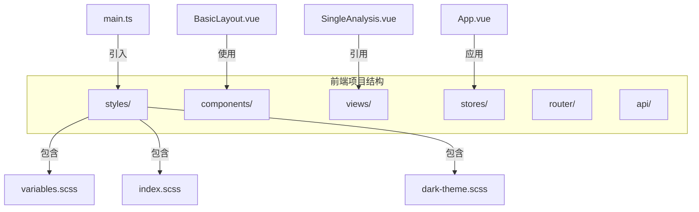
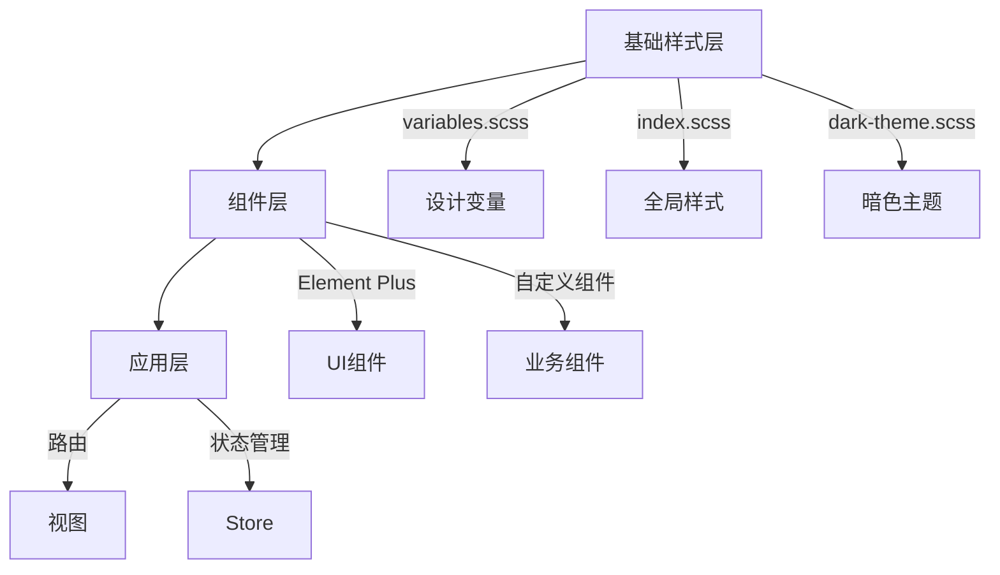
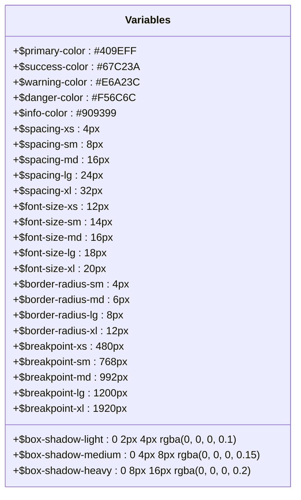
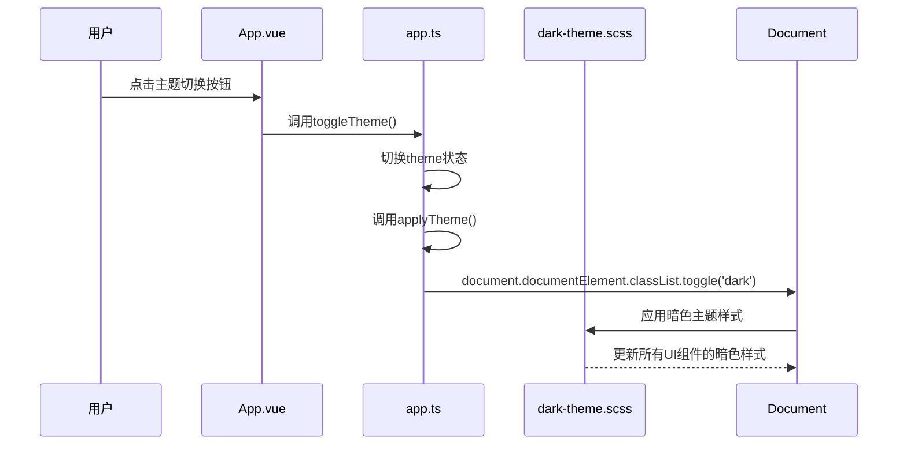
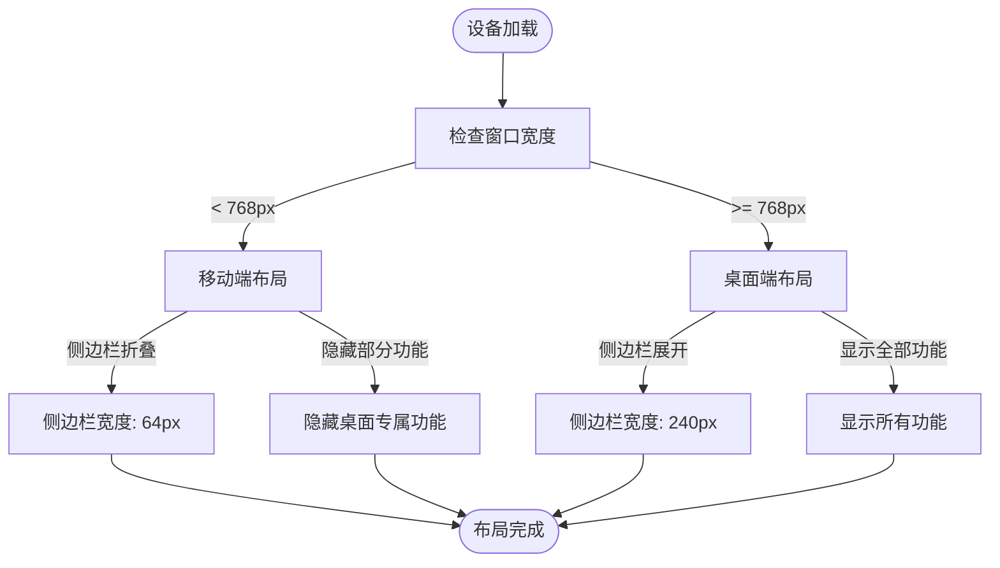
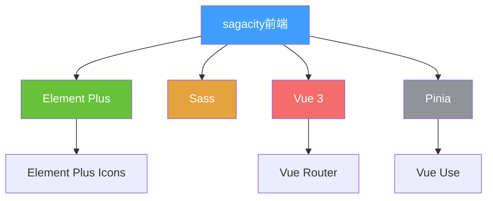

# UI设计系统

<cite>
**本文档引用的文件**  
- [dark-theme.scss](file://frontend/src/styles/dark-theme.scss)
- [variables.scss](file://frontend/src/styles/variables.scss)
- [index.scss](file://frontend/src/styles/index.scss)
- [main.ts](file://frontend/src/main.ts)
- [App.vue](file://frontend/src/App.vue)
- [app.ts](file://frontend/src/stores/app.ts)
- [package.json](file://frontend/package.json)
- [HeaderActions.vue](file://frontend/src/components/Layout/HeaderActions.vue)
- [BasicLayout.vue](file://frontend/src/layouts/BasicLayout.vue)
- [SingleAnalysis.vue](file://frontend/src/views/Analysis/SingleAnalysis.vue)
</cite>

## 目录
1. [简介](#简介)
2. [项目结构](#项目结构)
3. [核心组件](#核心组件)
4. [架构概述](#架构概述)
5. [详细组件分析](#详细组件分析)
6. [依赖分析](#依赖分析)
7. [性能考虑](#性能考虑)
8. [故障排除指南](#故障排除指南)
9. [结论](#结论)
10. [附录](#附录)（如有必要）

## 简介
本文档系统阐述了sagacity平台的UI设计系统，详细描述了基于Element Plus的UI组件库集成方案。文档涵盖了主题定制、暗色模式实现（dark-theme.scss）和设计变量（variables.scss）管理等核心内容。同时，本文档还介绍了整体视觉风格、色彩体系、字体排版和间距规范，以及响应式设计实现和跨设备兼容性策略。通过提供UI组件使用指南和自定义扩展方法，帮助开发者和设计师更好地理解和应用该设计系统。

## 项目结构
sagacity平台的前端项目结构清晰，遵循现代前端开发的最佳实践。项目采用Vue 3 + TypeScript + Vite技术栈，UI组件库基于Element Plus构建。核心设计系统文件位于`frontend/src/styles/`目录下，包括`variables.scss`（设计变量）、`index.scss`（全局样式）和`dark-theme.scss`（暗色主题样式）。

**Diagram sources**
- [dark-theme.scss](file://frontend/src/styles/dark-theme.scss)
- [variables.scss](file://frontend/src/styles/variables.scss)
- [index.scss](file://frontend/src/styles/index.scss)
- [main.ts](file://frontend/src/main.ts)
- [App.vue](file://frontend/src/App.vue)
- [BasicLayout.vue](file://frontend/src/layouts/BasicLayout.vue)
- [SingleAnalysis.vue](file://frontend/src/views/Analysis/SingleAnalysis.vue)

**Section sources**
- [dark-theme.scss](file://frontend/src/styles/dark-theme.scss)
- [variables.scss](file://frontend/src/styles/variables.scss)
- [index.scss](file://frontend/src/styles/index.scss)
- [main.ts](file://frontend/src/main.ts)
- [App.vue](file://frontend/src/App.vue)

## 核心组件
UI设计系统的核心组件包括设计变量管理、主题定制、暗色模式实现和响应式布局。设计变量在`variables.scss`中定义，包括颜色、间距、字体大小、边框圆角和阴影等基础设计元素。主题定制通过Element Plus的CSS变量机制实现，支持浅色、深色和自动三种主题模式。暗色模式通过`dark-theme.scss`文件进行深度优化，确保在暗色背景下所有UI元素的可读性和视觉一致性。

**Section sources**
- [variables.scss](file://frontend/src/styles/variables.scss)
- [dark-theme.scss](file://frontend/src/styles/dark-theme.scss)
- [index.scss](file://frontend/src/styles/index.scss)
- [app.ts](file://frontend/src/stores/app.ts)

## 架构概述
sagacity平台的UI架构基于Vue 3的组合式API和Pinia状态管理，采用模块化的组件设计。整体架构分为三层：基础样式层、组件层和应用层。基础样式层由SCSS变量和全局样式构成，组件层基于Element Plus并进行二次封装，应用层通过路由和状态管理组织业务逻辑。

**Diagram sources**
- [variables.scss](file://frontend/src/styles/variables.scss)
- [index.scss](file://frontend/src/styles/index.scss)
- [dark-theme.scss](file://frontend/src/styles/dark-theme.scss)
- [package.json](file://frontend/package.json)
- [app.ts](file://frontend/src/stores/app.ts)

## 详细组件分析
### 设计变量管理
设计变量在`variables.scss`文件中集中管理，采用SCSS变量语法定义，便于维护和复用。变量命名遵循语义化原则，分为颜色、间距、字体、圆角和阴影等类别。

**Diagram sources**
- [variables.scss](file://frontend/src/styles/variables.scss)

**Section sources**
- [variables.scss](file://frontend/src/styles/variables.scss)

### 主题定制与暗色模式
主题定制通过Element Plus的CSS变量和自定义SCSS样式实现。系统支持三种主题模式：浅色、深色和自动（跟随系统设置）。暗色模式通过在`html`元素上添加`dark`类来激活，`dark-theme.scss`文件中定义了所有需要调整的样式。

**Diagram sources**
- [App.vue](file://frontend/src/App.vue)
- [app.ts](file://frontend/src/stores/app.ts)
- [dark-theme.scss](file://frontend/src/styles/dark-theme.scss)

**Section sources**
- [App.vue](file://frontend/src/App.vue)
- [app.ts](file://frontend/src/stores/app.ts)
- [dark-theme.scss](file://frontend/src/styles/dark-theme.scss)

### 响应式设计实现
响应式设计通过SCSS媒体查询和Element Plus的栅格系统实现。系统定义了多个断点变量，支持从手机到超大屏幕的多设备适配。在移动设备上，侧边栏会自动折叠，部分功能会隐藏或调整布局。

**Diagram sources**
- [BasicLayout.vue](file://frontend/src/layouts/BasicLayout.vue)
- [variables.scss](file://frontend/src/styles/variables.scss)

**Section sources**
- [BasicLayout.vue](file://frontend/src/layouts/BasicLayout.vue)
- [variables.scss](file://frontend/src/styles/variables.scss)

## 依赖分析
UI设计系统主要依赖Element Plus组件库，版本为^2.4.4。Element Plus提供了丰富的UI组件和主题定制能力，是整个设计系统的基础。项目还依赖Sass进行CSS预处理，利用其变量、嵌套和混合等功能提高样式代码的可维护性。

**Diagram sources**
- [package.json](file://frontend/package.json)

**Section sources**
- [package.json](file://frontend/package.json)

## 性能考虑
UI设计系统在性能方面做了多项优化。首先，通过合理使用`keep-alive`组件缓存常用页面，减少重复渲染。其次，采用按需引入Element Plus组件的方式，减少打包体积。此外，通过CSS变量和SCSS变量的合理使用，提高了样式的复用性和维护性，减少了CSS代码量。

## 故障排除指南
当遇到UI显示问题时，首先检查浏览器控制台是否有样式加载错误。如果暗色模式不生效，检查`html`元素是否正确添加了`dark`类。如果响应式布局异常，检查窗口大小和媒体查询断点设置。对于组件样式冲突，检查样式优先级和CSS specificity。

**Section sources**
- [main.ts](file://frontend/src/main.ts)
- [App.vue](file://frontend/src/App.vue)
- [index.scss](file://frontend/src/styles/index.scss)

## 结论
sagacity平台的UI设计系统基于Element Plus构建，通过科学的设计变量管理、灵活的主题定制和完善的响应式设计，为用户提供了一致且高质量的视觉体验。系统具有良好的可维护性和扩展性，能够适应未来的设计需求变化。通过遵循本文档的规范，开发者可以快速构建符合设计标准的用户界面。