# 组件集成

<cite>
**本文档引用的文件**   
- [main.ts](file://frontend/src/main.ts)
- [package.json](file://frontend/package.json)
- [MultiSourceSyncCard.vue](file://frontend/src/components/Dashboard/MultiSourceSyncCard.vue)
- [TaskResultDialog.vue](file://frontend/src/components/Global/TaskResultDialog.vue)
- [TaskReportDialog.vue](file://frontend/src/components/Global/TaskReportDialog.vue)
- [request.ts](file://frontend/src/api/request.ts)
- [sync.ts](file://frontend/src/api/sync.ts)
- [app.ts](file://frontend/src/stores/app.ts)
- [auth.ts](file://frontend/src/stores/auth.ts)
- [index.ts](file://frontend/src/components/index.ts)
</cite>

## 目录
1. [简介](#简介)
2. [Element Plus集成方案](#element-plus集成方案)
3. [核心UI组件](#核心ui组件)
4. [组件通信与状态管理](#组件通信与状态管理)
5. [API服务集成](#api服务集成)
6. [扩展与主题定制](#扩展与主题定制)

## 简介
本文档详细说明了基于Element Plus的组件库集成方案，涵盖了项目中UI组件的引入、配置、开发规范和使用方法。文档重点介绍了主要UI组件的功能特性、属性配置和使用场景，阐述了组件间通信机制和状态管理方案，以及API服务与UI组件的集成方式。通过本指南，开发者可以快速掌握项目中UI组件的使用方法和最佳实践。

## Element Plus集成方案

### 全局引入配置
项目在`main.ts`中通过全局方式引入Element Plus组件库，实现了统一的样式和功能配置。这种集成方式确保了整个应用中UI组件的一致性。

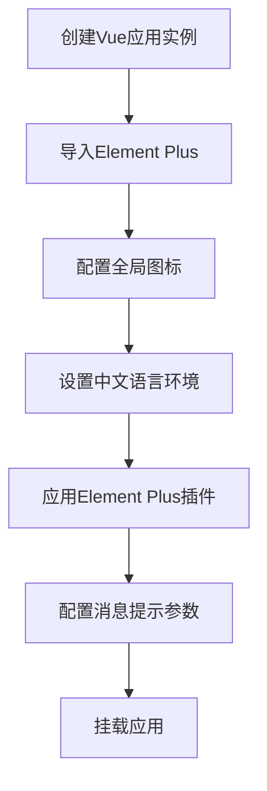

**Diagram sources**
- [main.ts](file://frontend/src/main.ts#L1-L45)

**Section sources**
- [main.ts](file://frontend/src/main.ts#L1-L45)

### 按需引入与全局组件注册
项目采用了按需引入的方式，通过`components/index.ts`文件集中管理全局组件的注册。这种方式既保证了组件的全局可用性，又避免了不必要的资源加载。

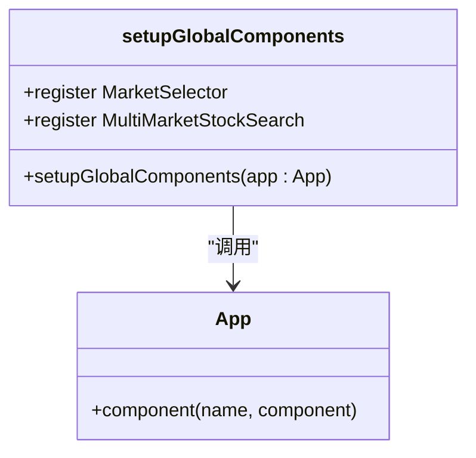

**Diagram sources**
- [index.ts](file://frontend/src/components/index.ts#L1-L13)

**Section sources**
- [index.ts](file://frontend/src/components/index.ts#L1-L13)

### 主题与国际化配置
项目支持暗色主题和中文国际化，通过`main.ts`中的配置实现了Element Plus组件的全局主题设置和语言环境配置。

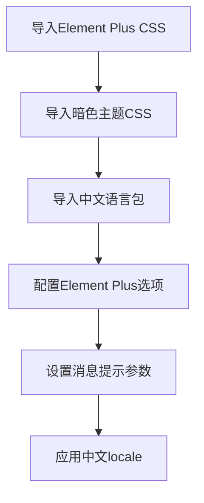

**Diagram sources**
- [main.ts](file://frontend/src/main.ts#L5-L39)

**Section sources**
- [main.ts](file://frontend/src/main.ts#L5-L39)

## 核心UI组件

### MultiSourceSyncCard组件
`MultiSourceSyncCard`组件是系统仪表盘的核心组件，用于展示多数据源同步的状态和控制功能。

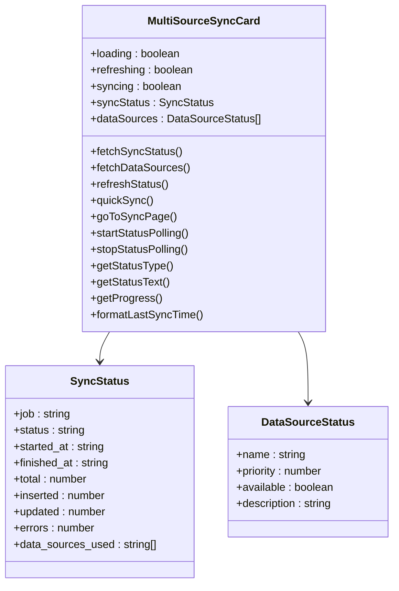

**Diagram sources**
- [MultiSourceSyncCard.vue](file://frontend/src/components/Dashboard/MultiSourceSyncCard.vue#L118-L302)

**Section sources**
- [MultiSourceSyncCard.vue](file://frontend/src/components/Dashboard/MultiSourceSyncCard.vue#L1-L439)

### TaskResultDialog组件
`TaskResultDialog`组件用于展示任务执行结果，支持Markdown格式的内容渲染。

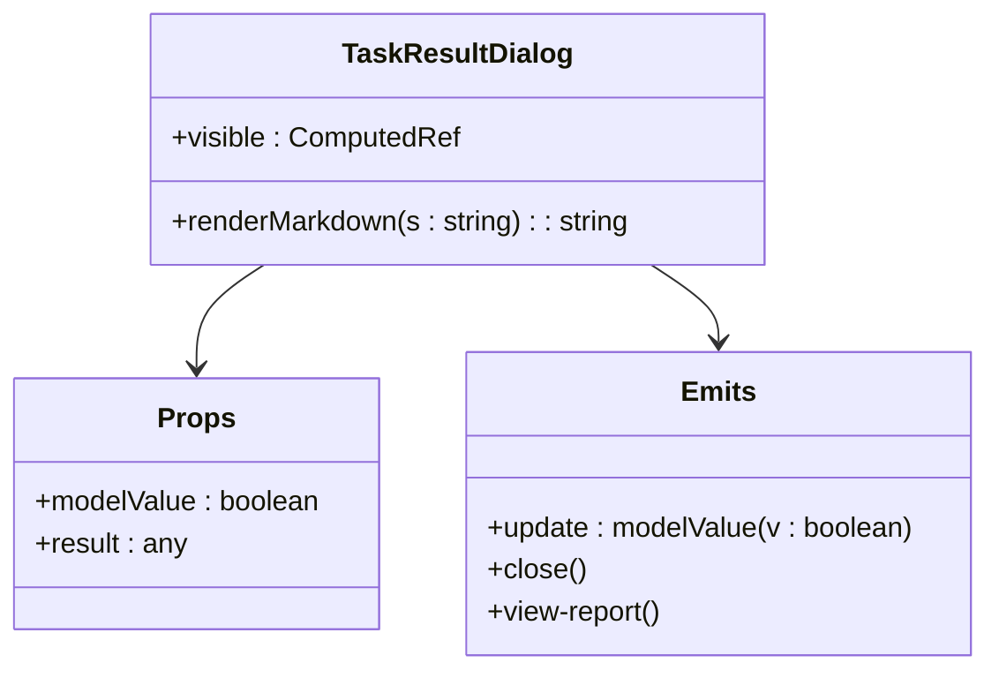

**Diagram sources**
- [TaskResultDialog.vue](file://frontend/src/components/Global/TaskResultDialog.vue#L16-L30)

**Section sources**
- [TaskResultDialog.vue](file://frontend/src/components/Global/TaskResultDialog.vue#L1-L32)

### TaskReportDialog组件
`TaskReportDialog`组件用于展示详细的报告内容，支持多标签页的报告展示。

```mermaid
classDiagram
class TaskReportDialog {
+visible : ComputedRef
+active : Ref
+renderMarkdown(s : string) : string
}
class Props {
+modelValue : boolean
+sections : Array<{ key? : string; title : string; content : any }>
}
class Emits {
+update : modelValue(v : boolean)
+close()
}
TaskReportDialog --> Props
TaskReportDialog --> Emits
```

**Diagram sources**
- [TaskReportDialog.vue](file://frontend/src/components/Global/TaskReportDialog.vue#L19-L28)

**Section sources**
- [TaskReportDialog.vue](file://frontend/src/components/Global/TaskReportDialog.vue#L1-L30)

## 组件通信与状态管理

### Pinia状态管理
项目使用Pinia作为状态管理方案，通过`app.ts`和`auth.ts`两个store文件管理应用状态和认证状态。

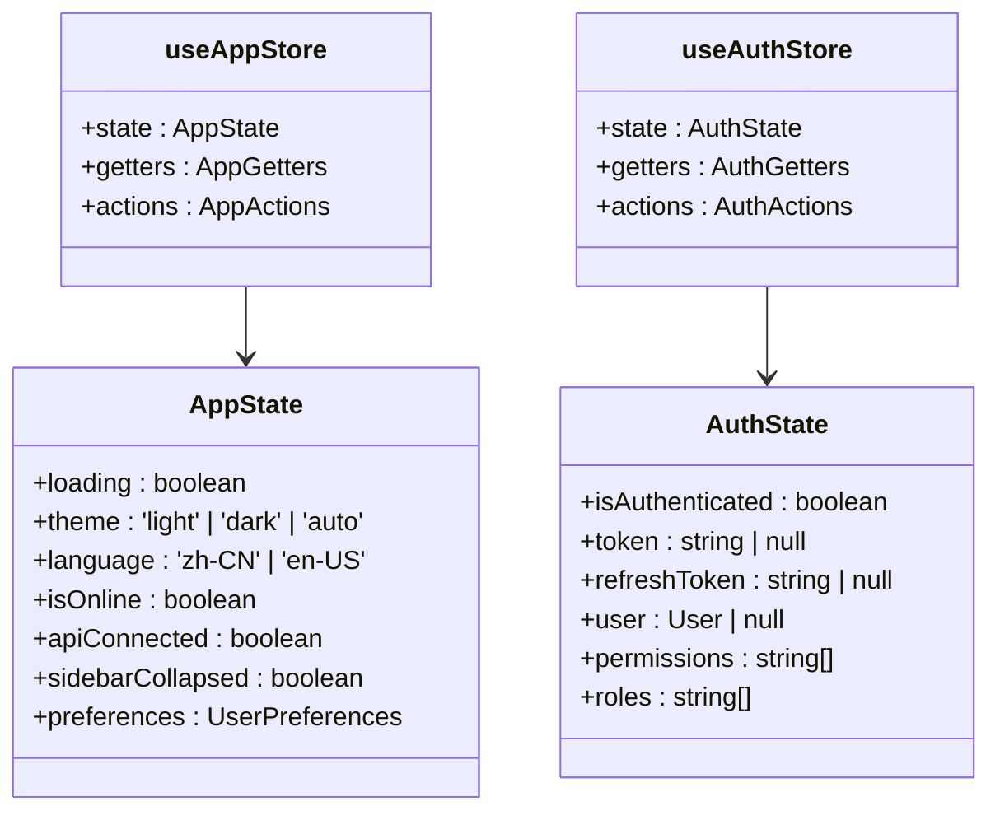

**Diagram sources**
- [app.ts](file://frontend/src/stores/app.ts#L1-L272)
- [auth.ts](file://frontend/src/stores/auth.ts#L1-L477)

**Section sources**
- [app.ts](file://frontend/src/stores/app.ts#L1-L272)
- [auth.ts](file://frontend/src/stores/auth.ts#L1-L477)

### 组件通信机制
组件间通过props和emits进行通信，实现了父子组件之间的数据传递和事件触发。

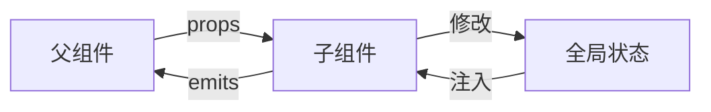

**Diagram sources**
- [TaskResultDialog.vue](file://frontend/src/components/Global/TaskResultDialog.vue#L20-L26)
- [TaskReportDialog.vue](file://frontend/src/components/Global/TaskReportDialog.vue#L22-L24)

**Section sources**
- [TaskResultDialog.vue](file://frontend/src/components/Global/TaskResultDialog.vue#L1-L32)
- [TaskReportDialog.vue](file://frontend/src/components/Global/TaskReportDialog.vue#L1-L30)

## API服务集成

### 请求封装与拦截器
项目通过`request.ts`文件封装了API请求，实现了请求拦截、响应处理和错误管理。

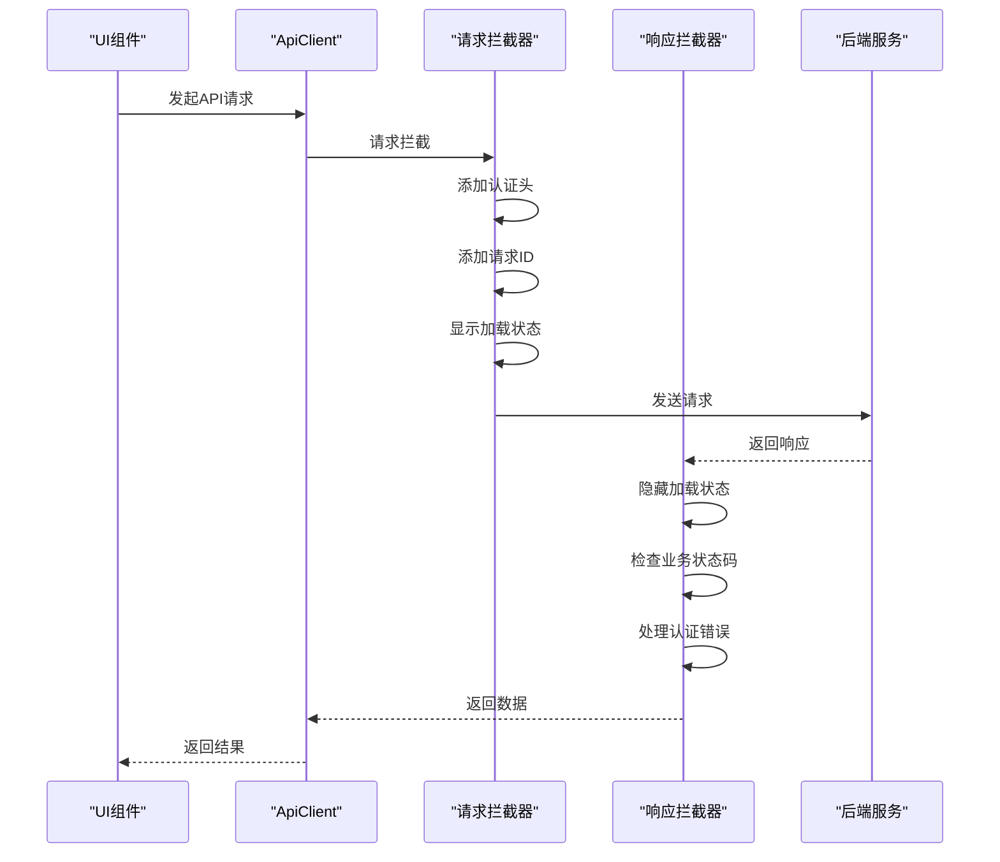

**Diagram sources**
- [request.ts](file://frontend/src/api/request.ts#L96-L363)

**Section sources**
- [request.ts](file://frontend/src/api/request.ts#L1-L593)

### API响应处理
项目定义了统一的API响应格式，并通过`ApiClient`类提供了常用的HTTP方法封装。

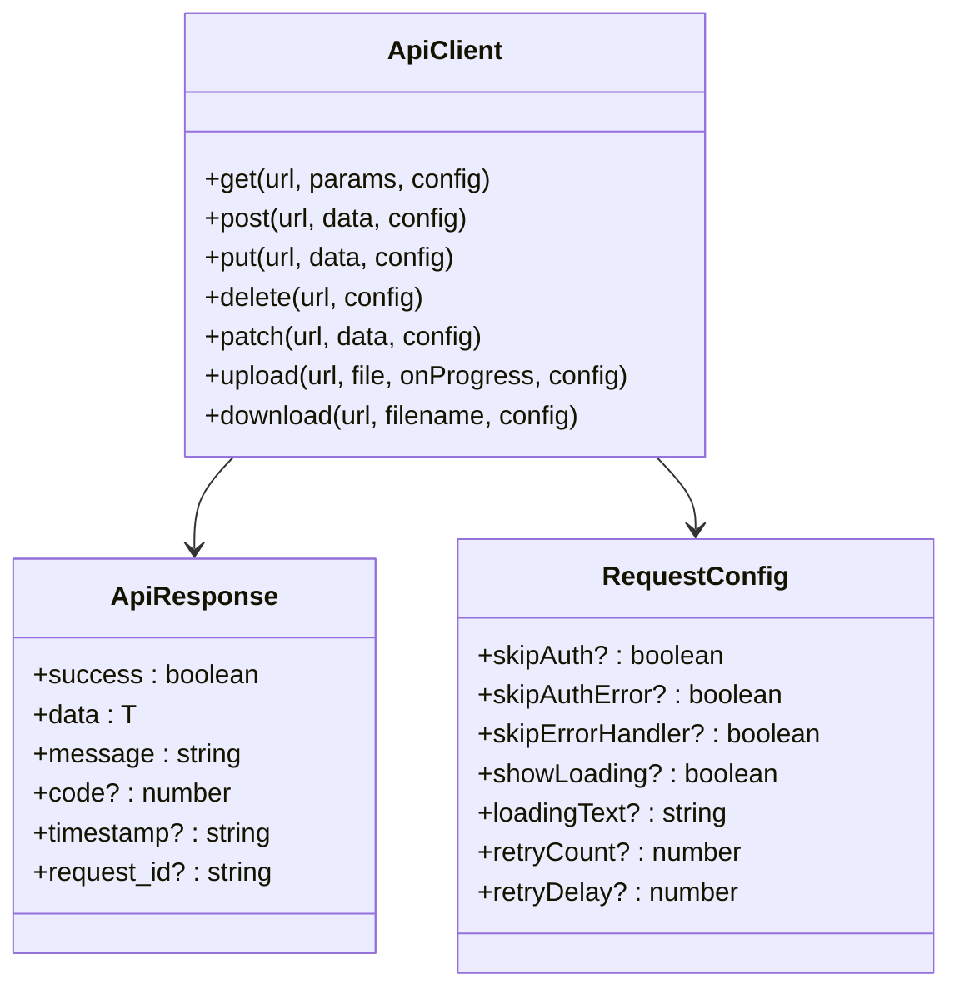

**Diagram sources**
- [request.ts](file://frontend/src/api/request.ts#L8-L593)

**Section sources**
- [request.ts](file://frontend/src/api/request.ts#L1-L593)

### 同步API集成
`sync.ts`文件定义了多数据源同步相关的API接口，为`MultiSourceSyncCard`组件提供了数据支持。

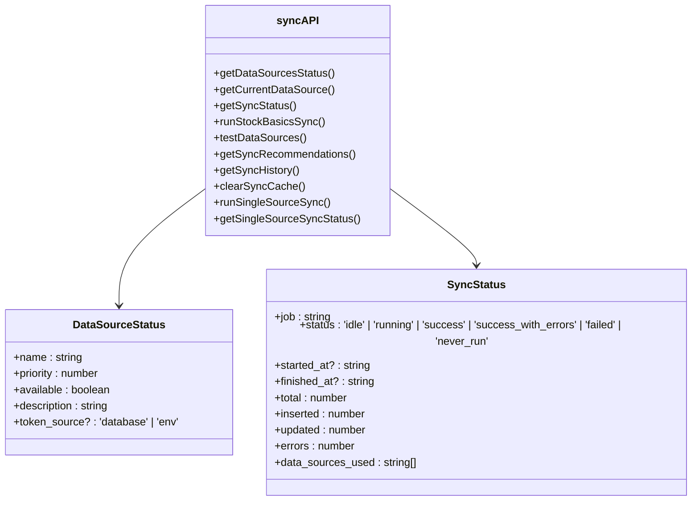

**Diagram sources**
- [sync.ts](file://frontend/src/api/sync.ts#L1-L186)

**Section sources**
- [sync.ts](file://frontend/src/api/sync.ts#L1-L186)

## 扩展与主题定制

### 主题定制方案
项目通过`dark-theme.scss`文件实现了暗色主题的深度定制，优化了Element Plus组件在暗色模式下的视觉效果。

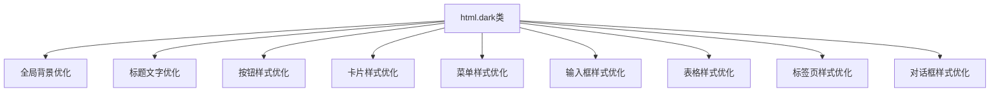

**Diagram sources**
- [dark-theme.scss](file://frontend/src/styles/dark-theme.scss#L1-L556)

**Section sources**
- [dark-theme.scss](file://frontend/src/styles/dark-theme.scss#L1-L556)

### 最佳实践
1. **组件复用**：将常用UI元素封装为全局组件，通过`setupGlobalComponents`统一注册
2. **状态管理**：使用Pinia管理应用状态，避免组件间直接传递复杂数据
3. **API封装**：通过`ApiClient`类封装HTTP请求，统一处理错误和加载状态
4. **主题支持**：实现暗色主题支持，提升用户体验
5. **国际化**：支持中文语言环境，满足本地化需求