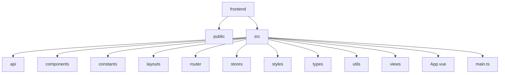
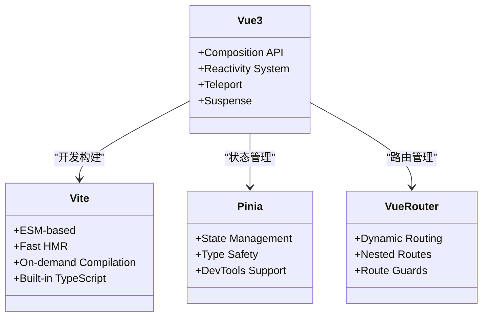
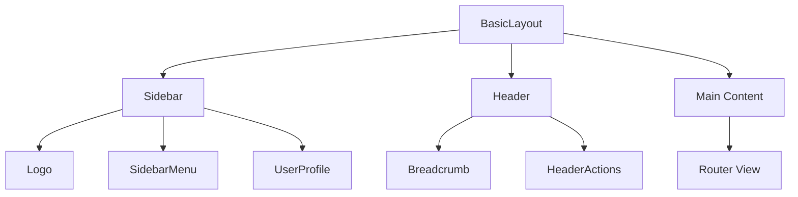
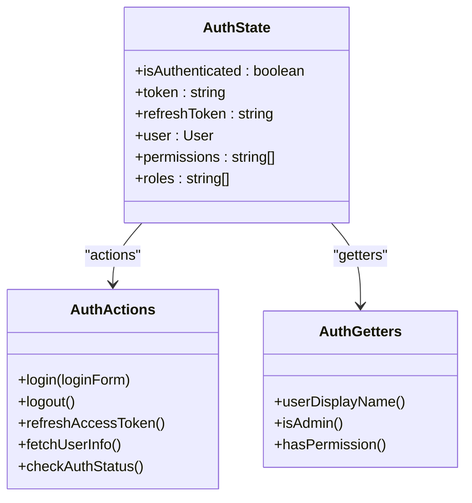
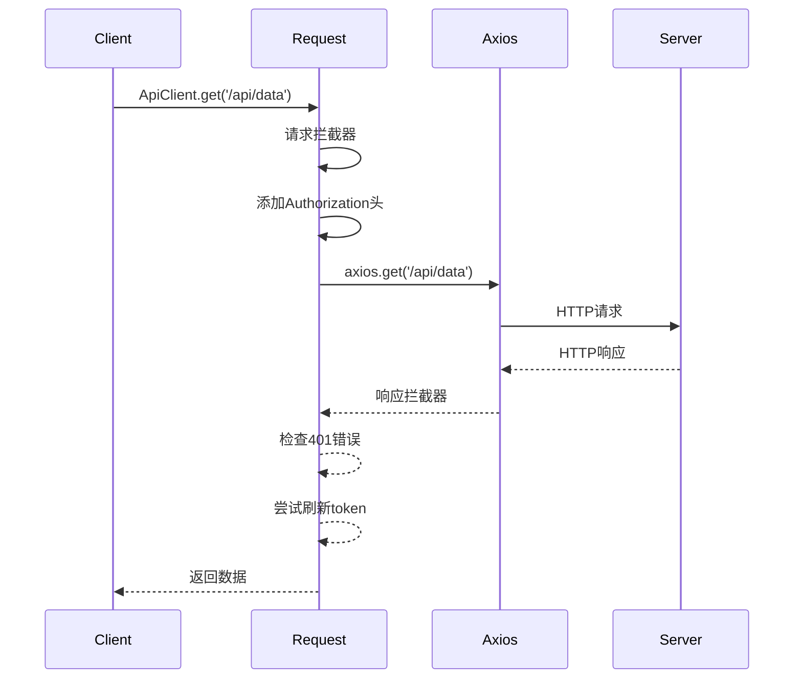
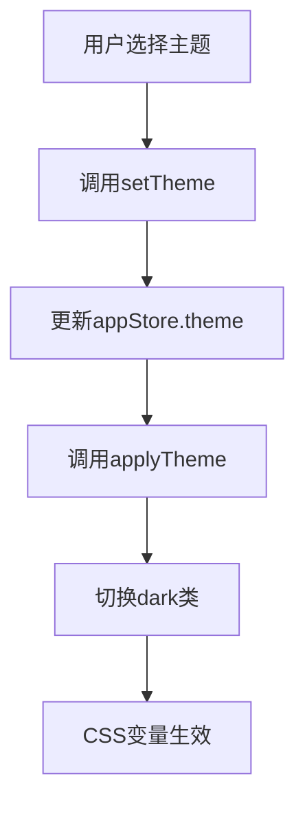

# 前端架构

<cite>
**本文档引用的文件**
- [package.json](file://frontend/package.json)
- [vite.config.ts](file://frontend/vite.config.ts)
- [main.ts](file://frontend/src/main.ts)
- [index.html](file://frontend/index.html)
- [index.ts](file://frontend/src/router/index.ts)
- [auth.ts](file://frontend/src/stores/auth.ts)
- [app.ts](file://frontend/src/stores/app.ts)
- [request.ts](file://frontend/src/api/request.ts)
- [index.ts](file://frontend/src/components/index.ts)
- [BasicLayout.vue](file://frontend/src/layouts/BasicLayout.vue)
- [index.vue](file://frontend/src/views/Dashboard/index.vue)
- [Login.vue](file://frontend/src/views/Auth/Login.vue)
- [index.scss](file://frontend/src/styles/index.scss)
- [auth.ts](file://frontend/src/utils/auth.ts)
</cite>

## 目录
1. [项目结构](#项目结构)
2. [技术栈选择](#技术栈选择)
3. [组件化设计](#组件化设计)
4. [状态管理机制](#状态管理机制)
5. [API客户端实现](#api客户端实现)
6. [UI库集成与主题定制](#ui库集成与主题定制)
7. [前端性能优化策略](#前端性能优化策略)
8. [前端开发工作流](#前端开发工作流)

## 项目结构

sagacity平台的前端项目采用基于Vue 3和Vite的现代化架构，项目结构清晰，模块化程度高。`frontend`目录是前端代码的根目录，包含`public`、`src`等核心子目录。

`src`目录是前端源码的核心，其下包含`api`、`components`、`constants`、`layouts`、`router`、`stores`、`styles`、`types`、`utils`和`views`等子目录，分别负责API接口、组件、常量、布局、路由、状态管理、样式、类型定义、工具函数和视图的组织。

**Diagram sources**
- [main.ts](file://frontend/src/main.ts)

**Section sources**
- [main.ts](file://frontend/src/main.ts)

## 技术栈选择

sagacity平台的前端技术栈基于Vue 3和Vite构建，选择这些技术是出于对现代Web开发最佳实践的考量。

Vue 3作为核心框架，提供了Composition API、更好的TypeScript支持和更小的包体积，使得代码组织更加灵活，类型安全更强。Vite作为构建工具，利用现代浏览器的原生ES模块支持，提供了闪电般的开发服务器启动速度和热更新，极大地提升了开发体验。

从`package.json`文件中可以看到，项目依赖了`vue@^3.4.0`、`vite@^5.0.10`、`vue-router@^4.2.5`和`pinia@^2.1.7`等关键包，构建了一个现代化的前端开发环境。

**Diagram sources**
- [package.json](file://frontend/package.json)

**Section sources**
- [package.json](file://frontend/package.json)

## 组件化设计

sagacity平台的前端采用组件化设计，将UI拆分为可复用的独立组件，提高了代码的可维护性和开发效率。

### 布局组件

布局组件定义了应用的整体结构。`BasicLayout.vue`是核心布局组件，它包含了侧边栏（Sidebar）、顶部导航栏（Header）和主内容区（Main Content）。侧边栏通过`SidebarMenu`组件实现导航菜单，顶部导航栏包含面包屑（Breadcrumb）和用户操作（HeaderActions）。

**Diagram sources**
- [BasicLayout.vue](file://frontend/src/layouts/BasicLayout.vue)

### 表单组件

表单组件用于用户输入和数据提交。`Login.vue`是一个典型的表单组件，它使用Element Plus的`el-form`和`el-input`组件构建了登录表单，包含用户名、密码输入框和登录按钮，并实现了表单验证功能。

### 数据展示组件

数据展示组件用于呈现从后端获取的数据。`index.vue`中的仪表板页面展示了多个数据展示组件，如`recent-analyses-card`（最近分析）、`favorites-card`（我的自选股）和`market-news-card`（市场快讯），这些组件使用`el-table`、`el-card`等Element Plus组件来展示表格和卡片信息。

**Section sources**
- [BasicLayout.vue](file://frontend/src/layouts/BasicLayout.vue)
- [Login.vue](file://frontend/src/views/Auth/Login.vue)
- [index.vue](file://frontend/src/views/Dashboard/index.vue)

## 状态管理机制

sagacity平台使用Pinia作为状态管理库，替代了传统的Vuex，提供了更简洁的API和更好的TypeScript支持。

### AuthStore

`auth.ts`文件定义了`useAuthStore`，用于管理用户的认证状态。它包含了`isAuthenticated`、`token`、`user`等状态，以及`login`、`logout`、`refreshAccessToken`等操作。该store还实现了自动刷新token的机制，通过`setupTokenRefreshTimer`函数设置定时器，定期检查token是否即将过期并自动刷新。

**Diagram sources**
- [auth.ts](file://frontend/src/stores/auth.ts)

### AppStore

`app.ts`文件定义了`useAppStore`，用于管理应用的全局状态。它包含了`theme`、`language`、`sidebarCollapsed`等UI状态，以及`loading`、`isOnline`等应用状态。该store还负责同步用户偏好设置到本地存储，实现个性化配置。

**Section sources**
- [auth.ts](file://frontend/src/stores/auth.ts)
- [app.ts](file://frontend/src/stores/app.ts)

## API客户端实现

sagacity平台的API客户端实现封装在`src/api`目录下，提供了一套统一的HTTP请求接口。

### 请求封装

`request.ts`文件是API客户端的核心，它基于axios创建了一个自定义实例，并配置了请求拦截器和响应拦截器。请求拦截器负责添加认证头（Authorization）和请求ID，响应拦截器则统一处理HTTP状态码和业务错误码。

**Diagram sources**
- [request.ts](file://frontend/src/api/request.ts)

### 错误处理

API客户端实现了完善的错误处理机制。对于401未授权错误，它会尝试使用refresh token自动刷新access token，刷新成功后重试原请求。对于其他网络错误，如超时或连接失败，它会进行重试，最多重试2次。

### 模块化API

`src/api`目录下的`auth.ts`、`analysis.ts`等文件将API按功能模块化，每个文件导出一个API对象，如`authApi`，其中包含该模块的所有请求方法。这种设计使得API调用更加清晰和易于维护。

**Section sources**
- [request.ts](file://frontend/src/api/request.ts)

## UI库集成与主题定制

sagacity平台集成了Element Plus作为UI库，并实现了主题定制功能。

### Element Plus集成

在`main.ts`中，通过`app.use(ElementPlus)`全局注册了Element Plus组件库，并配置了中文locale和消息提示的默认设置。同时，通过`unplugin-auto-import`和`unplugin-vue-components`插件实现了Element Plus组件的自动导入，无需手动import即可在模板中使用。

### 主题定制

项目通过`src/styles/variables.scss`文件定义了自定义的SCSS变量，并在`vite.config.ts`中通过`additionalData`选项将其注入到所有SCSS文件中。此外，`app.ts`中的`applyTheme`方法可以动态切换浅色、深色和自动主题，并通过`document.documentElement.classList.toggle('dark', isDark)`来应用CSS类。

**Diagram sources**
- [main.ts](file://frontend/src/main.ts)
- [vite.config.ts](file://frontend/vite.config.ts)
- [app.ts](file://frontend/src/stores/app.ts)

**Section sources**
- [main.ts](file://frontend/src/main.ts)
- [vite.config.ts](file://frontend/vite.config.ts)
- [app.ts](file://frontend/src/stores/app.ts)

## 前端性能优化策略

sagacity平台实施了多种前端性能优化策略，以提升用户体验。

### 代码分割与懒加载

通过Vue Router的动态导入语法`() => import('@/views/Dashboard/index.vue')`，实现了路由级别的代码分割，只有当用户访问某个路由时，对应的组件代码才会被加载，减少了初始包体积。

### 缓存机制

项目使用`localStorage`进行数据缓存，如认证信息（token）、用户信息和应用偏好设置。`useStorage`函数（来自`@vueuse/core`）被用于创建响应式的存储引用，确保数据在页面刷新后依然存在。

### 资源优化

`vite.config.ts`中配置了Rollup的`chunkFileNames`和`entryFileNames`，为生成的JS和CSS文件添加了内容哈希，实现了长期缓存。同时，`build.sourcemap`设置为`false`，避免在生产环境中暴露源码。

**Section sources**
- [vite.config.ts](file://frontend/vite.config.ts)

## 前端开发工作流

sagacity平台的前端开发工作流基于Vite，提供了高效的开发体验。

### 本地开发

通过`npm run dev`命令启动开发服务器，Vite会监听文件变化并提供热更新。`vite.config.ts`中配置了代理，将`/api`前缀的请求代理到`http://localhost:8000`，解决了开发环境下的跨域问题。

### 调试

项目集成了Element Plus的调试工具和Vue DevTools，方便开发者调试组件状态和路由。`main.ts`中的`initApp`函数包含了详细的日志输出，帮助开发者了解应用的初始化流程。

### 构建发布

通过`npm run build`命令构建生产版本，Vite会将代码打包到`dist`目录。`package.json`中的`build`脚本先运行`vue-tsc`进行类型检查，再执行`vite build`，确保了代码质量和构建的可靠性。

**Section sources**
- [vite.config.ts](file://frontend/vite.config.ts)
- [package.json](file://frontend/package.json)
- [main.ts](file://frontend/src/main.ts)