# 状态管理

<cite>
**本文档引用的文件**   
- [app.ts](file://frontend/src/stores/app.ts)
- [auth.ts](file://frontend/src/stores/auth.ts)
- [notifications.ts](file://frontend/src/stores/notifications.ts)
- [main.ts](file://frontend/src/main.ts)
- [auth.ts](file://frontend/src/api/auth.ts)
- [notifications.ts](file://frontend/src/api/notifications.ts)
- [HeaderActions.vue](file://frontend/src/components/Layout/HeaderActions.vue)
- [UserProfile.vue](file://frontend/src/components/Layout/UserProfile.vue)
- [BasicLayout.vue](file://frontend/src/layouts/BasicLayout.vue)
- [index.vue](file://frontend/src/views/Dashboard/index.vue)
</cite>

## 目录
1. [简介](#简介)
2. [状态管理方案](#状态管理方案)
3. [核心状态模块](#核心状态模块)
4. [状态持久化策略](#状态持久化策略)
5. [响应式机制与性能优化](#响应式机制与性能优化)
6. [最佳实践](#最佳实践)

## 简介
sagacity平台采用Pinia作为前端状态管理方案，实现了应用状态的集中管理和响应式更新。本文档深入解析基于Pinia的状态管理机制，涵盖app、auth、notifications等store模块的设计与实现，详细说明各state、getter、action的职责和使用方式。

**Section sources**
- [app.ts](file://frontend/src/stores/app.ts#L1-L272)
- [auth.ts](file://frontend/src/stores/auth.ts#L1-L477)
- [notifications.ts](file://frontend/src/stores/notifications.ts#L1-L233)

## 状态管理方案
sagacity平台使用Pinia作为状态管理库，通过定义多个store模块来管理不同类型的应用状态。在main.ts中初始化Pinia实例并将其挂载到Vue应用中，实现了状态管理的全局配置。

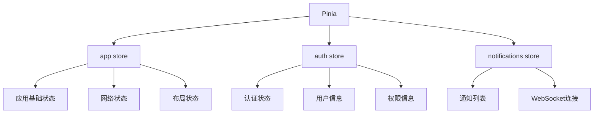

**Diagram sources **
- [main.ts](file://frontend/src/main.ts#L30-L31)
- [app.ts](file://frontend/src/stores/app.ts#L39-L271)
- [auth.ts](file://frontend/src/stores/auth.ts#L26-L476)
- [notifications.ts](file://frontend/src/stores/notifications.ts#L6-L232)

## 核心状态模块

### app store
app store管理应用的基础状态、网络状态、布局状态和用户偏好等。通过useStorage实现状态的本地持久化，确保用户设置在页面刷新后仍然保留。

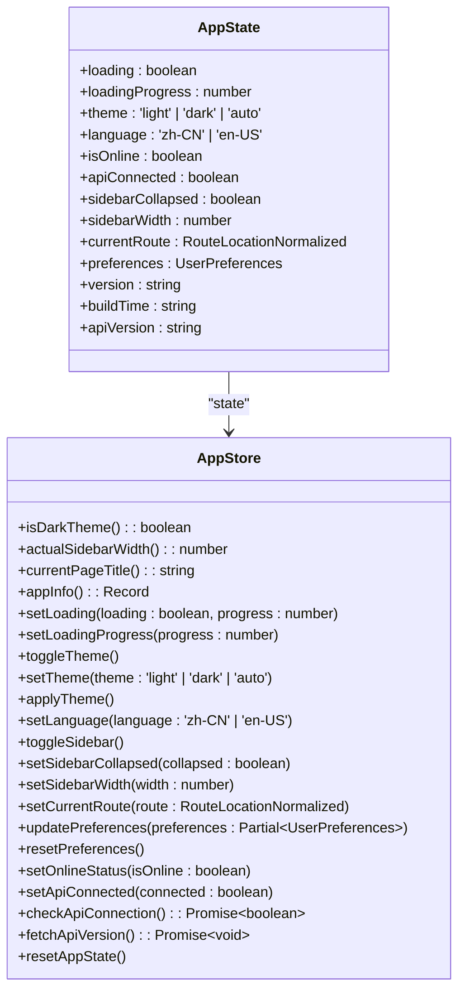

**Diagram sources **
- [app.ts](file://frontend/src/stores/app.ts#L5-L72)
- [app.ts](file://frontend/src/stores/app.ts#L74-L271)

**Section sources**
- [app.ts](file://frontend/src/stores/app.ts#L1-L272)

### auth store
auth store管理用户的认证状态、用户信息、权限信息和登录状态。通过localStorage实现token和用户信息的持久化存储，并提供自动刷新token的机制。

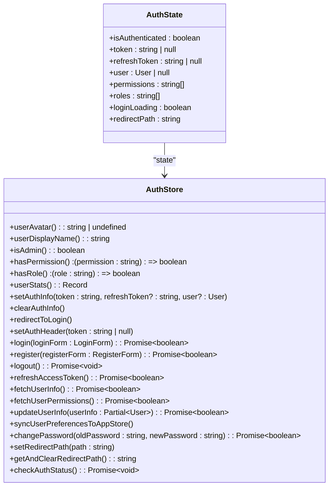

**Diagram sources **
- [auth.ts](file://frontend/src/stores/auth.ts#L6-L66)
- [auth.ts](file://frontend/src/stores/auth.ts#L69-L476)

**Section sources**
- [auth.ts](file://frontend/src/stores/auth.ts#L1-L477)

### notifications store
notifications store管理通知列表、未读数量、加载状态和WebSocket连接状态。通过WebSocket实现实时通知推送，并提供自动重连机制。

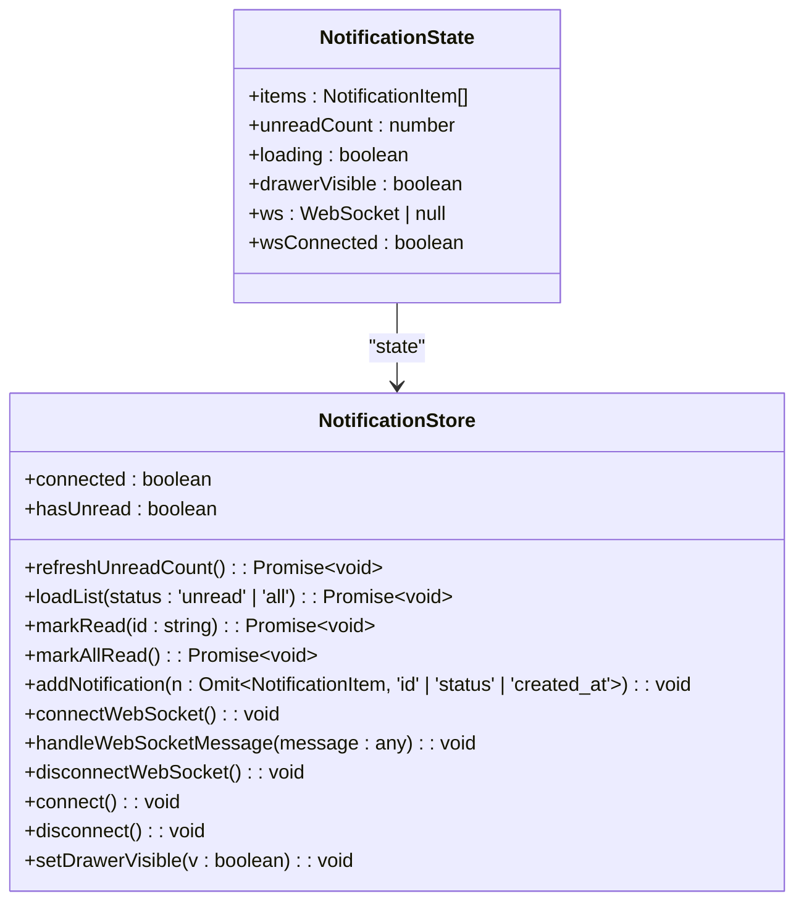

**Diagram sources **
- [notifications.ts](file://frontend/src/stores/notifications.ts#L7-L11)
- [notifications.ts](file://frontend/src/stores/notifications.ts#L20-L231)

**Section sources**
- [notifications.ts](file://frontend/src/stores/notifications.ts#L1-L233)

## 状态持久化策略
sagacity平台采用多种策略实现状态持久化，确保用户设置和认证信息在页面刷新后仍然有效。

### 本地存储
通过@vueuse/core的useStorage函数实现状态的本地持久化，将关键状态存储在localStorage中。

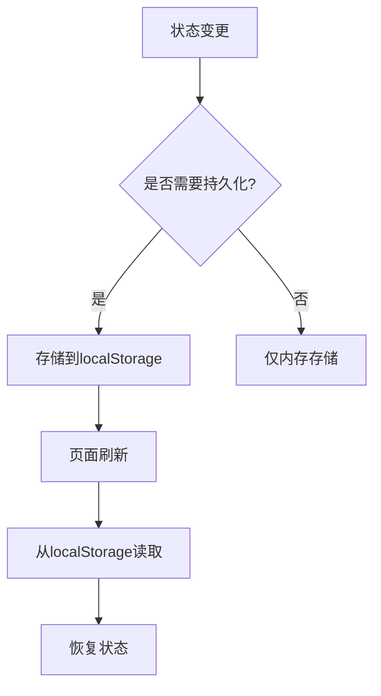

**Diagram sources **
- [app.ts](file://frontend/src/stores/app.ts#L43-L45)
- [app.ts](file://frontend/src/stores/app.ts#L50-L51)
- [app.ts](file://frontend/src/stores/app.ts#L55-L56)
- [auth.ts](file://frontend/src/stores/auth.ts#L28-L30)

### 认证信息持久化
认证信息通过localStorage进行持久化存储，包括token、refreshToken和用户信息。

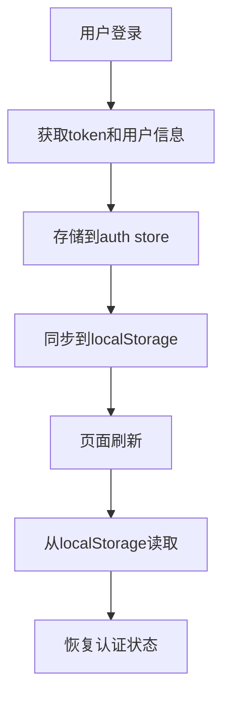

**Diagram sources **
- [auth.ts](file://frontend/src/stores/auth.ts#L126-L132)
- [auth.ts](file://frontend/src/stores/auth.ts#L158-L160)

## 响应式机制与性能优化
sagacity平台通过Pinia的响应式机制实现状态的自动更新，并采用多种策略优化性能。

### 响应式更新
通过Pinia的state、getters和actions实现状态的响应式更新，确保视图与状态保持同步。

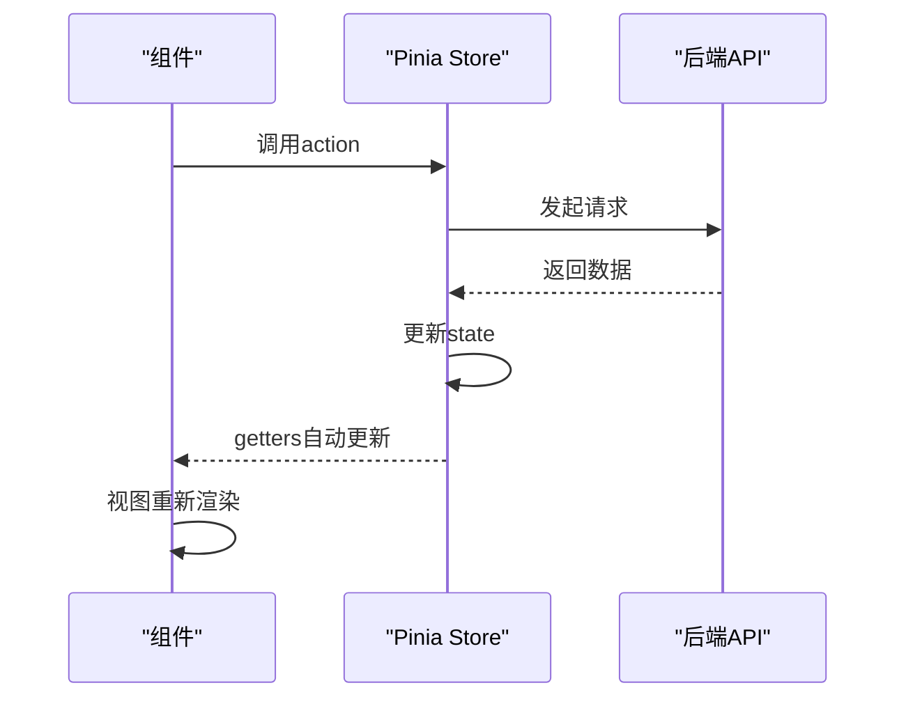

**Diagram sources **
- [app.ts](file://frontend/src/stores/app.ts#L105-L271)
- [auth.ts](file://frontend/src/stores/auth.ts#L111-L476)
- [notifications.ts](file://frontend/src/stores/notifications.ts#L33-L57)

### 性能优化
通过多种策略优化状态管理的性能，包括状态分片、懒加载和缓存机制。

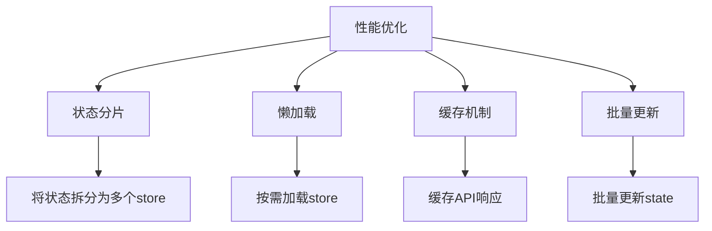

**Diagram sources **
- [app.ts](file://frontend/src/stores/app.ts#L39-L271)
- [auth.ts](file://frontend/src/stores/auth.ts#L26-L476)
- [notifications.ts](file://frontend/src/stores/notifications.ts#L6-L232)

## 最佳实践

### 模块划分
遵循单一职责原则，将状态按功能模块划分，每个store负责特定领域的状态管理。

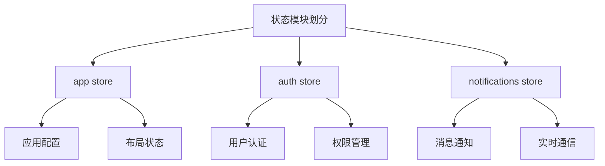

**Diagram sources **
- [app.ts](file://frontend/src/stores/app.ts#L1-L272)
- [auth.ts](file://frontend/src/stores/auth.ts#L1-L477)
- [notifications.ts](file://frontend/src/stores/notifications.ts#L1-L233)

### 类型定义
使用TypeScript定义清晰的状态类型，提高代码的可维护性和类型安全性。

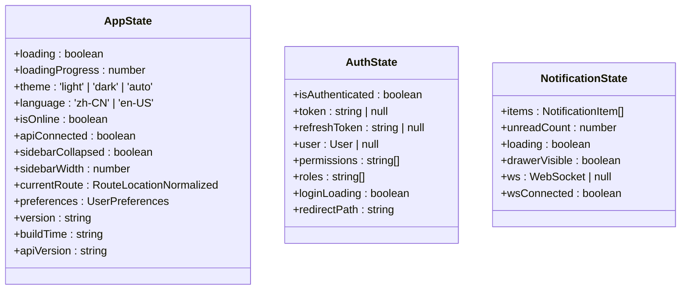

**Diagram sources **
- [app.ts](file://frontend/src/stores/app.ts#L5-L37)
- [auth.ts](file://frontend/src/stores/auth.ts#L6-L24)
- [notifications.ts](file://frontend/src/stores/notifications.ts#L7-L11)

### 错误处理
在状态管理中实现完善的错误处理机制，确保应用的稳定性和用户体验。

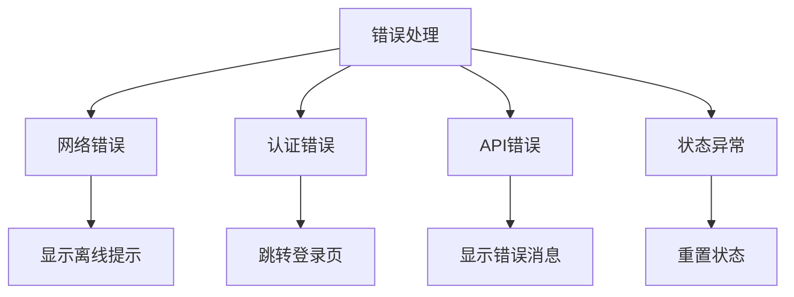

**Diagram sources **
- [auth.ts](file://frontend/src/stores/auth.ts#L218-L224)
- [auth.ts](file://frontend/src/stores/auth.ts#L297-L311)
- [app.ts](file://frontend/src/stores/app.ts#L222-L230)
- [notifications.ts](file://frontend/src/stores/notifications.ts#L141-L144)

**Section sources**
- [app.ts](file://frontend/src/stores/app.ts#L1-L272)
- [auth.ts](file://frontend/src/stores/auth.ts#L1-L477)
- [notifications.ts](file://frontend/src/stores/notifications.ts#L1-L233)