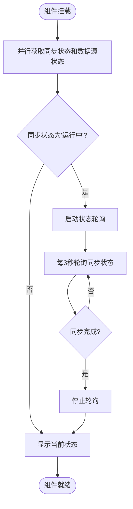
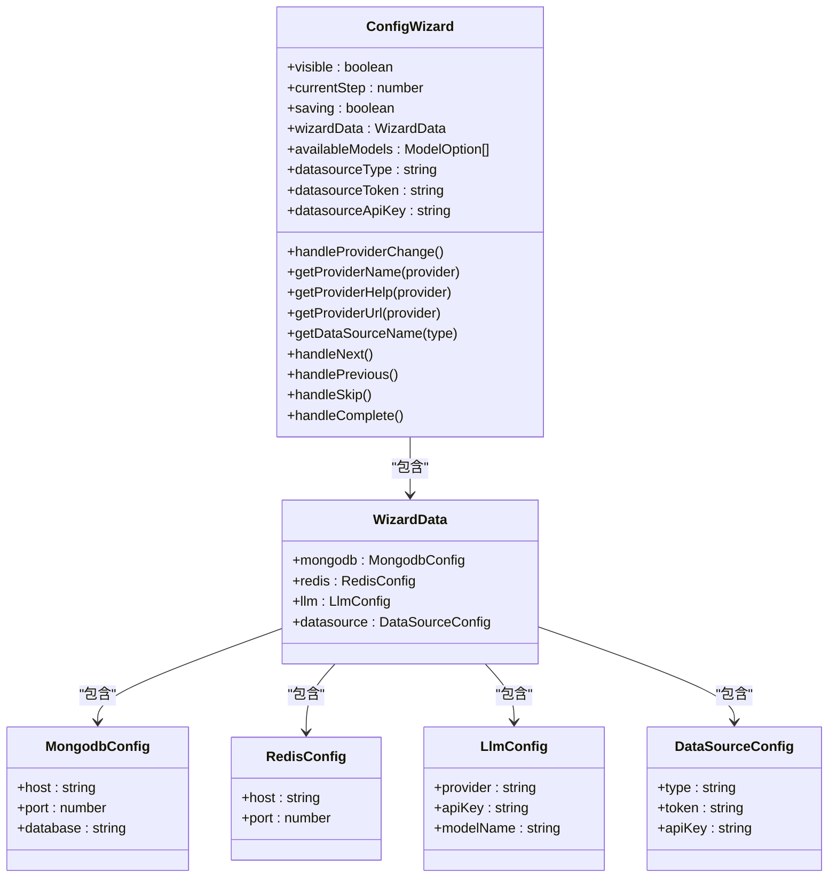
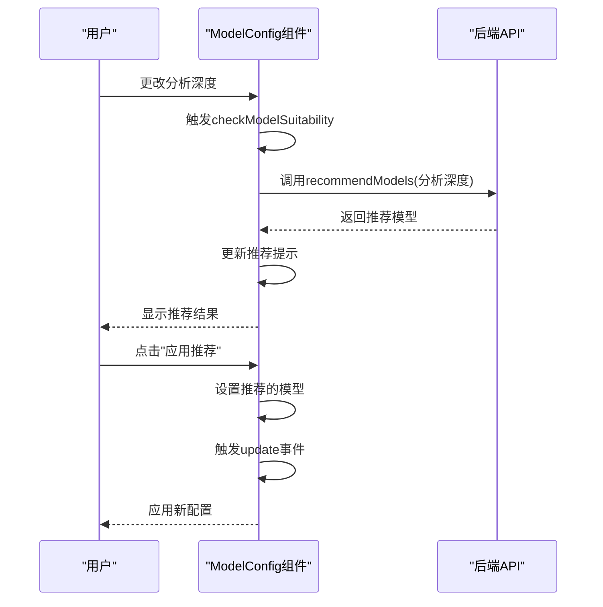
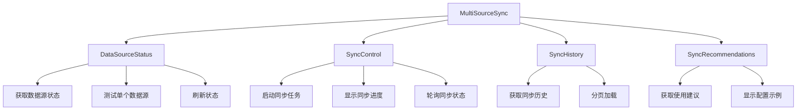
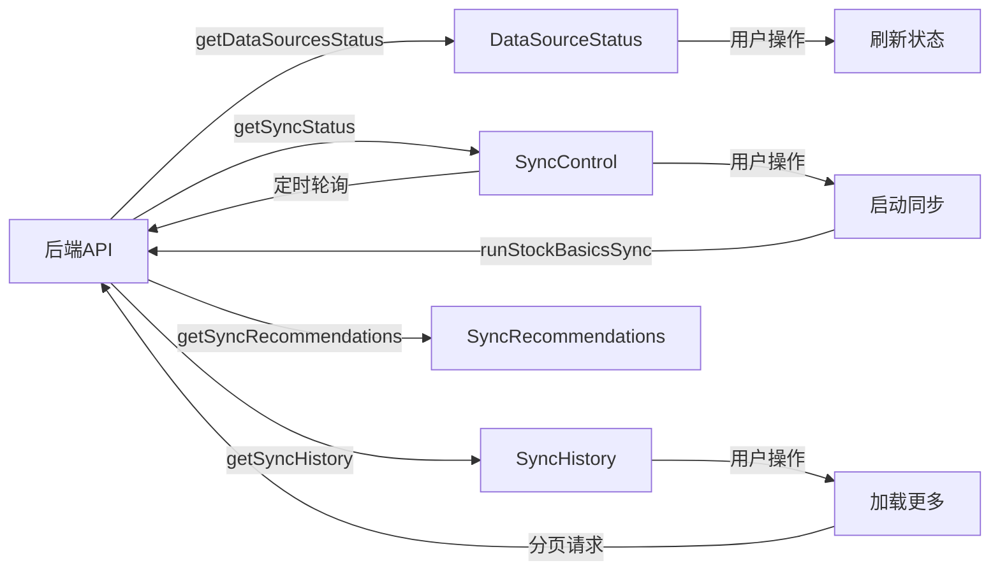

# 业务组件

<cite>
**本文档引用的文件**  
- [MultiSourceSyncCard.vue](file://frontend/src/components/Dashboard/MultiSourceSyncCard.vue)
- [ConfigWizard.vue](file://frontend/src/components/ConfigWizard.vue)
- [ModelConfig.vue](file://frontend/src/components/ModelConfig.vue)
- [DataSourceStatus.vue](file://frontend/src/components/Sync/DataSourceStatus.vue)
- [SyncControl.vue](file://frontend/src/components/Sync/SyncControl.vue)
- [SyncHistory.vue](file://frontend/src/components/Sync/SyncHistory.vue)
- [SyncRecommendations.vue](file://frontend/src/components/Sync/SyncRecommendations.vue)
- [sync.ts](file://frontend/src/api/sync.ts)
- [MultiSourceSync.vue](file://frontend/src/views/System/MultiSourceSync.vue)
</cite>

## 目录
1. [引言](#引言)
2. [核心业务组件分析](#核心业务组件分析)
   1. [MultiSourceSyncCard 组件](#multisourcesynccard-组件)
   2. [ConfigWizard 组件](#configwizard-组件)
   3. [ModelConfig 组件](#modelconfig-组件)
3. [数据同步管理组件协作](#数据同步管理组件协作)
   1. [组件协作关系](#组件协作关系)
   2. [数据流分析](#数据流分析)
   3. [用户交互设计](#用户交互设计)
4. [实际使用场景与集成示例](#实际使用场景与集成示例)
5. [结论](#结论)

## 引言

本文档详细解析了 TradingAgents-CN 项目中的核心业务功能组件，重点分析了 `MultiSourceSyncCard`、`ConfigWizard` 和 `ModelConfig` 三个关键组件的实现机制。同时，深入探讨了 Sync 目录下各组件（`DataSourceStatus`、`SyncControl`、`SyncHistory`、`SyncRecommendations`）在数据同步管理中的协作关系。通过分析这些组件的业务逻辑、数据流和用户交互设计，为开发者和用户提供全面的理解和使用指导。

## 核心业务组件分析

### MultiSourceSyncCard 组件

`MultiSourceSyncCard` 组件是系统仪表板上的核心组件，用于展示多数据源同步状态并提供快速操作入口。该组件通过集成多个后端 API 接口，实现了对系统同步状态的实时监控和管理。

组件主要功能包括：
- **同步状态展示**：显示当前同步任务的状态（空闲、运行中、成功、失败等），并提供进度条可视化同步进度
- **数据源状态概览**：展示主要数据源的可用性和优先级信息，帮助用户快速了解数据源健康状况
- **快速同步操作**：提供一键快速同步功能，简化用户操作流程
- **状态轮询机制**：当同步任务运行时，自动启动状态轮询，实时更新进度信息

组件通过 `getSyncStatus` 和 `getDataSourcesStatus` API 接口获取同步状态和数据源状态，并在组件挂载时并行加载这些数据。当检测到同步任务正在运行时，会自动启动定时轮询，直到任务完成。



**组件源码**
- [MultiSourceSyncCard.vue](file://frontend/src/components/Dashboard/MultiSourceSyncCard.vue#L1-L439)

### ConfigWizard 组件

`ConfigWizard` 组件是一个引导式配置向导，帮助用户逐步完成系统的基本配置。该组件采用多步骤表单设计，确保用户能够系统性地完成所有必要的配置。

配置向导包含以下四个步骤：
1. **欢迎页面**：介绍配置向导的目的和流程
2. **数据库配置**：设置 MongoDB 和 Redis 数据库连接参数
3. **大模型配置**：选择并配置 AI 大模型提供商（如 DeepSeek、通义千问、OpenAI、Google Gemini）
4. **数据源配置**：选择股票数据源（如 AKShare、Tushare、FinnHub）

组件通过计算属性实现了数据源配置的动态绑定，并根据用户选择的大模型提供商动态更新可用的模型列表。当用户完成所有配置步骤后，组件会触发 `complete` 事件，将配置数据传递给父组件进行保存。



**组件源码**
- [ConfigWizard.vue](file://frontend/src/components/ConfigWizard.vue#L1-L599)

### ModelConfig 组件

`ModelConfig` 组件用于管理 LLM 模型设置，允许用户配置快速分析模型和深度决策模型。该组件还集成了智能推荐功能，根据用户的分析深度偏好自动推荐合适的模型组合。

组件主要特性包括：
- **模型选择**：提供下拉菜单让用户选择快速分析模型和深度决策模型
- **能力等级标识**：通过标签显示模型的能力等级（基础、标准、高级、专业、旗舰）
- **角色标签**：标识模型适合的角色（快速分析或深度分析）
- **智能推荐**：根据分析深度自动推荐最优的模型配置组合

组件通过 `recommendModels` API 接口获取模型推荐，并在用户更改分析深度或模型选择时自动重新评估推荐。用户可以一键应用推荐的模型配置，简化配置过程。



**组件源码**
- [ModelConfig.vue](file://frontend/src/components/ModelConfig.vue#L1-L371)

## 数据同步管理组件协作

### 组件协作关系

Sync 目录下的四个组件共同构成了完整的数据同步管理界面，它们在 `MultiSourceSync` 主页面中协同工作，形成一个功能完整的数据同步管理系统。



各组件的职责分工如下：
- **DataSourceStatus**：负责展示所有数据源的连接状态和可用性，支持单个数据源的连接测试
- **SyncControl**：提供同步任务的控制功能，包括启动同步、显示进度和状态监控
- **SyncHistory**：以时间线形式展示历史同步记录，帮助用户了解同步执行情况
- **SyncRecommendations**：提供数据源配置的优化建议和最佳实践

### 数据流分析

数据同步管理组件的数据流遵循清晰的模式，确保数据的一致性和实时性。



数据流的关键特点：
1. **初始化加载**：主页面加载时，并行请求各组件所需的数据
2. **事件驱动更新**：用户操作（如启动同步、刷新状态）触发数据更新
3. **定时轮询**：当同步任务运行时，`SyncControl` 组件启动定时轮询以获取最新状态
4. **缓存策略**：合理使用缓存减少不必要的网络请求

### 用户交互设计

数据同步管理界面采用响应式布局设计，适应不同设备尺寸：

- **桌面端**：双列布局，左侧显示数据源状态和使用建议，右侧显示同步控制和同步历史
- **平板端**：单列布局，垂直排列各组件
- **移动端**：紧凑布局，优化触摸操作体验

用户交互流程设计注重直观性和效率：
1. 用户进入同步管理页面，首先看到数据源状态和同步控制面板
2. 可以立即启动同步任务或测试特定数据源的连接
3. 同步过程中，进度条实时更新，用户可随时监控进度
4. 同步完成后，历史记录自动更新，用户可查看详细执行情况
5. 使用建议组件提供配置优化指导，帮助用户改进系统性能

**组件源码**
- [DataSourceStatus.vue](file://frontend/src/components/Sync/DataSourceStatus.vue#L1-L336)
- [SyncControl.vue](file://frontend/src/components/Sync/SyncControl.vue)
- [SyncHistory.vue](file://frontend/src/components/Sync/SyncHistory.vue)
- [SyncRecommendations.vue](file://frontend/src/components/Sync/SyncRecommendations.vue)
- [MultiSourceSync.vue](file://frontend/src/views/System/MultiSourceSync.vue#L1-L58)

## 实际使用场景与集成示例

### 使用场景一：系统初始化配置

当用户首次部署系统时，可以通过 `ConfigWizard` 组件快速完成基本配置：

1. 启动配置向导，选择推荐的 AKShare 数据源（无需 API 密钥）
2. 配置 DeepSeek 作为主要大模型提供商，输入 API 密钥
3. 保存配置并完成向导
4. 系统自动跳转到仪表板，`MultiSourceSyncCard` 显示同步状态

### 使用场景二：数据源故障排查

当发现数据同步异常时，用户可以使用数据同步管理组件进行故障排查：

1. 进入同步管理页面，查看 `DataSourceStatus` 中各数据源的状态
2. 对显示为"不可用"的数据源进行单独测试
3. 根据测试结果调整配置或联系服务提供商
4. 手动启动同步任务验证修复效果

### 集成示例

在其他页面中集成 `MultiSourceSyncCard` 组件的示例：

```vue
<template>
  <div class="dashboard">
    <!-- 其他仪表板组件 -->
    <MultiSourceSyncCard />
    <!-- 其他仪表板组件 -->
  </div>
</template>

<script setup>
import MultiSourceSyncCard from '@/components/Dashboard/MultiSourceSyncCard.vue'
</script>
```

## 结论

通过对 `MultiSourceSyncCard`、`ConfigWizard` 和 `ModelConfig` 等核心业务组件的分析，我们可以看到系统在用户体验和功能完整性方面做了精心设计。这些组件不仅提供了必要的功能，还通过智能推荐、状态轮询、错误处理等机制提升了系统的易用性和可靠性。

Sync 目录下的组件通过清晰的职责分工和良好的协作关系，构建了一个完整的数据同步管理解决方案。这种模块化的设计使得系统易于维护和扩展，同时也为用户提供了直观、高效的操作体验。

这些业务组件的设计体现了现代前端开发的最佳实践，包括响应式设计、组件化架构、状态管理、错误处理和用户体验优化，为系统的稳定运行和持续发展奠定了坚实的基础。