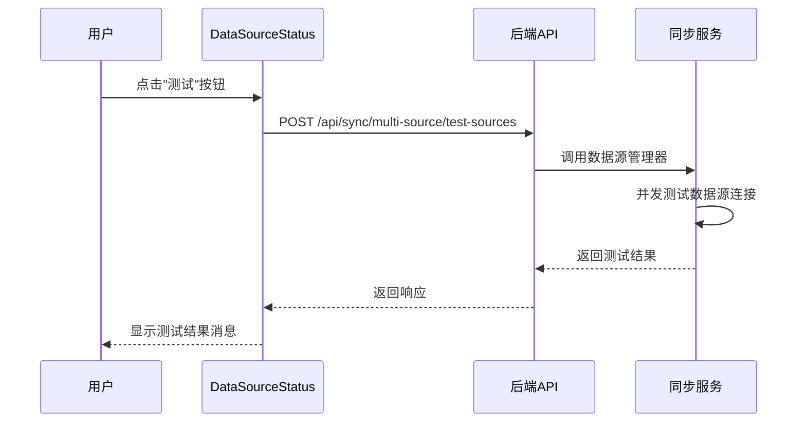
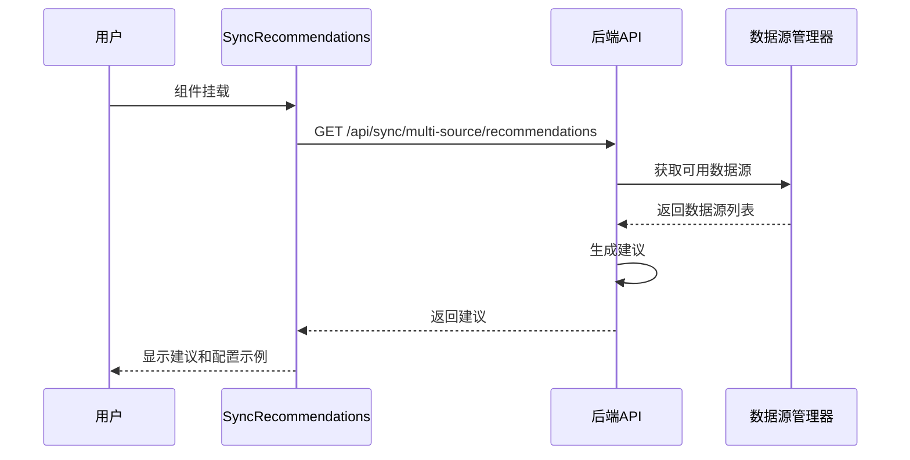
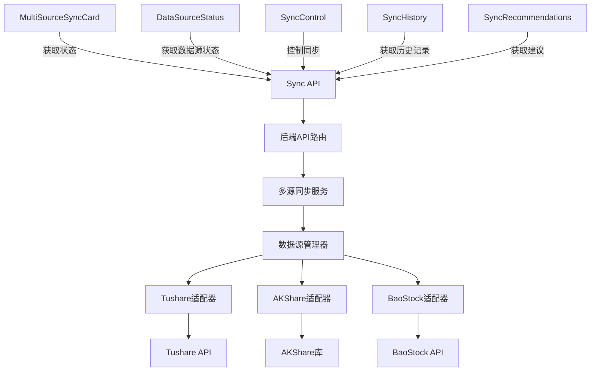
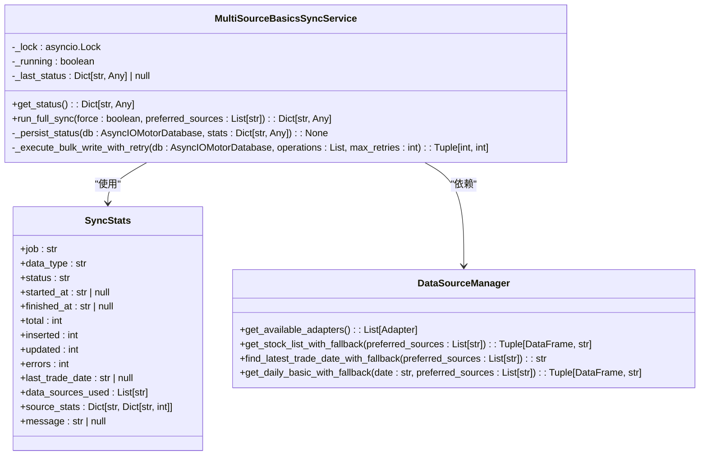
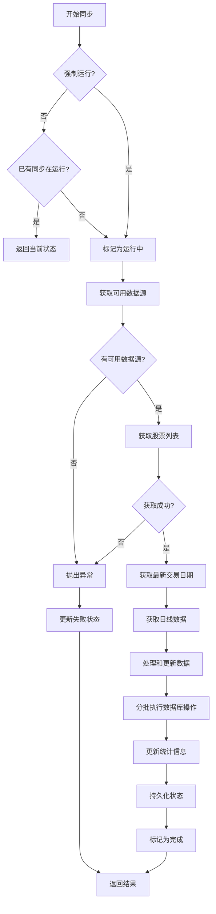
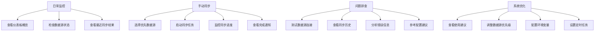
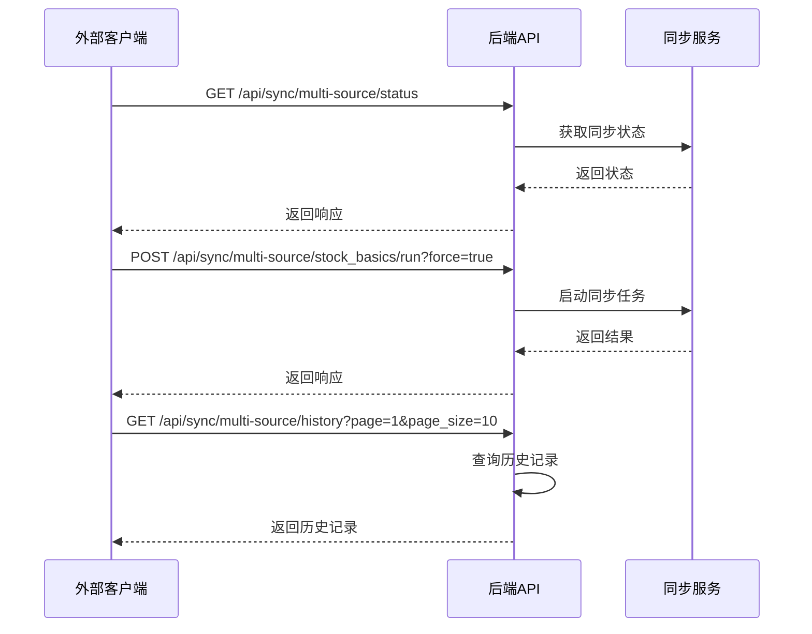
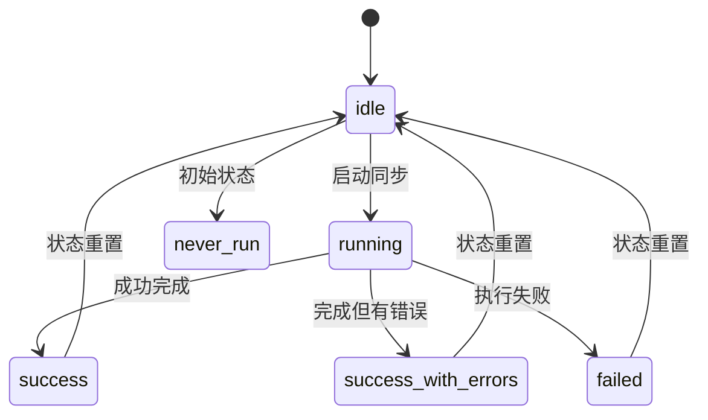
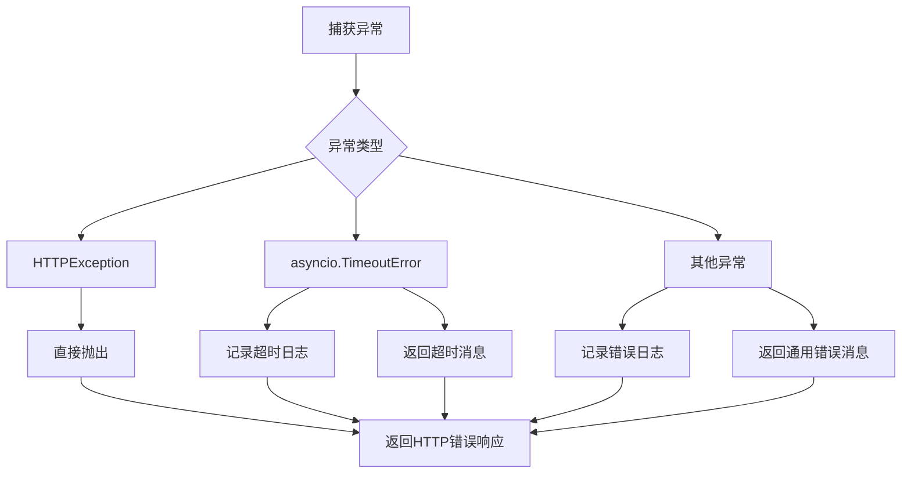

# 数据同步组件

<cite>
**本文档引用文件**   
- [MultiSourceSyncCard.vue](file://frontend/src/components/Dashboard/MultiSourceSyncCard.vue)
- [DataSourceStatus.vue](file://frontend/src/components/Sync/DataSourceStatus.vue)
- [SyncControl.vue](file://frontend/src/components/Sync/SyncControl.vue)
- [SyncHistory.vue](file://frontend/src/components/Sync/SyncHistory.vue)
- [SyncRecommendations.vue](file://frontend/src/components/Sync/SyncRecommendations.vue)
- [sync.ts](file://frontend/src/api/sync.ts)
- [multi_source_sync.py](file://app/routers/multi_source_sync.py)
- [multi_source_basics_sync_service.py](file://app/services/multi_source_basics_sync_service.py)
</cite>

## 目录
1. [简介](#简介)
2. [核心组件分析](#核心组件分析)
3. [数据流与通信机制](#数据流与通信机制)
4. [后端API交互逻辑](#后端api交互逻辑)
5. [使用场景与集成示例](#使用场景与集成示例)
6. [状态管理与错误处理](#状态管理与错误处理)

## 简介
数据同步组件是系统中负责管理多数据源同步状态、控制同步操作、记录同步历史和提供智能建议的核心功能模块。该组件通过一组相互协作的前端组件和后端服务，实现了对股票基础信息等数据的多源同步管理。

组件体系包含五个主要部分：MultiSourceSyncCard用于在仪表板展示整体同步状态；DataSourceStatus实时显示各数据源的连接与更新状态；SyncControl提供用户控制同步操作的界面；SyncHistory记录和展示历史同步任务；SyncRecommendations基于系统状态提供智能同步建议。

这些组件通过清晰的数据流和事件通信机制协同工作，为用户提供了一个完整的数据同步管理解决方案。系统支持Tushare、AKShare、BaoStock等多个数据源，采用优先级机制和故障转移策略，确保数据获取的可靠性和稳定性。

**Section sources**
- [MultiSourceSyncCard.vue](file://frontend/src/components/Dashboard/MultiSourceSyncCard.vue#L1-L439)
- [DataSourceStatus.vue](file://frontend/src/components/Sync/DataSourceStatus.vue#L1-L235)
- [SyncControl.vue](file://frontend/src/components/Sync/SyncControl.vue#L1-L706)
- [SyncHistory.vue](file://frontend/src/components/Sync/SyncHistory.vue#L1-L425)
- [SyncRecommendations.vue](file://frontend/src/components/Sync/SyncRecommendations.vue#L1-L396)

## 核心组件分析

### MultiSourceSyncCard 组件
MultiSourceSyncCard 组件是数据同步功能在仪表板上的主要展示入口，提供了一个简洁的概览界面。该组件在 `frontend/src/components/Dashboard/MultiSourceSyncCard.vue` 中实现。

组件主要包含四个区域：同步状态显示、数据源状态列表、快速同步操作按钮和最近同步信息。同步状态以标签形式显示当前状态（如"运行中"、"成功"、"失败"等），并在同步进行时显示进度条。数据源状态部分展示前三个优先级最高的数据源及其可用性状态，通过颜色编码和图标直观表示连接状态。

当组件挂载时，会并行获取同步状态和数据源状态信息。如果检测到同步正在运行，会启动状态轮询机制，每3秒检查一次状态，直到同步完成。这种设计确保了用户界面能够实时反映后台同步任务的最新状态。

```mermaid
flowchart TD
A[组件挂载] --> B[并行获取同步状态]
A --> C[并行获取数据源状态]
B --> D{同步状态为"运行中"?}
C --> D
D --> |是| E[启动状态轮询]
D --> |否| F[停止轮询]
E --> G[每3秒检查状态]
G --> H{同步完成?}
H --> |否| G
H --> |是| I[停止轮询]
```

**Diagram sources **
- [MultiSourceSyncCard.vue](file://frontend/src/components/Dashboard/MultiSourceSyncCard.vue#L284-L301)

**Section sources**
- [MultiSourceSyncCard.vue](file://frontend/src/components/Dashboard/MultiSourceSyncCard.vue#L1-L439)

### DataSourceStatus 组件
DataSourceStatus 组件专门用于展示和管理所有数据源的连接状态，位于 `frontend/src/components/Sync/DataSourceStatus.vue`。该组件不仅显示数据源的可用性，还提供了测试单个数据源连接的功能。

组件通过 `getDataSourcesStatus` API 获取所有数据源的状态信息，包括名称、优先级、可用性和描述。数据源按优先级降序排列，优先级高的数据源显示在前面。对于每个数据源，组件显示一个状态卡片，包含数据源名称、连接状态图标和优先级信息。

用户可以通过点击"刷新"按钮重新获取所有数据源的状态，或通过"测试"按钮单独测试某个数据源的连接。测试功能会向后端发送请求，对指定数据源进行连通性测试，并在界面上显示测试结果。这种设计允许用户在不启动完整同步的情况下验证数据源配置的正确性。



**Diagram sources **
- [DataSourceStatus.vue](file://frontend/src/components/Sync/DataSourceStatus.vue#L178-L208)
- [multi_source_sync.py](file://app/routers/multi_source_sync.py#L277-L347)

**Section sources**
- [DataSourceStatus.vue](file://frontend/src/components/Sync/DataSourceStatus.vue#L1-L235)

### SyncControl 组件
SyncControl 组件提供了一个完整的同步操作控制界面，实现在 `frontend/src/components/Sync/SyncControl.vue` 文件中。该组件不仅显示当前同步状态，还允许用户配置同步参数并启动同步任务。

组件的主要功能包括：显示详细的同步统计信息（总数、新增、更新、错误数）、选择优先使用的数据源、设置强制同步选项以及执行各种控制操作。用户可以在启动同步前指定优先使用的数据源，系统将按照指定顺序尝试从这些数据源获取数据。

同步控制采用了状态轮询机制。当用户启动同步后，组件会持续轮询同步状态，最多轮询60次（约5分钟）。如果检测到同步状态从"运行中"变为其他状态，会立即停止轮询并显示相应的完成通知。这种设计既保证了状态更新的及时性，又避免了无限轮询。

```mermaid
classDiagram
class SyncControl {
+syncing : boolean
+refreshing : boolean
+syncStatus : SyncStatus | null
+availableSources : DataSourceStatus[]
+syncForm : {preferred_sources : string[], force : boolean}
+fetchSyncStatus() : Promise~void~
+fetchDataSources() : Promise~void~
+startSync() : Promise~void~
+refreshStatus() : Promise~void~
+clearCache() : Promise~void~
+startStatusPolling() : void
+stopStatusPolling() : void
+showSyncCompletionNotification(status : string) : void
}
class SyncStatus {
+job : string
+status : 'idle'|'running'|'success'|'success_with_errors'|'failed'|'never_run'
+started_at? : string
+finished_at? : string
+total : number
+inserted : number
+updated : number
+errors : number
+last_trade_date? : string
+data_sources_used : string[]
+message? : string
}
class DataSourceStatus {
+name : string
+priority : number
+available : boolean
+description : string
}
SyncControl --> SyncStatus : "显示"
SyncControl --> DataSourceStatus : "选择"
```

**Diagram sources **
- [SyncControl.vue](file://frontend/src/components/Sync/SyncControl.vue#L251-L291)
- [sync.ts](file://frontend/src/api/sync.ts#L16-L29)

**Section sources**
- [SyncControl.vue](file://frontend/src/components/Sync/SyncControl.vue#L1-L706)

### SyncHistory 组件
SyncHistory 组件负责展示历史同步任务的记录，实现于 `frontend/src/components/Sync/SyncHistory.vue`。该组件使用时间线布局展示同步历史，使用户能够直观地查看过去同步任务的执行情况。

组件通过分页方式加载同步历史记录，每页显示10条记录。时间线上的每个项目代表一次同步任务，使用不同颜色和图标表示任务状态（成功、部分成功、失败、运行中）。每条记录显示详细的统计信息，包括处理的总记录数、新增数、更新数和错误数，以及使用的数据源和执行时长。

组件支持"加载更多"功能，当用户滚动到列表底部时，可以加载更多历史记录。对于较早的历史记录，日期时间会以相对时间（如"2小时前"、"昨天"）显示，提高可读性。这种设计既保证了性能（避免一次性加载过多数据），又提供了良好的用户体验。

```mermaid
flowchart TD
A[组件挂载] --> B[获取第一页历史记录]
B --> C{是否有更多记录?}
C --> |是| D[显示"加载更多"按钮]
C --> |否| E[显示空状态]
D --> F[用户点击"加载更多"]
F --> G[获取下一页记录]
G --> C
H[用户点击"刷新"] --> I[重新获取第一页记录]
I --> C
```

**Diagram sources **
- [SyncHistory.vue](file://frontend/src/components/Sync/SyncHistory.vue#L189-L192)
- [multi_source_sync.py](file://app/routers/multi_source_sync.py#L402-L446)

**Section sources**
- [SyncHistory.vue](file://frontend/src/components/Sync/SyncHistory.vue#L1-L425)

### SyncRecommendations 组件
SyncRecommendations 组件提供基于系统状态的智能同步建议，实现在 `frontend/src/components/Sync/SyncRecommendations.vue`。该组件不仅显示建议，还提供配置示例和最佳实践指导。

组件的主要内容包括：推荐的主数据源、备用数据源列表、优化建议、注意事项和配置示例。主数据源推荐基于数据源的可用性和优先级，系统会推荐优先级最高且可用的数据源作为主数据源。组件还提供环境变量配置和API调用示例，帮助用户正确配置系统。

建议内容动态生成，基于当前可用的数据源和系统状态。例如，如果没有可用的数据源，会显示相应的警告；如果只有一个数据源可用，会建议配置更多数据源以提高冗余性。这种智能化的建议系统帮助用户优化配置，提高数据同步的可靠性和效率。



**Diagram sources **
- [SyncRecommendations.vue](file://frontend/src/components/Sync/SyncRecommendations.vue#L177-L184)
- [multi_source_sync.py](file://app/routers/multi_source_sync.py#L349-L397)

**Section sources**
- [SyncRecommendations.vue](file://frontend/src/components/Sync/SyncRecommendations.vue#L1-L396)

## 数据流与通信机制

### 组件间数据流
数据同步组件之间通过清晰的数据流和事件通信机制协同工作。前端组件通过API服务层与后端进行通信，后端服务则通过数据源管理器协调多个数据源的访问。



**Diagram sources **
- [sync.ts](file://frontend/src/api/sync.ts#L79-L176)
- [multi_source_sync.py](file://app/routers/multi_source_sync.py#L16-L488)
- [multi_source_basics_sync_service.py](file://app/services/multi_source_basics_sync_service.py#L58-L382)

### 状态管理机制
系统采用混合状态管理策略，结合了前端组件状态和后端持久化状态。前端组件维护本地状态（如加载状态、刷新状态），而后端服务负责维护同步任务的持久化状态。

多源同步服务（MultiSourceBasicsSyncService）使用锁机制确保同一时间只有一个同步任务在运行。服务状态存储在MongoDB的`sync_status`集合中，包含任务状态、开始时间、结束时间、统计信息等。这种设计确保了状态的一致性和可靠性，即使在服务重启后也能恢复正确的状态。



**Diagram sources **
- [multi_source_basics_sync_service.py](file://app/services/multi_source_basics_sync_service.py#L58-L382)
- [multi_source_sync.py](file://app/routers/multi_source_sync.py#L137-L149)

**Section sources**
- [multi_source_basics_sync_service.py](file://app/services/multi_source_basics_sync_service.py#L1-L382)

## 后端API交互逻辑

### API路由设计
后端API路由设计遵循RESTful原则，提供了一组清晰的端点用于管理多源同步。所有端点位于`/api/sync/multi-source`前缀下，便于组织和管理。

```mermaid
graph TD
A[/api/sync/multi-source] --> B[/sources/status]
A --> C[/sources/current]
A --> D[/status]
A --> E[/stock_basics/run]
A --> F[/test-sources]
A --> G[/recommendations]
A --> H[/history]
A --> I[/cache]
B --> J[GET: 获取所有数据源状态]
C --> K[GET: 获取当前数据源]
D --> L[GET: 获取同步状态]
E --> M[POST: 运行同步任务]
F --> N[POST: 测试数据源连接]
G --> O[GET: 获取同步建议]
H --> P[GET: 获取同步历史]
I --> Q[DELETE: 清空缓存]
```

**Diagram sources **
- [multi_source_sync.py](file://app/routers/multi_source_sync.py#L40-L488)

### 同步执行流程
多源同步的执行流程设计严谨，确保了数据获取的可靠性和效率。流程从获取可用数据源开始，然后按优先级顺序尝试从各个数据源获取数据。



**Diagram sources **
- [multi_source_basics_sync_service.py](file://app/services/multi_source_basics_sync_service.py#L143-L330)

**Section sources**
- [multi_source_sync.py](file://app/routers/multi_source_sync.py#L154-L188)
- [multi_source_basics_sync_service.py](file://app/services/multi_source_basics_sync_service.py#L143-L330)

## 使用场景与集成示例

### 典型使用场景
数据同步组件适用于多种使用场景，从日常监控到故障排查，为用户提供全面的支持。



**Diagram sources **
- [MultiSourceSyncCard.vue](file://frontend/src/components/Dashboard/MultiSourceSyncCard.vue#L86-L97)
- [SyncControl.vue](file://frontend/src/components/Sync/SyncControl.vue#L124-L166)

### 集成示例
以下是一些常见的API集成示例，展示如何在外部系统中使用数据同步功能。



**Diagram sources **
- [sync.ts](file://frontend/src/api/sync.ts#L99-L122)
- [multi_source_sync.py](file://app/routers/multi_source_sync.py#L154-L188)

**Section sources**
- [sync.ts](file://frontend/src/api/sync.ts#L1-L186)

## 状态管理与错误处理

### 状态转换机制
系统实现了完整的状态转换机制，确保同步任务的状态准确反映实际执行情况。



**Diagram sources **
- [multi_source_basics_sync_service.py](file://app/services/multi_source_basics_sync_service.py#L45-L53)

### 错误处理策略
系统采用多层次的错误处理策略，确保在各种异常情况下都能提供有意义的反馈。



**Diagram sources **
- [multi_source_sync.py](file://app/routers/multi_source_sync.py#L190-L191)
- [multi_source_basics_sync_service.py](file://app/services/multi_source_basics_sync_service.py#L323-L329)

**Section sources**
- [multi_source_sync.py](file://app/routers/multi_source_sync.py#L190-L191)
- [multi_source_basics_sync_service.py](file://app/services/multi_source_basics_sync_service.py#L323-L329)