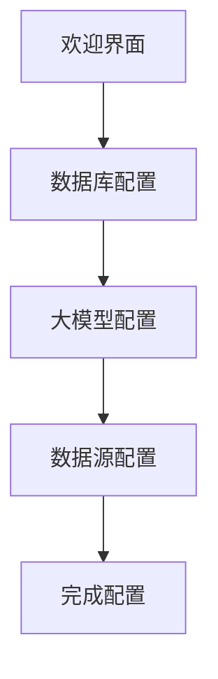
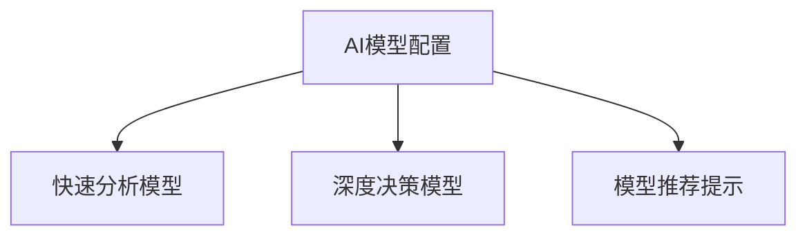
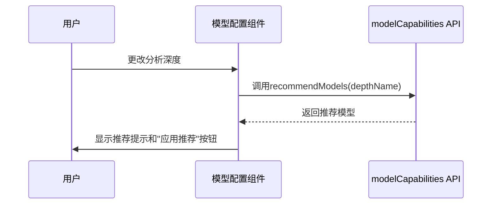
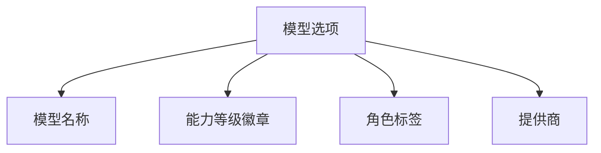
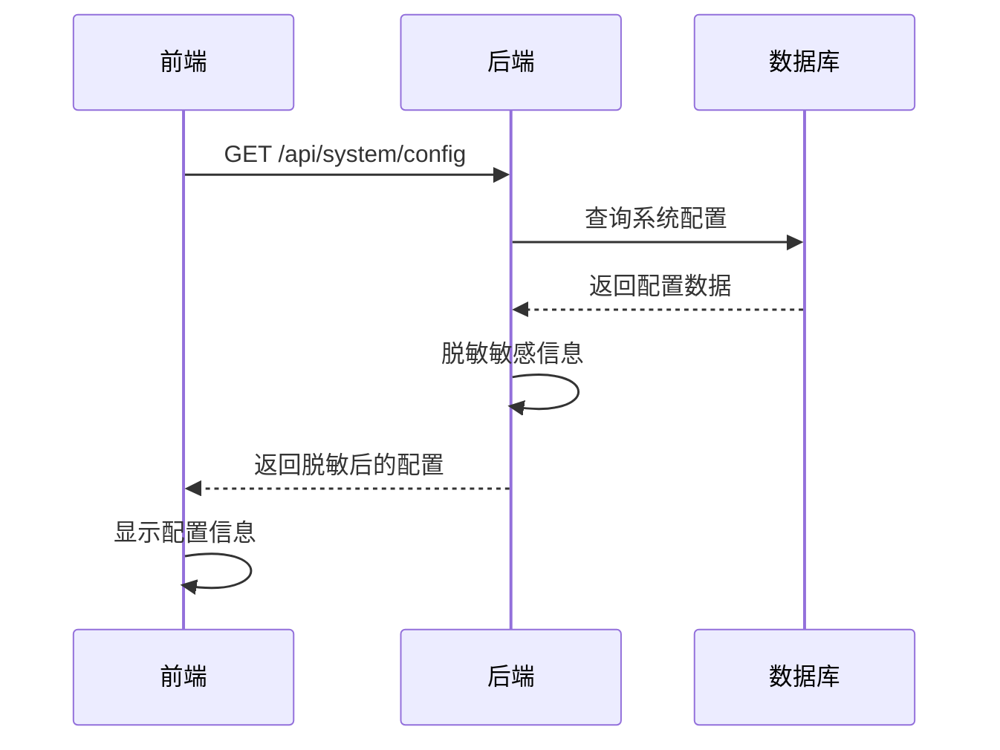
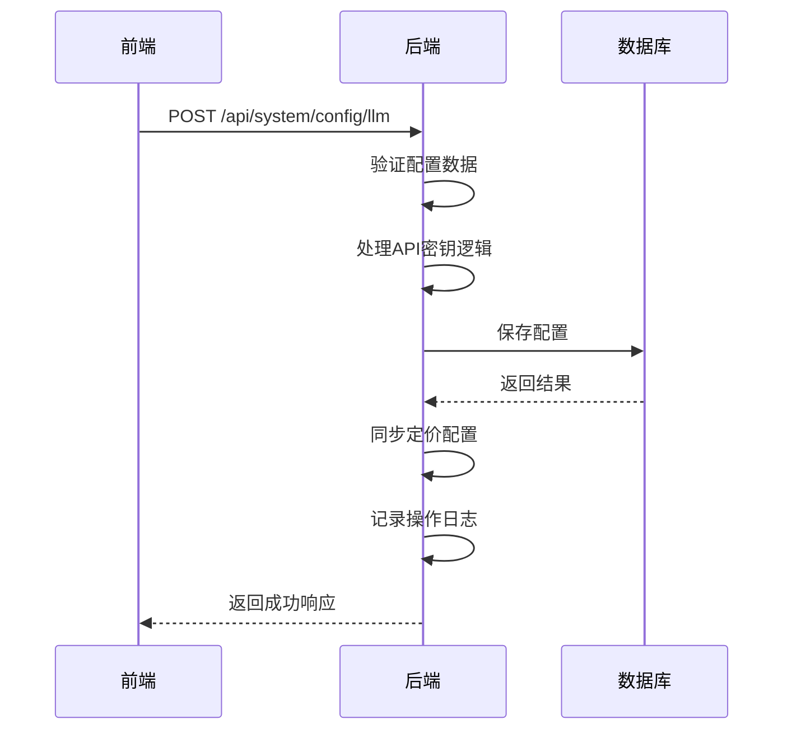

# 配置管理组件

<cite>
**本文档引用文件**  
- [ConfigWizard.vue](file://frontend/src/components/ConfigWizard.vue)
- [ModelConfig.vue](file://frontend/src/components/ModelConfig.vue)
- [DeepModelSelector.vue](file://frontend/src/components/DeepModelSelector.vue)
- [LLMConfigDialog.vue](file://frontend/src/views/Settings/components/LLMConfigDialog.vue)
- [config.py](file://app/routers/config.py)
- [config.py](file://app/models/config.py)
- [CONFIG_WIZARD.md](file://docs/features/config-wizard/CONFIG_WIZARD.md)
- [modelCapabilities.ts](file://frontend/src/api/modelCapabilities.ts)
- [config.ts](file://frontend/src/api/config.ts)
</cite>

## 目录
1. [简介](#简介)
2. [配置向导组件 (ConfigWizard)](#配置向导组件-configwizard)
3. [模型配置组件 (ModelConfig)](#模型配置组件-modelconfig)
4. [深度模型选择器 (DeepModelSelector)](#深度模型选择器-deepmodelselector)
5. [状态管理与表单验证](#状态管理与表单验证)
6. [后端API交互](#后端api交互)
7. [配置保存与加载流程](#配置保存与加载流程)
8. [常见配置问题解决方案](#常见配置问题解决方案)
9. [总结](#总结)

## 简介
配置管理组件是系统初始化和运行的核心部分，包含三个主要组件：**配置向导 (ConfigWizard)**、**模型配置 (ModelConfig)** 和 **深度模型选择器 (DeepModelSelector)**。这些组件协同工作，为用户提供直观的配置界面，确保系统能够正确连接数据库、大模型服务和数据源。

配置向导引导新用户完成系统初始化配置，包括数据库、大模型提供商、API密钥和数据源等关键设置。模型配置组件提供多模型管理功能，支持快速分析和深度决策模型的独立配置。深度模型选择器则为高级用户提供模型选择功能，支持能力等级和角色标签的可视化展示。

**Section sources**
- [ConfigWizard.vue](file://frontend/src/components/ConfigWizard.vue)
- [ModelConfig.vue](file://frontend/src/components/ModelConfig.vue)
- [DeepModelSelector.vue](file://frontend/src/components/DeepModelSelector.vue)

## 配置向导组件 (ConfigWizard)

配置向导是一个向导式对话框组件，通过五个步骤引导用户完成系统初始化配置。该组件使用Element Plus的`el-dialog`和`el-steps`组件构建，确保用户能够逐步完成配置。

### 配置向导工作流程


**Diagram sources**
- [ConfigWizard.vue](file://frontend/src/components/ConfigWizard.vue#L1-L599)

### 配置向导数据结构
配置向导维护一个`WizardData`类型的数据对象，包含以下配置信息：

```typescript
interface WizardData {
  mongodb: {
    host: string
    port: number
    database: string
  }
  redis: {
    host: string
    port: number
  }
  llm: {
    provider: string
    apiKey: string
    modelName: string
  }
  datasource: {
    type: string
    token: string
    apiKey: string
  }
}
```

**Diagram sources**
- [ConfigWizard.vue](file://frontend/src/components/ConfigWizard.vue#L327-L349)

### 配置向导步骤详解

#### 步骤0：欢迎界面
欢迎界面是配置向导的入口，向用户介绍配置向导的目的和功能。用户可以选择"跳过向导"或"开始配置"。

#### 步骤1：数据库配置
此步骤要求用户配置MongoDB和Redis数据库连接信息。需要注意的是，这些配置主要用于验证连接，实际的数据库配置需要在`.env`文件中设置。

#### 步骤2：大模型配置
用户在此步骤选择大模型提供商（如DeepSeek、通义千问、OpenAI、Google Gemini），并输入相应的API密钥。组件会根据选择的提供商动态更新可用模型列表。

#### 步骤3：数据源配置
用户选择股票数据源，包括AKShare（推荐，免费无需密钥）、Tushare（专业A股数据）和FinnHub（美股数据）。对于需要密钥的数据源，用户需要输入相应的Token或API Key。

#### 步骤4：完成配置
最后一步显示配置摘要，包括数据库、大模型和数据源的配置信息，并提供下一步操作建议。

**Section sources**
- [ConfigWizard.vue](file://frontend/src/components/ConfigWizard.vue#L1-L599)
- [CONFIG_WIZARD.md](file://docs/features/config-wizard/CONFIG_WIZARD.md#L197-L284)

## 模型配置组件 (ModelConfig)

模型配置组件提供模型参数的可视化编辑界面，支持多模型配置管理。该组件允许用户分别为快速分析和深度决策配置不同的模型。

### 模型配置界面结构


**Diagram sources**
- [ModelConfig.vue](file://frontend/src/components/ModelConfig.vue#L1-L371)

### 模型配置功能特性

#### 模型选择与显示
组件使用`el-select`组件提供模型选择功能，每个选项都包含模型名称、能力等级徽章、角色标签和提供商信息。

```vue
<el-option>
  <div style="display: flex; justify-content: space-between; align-items: center; gap: 8px;">
    <span style="flex: 1;">{{ model.model_display_name || model.model_name }}</span>
    <div style="display: flex; align-items: center; gap: 4px;">
      <!-- 能力等级徽章 -->
      <el-tag v-if="model.capability_level" :type="getCapabilityTagType(model.capability_level)" size="small" effect="plain">
        {{ getCapabilityText(model.capability_level) }}
      </el-tag>
      <!-- 角色标签 -->
      <el-tag v-if="isQuickAnalysisRole(model.suitable_roles)" type="success" size="small" effect="plain">⚡快速</el-tag>
      <span style="font-size: 12px; color: #909399;">{{ model.provider }}</span>
    </div>
  </div>
</el-option>
```

**Diagram sources**
- [ModelConfig.vue](file://frontend/src/components/ModelConfig.vue#L15-L46)

#### 模型能力等级系统
组件实现了五级模型能力等级系统，用于区分不同模型的性能和适用场景：

| 等级 | 名称 | 描述 |
|------|------|------|
| 1 | ⚡基础 | 适合快速分析和简单任务 |
| 2 | 📊标准 | 适合日常分析和常规任务 |
| 3 | 🎯高级 | 适合深度分析和复杂推理 |
| 4 | 🔥专业 | 适合专业级分析和多轮辩论 |
| 5 | 👑旗舰 | 最强能力，适合全面分析 |

**Diagram sources**
- [ModelConfig.vue](file://frontend/src/components/ModelConfig.vue#L177-L184)

#### 模型推荐功能
组件集成了模型推荐功能，根据用户的分析深度自动推荐合适的模型配置。当分析深度或模型选择发生变化时，系统会重新评估模型适配性并提供推荐。



**Diagram sources**
- [ModelConfig.vue](file://frontend/src/components/ModelConfig.vue#L217-L289)
- [modelCapabilities.ts](file://frontend/src/api/modelCapabilities.ts)

**Section sources**
- [ModelConfig.vue](file://frontend/src/components/ModelConfig.vue#L1-L371)
- [LLMConfigDialog.vue](file://frontend/src/views/Settings/components/LLMConfigDialog.vue#L213-L336)

## 深度模型选择器 (DeepModelSelector)

深度模型选择器是一个可复用的模型选择组件，提供高级模型选择功能。该组件支持根据模型能力和角色进行筛选和显示。

### 组件属性与配置
```typescript
interface Props {
  modelValue: string
  availableModels: any[]
  placeholder?: string
  type?: 'quick' | 'deep'
  size?: 'large' | 'default' | 'small'
  width?: string
}
```

**Diagram sources**
- [DeepModelSelector.vue](file://frontend/src/components/DeepModelSelector.vue#L45-L52)

### 模型选项渲染
组件为每个模型选项渲染丰富的信息，包括模型名称、能力等级徽章、角色标签和提供商。



**Diagram sources**
- [DeepModelSelector.vue](file://frontend/src/components/DeepModelSelector.vue#L16-L37)

### 能力等级与角色判断
组件实现了能力等级和角色的判断逻辑，用于决定是否显示相应的标签。

```typescript
const getCapabilityText = (level: number): string => {
  const texts: Record<number, string> = {
    1: '⚡基础',
    2: '📊标准',
    3: '🎯高级',
    4: '🔥专业',
    5: '👑旗舰'
  }
  return texts[level] || '📊标准'
}

const isQuickAnalysisRole = (roles: string[] | undefined): boolean => {
  if (!roles || !Array.isArray(roles)) return false
  return roles.includes('quick_analysis') || roles.includes('both')
}

const isDeepAnalysisRole = (roles: string[] | undefined): boolean => {
  if (!roles || !Array.isArray(roles)) return false
  return roles.includes('deep_analysis') || roles.includes('both')
}
```

**Diagram sources**
- [DeepModelSelector.vue](file://frontend/src/components/DeepModelSelector.vue#L73-L98)

**Section sources**
- [DeepModelSelector.vue](file://frontend/src/components/DeepModelSelector.vue#L1-L100)

## 状态管理与表单验证

配置管理组件采用Vue 3的Composition API进行状态管理，使用`ref`和`computed`创建响应式数据。

### 计算属性双向绑定
为了实现安全的双向绑定，组件使用计算属性的getter和setter模式：

```typescript
const datasourceType = computed({
  get: () => wizardData.value.datasource.type,
  set: (value: string) => {
    wizardData.value.datasource.type = value
  }
})
```

**Diagram sources**
- [ConfigWizard.vue](file://frontend/src/components/ConfigWizard.vue#L422-L427)

### 表单验证逻辑
组件在提交配置前进行基本的表单验证，确保必填字段已填写。

```typescript
const handleNext = async () => {
  // 验证当前步骤
  if (currentStep.value === 2 && !wizardData.value.llm.provider) {
    ElMessage.warning('请选择大模型提供商')
    return
  }
  
  if (currentStep.value === 2 && !wizardData.value.llm.apiKey) {
    ElMessage.warning('请输入 API 密钥')
    return
  }
  
  currentStep.value++
}
```

**Diagram sources**
- [ConfigWizard.vue](file://frontend/src/components/ConfigWizard.vue#L490-L502)

### 模型配置验证
在模型配置对话框中，组件使用Element Plus的表单验证规则进行更严格的验证：

```typescript
const rules: FormRules = {
  provider: [{ required: true, message: '请选择供应商', trigger: 'change' }],
  model_name: [{ required: true, message: '请输入模型名称', trigger: 'blur' }],
  max_tokens: [{ required: true, message: '请输入最大Token数', trigger: 'blur' }],
  temperature: [{ required: true, message: '请输入温度参数', trigger: 'blur' }],
  timeout: [{ required: true, message: '请输入超时时间', trigger: 'blur' }],
  retry_times: [{ required: true, message: '请输入重试次数', trigger: 'blur' }],
  priority: [{ required: true, message: '请输入优先级', trigger: 'blur' }]
}
```

**Diagram sources**
- [LLMConfigDialog.vue](file://frontend/src/views/Settings/components/LLMConfigDialog.vue#L419-L427)

**Section sources**
- [ConfigWizard.vue](file://frontend/src/components/ConfigWizard.vue#L490-L502)
- [LLMConfigDialog.vue](file://frontend/src/views/Settings/components/LLMConfigDialog.vue#L419-L427)

## 后端API交互

配置管理组件与后端`config` API进行交互，实现配置的保存、加载和验证。

### API端点概览
```mermaid
graph TD
A[前端组件] --> B[config API]
B --> C[/config/system]
B --> D[/config/llm/providers]
B --> E[/config/llm]
B --> F[/config/datasource]
B --> G[/config/database]
B --> H[/config/reload]
```

**Diagram sources**
- [config.py](file://app/routers/config.py#L31-L80)

### 配置获取流程


**Diagram sources**
- [config.py](file://app/routers/config.py#L171-L197)

### 配置更新流程


**Diagram sources**
- [config.py](file://app/routers/config.py#L582-L688)

### 敏感信息处理
后端API对敏感信息进行脱敏处理，确保API密钥等敏感信息不会直接暴露给前端。

```python
def _sanitize_llm_configs(items):
    try:
        return [LLMConfig(**{**i.model_dump(), "api_key": None}) for i in items]
    except Exception:
        return items

def _sanitize_datasource_configs(items):
    """
    脱敏数据源配置，返回缩略的 API Key
    """
    try:
        from app.utils.api_key_utils import (
            is_valid_api_key,
            truncate_api_key,
            get_env_api_key_for_datasource
        )
        
        result = []
        for item in items:
            data = item.model_dump()
            
            # 处理 API Key
            db_key = data.get("api_key")
            if is_valid_api_key(db_key):
                data["api_key"] = truncate_api_key(db_key)
            else:
                ds_type = data.get("type")
                if isinstance(ds_type, str):
                    env_key = get_env_api_key_for_datasource(ds_type)
                    if env_key:
                        data["api_key"] = truncate_api_key(env_key)
                    else:
                        data["api_key"] = None
                else:
                    data["api_key"] = None
            
            result.append(DataSourceConfig(**data))
        return result
    except Exception as e:
        print(f"⚠️ 脱敏数据源配置失败: {e}")
        return items
```

**Diagram sources**
- [config.py](file://app/routers/config.py#L83-L139)

**Section sources**
- [config.py](file://app/routers/config.py#L83-L139)
- [config.py](file://app/routers/config.py#L207-L271)

## 配置保存与加载流程

### 配置保存流程
当用户完成配置向导或在配置管理页面修改配置时，系统会执行以下保存流程：

1. 前端收集配置数据
2. 前端验证配置数据
3. 前端调用后端API保存配置
4. 后端验证并处理配置数据
5. 后端保存配置到数据库
6. 后端重新加载配置
7. 后端返回成功响应

### 配置加载流程
系统启动或用户访问配置管理页面时，会执行以下加载流程：

1. 前端调用`/api/system/config` API
2. 后端从数据库查询系统配置
3. 后端对敏感信息进行脱敏处理
4. 后端返回配置数据
5. 前端接收并显示配置信息

### 配置重载机制
当配置更新后，系统需要重新加载配置以使其生效。这通过调用`/api/system/config/reload`端点实现。

```python
@router.post("/reload", summary="重新加载配置")
async def reload_config(current_user: dict = Depends(get_current_user)):
    """
    重新加载配置并桥接到环境变量
    
    用于配置更新后立即生效，无需重启服务
    """
    try:
        from app.core.config_bridge import reload_bridged_config
        
        success = reload_bridged_config()
        
        if success:
            await log_operation(
                user_id=str(current_user.get("user_id", "")),
                username=current_user.get("username", "unknown"),
                action_type=ActionType.CONFIG_MANAGEMENT,
                action="重载配置",
                details={"action": "reload_config"},
                ip_address="",
                user_agent=""
            )
            
            return {
                "success": True,
                "message": "配置重载成功",
                "data": {
                    "reloaded_at": now_tz().isoformat()
                }
            }
        else:
            return {
                "success": False,
                "message": "配置重载失败，请查看日志"
            }
    except Exception as e:
        logger.error(f"配置重载失败: {e}", exc_info=True)
        raise HTTPException(
            status_code=status.HTTP_500_INTERNAL_SERVER_ERROR,
            detail=f"配置重载失败: {str(e)}"
        )
```

**Diagram sources**
- [config.py](file://app/routers/config.py#L37-L77)

**Section sources**
- [config.py](file://app/routers/config.py#L37-L77)

## 常见配置问题解决方案

### 配置向导没有自动弹出
**检查清单**:
1. 确认已登录
2. 检查 localStorage 中是否有 `config_wizard_completed` 标记
3. 检查后端 `/api/system/config/validate` API 是否正常
4. 查看浏览器控制台是否有错误

### API密钥验证失败
**解决方案**:
1. 确认密钥格式正确，长度大于10个字符
2. 确保密钥不是占位符（如"your_xxx"）
3. 检查密钥是否已过期
4. 尝试在"厂家管理"中测试API密钥

### 数据源配置不生效
**解决方案**:
1. 确认数据源已启用
2. 检查数据源优先级设置
3. 验证API密钥或Token是否正确
4. 检查网络连接是否正常

### 模型配置无法保存
**解决方案**:
1. 确认所有必填字段已填写
2. 检查模型名称是否正确
3. 确认提供商配置已正确设置
4. 查看后端日志获取详细错误信息

**Section sources**
- [CONFIG_WIZARD.md](file://docs/features/config-wizard/CONFIG_WIZARD.md#L277-L284)

## 总结
配置管理组件为系统提供了完整的配置解决方案，从初始化配置到高级模型管理，确保用户能够轻松地配置和管理系统。通过向导式界面、可视化编辑和智能推荐，大大降低了用户的配置难度。

组件设计遵循了良好的架构原则，前端与后端分离，敏感信息得到妥善处理，配置变更能够实时生效。未来可以进一步优化用户体验，如增加配置导入导出功能、提供更详细的配置验证反馈等。

**Section sources**
- [ConfigWizard.vue](file://frontend/src/components/ConfigWizard.vue)
- [ModelConfig.vue](file://frontend/src/components/ModelConfig.vue)
- [DeepModelSelector.vue](file://frontend/src/components/DeepModelSelector.vue)
- [config.py](file://app/routers/config.py)
- [config.py](file://app/models/config.py)